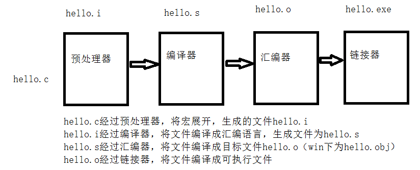

# 2-1模板

# 目录

1. [模板概论](#cpp2data101)
2. [函数模板](#cpp2data102)
    1. [什么是函数模板](#cpp2data102a)
    2. [课堂练习](#cpp2data102b)
3. [函数模板和普通函数区别](#cpp2data103)
4. [函数模板和普通函数在一起调用规则](#cpp2data104)
5. [模板机制剖析](#cpp2data105)
    1. [编译过程](#cpp2data105a)
    2. [模板实现机制](#cpp2data105b)
6. [模板的局限性](#cpp2data106)
7. [类模板](#cpp2data107)
    1. [类模板基本概念](#cpp2data107a)
    2. [类模板做函数参数](#cpp2data107b)
    3. [类模板派生普通类](#cpp2data107c)
    4. [类模板派生类模板](#cpp2data107d)
    5. [类模板类内实现](#cpp2data107e)
    6. [类模板类外实现](#cpp2data107f)
    7. [类模板头文件和源文件分离问题](#cpp2data107g)
    8. [模板类碰到友元函数](#cpp2data107h)
8. [类模板的应用](#cpp2data108)


### cpp2data101
# 1.1 模板概论

c++提供了函数模板(function template.)所谓函数模板，**实际上是建立一个通用函数，其函数类型和形参类型不具体制定，用一个虚拟的类型来代表。这个通用函数就成为函数模板**凡是函数体相同的函数都可以用这个模板代替，不必定义多个函数，只需在模板中定义一次即可。在调用函数时系统会根据实参的类型来取代模板中的虚拟类型，从而实现不同函数的功能。

- c++提供两种模板机制:**函数模板**和**类模板**

- 类属 - 类型参数化，又称参数模板

**总结：**

 - 模板把函数或类要处理的数据类型参数化，表现为参数的多态性，成为类属。

- 模板用于表达逻辑结构相同，但具体数据元素类型不同的数据对象的通用行为。

### cpp2data102
# 1.2 函数模板

### cpp2data102a
## 1.2.1 什么是函数模板？

```cpp

//交换int数据
void SwapInt(int& a,int& b){
	int temp = a;
	a = b;
	b = temp;
}

//交换char数据
void SwapChar(char& a,char& b){
	char temp = a;
	a = b;
	b = temp;
}
//问题：如果我要交换double类型数据，那么还需要些一个double类型数据交换的函数
//繁琐，写的函数越多，当交换逻辑发生变化的时候，所有的函数都需要修改，无形当中增加了代码的维护难度

//如果能把类型作为参数传递进来就好了，传递int就是Int类型交换，传递char就是char类型交换
//我们有一种技术，可以实现类型的参数化---函数模板


//class 和 typename都是一样的，用哪个都可以
template<class T>
void MySwap(T& a,T& b){
	T temp = a;
	a = b;
	b = temp;
}

void test01(){
	
	int a = 10;
	int b = 20;
	cout << "a:" << a << " b:" << b << endl;
	//1. 这里有个需要注意点，函数模板可以自动推导参数的类型
	MySwap(a,b);
	cout << "a:" << a << " b:" << b << endl;

	char c1 = 'a';
	char c2 = 'b';
	cout << "c1:" << c1 << " c2:" << c2 << endl;
	//2. 函数模板可以自动类型推导，那么也可以显式指定类型
	MySwap<char>(c1, c2);
	cout << "c1:" << c1 << " c2:" << c2 << endl;
}

```

**用模板是为了实现泛型，可以减轻编程的工作量，增强函数的重用性。**

### cpp2data102b
## 1.2.2 课堂练习

**使用函数模板实现对** ,**char和int类型数组进行排序？**

```cpp

//模板打印函数
template<class T>
void PrintArray(T arr[],int len){
	for (int i = 0; i < len;i++){
		cout << arr[i] << " ";
	}
	cout << endl;
}

//模板排序函数
template<class T>
void MySort(T arr[],int len){
	
	for (int i = 0; i < len;i++){
		for (int j = len - 1; j > i;j--){
			if (arr[j] > arr[j - 1]){
				T temp = arr[j - 1];
				arr[j - 1] = arr[j];
				arr[j] = temp;
			}
		}
	}

}

void test(){
	
	//char数组
	char tempChar[] = "aojtifysn";
	int charLen = strlen(tempChar);

	//int数组
	int tempInt[] = {7,4,2,9,8,1};
	int intLen = sizeof(tempInt) / sizeof(int);

	//排序前 打印函数
	PrintArray(tempChar, charLen);
	PrintArray(tempInt, intLen);
	//排序
	MySort(tempChar, charLen);
	MySort(tempInt, intLen);
	//排序后打印
	PrintArray(tempChar, charLen);
	PrintArray(tempInt, intLen);
}

```


### cpp2data103
# 1.3 函数模板和普通函数区别

- 函数模板不允许自动类型转化

- 普通函数能够自动进行类型转化

```cpp

//函数模板
template<class T>
T MyPlus(T a, T b){
	T ret = a + b;
	return ret;
}

//普通函数
int MyPlus(int a,char b){
	int ret = a + b;
	return ret;
}

void test02(){

	int a = 10;
	char b = 'a';

	//调用函数模板，严格匹配类型
	MyPlus(a, a);
	MyPlus(b, b);
	//调用普通函数
	MyPlus(a, b);
	//调用普通函数  普通函数可以隐式类型转换
	MyPlus(b, a);

	//结论：
	//函数模板不允许自动类型转换，必须严格匹配类型
	//普通函数可以进行自动类型转换
}

```


### cpp2data104
# 1.4 函数模板和普通函数在一起调用规则

- c++编译器优先考虑普通函数

- 可以通过空模板实参列表的语法限定编译器只能通过模板匹配

- 函数模板可以像普通函数那样可以被重载

- 如果函数模板可以产生一个更好的匹配，那么选择模板


```cpp

//函数模板
template<class T>
T MyPlus(T a, T b){
	T ret = a + b;
	return ret;
}

//普通函数
int MyPlus(int a, int b){
	int ret = a + b;
	return ret;
}

void test03(){
	int a = 10;
	int b = 20;
	char c = 'a';
	char d = 'b';
	//如果函数模板和普通函数都能匹配，c++编译器优先考虑普通函数
	cout << MyPlus(a, b) << endl;
	//如果我必须要调用函数模板,那么怎么办?
	cout << MyPlus<>(a, b) << endl;
	//此时普通函数也可以匹配，因为普通函数可以自动类型转换
	//但是此时函数模板能够有更好的匹配
	//如果函数模板可以产生一个更好的匹配，那么选择模板
	cout << MyPlus(c,d);
}

//函数模板重载
template<class T>
T MyPlus(T a, T b, T c){
	T ret = a + b + c;
	return ret;
}

void test04(){

	int a = 10;
	int b = 20;
	int c = 30;
	cout << MyPlus(a, b, c) << endl;
	//如果函数模板和普通函数都能匹配，c++编译器优先考虑普通函数
}

```


### cpp2data105
# 1.5 模板机制剖析

**思考:为什么函数模板可以和普通函数放在一起?c++编译器是如何实现函数模板机制的？**


### cpp2data105a
## 1.5.1 编译过程

hello.cpp程序是高级c语言程序，这种程序易于被人读懂。为了在系统上运行hello.c程序，每一条c语句都必须转化为低级的机器指令。然后将这些机器指令打包成可执行目标文件格式，并以二进制形式存储于磁盘中。

预处理(Pre-processing) -> 编译(Compiling) ->汇编(Assembling) -> 链接(Linking)



### cpp2data105b
## 1.5.2 模板实现机制

**函数模板机制结论：**

- **编译器并不是把函数模板处理成能够处理任何类型的函数**

- **函数模板通过具体类型产生不同的函数**

- **编译器会对函数模板进行****两次编译****，在声明的地方对模板代码本身进行编译，在调用的地方对参数替换后的代码进行编译。**

### cpp2data106
# 1.6 模板的局限性

**假设有如下模板函数：**

```cpp

template<class T>
void f(T a, T b)
{ … }

```

**如果代码实现时定义了赋值操作 a = b，但是T为数组，这种假设就不成立了**

**同样，如果里面的语句为判断语句 if(a>b),但T如果是结构体，该假设也不成立，另外如果是传入的数组，数组名为地址，因此它比较的是地址，而这也不是我们所希望的操作。**

**总之，编写的模板函数很可能无法处理某些类型，另一方面，有时候通用化是有意义的，但C++语法不允许这样做。为了解决这种问题，可以提供模板的重载，为这些特定的类型提供具体化的模板。**

```cpp

class Person
{
public:
	Person(string name, int age)
	{
		this->mName = name;
		this->mAge = age;
	}
	string mName;
	int mAge;
};

//普通交换函数
template <class T>
void mySwap(T &a,T &b)
{
	T temp = a;
	a = b; 
	b = temp;
}
//第三代具体化，显示具体化的原型和定意思以template<>开头，并通过名称来指出类型
//具体化优先于常规模板
template<>void  mySwap<Person>(Person &p1, Person &p2)
{
	string nameTemp;
	int ageTemp;

	nameTemp = p1.mName;
	p1.mName = p2.mName;
	p2.mName = nameTemp;

	ageTemp = p1.mAge;
	p1.mAge = p2.mAge;
	p2.mAge = ageTemp;

}

void test()
{
	Person P1("Tom", 10);
	Person P2("Jerry", 20);

	cout << "P1 Name = " << P1.mName << " P1 Age = " << P1.mAge << endl;
	cout << "P2 Name = " << P2.mName << " P2 Age = " << P2.mAge << endl;
	mySwap(P1, P2);
	cout << "P1 Name = " << P1.mName << " P1 Age = " << P1.mAge << endl;
	cout << "P2 Name = " << P2.mName << " P2 Age = " << P2.mAge << endl;
}

```


### cpp2data107
# 1.7 类模板

### cpp2data107a
## 1.7.1 类模板基本概念

类模板和函数模板的定义和使用类似，我们已经进行了介绍。有时，有两个或多个类，其功能是相同的，仅仅是数据类型不同。

- 类模板用于实现类所需数据的类型参数化

```cpp

template<class NameType, class AgeType>
class Person
{
public:
	Person(NameType name, AgeType age)
	{
		this->mName = name;
		this->mAge = age;
	}
	void showPerson()
	{
		cout << "name: " << this->mName << " age: " << this->mAge << endl;
	}
public:
	NameType mName;
	AgeType mAge;
};

void test01()
{
	//Person P1("德玛西亚",18); // 类模板不能进行类型自动推导 
	Person<string, int>P1("德玛西亚", 18);
	P1.showPerson();
}

```


### cpp2data107b
## 1.7.2 类模板做函数参数

```cpp

//类模板
template<class NameType, class AgeType>
class Person{
public:
	Person(NameType name, AgeType age){
		this->mName = name;
		this->mAge = age;
	}
	void PrintPerson(){
		cout << "Name:" << this->mName << " Age:" << this->mAge << endl;
	}
public:
	NameType mName;
	AgeType mAge;
};

//类模板做函数参数
void DoBussiness(Person<string,int>& p){
	p.mAge += 20;
	p.mName += "_vip";
	p.PrintPerson();
}

int main(){

	Person<string, int> p("John", 30);
	DoBussiness(p);

	system("pause");
	return EXIT_SUCCESS;
}

```


### cpp2data107c
## 1.7.3 类模板派生普通类

```cpp

//类模板
template<class T>
class MyClass{
public:
	MyClass(T property){
		this->mProperty = property;
	}
public:
	T mProperty;
};

//子类实例化的时候需要具体化的父类，子类需要知道父类的具体类型是什么样的
//这样c++编译器才能知道给子类分配多少内存

//普通派生类
class SubClass : public MyClass<int>{
public:
	SubClass(int b) : MyClass<int>(20){
		this->mB = b;
	}
public:
	int mB;
};

```


### cpp2data107d
## 1.7.4 类模板派生类模板

```cpp

//父类类模板
template<class T>
class Base
{
	T m;
};
template<class T >
class Child2 : public Base<double>  //继承类模板的时候，必须要确定基类的大小
{
public:
	T mParam;
};

void test02()
{
	Child2<int> d2;
}

```


### cpp2data107e
## 1.7.5 类模板类内实现

```cpp

template<class NameType, class AgeType>
class Person
{
public:
	Person(NameType name, AgeType age)
	{
		this->mName = name;
		this->mAge = age;
	}
	void showPerson()
	{
		cout << "name: " << this->mName << " age: " << this->mAge << endl;
	}
public:
	NameType mName;
	AgeType mAge;
};

void test01()
{
	//Person P1("德玛西亚",18); // 类模板不能进行类型自动推导 
	Person<string, int>P1("德玛西亚", 18);
	P1.showPerson();
}

```


### cpp2data107f
## 1.7.6 类模板类外实现

```cpp

#define _CRT_SECURE_NO_WARNINGS
#include<iostream>
#include<string>
using namespace std;

template<class T1, class T2>
class Person{
public:
	Person(T1 name, T2 age);
	void showPerson();

public:
	T1 mName;
	T2 mAge;
};


//类外实现
template<class T1, class T2>
Person<T1, T2>::Person(T1 name, T2 age){
	this->mName = name;
	this->mAge = age;
}


template<class T1, class T2>
void Person<T1, T2>::showPerson(){
	cout << "Name:" << this->mName << " Age:" << this->mAge << endl;
}

void test()
{
	Person<string, int> p("Obama", 20);
	p.showPerson();
}

int main(){

	test();

	system("pause");
	return EXIT_SUCCESS;
}

```


### cpp2data107g
## 1.7.7 类模板头文件和源文件分离问题

Person.hpp
```cpp

#pragma once

template<class T1,class T2>
class Person{
public:
	Person(T1 name,T2 age);
	void ShowPerson();
public:
	T1 mName;
	T2 mAge;
};

template<class T1, class T2>
Person<T1, T2>::Person(T1 name, T2 age){
	this->mName = name;
	this->mAge = age;
}

template<class T1, class T2>
void Person<T1, T2>::ShowPerson(){
	cout << "Name:" << this->mName << " Age:" << this->mAge << endl;
}

```

main.cpp

```cpp

#define _CRT_SECURE_NO_WARNINGS
#include<iostream>
using namespace std;
#include<string>
#include"Person.hpp"

//模板二次编译
//编译器编译源码 逐个编译单元编译的

int main(){

	Person<string, int> p("Obama", 20);
	p.ShowPerson();


	system("pause");
	return EXIT_SUCCESS;
}

```

**结论:** 案例代码在qt编译器顺利通过编译并执行，但是在Linux和vs编辑器下如果只包含头文件，那么会报错链接错误，需要包含cpp文件，但是如果类模板中有友元类，那么编译失败！

**解决方案: 类模板的声明和实现放到一个文件中，我们把这个文件命名为.hpp(这个是个约定的规则，并不是标准，必须这么写).**

**原因：**

- **类模板需要二次编译，在出现模板的地方编译一次，在调用模板的地方再次编译。**

- **C++编译规则为独立编译。**

### cpp2data107h
## 1.7.8 模板类碰到友元函数

```cpp

#define _CRT_SECURE_NO_WARNINGS
#include<iostream>
using namespace std;
#include <string>

template<class T1, class T2> class Person;
//告诉编译器这个函数模板是存在
template<class T1, class T2> void PrintPerson2(Person<T1, T2>& p);

//友元函数在类内实现
template<class T1, class T2>
class Person{
	//1. 友元函数在类内实现
	friend void PrintPerson(Person<T1, T2>& p){
		cout << "Name:" << p.mName << " Age:" << p.mAge << endl;
	}

	//2.友元函数类外实现
	//告诉编译器这个函数模板是存在
	friend void PrintPerson2<>(Person<T1, T2>& p);

	//3. 类模板碰到友元函数模板
	template<class U1, class U2>
	friend void PrintPerson(Person<U1, U2>& p);

public:
	Person(T1 name, T2 age){
		this->mName = name;
		this->mAge = age;
	}
	void showPerson(){
		cout << "Name:" << this->mName << " Age:" << this->mAge << endl;
	}
private:
	T1 mName;
	T2 mAge;
};

void test01()
{
	Person <string, int>p("Jerry", 20);
	PrintPerson(p);
}


// 类模板碰到友元函数
//友元函数类外实现  加上<>空参数列表，告诉编译去匹配函数模板
template<class T1 , class T2>
void PrintPerson2(Person<T1, T2>& p)
{
	cout << "Name2:" << p.mName << " Age2:" << p.mAge << endl;
}

void  test02()
{
	Person <string, int>p("Jerry", 20);
	PrintPerson2(p);   //不写可以编译通过，写了之后，会找PrintPerson2的普通函数调用，因为写了普通函数PrintPerson2的声明	
}

int main(){

	//test01();
	test02();
	system("pause");
	return EXIT_SUCCESS;
}

```

### cpp2data108
# 1.8 类模板的应用

设计一个数组模板类(MyArray),完成对不同类型元素的管理


```cpp

#pragma once
template<class T>
class MyArray
{
public:
	explicit MyArray(int capacity)
	{
		this->m_Capacity = capacity;
		this->m_Size = 0;
		// 如果T是对象，那么这个对象必须提供默认的构造函数
		pAddress = new T[this->m_Capacity];
	}

	//拷贝构造
	MyArray(const MyArray & arr)
	{
		this->m_Capacity = arr.m_Capacity;
		this->m_Size = arr.m_Size;
		this->pAddress = new T[this->m_Capacity];
		for (int i = 0; i < this->m_Size;i++)
		{
			this->pAddress[i] = arr.pAddress[i];
		}
	}

	//重载[] 操作符  arr[0]
	T& operator [](int index)
	{
		return this->pAddress[index]; 
	}
	//尾插法
	void Push_back(const T & val)
	{
		if (this->m_Capacity == this->m_Size)
		{
			return;
		}
		this->pAddress[this->m_Size] = val;
		this->m_Size++;
	}
	void Pop_back()
	{
		if (this->m_Size == 0)
		{
			return;
		}
		this->m_Size--;
	}
	int	getSize()
	{
		return this->m_Size;
	}
	//析构
	~MyArray()
	{
		if (this->pAddress != NULL)
		{
			delete[] this->pAddress;
			this->pAddress = NULL;
			this->m_Capacity = 0; 
			this->m_Size = 0;
		}
	}

private:
	T * pAddress;  //指向一个堆空间，这个空间存储真正的数据
	int m_Capacity; //容量
	int m_Size;   // 大小
};

测试代码：


class Person{
public:
	Person(){}
	Person(string name, int age){
		this->mName = name;
		this->mAge = age;
	}
public:
	string mName;
	int mAge;
};


void PrintMyArrayInt(MyArray<int>& arr){
	for (int i = 0; i < arr.getSize(); i++){
		cout << arr[i] << " ";
	}
	cout << endl;
}

void PrintMyPerson(MyArray<Person>& personArr)
{
	for (int i = 0; i < personArr.getSize(); i++){
		cout << "姓名：" << personArr[i].mName << " 年龄： " << personArr[i].mAge << endl;
	}
	
}
	
	MyArray<int> myArrayInt(10);
	for (int i = 0; i < 9; i++)
	{
		myArrayInt.Push_back(i);
	}
	myArrayInt.Push_back(100);
	PrintMyArrayInt(myArrayInt);

MyArray<Person> myArrayPerson(10);
	Person p1("德玛西亚", 30);
	Person p2("提莫", 20);
	Person p3("孙悟空",18);
	Person p4("赵信", 15);
	Person p5("赵云", 24);
	myArrayPerson.Push_back(p1);
	myArrayPerson.Push_back(p2);
	myArrayPerson.Push_back(p3);
	myArrayPerson.Push_back(p4);
	myArrayPerson.Push_back(p5);

```
