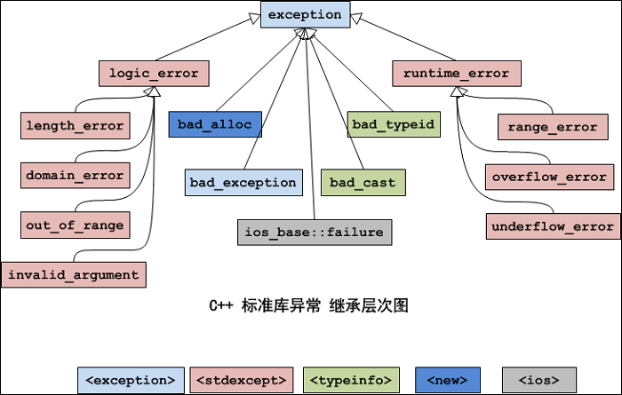
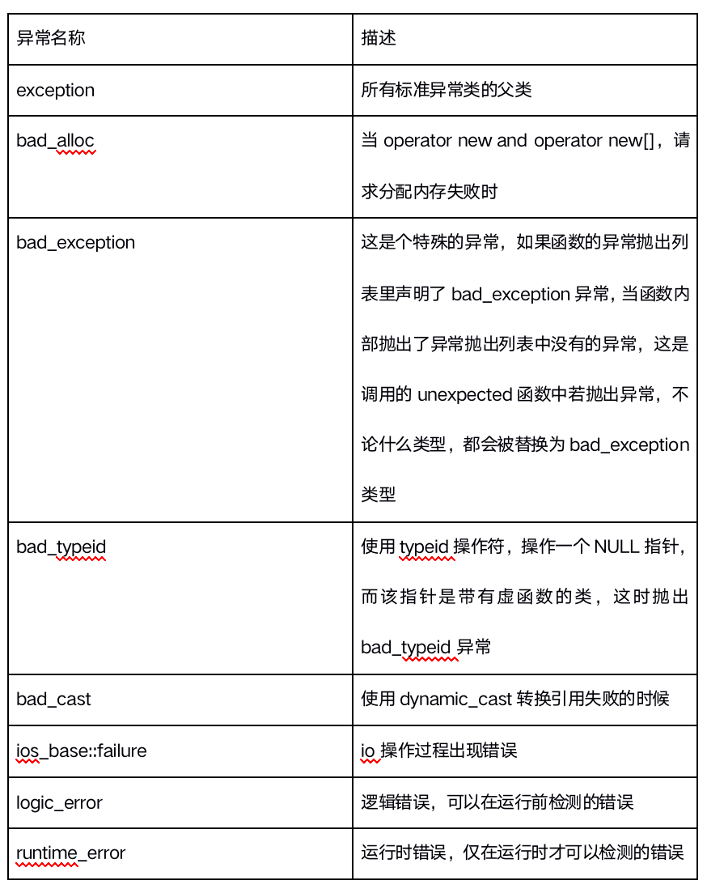
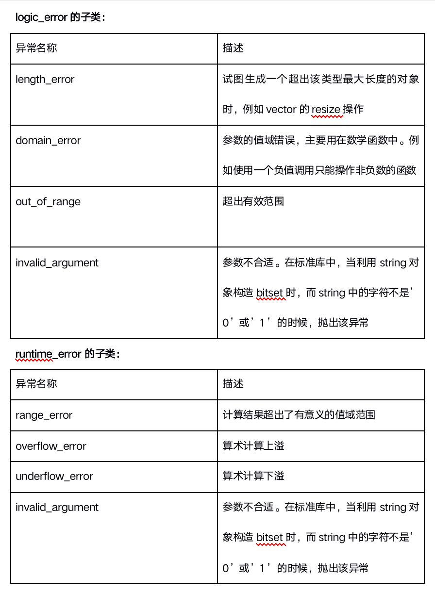

# 2-3cpp异常


# 目录

1. [异常基本概念](#cpp2data301)
2. [异常语法](#cpp2data302)
    1. [异常基本语法](#cpp2data302a)
    2. [异常严格类型匹配](#cpp2data302b)
    3. [栈解旋(unwinding)](#cpp2data302c)
    4. [异常接口声明](#cpp2data302d)
    5. [异常变量生命周期](#cpp2data302e)
    6. [异常的多态使用](#cpp2data302f)
3. [C++标准异常库](#cpp2data303)
    1. [标准库介绍](#cpp2data303a)
    2. [编写自己的异常类](#cpp2data303b)

### cpp2data301
# 3.1 异常基本概念

Bjarne Stroustrup说：提供异常的基本目的就是为了处理上面的问题。基本思想是：让一个函数在发现了自己无法处理的错误时抛出（throw）一个异常，然后它的（直接或者间接）调用者能够处理这个问题。也就是《C++ primer》中说的：将问题检测和问题处理相分离。

一种思想：在所有支持异常处理的编程语言中（例如java），要认识到的一个思想：在异常处理过程中，由问题检测代码可以抛出一个对象给问题处理代码，通过这个对象的类型和内容，实际上完成了两个部分的通信，通信的内容是“出现了什么错误”。当然，各种语言对异常的具体实现有着或多或少的区别，但是这个通信的思想是不变的。


**一句话：异常处理就是处理程序中的错误。所谓错误是指在程序运行的过程中发生的一些异常事件（如：除0溢出，数组下标越界，所要读取的文件不存在,空指针，内存不足等等）。**


**回顾一下：我们以前编写程序是如何处理异常？**

- 在C语言的世界中，对错误的处理总是围绕着两种方法：一是使用整型的返回值标识错误；二是使用errno宏（可以简单的理解为一个全局整型变量）去记录错误。当然C++中仍然是可以用这两种方法的。

- 这两种方法最大的缺陷就是会出现不一致问题。例如有些函数返回1表示成功，返回0表示出错；而有些函数返回0表示成功，返回非0表示出错。

- 还有一个缺点就是函数的返回值只有一个，你通过函数的返回值表示错误代码，那么函数就不能返回其他的值。当然，你也可以通过指针或者C++的引用来返回另外的值，但是这样可能会令你的程序略微晦涩难懂。


**c++****异常机制相比C语言异常处理的优势?**

- 函数的返回值可以忽略，但异常不可忽略。如果程序出现异常，但是没有被捕获，程序就会终止，这多少会促使程序员开发出来的程序更健壮一点。而如果使用C语言的error宏或者函数返回值，调用者都有可能忘记检查，从而没有对错误进行处理，结果造成程序莫名其面的终止或出现错误的结果。

- 整型返回值没有任何语义信息。而异常却包含语义信息，有时你从类名就能够体现出来。

- 整型返回值缺乏相关的上下文信息。异常作为一个类，可以拥有自己的成员，这些成员就可以传递足够的信息。

- 异常处理可以在调用跳级。这是一个代码编写时的问题：假设在有多个函数的调用栈中出现了某个错误，使用整型返回码要求你在每一级函数中都要进行处理。而使用异常处理的栈展开机制，只需要在一处进行处理就可以了，不需要每级函数都处理。


```cpp

//如果判断返回值，那么返回值是错误码还是结果？
//如果不判断返回值，那么b==0时候，程序结果已经不正确
//A写的代码
int A_MyDivide(int a,int b){
	if (b == 0){
		return -1;
	}

	return a / b;
}

//B写的代码
int B_MyDivide(int a,int b){

	int ba = a + 100;
	int bb = b;

	int ret = A_MyDivide(ba, bb);  //由于B没有处理异常，导致B结果运算错误

	return ret;
}

//C写的代码
int C_MyDivide(){

	int a = 10;
	int b = 0;

	int ret = B_MyDivide(a, b); //更严重的是，由于B没有继续抛出异常，导致C的代码没有办法捕获异常
	if (ret == -1){
		return -1;
	}
	else{
		return ret;
	}
}

//所以,我们希望：
//1.异常应该捕获，如果你捕获，可以，那么异常必须继续抛给上层函数,你不处理，不代表你的上层不处理
//2.这个例子，异常没有捕获的结果就是运行结果错的一塌糊涂，结果未知，未知的结果程序没有必要执行下去


```


### cpp2data302
# 3.2 异常语法

### cpp2data302a
## 3.2.1 异常基本语法

```cpp

int A_MyDivide(int a, int b){
	if (b == 0){
		throw 0;
	}

	return a / b;
}

//B写的代码 B写代码比较粗心，忘记处理异常
int B_MyDivide(int a, int b){

	int ba = a;
	int bb = b;

	int ret = A_MyDivide(ba, bb) + 100;  //由于B没有处理异常，导致B结果运算错误

	return ret;
}

//C写的代码
int C_MyDivide(){

	int a = 10;
	int b = 0;

	int ret = 0;

//没有处理异常，程序直接中断执行
#if 1 
	ret = B_MyDivide(a, b);

//处理异常
#else 
	try{
		ret = B_MyDivide(a, b); //更严重的是，由于B没有继续抛出异常，导致C的代码没有办法捕获异常
	}
	catch (int e){
		cout << "C_MyDivide Call B_MyDivide 除数为:" << e << endl;
	}
#endif
	
	return ret;
}

int main(){

	C_MyDivide();

	system("pause");
	return EXIT_SUCCESS;
}


```


**总结:**

- 若有异常则通过throw操作创建一个异常对象并抛出。

- 将可能抛出异常的程序段放到try块之中。

- 如果在try段执行期间没有引起异常，那么跟在try后面的catch字句就不会执行。

- catch子句会根据出现的先后顺序被检查，匹配的catch语句捕获并处理异常(或继续抛出异常)

- 如果匹配的处理未找到，则运行函数terminate将自动被调用，其缺省功能调用abort终止程序。

- 处理不了的异常，可以在catch的最后一个分支，使用throw，向上抛。

c++异常处理使得异常的引发和异常的处理不必在一个函数中，这样底层的函数可以着重解决具体问题，而不必过多的考虑异常的处理。上层调用者可以在适当的位置设计对不同类型异常的处理。


### cpp2data302b
## 3.2.2 异常严格类型匹配

异常机制和函数机制互不干涉,但是**捕捉方式是通过严格类型匹配**。

```cpp

void TestFunction(){
	
	cout << "开始抛出异常..." << endl;
	//throw 10; //抛出int类型异常
	//throw 'a'; //抛出char类型异常
	//throw "abcd"; //抛出char*类型异常
	string ex = "string exception!";
	throw ex;

}

int main(){

	try{
		TestFunction();
	}
	catch (int){
		cout << "抛出Int类型异常!" << endl;
	}
	catch (char){
		cout << "抛出Char类型异常!" << endl;
	}
	catch (char*){
		cout << "抛出Char*类型异常!" << endl;
	}
	catch (string){
		cout << "抛出string类型异常!" << endl;
	}
	//捕获所有异常
	catch (...){
		cout << "抛出其他类型异常!" << endl;
	}


	system("pause");
	return EXIT_SUCCESS;
}


```


### cpp2data302c
## 3.2.3 栈解旋(unwinding)

异常被抛出后，从进入`try`块起，到异常被抛掷前，这期间在栈上构造的所有对象，都会被自动析构。析构的顺序与构造的顺序相反，这一过程称为栈的解旋(`unwinding`).

```cpp

class Person{
public:
	Person(string name){
		mName = name;
		cout << mName << "对象被创建!" << endl;
	}
	~Person(){
		cout << mName << "对象被析构!" << endl;
	}
public:
	string mName;
};

void TestFunction(){
	
	Person p1("aaa");
	Person p2("bbb");
	Person p3("ccc");

	//抛出异常
	throw 10;
}

int main(){

	try{
		TestFunction();
	}
	catch (...){
		cout << "异常被捕获!" << endl;
	}

	system("pause");
	return EXIT_SUCCESS;
}


```


### cpp2data302d
## 3.2.4 异常接口声明


- 为了加强程序的可读性，可以在函数声明中列出可能抛出异常的所有类型，例如：void func() throw(A,B,C);这个函数func能够且只能抛出类型A,B,C及其子类型的异常。

- 如果在函数声明中没有包含异常接口声明，则此函数可以抛任何类型的异常，例如:void func()

- 一个不抛任何类型异常的函数可声明为:void func() throw()

- 如果一个函数抛出了它的异常接口声明所不允许抛出的异常,unexcepted函数会被调用，该函数默认行为调用terminate函数中断程序。

```cpp

//可抛出所有类型异常
void TestFunction01(){
	throw 10;
}

//只能抛出int char char*类型异常
void TestFunction02() throw(int,char,char*){
	string exception = "error!";
	throw exception;
}

//不能抛出任何类型异常
void TestFunction03() throw(){
	throw 10;
}

int main(){

	try{
		//TestFunction01();
		//TestFunction02();
		//TestFunction03();
	}
	catch (...){
		cout << "捕获异常!" << endl;
	}
	
	system("pause");
	return EXIT_SUCCESS;
}


```


请分别在qt vs linux下做测试! Qt and Linux 正确!

### cpp2data302e
## 3.2.5 异常变量生命周期

- throw的异常是有类型的，可以是数字、字符串、类对象。

- throw的异常是有类型的，catch需严格匹配异常类型。

```cpp


class MyException
{
public:
	MyException(){
		cout << "异常变量构造" << endl;
	};
	MyException(const MyException & e)
	{
		cout << "拷贝构造" << endl;
	}
	~MyException()
	{
		cout << "异常变量析构" << endl;
	}
};
void DoWork()
{
	throw new MyException(); //test1 2都用 throw MyExecption();
}

void test01()
{
	try
	{
		DoWork();
	}
	catch (MyException e)
	{
		cout << "捕获 异常" << endl;
	}
}
void test02()
{
	try
	{
		DoWork();
	}
	catch (MyException &e)
	{
		cout << "捕获 异常" << endl;
	}
}

void test03()
{
	try
	{
		DoWork();
	}
	catch (MyException *e)
	{
		cout << "捕获 异常" << endl;
		delete e;
	}
}


```


### cpp2data302f
## 3.2.6 异常的多态使用

```cpp

//异常基类
class BaseException{
public:
	virtual void printError(){};
};

//空指针异常
class NullPointerException : public BaseException{
public:
	virtual void printError(){
		cout << "空指针异常!" << endl;
	}
};
//越界异常
class OutOfRangeException : public BaseException{
public:
	virtual void printError(){
		cout << "越界异常!" << endl;
	}
};

void doWork(){

	throw NullPointerException();
}

void test()
{
	try{
		doWork();
	}
	catch (BaseException& ex){
		ex.printError();
	}
}


```


### cpp2data303
# 3.3 C++标准异常库


### cpp2data303a
## 3.3.1 标准库介绍

标准库中也提供了很多的异常类，它们是通过类继承组织起来的。异常类继承层级结构图如下：



每个类所在的头文件在图下方标识出来。

**标准异常类的成员：**

① 在上述继承体系中，每个类都有提供了构造函数、复制构造函数、和赋值操作符重载。

② logic_error类及其子类、runtime_error类及其子类，它们的构造函数是接受一个string类型的形式参数，用于异常信息的描述

③ 所有的异常类都有一个what()方法，返回const char* 类型（C风格字符串）的值，描述异常信息。

**标准异常类的具体描述：**





```cpp

#include<stdexcept>
class Person{
public:
	Person(int age){
		if (age < 0 || age > 150){
			throw out_of_range("年龄应该在0-150岁之间!");
		}
	}
public:
	int mAge;
};

int main(){

	try{
		Person p(151);
	}
	catch (out_of_range& ex){
		cout << ex.what() << endl;
	}
	
	system("pause");
	return EXIT_SUCCESS;
}

```


### cpp2data303b
## 3.3.2 编写自己的异常类


① 标准库中的异常是有限的；

② 在自己的异常类中，可以添加自己的信息。（标准库中的异常类值允许设置一个用来描述异常的字符串）。

**2\. 如何编写自己的异常类？**

① 建议自己的异常类要继承标准异常类。因为C++中可以抛出任何类型的异常，所以我们的异常类可以不继承自标准异常，但是这样可能会导致程序混乱，尤其是当我们多人协同开发时。

② 当继承标准异常类时，应该重载父类的what函数和虚析构函数。

③ 因为栈展开的过程中，要复制异常类型，那么要根据你在类中添加的成员考虑是否提供自己的复制构造函数。


```cpp

//自定义异常类
class MyOutOfRange:public exception
{
public:
	MyOutOfRange(const string  errorInfo)
	{
		this->m_Error = errorInfo;
	}

	MyOutOfRange(const char * errorInfo)
	{
		this->m_Error = string( errorInfo);
	}

	virtual  ~MyOutOfRange()
	{
	
	}
	virtual const char *  what() const
	{
		return this->m_Error.c_str() ;
	}

	string m_Error;

};

class Person
{
public:
	Person(int age)
	{
		if (age <= 0 || age > 150)
		{
			//抛出异常 越界
			//cout << "越界" << endl;
			//throw  out_of_range("年龄必须在0~150之间");

			//throw length_error("长度异常");
			throw MyOutOfRange(("我的异常 年龄必须在0~150之间"));
		}
		else
		{
			this->m_Age = age;
		}
		
	}

	int m_Age;
};


void test01()
{
	try
	{
		Person p(151);
	}
	catch ( out_of_range & e )
	{
		cout << e.what() << endl;
	}
	catch (length_error & e)
	{
		cout << e.what() << endl;
	}
	catch (MyOutOfRange e)
	{
		cout << e.what() << endl;
	}
}

```
