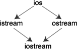
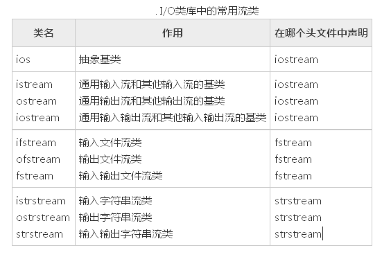
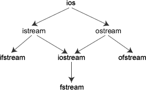
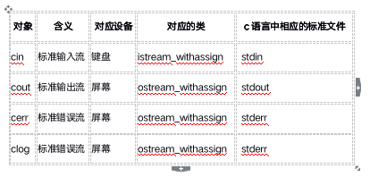
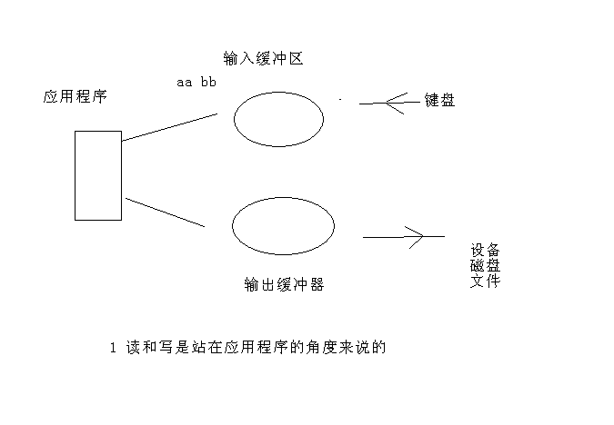
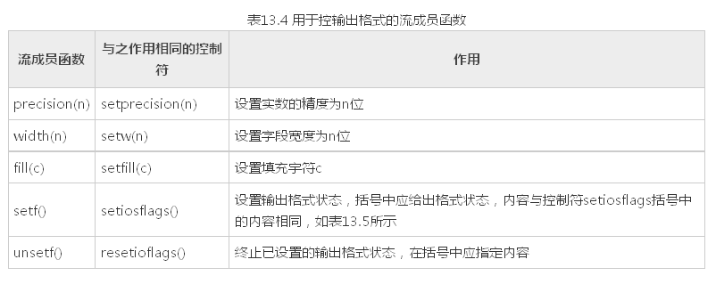
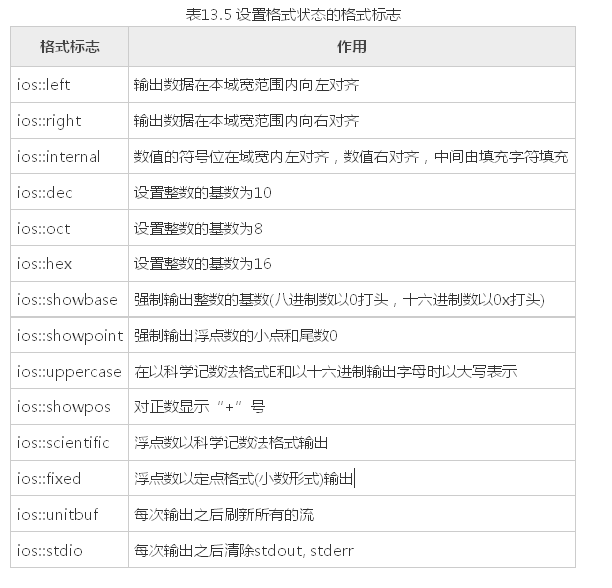
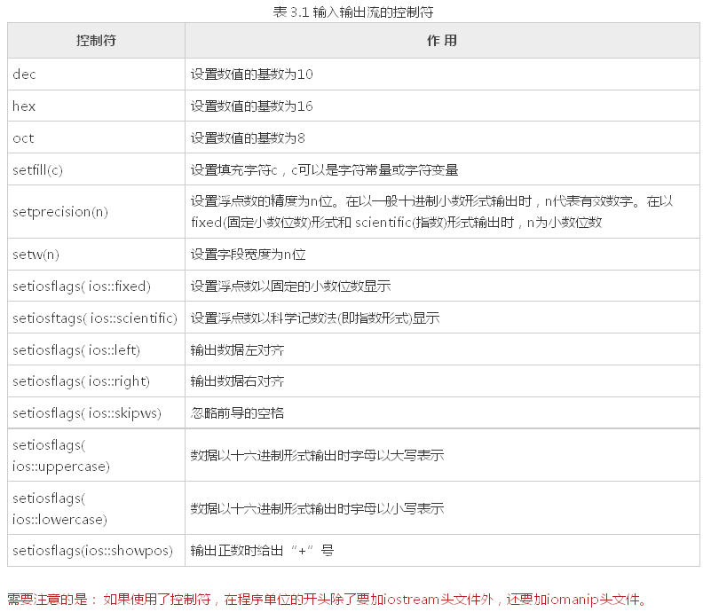
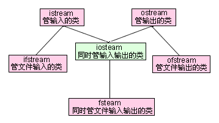
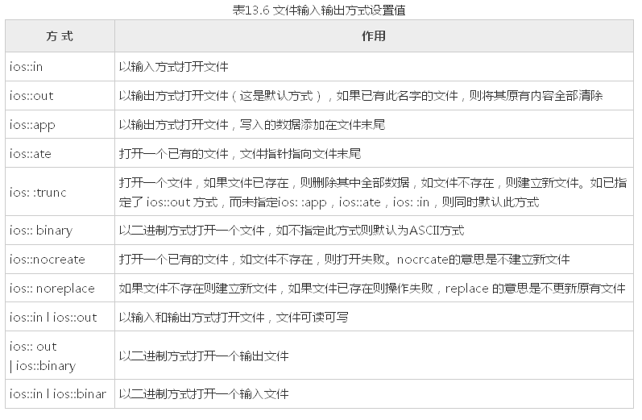

# 2-4IO


# 目录

1. [流的概念和流类库的结构](#cpp2data401)
2. [标准I/O流](#cpp2data402)
3. [标准输入流](#cpp2data403)
4. [标准输出流](#cpp2data404)
    1. [字符输出](#cpp2data404a)
    2. [格式化输出](#cpp2data404b)
        1. [使用流对象的有关成员函数](#cpp2data404b1)
        2. [控制符格式化输出](#cpp2data404b2)
        3. [对程序的几点说明](#cpp2data404b3)
5. [文件读写](#cpp2data405)
    1. [文件流类和文件流对象](#cpp2data405a)
    2. [C++打开文件](#cpp2data405b)
    3. [C++关闭文件](#cpp2data405c)
    4. [C++对ASCII文件的读写操作](#cpp2data405d)
    5. [C++对二进制文件的读写操作](#cpp2data405e)


### cpp2data401
# 4.1 流的概念和流类库的结构

程序的输入指的是从输入文件将数据传送给程序，程序的输出指的是从程序将数据传送给输出文件。

C++输入输出包含以下三个方面的内容：

- 对系统指定的标准设备的输入和输出。即从键盘输入数据，输出到显示器屏幕。这种输入输出称为标准的输入输出，简称标准I/O。

- 以外存磁盘文件为对象进行输入和输出，即从磁盘文件输入数据，数据输出到磁盘文件。以外存文件为对象的输入输出称为文件的输入输出，简称文件I/O。

- 对内存中指定的空间进行输入和输出。通常指定一个字符数组作为存储空间(实际上可以利用该空间存储任何信息)。这种输入和输出称为字符串输入输出，简称串I/O。

C++编译系统提供了用于输入输出的iostream类库。iostream这个单词是由3个部 分组成的，即i-o-stream，意为输入输出流。在iostream类库中包含许多用于输入输出的 类。常用的见表




ios是抽象基类，由它派生出istream类和ostream类，两个类名中第1个字母i和o分别代表输入(input)和输出(output)。 istream类支持输入操作，ostream类支持输出操作， iostream类支持输入输出操作。iostream类是从istream类和ostream类通过多重继承而派生的类。其继承层次见上图表示。

C++对文件的输入输出需要用ifstrcam和ofstream类，两个类名中第1个字母i和o分别代表输入和输出，第2个字母f代表文件 (file)。ifstream支持对文件的输入操作， ofstream支持对文件的输出操作。类ifstream继承了类istream，类ofstream继承了类ostream，类fstream继承了 类iostream。见图



I/O类库中还有其他一些类，但是对于一般用户来说，以上这些已能满足需要了。

**与iostream类库有关的头文件**

iostream类库中不同的类的声明被放在不同的头文件中，用户在自己的程序中用#include命令包含了有关的头文件就相当于在本程序中声明了所需 要用到的类。可以换 —种说法：头文件是程序与类库的接口，iostream类库的接口分别由不同的头文件来实现。常用的有

- · iostream  包含了对输入输出流进行操作所需的基本信息。

- · fstream  用于用户管理的文件的I/O操作。

- · strstream  用于字符串流I/O。

- · stdiostream  用于混合使用C和C + +的I/O机制时，例如想将C程序转变为C++程序。

- · iomanip  在使用格式化I/O时应包含此头文件。

**在iostream头文件中定义的流对象**

在 iostream 头文件中定义的类有 ios，istream，ostream，iostream，istream 等。

在iostream头文件中不仅定义了有关的类，还定义了4种流对象，



在iostream头文件中定义以上4个流对象用以下的形式（以cout为例）：      ostream cout ( stdout);  在定义cout为ostream流类对象时，把标准输出设备stdout作为参数，这样它就与标准输出设备(显示器)联系起来，如果有      cout <<3;  就会在显示器的屏幕上输出3。

**在iostream头文件中重载运算符**

“<<”和“>>”本来在C++中是被定义为左位移运算符和右位移运算符的，由于在iostream头文件中对它们进行了重载， 使它们能用作标准类型数据的输入和输出运算符。所以，在用它们的程序中必须用#include命令把iostream包含到程序中。

    #include <iostream>

1) >>a表示将数据放入a对象中。

2) <<a表示将a对象中存储的数据拿出。

### cpp2data402
# 4.2 标准I/O流

标准I/O对象:cin，cout，cerr，clog

**cout流对象**

cout是console output的缩写，意为在控制台（终端显示器）的输出。强调几点。

1) cout不是`C++`预定义的关键字，它是ostream流类的对象，在iostream中定义。 顾  名思义，流是流动的数据，cout流是流向显示器的数据。cout流中的数据是用流插入  运算符“<<”顺序加入的。如果有:      cout<<"I "<<"study `C++ `"<<"very hard. << “hello world !";

按顺序将字符串"I ", "study C++ ", "very hard."插人到cout流中，cout就将它们送  到显示器，在显示器上输出字符串"I study C++ very hard."。cout流是容纳数据的载  体，它并不是一个运算符。人们关心的是cout流中的内容，也就是向显示器输出什么。

  2)  用“cout<<”输出基本类型的数据时，可以不必考虑数据是什么类型，系统会判断数  据的类型，并根据其类型选择调用与之匹配的运算符重 载函数。这个过程都是自动的，  用户不必干预。如果在C语言中用prinf函数输出不同类型的数据，必须分别指定相应  的输出格式符，十分麻烦，而且容易出错。C++的I/O机制对用户来说，显然是方便  而安全的。

1) cout流在内存中对应开辟了一个缓冲区，用来存放流中的数据，当向cout流插人一个endl时，不论缓冲区是否已满，都立即输出流中所有数据，然后插入一个换行符， 并刷新流（清空缓冲区）。注意如果插人一个换行符”\n“（如cout<<a<<"\n"），则只输出和换行，而不刷新cout 流(但并不是所有编译系统都体现出这一区别）。

2)  在iostream中只对"<<"和">>"运算符用于标准类型数据的输入输出进行了重载，但未对用户声明的类型数据的输入输出进行重载。如果用户声明了新的类型，并希望用"<<"和">>"运算符对其进行输入输出，按照重运算符重载来做。

**cerr流对象**

cerr流对象是标准错误流，cerr流已被指定为与显示器关联。cerr的 作用是向标准错误设备(standard error device)输出有关出错信息。cerr与标准输出流cout的作用和用法差不多。但有一点不同：cout流通常是传送到显示器输出，但也可以被重定向输出到磁盘文件，而cerr流中的信息只能在显示器输出。当调试程序时，往往不希望程序运行时的出错信息被送到其他文件，而要求在显示器上及时输出，这时 应该用cerr。cerr流中的信息是用户根据需要指定的。

**clog流对象**

clog流对象也是标准错误流，它是console log的缩写。它的作用和cerr相同，都是在终端显示器上显示出错信息。区别：cerr是不经过缓冲区，直接向显示器上输出有关信息，而clog中的信息存放在缓冲区中，缓冲区满后或遇endl时向显示器输出。

缓冲区的概念:



### cpp2data403
# 4.3 标准输入流
标准输入流对象cin，重点掌握的函数

cin.get() //一次只能读取一个字符

cin.get(一个参数) //读一个字符

cin.get(两个参数) //可以读字符串

cin.getline()

cin.ignore()

cin.peek()

cin.putback()

```cpp

//cin.get
void test01(){
#if 0
	char ch = cin.get();
	cout << ch << endl;

	cin.get(ch);
	cout << ch << endl;


	//链式编程
	char char1, char2, char3, char4;
	cin.get(char1).get(char2).get(char3).get(char4);

	cout << char1 << " " << char2 << "" << char3 <<  " " << char4 << " ";
#endif

	char buf[1024] = { 0 };
	//cin.get(buf.1024);
	cin.getline(buf,1024);
	cout << buf;
}

//cin.ignore
void test02(){

	char buf[1024] = { 0 };
	cin.ignore(2); //忽略缓冲区当前字符
	cin.get(buf,1024);
	cout << buf << endl;
}

//cin.putback 将数据放回缓冲区
void test03(){

	//从缓冲区取走一个字符
	char ch = cin.get();
	cout << "从缓冲区取走的字符:" << ch << endl;
	//将数据再放回缓冲区
	cin.putback(ch);
	char buf[1024] = { 0 };
	cin.get(buf,1024);
	cout << buf << endl;

}

//cin.peek 偷窥
void test04(){
	
	//偷窥下缓冲区的数据
	char ch = cin.peek();
	cout << "偷窥缓冲区数据:" << ch << endl;
	char buf[1024] = { 0 };
	cin.get(buf, 1024);
	cout << buf << endl;
}

//练习  作业 使用cin.get和putback完成类似功能
void test05(){
	
	cout << "请输入一个数字或者字符串:" << endl;
	char ch = cin.peek();
	if(ch >= '0' && ch <= '9'){
		int number;
		cin >> number;
		cout << "数字:" << number << endl;
	}
	else{
		char buf[64] = { 0 };
		cin.getline(buf, 64);
		cout << "字符串:" <<  buf << endl;
	}
}

```


### cpp2data404
# 4.4 标准输出流

### cpp2data404a
## 4.4.1 字符输出

cout.flush() //刷新缓冲区 Linux下有效

cout.put() //向缓冲区写字符

cout.write() //从buffer中写num个字节到当前输出流中。

```cpp

//cout.flush 刷新缓冲区，linux下有效
void test01(){	
	cout << "hello world";
	//刷新缓冲区
	cout.flush(); 
}

//cout.put 输出一个字符
void test02(){
	
	cout.put('a');
	//链式编程
	cout.put('h').put('e').put('l');
}

//cout.write 输出字符串 buf,输出多少个
void test03(){
	
	//char* str = "hello world!";
	//cout.write(str, strlen(str));
	char* str = "*************";
	for (int i = 1; i <= strlen(str); i ++){
		cout.write(str, i);
		cout << endl;
	}

	for (int i = strlen(str); i > 0; i --){
		cout.write(str, i);
		cout << endl;
	}

}

```


### cpp2data404b
## 4.4.2 格式化输出

在输出数据时，为简便起见，往往不指定输出的格式，由系统根据数据的类型采取默认的格式，但有时希望数据按指定的格式输出，如要求以十六进制或八进制形式输出一个整数，对输出的小数只保留两位小数等。有两种方法可以达到此目的。

1）使用控制符的方法；

2）使用流对象的有关成员函数。

### cpp2data404b1
### 4.4.2.1 使用流对象的有关成员函数

通过调用流对象cout中用于控制输出格式的成员函数来控制输出格式。用于控制输出格式的常用的成员函数如下：



流成员函数setf和控制符setiosflags括号中的参数表示格式状态，它是通过格式标志来指定的。格式标志在类ios中被定义为枚举值。因此在引用这些格式标志时要在前面加上类名ios和域运算符“::”。格式标志见表13.5。



### cpp2data404b2
### 4.4.2.2 控制符格式化输出

C++提供了在输入输出流中使用的控制符(有的书中称为操纵符)。



```cpp


//通过流成员函数
void test01(){
	
	int number = 99;
	cout.width(20);
	cout.fill('*');
	cout.setf(ios::left);
	cout.unsetf(ios::dec); //卸载十进制
	cout.setf(ios::hex);
	cout.setf(ios::showbase);
	cout.unsetf(ios::hex);
	cout.setf(ios::oct);
	cout << number << endl;

}

//使用控制符
void test02(){

	int number = 99;
	cout << setw(20)
		<< setfill('~')
		<< setiosflags(ios::showbase)
		<< setiosflags(ios::left)
		<< hex
		<< number
		<< endl;

}

```


### cpp2data404b3
### 4.4.2.3 对程序的几点说明

1) 成员函数width(n)和控制符setw(n)只对其后的第一个输出项有效。如：

cout. width(6);      cout <<20 <<3.14<<endl;  输出结果为 203.14

在输出第一个输出项20时，域宽为6，因此在20前面有4个空格，在输出3.14时，width (6)已不起作用，此时按系统默认的域宽输出（按数据实际长度输出）。如果要求在输出数据时都按指定的同一域宽n输出，不能只调用一次width(n)， 而必须在输出每一项前都调用一次width(n>，上面的程序中就是这样做的。

2) 在表13.5中的输出格式状态分为5组，每一组中同时只能选用一种（例如dec、hex和oct中只能选一，它们是互相排斥的）。在用成员函数setf和 控制符setiosflags设置输出格式状态后，如果想改设置为同组的另一状态，应当调用成员函数unsetf（对应于成员函数self）或 resetiosflags（对应于控制符setiosflags），先终止原来设置的状态。然后再设置其他状态，大家可以从本程序中看到这点。程序在开 始虽然没有用成员函数self和控制符setiosflags设置用dec输出格式状态，但系统默认指定为dec，因此要改变为hex或oct，也应当先 用unsetf 函数终止原来设置。如果删去程序中的第7行和第10行，虽然在第8行和第11行中用成员函数setf设置了hex和oct格式，由于未终止dec格式，因 此hex和oct的设置均不起作用，系统依然以十进制形式输出。

同理，程序倒数第8行的unsetf 函数的调用也是不可缺少的。

3) 用setf 函数设置格式状态时，可以包含两个或多个格式标志，由于这些格式标志在ios类中被定义为枚举值，每一个格式标志以一个二进位代表，因此可以用位或运算符“|”组合多个格式标志。如倒数第5、第6行可以用下面一行代替：

    cout.setf(ios::internal I ios::showpos);  //包含两个状态标志，用"|"组合

1) 可以看到：对输出格式的控制，既可以用控制符(如例13.2)，也可以用cout流的有关成员函数(如例13.3)，二者的作用是相同的。控制符是在头文件iomanip中定义的，因此用控制符时，必须包含iomanip头文件。cout流的成员函数是在头文件iostream 中定义的，因此只需包含头文件iostream，不必包含iomanip。许多程序人员感到使用控制符方便简单，可以在一个cout输出语句中连续使用多种控制符。

### cpp2data405
# 4.5 文件读写


### cpp2data405a
## 4.5.1 文件流类和文件流对象

输入输出是以系统指定的标准设备（输入设备为键盘，输出设备为显示器）为对象的。在实际应用中，常以磁盘文件作为对象。即从磁盘文件读取数据，将数据输出到磁盘文件。

和文件有关系的输入输出类主要在fstream.h这个头文件中被定义，在这个头文件中主要被定义了三个类，由这三个类控制对文件的各种输入输出操作，他们分别是ifstream、ofstream、fstream，其中fstream类是由iostream类派生而来，他们之间的继承关系见下图所示：



由于文件设备并不像显示器屏幕与键盘那样是标准默认设备，所以它在fstream头文件中是没有像cout那样预先定义的全局对象，所以我们必须自己定义一个该类的对象。ifstream类，它是从istream类派生的，用来支持从磁盘文件的输入。ofstream类，它是从ostream类派生的，用来支持向磁盘文件的输出。

fstream类，它是从iostream类派生的，用来支持对磁盘文件的输入输出。


### cpp2data405b
## 4.5.2 C++打开文件

所谓打开(open)文件是一种形象的说法，如同打开房门就可以进入房间活动一样。 打开文件是指在文件读写之前做必要的准备工作，包括：

1）为文件流对象和指定的磁盘文件建立关联，以便使文件流流向指定的磁盘文件。

2）指定文件的工作方式，如：该文件是作为输入文件还是输出文件，是ASCII文件还是二进制文件等。

以上工作可以通过两种不同的方法实现:

1) 调用文件流的成员函数open。如

      ofstream outfile;  //定义ofstream类(输出文件流类)对象outfile

        outfile.open("f1.dat",ios::out);  //使文件流与f1.dat文件建立关联

第2行是调用输出文件流的成员函数open打开磁盘文件f1.dat，并指定它为输出文件， 文件流对象outfile将向磁盘文件f1.dat输出数据。ios::out是I/O模式的一种，表示  以输出方式打开一个文件。或者简单地说，此时f1.dat是一个输出文件，接收从内存  输出的数据。

磁盘文件名可以包括路径，如"c:\\new\\f1.dat"，如缺省路径，则默认为当前目录下的文件。

2) 在定义文件流对象时指定参数

在声明文件流类时定义了带参数的构造函数，其中包含了打开磁盘文件的功能。因此，  可以在定义文件流对象时指定参数，调用文件流类的构造函数来实现打开文件的功能。



几点说明：  
- 1) 新版本的I/O类库中不提供ios::nocreate和ios::noreplace。    
- 2) 每一个打开的文件都有一个文件指针，该指针的初始位置由I/O方式指定，每次读写都从文件指针的当前位置开始。每读入一个字节，指针就后移一个字节。当文件指针移到最后，就会遇到文件结束EOF（文件结束符也占一个字节，其值为-1)，此时流对象的成员函数eof的值为非0值(一般设为1)，表示文件结束 了。    
- 3) 可以用“位或”运算符“|”对输入输出方式进行组合，如表13.6中最后3行所示那样。还可以举出下面一些例子：      ios::in | ios:: noreplace  //打开一个输入文件，若文件不存在则返回打开失败的信息      ios::app | ios::nocreate  //打开一个输出文件，在文件尾接着写数据，若文件不存在，则返回打开失败的信息      ios::out l ios::noreplace  //打开一个新文件作为输出文件，如果文件已存在则返回打开失败的信息      ios::in l ios::out I ios::binary  //打开一个二进制文件，可读可写  但不能组合互相排斥的方式，如 ios::nocreate l ios::noreplace。    

- 4) 如果打开操作失败，open函数的返回值为0(假)，如果是用调用构造函数的方式打开文件的，则流对象的值为0。可以据此测试打开是否成功。如      if(outfile.open("f1.bat", ios::app) ==0)          cout <<"open error";  或      if( !outfile.open("f1.bat", ios::app) )          cout <<"open error";

### cpp2data405c
## 4.5.3 C++关闭文件


在对已打开的磁盘文件的读写操作完成后，应关闭该文件。关闭文件用成员函数close。如：outfile.close( );  //将输出文件流所关联的磁盘文件关闭  所谓关闭，实际上是解除该磁盘文件与文件流的关联，原来设置的工作方式也失效，这样，就不能再通过文件流对该文件进行输入或输出。此时可以将文件流与其他磁盘文件建立关联，通过文件流对新的文件进行输入或输出。如:      

`outfile.open("f2.dat",ios::app|ios::nocreate)；`

   此时文件流outfile与f2.dat建立关联，并指定了f2.dat的工作方式。


### cpp2data405d
## 4.5.4 C++对ASCII文件的读写操作

如果文件的每一个字节中均以ASCII代码形式存放数据,即一个字节存放一个字符,这个文件就是ASCII文件(或称字符文件)。程序可以从ASCII文件中读入若干个字符,也可以向它输出一些字符。

1) 用流插入运算符“<<”和流提取运算符“>>”输入输出标准类型的数据。“<<”和“ >>”都巳在iostream中被重载为能用于ostream和istream类对象的标准类型的输入输出。由于ifstream和 ofstream分别是ostream和istream类的派生类；因此它们从ostream和istream类继承了公用的重载函数，所以在对磁盘文件的操作中，可以通过文件流对象和流插入运算符“<<”及 流提取运算符“>>”实现对磁盘 文件的读写，如同用cin、cout和<<、>>对标准设备进行读写一样。

2) 用文件流的put、get、geiline等成员函数进行字符的输入输出，：用`C++`流成员函数put输出单个字符、`C++ get()`函数读入一个字符和`C++ getline()`函数读入一行字符。

```cpp

int main(){

	char* sourceFileName = "./source.txt";
	char* targetFileName = "./target.txt";
	//创建文件输入流对象
	ifstream ism(sourceFileName, ios::in);
	//创建文件输出流对象
	ofstream osm(targetFileName,ios::out);

	if (!ism){
		cout << "文件打开失败!" << endl;
	}

	while (!ism.eof()){
		char buf[1024] = { 0 };
		ism.getline(buf,1024);
		cout << buf << endl;
		osm << buf << endl;
	}

	//关闭文件流对象
	ism.close();
	osm.close();

	system("pause");
	return EXIT_SUCCESS;
}

```


### cpp2data405e
## 4.5.5 C++对二进制文件的读写操作


二进制文件不是以ASCII代码存放数据的，它将内存中数据存储形式不加转换地传送到磁盘文件，因此它又称为内存数据的映像文件。因为文件中的信息不是字符数据，而是字节中的二进制形式的信息，因此它又称为字节文件。

对二进制文件的操作也需要先打开文件，用完后要关闭文件。在打开时要用ios::binary指定为以二进制形式传送和存储。二进制文件除了可以作为输入文件或输出文件外,还可以是既能输入又能输出的文件。这是和ASCII文件不同的地方。

**用成员函数read和write读写二进制文件**

对二进制文件的读写主要用istream类的成员函数read和write来实现。这两个成员函数的原型为      istream& read(char *buffer,int len);      ostream& write(const char * buffer,int len);  字符指针buffer指向内存中一段存储空间。len是读写的字节数。调用的方式为：      a. write(p1,50);      b. read(p2,30);  上面第一行中的a是输出文件流对象，write函数将字符指针p1所给出的地址开始的50个字节的内容不加转换地写到磁盘文件中。在第二行中，b是输入文件流对象，read 函数从b所关联的磁盘文件中，读入30个字节(或遇EOF结束），存放在字符指针p2所指的一段空间内。


```cpp

class Person{
public:
	Person(char* name,int age){
		strcpy(this->mName, name);
		this->mAge = age;
	}
public:
	char mName[64];
	int mAge;
};

int main(){

	char* fileName = "person.txt";
	//二进制模式读写文件
	//创建文件对象输出流
	ofstream osm(fileName, ios::out | ios::binary);

	Person p1("John",33);
	Person p2("Edward", 34);

	//Person对象写入文件
	osm.write((const char*)&p1,sizeof(Person));
	osm.write((const char*)&p2, sizeof(Person));

	//关闭文件输出流
	osm.close();

	//从文件中读取对象数组
	ifstream ism(fileName, ios::in | ios::binary);
	if (!ism){
		cout << "打开失败!" << endl;
	}
	
	Person p3;
	Person p4;

	ism.read((char*)&p3, sizeof(Person));
	ism.read((char*)&p4, sizeof(Person));

	cout << "Name:" << p3.mName << " Age:" << p3.mAge << endl;
	cout << "Age:" << p4.mName << " Age:" << p4.mAge << endl;

	//关闭文件输入流
	ism.close();

	system("pause");
	return EXIT_SUCCESS;
}

```
