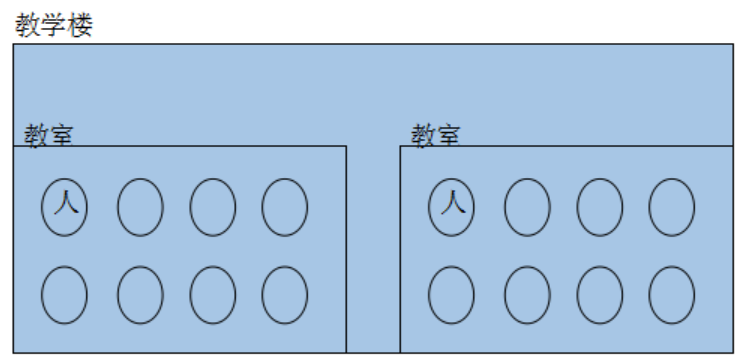

# 目录

1. [STL六大组件简介](#std3a)
2. [2.1 容器](#std3b)
3. [2.2 算法](#std3c)
4. [2.3 迭代器](#std3d)
5. [2.4 案例](#std3e)


### std3a
# 1. STL六大组件简介

STL提供了六大组件，彼此之间可以组合套用，这六大组件分别是:容器、算法、迭代器、仿函数、适配器、空间配置器。

**容器：** 各种数据结构，如`vector`、`list`、`deque`、`set`、`map`等,用来存放数据，从实现角度来看，`STL`容器是一种`class template`。

**算法:** 各种常用的算法，如`sort`、`find`、`copy`、`for_each`。从实现的角度来看，STL算法是一种`function tempalte.`

**迭代器:** 扮演了容器与算法之间的胶合剂，共有五种类型，从实现角度来看，迭代器是一种将`operator*` , `operator->` , `operator++`,`operator--`等指针相关操作予以重载的`class template. `所有`STL`容器都附带有自己专属的迭代器，只有容器的设计者才知道如何遍历自己的元素。原生指针(`native pointer`)也是一种迭代器。

**仿函数：** 行为类似函数，可作为算法的某种策略。从实现角度来看，仿函数是一种重载了`operator()`的`class` 或者`class template`

**适配器：** 一种用来修饰容器或者仿函数或迭代器接口的东西。

**空间配置器：** 负责空间的配置与管理。从实现角度看，配置器是一个实现了动态空间配置、空间管理、空间释放的`class tempalte.`

STL六大组件的交互关系，容器通过空间配置器取得数据存储空间，算法通过迭代器存储容器中的内容，仿函数可以协助算法完成不同的策略的变化，适配器可以修饰仿函数。


### std3b
# 2.1 容器

容器，置物之所也。

研究数据的特定排列方式，以利于搜索或排序或其他特殊目的，这一门学科我们成为数据结构。大学信息类相关专业里面，与编程最有直接关系的学科，首推数据结构与算法。几乎可以说，任何特定的数据结构都是为了实现某种特定的算法。`STL`容器就是将运用最广泛的一些数据结构实现出来。

常用的数据结构不在乎，数组(`array`),链表(`list`),`tree`(树)，栈(`stack`),队列(`queue`),集合(`set`),映射表(`map`),根据数据在容器中的排列特性，这些数据分为**序列式容器**和**关联式容器**两种。

- 序列式容器就是容器元素在容器中的位置是由元素进入容器的时间和地点来决定。`Vector`容器、`Deque`容器、`List`容器、`Stack`容器、`Queue`容器。

- 关联式容器是指容器已经有了一定的规则，容器元素在容器中的位置由我的规则来决定。`Set/multiset`容器 `Map/multimap`容器




### std3c
# 2.2 算法

算法，问题之解法也。

以有限的步骤，解决逻辑或数学上的问题，这一门学科我们叫做**算法**(`Algorithms`).

广义而言，我们所编写的每个程序都是一个算法，其中的每个函数也都是一个算法，毕竟它们都是用来解决或大或小的逻辑问题或数学问题。STL收录的算法经过了数学上的效能分析与证明，是极具复用价值的，包括常用的排序，查找等等。特定的算法往往搭配特定的数据结构，数据结构是问题的载体，算法与数据结构相辅相成。

`算法分为`: **质变算法** 和 **非质变算法**。

`质变算法`：是指运算过程中会更改区间内的元素的内容。例如拷贝，替换，删除等等

`非质变算法`：是指运算过程中不会更改区间内的元素内容，例如查找、计数、遍历、寻找极值等等


**再好的编编程技巧，也无法让一个笨拙的算法起死回生。**


### std3d
# 2.3 迭代器

迭代器(`iterator`)是一种抽象的设计概念，现实程序语言中并没有直接对应于这个概念的实物。在`<<Design Patterns>>`一书中提供了23中设计模式的完整描述，其中iterator模式定义如下：提供一种方法，使之能够依序寻访某个容器所含的各个元素，而又无需暴露该容器的内部表示方式。

迭代器的设计思维-STL的关键所在，STL的中心思想在于将数据容器(`container`)和算法(`algorithms`)分开，彼此独立设计，最后再一贴胶着剂将他们撮合在一起。从技术角度来看，容器和算法的泛型化并不困难，`c++`的`class template`和`function template`可分别达到目标，如果设计出两这个之间的良好的胶着剂，才是大难题。

迭代器的种类:

| item      | Model    |  Price |
| --------- | -------- | -----: |
|  输入迭代器   | 提供对数据的只读访问  | 只读，支持++、==、！= |
|  输出迭代器 |  提供对数据的只写访问 |  提供对数据的只写访问  |
|  前向迭代器 |  提供读写操作，并能向前推进迭代器  | 读写，支持++、==、！= |
|双向迭代器| 提供读写操作，并能向前和向后操作    |   读写，支持++、--，     |
|随机访问迭代器|提供读写操作，并能在数据中随机移动| 读写，支持++、--、[n]、-n、<、<=、>、>= |


### std3e
# 2.4 案例


```c


#include<iostream>
#include<vector>
#include<algorithm>
usingnamespace std;

//STL 中的容器 算法 迭代器
void test01(){
	vector<int> v;//STL 中的标准容器之一 ：动态数组
	v.push_back(1);//vector 容器提供的插入数据的方法
	v.push_back(5);
	v.push_back(3);
	v.push_back(7);
	//迭代器
	vector<int>::iterator pStart = v.begin();//vector 容器提供了 begin()方法 返回指向第一个元素的迭代器
	vector<int>::iterator pEnd = v.end();//vector 容器提供了 end()方法 返回指向最后一个元素下一个位置的迭代器
	//通过迭代器遍历
	while(pStart != pEnd){
		cout <<*pStart <<" ";
		pStart++;
	}
	cout << endl;
	//算法 count 算法 用于统计元素的个数
	int n = count(pStart, pEnd,5);
	cout <<"n:"<< n << endl;
}
//STL 容器不单单可以存储基础数据类型，也可以存储类对象
class Teacher
{
public:
	Teacher(int age):age(age){};
	~Teacher(){};
public:
	int age;
};
void test02(){
	vector<Teacher> v;//存储 Teacher 类型数据的容器
	Teacher t1(10), t2(20), t3(30);
	v.push_back(t1);
	v.push_back(t2);
	v.push_back(t3);
	vector<Teacher>::iterator pStart = v.begin();
	vector<Teacher>::iterator pEnd = v.end();
	//通过迭代器遍历
	while(pStart != pEnd){
		cout << pStart->age <<" ";
		pStart++;
	}
	cout << endl;
}
//存储 Teacher 类型指针
void test03(){
	vector<Teacher*> v;//存储 Teacher 类型指针
	Teacher* t1 =new Teacher(10);
	Teacher* t2 =new Teacher(20);
	Teacher* t3 =new Teacher(30);
	v.push_back(t1);
	v.push_back(t2);
	v.push_back(t3);
	//拿到容器迭代器
	vector<Teacher*>::iterator pStart = v.begin();
	vector<Teacher*>::iterator pEnd = v.end();
	//通过迭代器遍历
	while(pStart != pEnd){
		cout <<(*pStart)->age <<" ";
		pStart++;
	}
	cout << endl;
}
//容器嵌套容器 难点(不理解，可以跳过)
void test04(){
	vector<vector<int>> v;//容器中存储容器
	vector<int> v1, v2, v3;
	v1.push_back(1);
	v1.push_back(2);
	v2.push_back(10);
	v3.push_back(100);
	v3.push_back(200);
	v.push_back(v1);
	v.push_back(v2);
	v.push_back(v3);
	//拿到容器迭代器
	vector<vector<int>>::iterator pStart = v.begin();
	vector<vector<int>>::iterator pEnd = v.end();
	//通过迭代器遍历
	while(pStart != pEnd){
		vector<int> vTemp =*pStart;//获得迭代器当前指向的容器
		vector<int>::iterator tmpStart = vTemp.begin();
		vector<int>::iterator tmpEnd = vTemp.end();
		for(; tmpStart != tmpEnd; tmpStart++){
			cout <<*tmpStart <<" ";
		}
		cout << endl;
		pStart++;
	}
}
int main(){
	//test01();
	//test02();
	//test03();
	test04();
	system("pause");
	return EXIT_SUCCESS;
}


```
