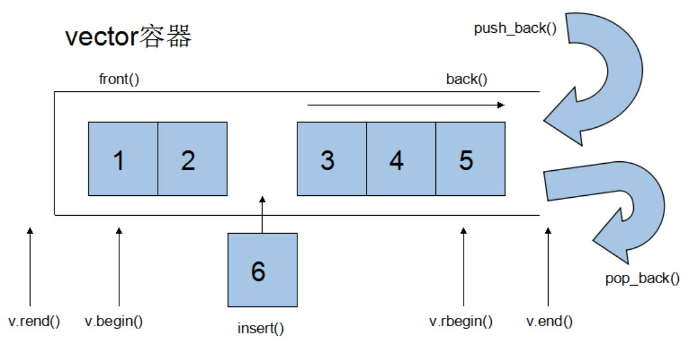
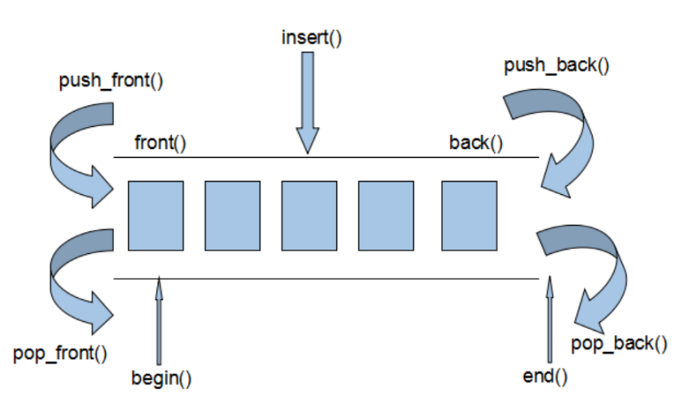
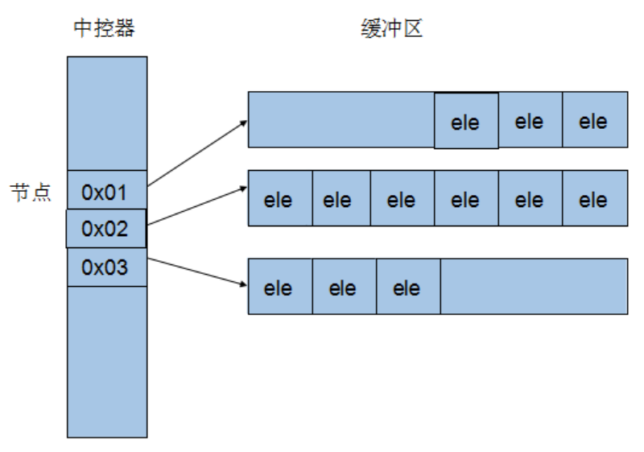
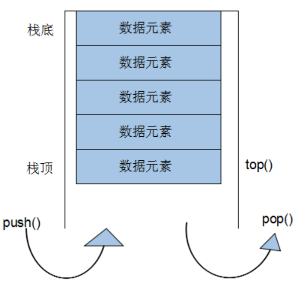
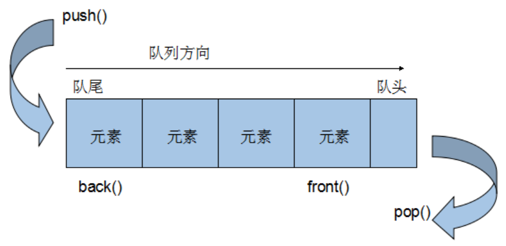
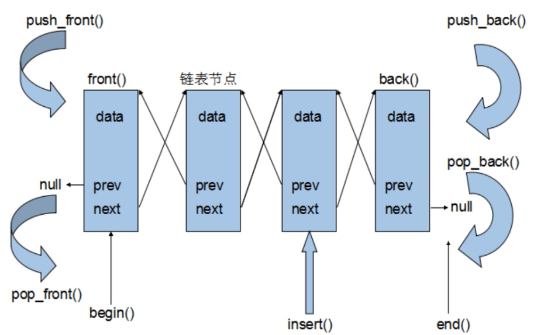
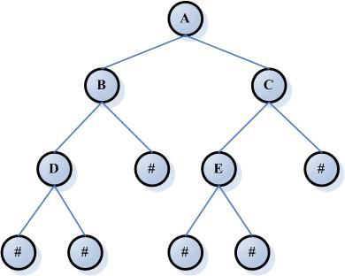
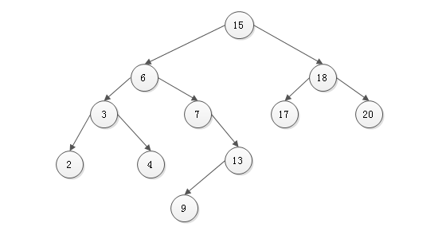
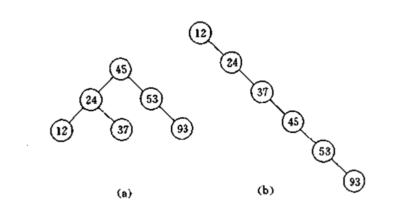

# 目录

1. [3.1 string容器](#std1)
    1. [3.1.1 string容器基本概念](#std1a) 
    2. [3.1.2 string容器常用操作](#std1b) 
        1. [3.1.2.1 string 构造函数](#std1b1)
        2. [3.1.2.2 string基本赋值操作](#std1b2)
        3. [3.1.2.3 string存取字符操作](#std1b3)
        4. [3.1.2.4 string拼接操作](#std1b4)
        5. [3.1.2.5 string查找和替换](#std1b5)
        6. [3.1.2.6 string比较操作](#std1b6)
        7. [3.1.2.7 string子串](#std1b7)
        8. [3.1.2.8 string插入和删除操作](#std1b8)
        9. [3.1.2.9 string和c-style字符串转换](#std1b9)

2. [3.2 vector容器](#std2)
    1. [3.2.1 vector容器基本概念](#std2a) 
    2. [3.2.2 vector迭代器](#std2b) 
    3. [3.2.3 vector的数据结构](#std2c) 
    4. [3.2.4 vector常用API操作](#std2d) 
        1. [3.2.4.1 vector构造函数](#std2d1) 
        2. [3.2.4.2 vector常用赋值操作](#std2d2) 
        3. [3.2.4.3 vector大小操作](#std2d3) 
        4. [3.2.4.4 vector数据存取操作](#std2d4) 
        5. [3.2.4.5 vector插入和删除操作](#std2d5) 
    5. [3.2.5 vector小案例](#std2e) 
3. [3.3 deque容器](#std3)
    1. [3.3.1 deque容器基本概念](#std3a)
    2. [3.3.2 deque容器实现原理](#std3b)
    3. [3.3.3 deque常用API](#std3c)
        1. [3.3.3.1 deque构造函数](#std3c1) 
        2. [3.3.3.2 deque赋值操作](#std3c2) 
        3. [3.3.3.3 deque大小操作](#std3c3) 
        4. [3.3.3.4 deque双端插入和删除操作](#std3c4) 
        5. [3.3.3.5 deque双端插入和删除操作](#std3c5) 
        6. [3.3.3.6 deque插入操作](#std3c6) 
        7. [3.3.3.7 deque删除操作](#std3c7) 
4. [3.4 stack容器](#std4)
    1. [3.4.1 stack容器基本概念](#std4a)
    2. [3.4.2 stack没有迭代器](#std4b)
    3. [3.4.3 stack常用API](#std4c)
        1. [3.4.3.1 stack构造函数](#std4c1)
        2. [3.4.3.2 stack赋值操作](#std4c2)
        3. [3.4.3.3 stack数据存取操作](#std4c3)
        4. [3.4.3.4 stack大小操作](#std4c4)
5. [3.5 queue容器](#std5)
    1. [3.5.1 queue容器基本概念](#std5a)
    2. [3.5.2 queue没有迭代器](#std5b)
    3. [3.5.3 queue常用API](#std5c)
        1. [3.5.3.1 queue构造函数](#std5c1)
        2. [3.5.3.2 queue存取、插入和删除操作](#std5c2)
        3. [3.5.3.3 queue赋值操作](#std5c3)
        4. [3.5.3.4 queue大小操作](#std5c4)
6. [3.6 list容器](#std6)
    1. [3.6.1 list容器基本概念](#std6a)
    2. [3.6.2 list容器的迭代器](#std6b)
    3. [3.6.3 list容器的数据结构](#std6c)
    4. [3.6.4 list常用API](#std6d)
        1. [3.6.4.1 list构造函数](#std6d1)
        2. [3.6.4.2 list数据元素插入和删除操作](#std6d2)
        3. [3.6.4.3 list大小操作](#std6d3)
        4. [3.6.4.4 list赋值操作](#std6d4)
        5. [3.6.4.5 list数据的存取](#std6d5)
        6. [3.6.4.6 list反转排序](#std6d6)
7. [3.7 set/multiset容器](#std7)
    1. [3.7.1 set/multiset容器基本概念](#std7a)
        1. [3.7.1.1 set容器基本概念](#std7a1)
        2. [3.7.1.2 multiset容器基本概念](#std7a2)
    2. [3.7.2 set常用API](#std7b)
        1. [3.7.2.1 set构造函数](#std7b1)
        2. [3.7.2.2 set赋值操作](#std7b2)
        3. [3.7.2.3 set大小操作](#std7b3)
        4. [3.7.2.4 set插入和删除操作](#std7b4)
        5. [3.7.2.5 set查找操作](#std7b5)
    3. [3.7.3 对组(pair)](#std7c)
8. [3.8 map/multimap容器](#std8)
    1. [3.8.1 map/multimap基本概念](#std8a)
    2. [3.8.2 map/multimap常用API](#std8b)
        1. [3.8.2.1 map构造函数](#std8b1)
        2. [3.8.2.2 map赋值操作](#std8b2)
        3. [3.8.2.3 map大小操作](#std8b3)
        4. [3.8.2.4 map插入数据元素操作](#std8b4)
        5. [3.8.2.5 map删除操作](#std8b5)
        6. [3.8.2.6 map查找操作](#std8b6)
    3. [3.8.3 multimap案例](#std8c)
9. [3.9 STL容器元素深/浅拷贝问题](#std9)
10. [3.10 STL容器使用时机](#std10)


### std1
# 3.1 string容器

### std1a
##  3.1.1 string容器基本概念

C风格字符串(以空字符结尾的字符数组)太过复杂难于掌握，不适合大程序的开发，所以`C++`标准库定义了一种`string`类，定义在头文件`<string>`。

`String`和c风格字符串对比：

`u Char*`是一个指针，`String`是一个类

`string`封装了`char*`，管理这个字符串，是一个`char*`型的容器。

`u String`封装了很多实用的成员方法

查找`find`，拷贝`copy`，删除`delete` 替换`replace`，插入`insert`

`u` 不用考虑内存释放和越界

 `string`管理`char*`所分配的内存。每一次`string`的复制，取值都由`string`类负责维护，不用担心复制越界和取值越界等。

### std1b
##  3.1.2 string容器常用操作

### std1b1
### 3.1.2.1 string 构造函数

```cpp

string();//创建一个空的字符串 例如: string str;      
string(conststring& str);//使用一个string对象初始化另一个string对象
string(constchar* s);//使用字符串s初始化
string(int n, char c);//使用n个字符c初始化 

```


### std1b2
### 3.1.2.2 string基本赋值操作

```cpp

string&operator=(constchar* s);//char*类型字符串 赋值给当前的字符串
string&operator=(conststring&s);//把字符串s赋给当前的字符串
string&operator=(char c);//字符赋值给当前的字符串
string& assign(constchar *s);//把字符串s赋给当前的字符串
string& assign(constchar *s, int n);//把字符串s的前n个字符赋给当前的字符串
string& assign(conststring&s);//把字符串s赋给当前字符串
string& assign(int n, char c);//用n个字符c赋给当前字符串
string& assign(conststring&s, int start, int n);//将s从start开始n个字符赋值给字符串,如s=hello,那么n=3,start=1，那么是hel中从e开始赋值3-1个字符

```


### std1b3
### 3.1.2.3 string存取字符操作

```cpp

char&operator[](int n);//通过[]方式取字符
char& at(int n);//通过at方法获取字符

```


### std1b4
### 3.1.2.4 string拼接操作

```cpp

string&operator+=(conststring& str);//重载+=操作符
string&operator+=(constchar* str);//重载+=操作符
string&operator+=(constchar c);//重载+=操作符
string& append(constchar *s);//把字符串s连接到当前字符串结尾
string& append(constchar *s, int n);//把字符串s的前n个字符连接到当前字符串结尾
string& append(conststring&s);//同operator+=()
string& append(conststring&s, int pos, int n);//把字符串s中从pos开始的n个字符连接到当前字符串结尾
string& append(int n, char c);//在当前字符串结尾添加n个字符c

```


### std1b5
### 3.1.2.5 string查找和替换

```cpp

int find(conststring& str, int pos = 0) const; //查找str第一次出现位置,从pos开始查找
int find(constchar* s, int pos = 0) const;  //查找s第一次出现位置,从pos开始查找
int find(constchar* s, int pos, int n) const;  //从pos位置查找s的前n个字符第一次位置
int find(constchar c, int pos = 0) const;  //查找字符c第一次出现位置
int rfind(conststring& str, int pos = npos) const;//查找str最后一次位置,从pos开始查找
int rfind(constchar* s, int pos = npos) const;//查找s最后一次出现位置,从pos开始查找
int rfind(constchar* s, int pos, int n) const;//从pos查找s的前n个字符最后一次位置
int rfind(constchar c, int pos = 0) const; //查找字符c最后一次出现位置
string& replace(int pos, int n, conststring& str); //替换从pos开始n个字符为字符串str
string& replace(int pos, int n, constchar* s); //替换从pos开始的n个字符为字符串s

```


### std1b6
### 3.1.2.6 string比较操作

```cpp

/*
compare函数在>时返回 1，<时返回 -1，==时返回 0。
比较区分大小写，比较时参考字典顺序，排越前面的越小。
大写的A比小写的a小。
*/
int compare(conststring&s) const;//与字符串s比较
int compare(constchar *s) const;//与字符串s比较

```


### std1b7
### 3.1.2.7 string子串

```cpp

string substr(int pos = 0, int n = npos) const;//返回由pos开始的n个字符组成的字符串

```


### std1b8
### 3.1.2.8 string插入和删除操作

```cpp

string& insert(int pos, constchar* s); //插入字符串
string& insert(int pos, conststring& str); //插入字符串
string& insert(int pos, int n, char c);//在指定位置插入n个字符c
string& erase(int pos, int n = npos);//删除从Pos开始的n个字符 

```


### std1b9
### 3.1.2.9 string和c-style字符串转换

```cpp

//string 转 char*
string str = "itcast";
constchar* cstr = str.c_str();
//char* 转 string 
char* s = "itcast";
string sstr(s);

```


**提示:**

  在`c++`中存在一个从const char*到string的隐式类型转换，却不存在从一个string对象到`C_string`的自动类型转换。对于string类型的字符串，可以通过`c_str()`函数返回string对象对应的`C_string.`

  通常，程序员在整个程序中应坚持使用`string`类对象，直到必须将内容转化为`char*`时才将其转换为`C_string.`


**提示:**

   为了修改string字符串的内容，下标操作符[]和at都会返回字符的引用。但当字符串的内存被重新分配之后，可能发生错误.


```cpp


	string s ="abcdefg";
	char& a = s[2];
	char& b = s[3];

	a ='1';
	b ='2';

	cout << s << endl;
	cout <<(int*)s.c_str()<< endl;

	s ="pppppppppppppppppppppppp";

	//a = '1';
	//b = '2';

	cout << s << endl;
	cout <<(int*)s.c_str()<< endl;

```


### std2
# 3.2 vector容器 

### std2a
## 3.2.1 vector容器基本概念

vector的数据安排以及操作方式，与array非常相似，两者的唯一差别在于空间的运用的灵活性。Array是静态空间，一旦配置了就不能改变，要换大一点或者小一点的空间，可以，一切琐碎得由自己来，首先配置一块新的空间，然后将旧空间的数据搬往新空间，再释放原来的空间。Vector是动态空间，随着元素的加入，它的内部机制会自动扩充空间以容纳新元素。因此vector的运用对于内存的合理利用与运用的灵活性有很大的帮助，我们再也不必害怕空间不足而一开始就要求一个大块头的array了。

Vector的实现技术，关键在于其对大小的控制以及重新配置时的数据移动效率，一旦vector旧空间满了，如果客户每新增一个元素，vector内部只是扩充一个元素的空间，实为不智，因为所谓的扩充空间(不论多大)，一如刚所说，是”配置新空间-数据移动-释放旧空间”的大工程,时间成本很高，应该加入某种未雨绸缪的考虑，稍后我们便可以看到vector的空间配置策略。




### std2b
## 3.2.2 vector迭代器

Vector维护一个线性空间，所以不论元素的型别如何，普通指针都可以作为vector的迭代器，因为vector迭代器所需要的操作行为，如operaroe*, operator->, operator++, operator--, operator+, operator-, operator+=, operator-=, 普通指针天生具备。Vector支持随机存取，而普通指针正有着这样的能力。所以vector提供的是随机访问迭代器(Random Access Iterators).

根据上述描述，如果我们写如下的代码：

Vector<int>::iterator it1;

Vector<Teacher>::iterator it2;

It1的型别其实就是`Int*`,`it2`的型别其实就是`Teacher*`.

```cpp

#define _CRT_SECURE_NO_WARNINGS
#include<iostream>
#include<vector>
usingnamespace std;

int main(){

	vector<int> v;
	for(int i =0; i <10;i ++){
		v.push_back(i);
		cout << v.capacity()<< endl;
	}

	int* start =&v[0];
	int* end =&v[v.size()-1];

	for(; start <= end; start++){
		cout <<*start << endl;
	}

	system("pause");
	return EXIT_SUCCESS;
}

```


### std2c
## 3.2.3 vector的数据结构

`Vector`所采用的数据结构非常简单，线性连续空间，它以两个迭代器`_Myfirst`和`_Mylast`分别指向配置得来的连续空间中目前已被使用的范围，并以迭代器_Myend指向整块连续内存空间的尾端。

为了降低空间配置时的速度成本，vector实际配置的大小可能比客户端需求大一些，以备将来可能的扩充，这边是**容量**的概念。换句话说，一个vector的容量永远大于或等于其大小，一旦容量等于大小，便是满载，下次再有新增元素，整个vector容器就得另觅居所。

**注意：**

   所谓动态增加大小，并不是在原空间之后续接新空间(因为无法保证原空间之后尚有可配置的空间)，而是一块更大的内存空间，然后将原数据拷贝新空间，并释放原空间。因此，对vector的任何操作，一旦引起空间的重新配置，指向原vector的所有迭代器就都失效了。这是程序员容易犯的一个错误，务必小心。


### std2d
## 3.2.4 vector常用API操作

### std2d1
## 3.2.4.1 vector构造函数

```cpp

vector<T> v; //采用模板实现类实现，默认构造函数
vector(v.begin(), v.end());//将v[begin(), end())区间中的元素拷贝给本身。
vector(n, elem);//构造函数将n个elem拷贝给本身。
vector(const vector &vec);//拷贝构造函数。

//例子 使用第二个构造函数 我们可以...
int arr[] = {2,3,4,1,9};
vector<int> v1(arr, arr + sizeof(arr) / sizeof(int)); 

```


### std2d2
## 3.2.4.2 vector常用赋值操作

```cpp

assign(beg, end);//将[beg, end)区间中的数据拷贝赋值给本身。
assign(n, elem);//将n个elem拷贝赋值给本身。
vector&operator=(const vector  &vec);//重载等号操作符
swap(vec);// 将vec与本身的元素互换。

```


### std2d3
## 3.2.4.3 vector大小操作

```cpp

size();//返回容器中元素的个数
empty();//判断容器是否为空
resize(int num);//重新指定容器的长度为num，若容器变长，则以默认值填充新位置。如果容器变短，则末尾超出容器长度的元素被删除。
resize(int num, elem);//重新指定容器的长度为num，若容器变长，则以elem值填充新位置。如果容器变短，则末尾超出容器长>度的元素被删除。
capacity();//容器的容量
reserve(int len);//容器预留len个元素长度，预留位置不初始化，元素不可访问。

```


### std2d4
## 3.2.4.4 vector数据存取操作


```cpp

at(int idx); //返回索引idx所指的数据，如果idx越界，抛出out_of_range异常。
operator[];//返回索引idx所指的数据，越界时，运行直接报错
front();//返回容器中第一个数据元素
back();//返回容器中最后一个数据元素

```


### std2d5
## 3.2.4.5 vector插入和删除操作

```cpp

insert(const_iterator pos, int count,ele);//迭代器指向位置pos插入count个元素ele.
push_back(ele); //尾部插入元素ele
pop_back();//删除最后一个元素
erase(const_iterator start, const_iterator end);//删除迭代器从start到end之间的元素
erase(const_iterator pos);//删除迭代器指向的元素
clear();//删除容器中所有元素

```


### std2e
## 3.2.5 vector小案例

#### **3.2.5.1巧用swap，收缩内存空间**

```cpp

#define _CRT_SECURE_NO_WARNINGS
#include<iostream>
#include<vector>
usingnamespace std;

int main(){

	vector<int> v;
	for(int i =0; i <100000;i ++){
		v.push_back(i);
	}

	cout <<"capacity:"<< v.capacity()<< endl;
	cout <<"size:"<< v.size()<< endl;

	//此时 通过resize改变容器大小
	v.resize(10);

	cout <<"capacity:"<< v.capacity()<< endl;
	cout <<"size:"<< v.size()<< endl;

	//容量没有改变
	vector<int>(v).swap(v);

	cout <<"capacity:"<< v.capacity()<< endl;
	cout <<"size:"<< v.size()<< endl;


	system("pause");
	return EXIT_SUCCESS;
}

```

#### **3.2.5.2 reserve预留空间**

```cpp

#define _CRT_SECURE_NO_WARNINGS
#include<iostream>
#include<vector>
usingnamespace std;

int main(){

	vector<int> v;

	//预先开辟空间
	v.reserve(100000);

	int* pStart =NULL;
	int count =0;
	for(int i =0; i <100000;i ++){
		v.push_back(i);
		if(pStart !=&v[0]){
			pStart =&v[0];
			count++;
		}
	}

	cout <<"count:"<< count << endl;

	system("pause");
	return EXIT_SUCCESS;
}

```


### std3
# 3.3 deque容器

### std3a
## 3.3.1 deque容器基本概念

Vector容器是单向开口的连续内存空间，deque则是一种双向开口的连续线性空间。所谓的双向开口，意思是可以在头尾两端分别做元素的插入和删除操作，当然，vector容器也可以在头尾两端插入元素，但是在其头部操作效率奇差，无法被接受。




Deque容器和vector容器最大的差异，一在于deque允许使用常数项时间对头端进行元素的插入和删除操作。二在于deque没有容量的概念，因为它是动态的以分段连续空间组合而成，随时可以增加一段新的空间并链接起来，换句话说，像vector那样，”旧空间不足而重新配置一块更大空间，然后复制元素，再释放旧空间”这样的事情在deque身上是不会发生的。也因此，deque没有必须要提供所谓的空间保留(reserve)功能.

虽然deque容器也提供了Random Access Iterator,但是它的迭代器并不是普通的指针，其复杂度和vector不是一个量级，这当然影响各个运算的层面。因此，除非有必要，我们应该尽可能的使用vector，而不是deque。对deque进行的排序操作，为了最高效率，可将deque先完整的复制到一个vector中，对vector容器进行排序，再复制回deque.


### std3b
## 3.3.2 deque容器实现原理

Deque容器是连续的空间，至少逻辑上看来如此，连续现行空间总是令我们联想到array和vector,array无法成长，vector虽可成长，却只能向尾端成长，而且其成长其实是一个假象，事实上(1) 申请更大空间 (2)原数据复制新空间 (3)释放原空间 三步骤，如果不是vector每次配置新的空间时都留有余裕，其成长假象所带来的代价是非常昂贵的。

Deque是由一段一段的定量的连续空间构成。一旦有必要在deque前端或者尾端增加新的空间，便配置一段连续定量的空间，串接在deque的头端或者尾端。Deque最大的工作就是维护这些分段连续的内存空间的整体性的假象，并提供随机存取的接口，避开了重新配置空间，复制，释放的轮回，代价就是复杂的迭代器架构。

既然deque是分段连续内存空间，那么就必须有中央控制，维持整体连续的假象，数据结构的设计及迭代器的前进后退操作颇为繁琐。Deque代码的实现远比vector或list都多得多。

Deque采取一块所谓的map(注意，不是STL的map容器)作为主控，这里所谓的map是一小块连续的内存空间，其中每一个元素(此处成为一个结点)都是一个指针，指向另一段连续性内存空间，称作缓冲区。缓冲区才是deque的存储空间的主体。



### std3c
## 3.3.3 deque常用API

### std3c1
### 3.3.3.1 deque构造函数

```cpp

deque<T> deqT;//默认构造形式
deque(beg, end);//构造函数将[beg, end)区间中的元素拷贝给本身。
deque(n, elem);//构造函数将n个elem拷贝给本身。
deque(const deque &deq);//拷贝构造函数。

```


### std3c2
### 3.3.3.2 deque赋值操作

```cpp

assign(beg, end);//将[beg, end)区间中的数据拷贝赋值给本身。
assign(n, elem);//将n个elem拷贝赋值给本身。
deque&operator=(const deque &deq); //重载等号操作符 
swap(deq);// 将deq与本身的元素互换

```


### std3c3
### 3.3.3.3 deque大小操作


```cpp

deque.size();//返回容器中元素的个数
deque.empty();//判断容器是否为空
deque.resize(num);//重新指定容器的长度为num,若容器变长，则以默认值填充新位置。如果容器变短，则末尾超出容器长度的元素被删除。
deque.resize(num, elem); //重新指定容器的长度为num,若容器变长，则以elem值填充新位置,如果容器变短，则末尾超出容器长度的元素被删除。

```


### std3c4
### 3.3.3.4 deque双端插入和删除操作

```cpp

| 

push_back(elem);//在容器尾部添加一个数据

push_front(elem);//在容器头部插入一个数据

pop_back();//删除容器最后一个数据

pop_front();//删除容器第一个数据

 |

```


### std3c5
### 3.3.3.5 deque双端插入和删除操作

```cpp

at(idx);//返回索引idx所指的数据，如果idx越界，抛出out_of_range。
operator[];//返回索引idx所指的数据，如果idx越界，不抛出异常，直接出错。
front();//返回第一个数据。
back();//返回最后一个数据

```


### std3c6
### 3.3.3.6 deque插入操作

```cpp

insert(pos,elem);//在pos位置插入一个elem元素的拷贝，返回新数据的位置。
insert(pos,n,elem);//在pos位置插入n个elem数据，无返回值。
insert(pos,beg,end);//在pos位置插入[beg,end)区间的数据，无返回值。

```


### std3c7
### 3.3.3.7 deque删除操作

```cpp

clear();//移除容器的所有数据
erase(beg,end);//删除[beg,end)区间的数据，返回下一个数据的位置。
erase(pos);//删除pos位置的数据，返回下一个数据的位置。

```


### std4
# 3.4 stack容器

### std4a
## 3.4.1 stack容器基本概念

stack是一种先进后出(First In Last Out,FILO)的数据结构，它只有一个出口，形式如图所示。stack容器允许新增元素，移除元素，取得栈顶元素，但是除了最顶端外，没有任何其他方法可以存取stack的其他元素。换言之，stack不允许有遍历行为。

有元素推入栈的操作称为:push,将元素推出stack的操作称为pop.



### std4b
## 3.4.2 stack没有迭代器

Stack所有元素的进出都必须符合”先进后出”的条件，只有stack顶端的元素，才有机会被外界取用。Stack不提供遍历功能，也不提供迭代器。


### std4c
## 3.4.3 stack常用API

### std4c1
### 3.4.3.1 stack构造函数

```cpp

stack<T> stkT;//stack采用模板类实现， stack对象的默认构造形式： 
stack(const stack &stk);//拷贝构造函数

```


### std4c2
### 3.4.3.2 stack赋值操作

```cpp

stack&operator=(const stack &stk);//重载等号操作符

```


### std4c3
### 3.4.3.3 stack数据存取操作

```cpp

push(elem);//向栈顶添加元素
pop();//从栈顶移除第一个元素
top();//返回栈顶元素

```


### std4c4
### 3.4.3.4 stack大小操作

```cpp

empty();//判断堆栈是否为空
size();//返回堆栈的大小

```


### std5
# 3.5 queue容器

### std5a
## 3.5.1 queue容器基本概念

Queue是一种先进先出(First In First Out,FIFO)的数据结构，它有两个出口，queue容器允许从一端新增元素，从另一端移除元素。



### std5b
## 3.5.2 queue没有迭代器

Queue所有元素的进出都必须符合”先进先出”的条件，只有queue的顶端元素，才有机会被外界取用。Queue不提供遍历功能，也不提供迭代器。

### std5c
## 3.5.3 queue常用API

### std5c1
### 3.5.3.1 queue构造函数

```cpp

queue<T> queT;//queue采用模板类实现，queue对象的默认构造形式：
queue(const queue &que);//拷贝构造函数

```


### std5c2
### 3.5.3.2 queue存取、插入和删除操作  


```cpp
push(elem);//往队尾添加元素
pop();//从队头移除第一个元素
back();//返回最后一个元素
front();//返回第一个元素

```


### std5c3
### 3.5.3.3 queue赋值操作

```cpp

queue&operator=(const queue &que);//重载等号操作符

```


### std5c4
### 3.5.3.4 queue大小操作  

```cpp

empty();//判断队列是否为空
size();//返回队列的大小

```


### std6
# 3.6 list容器


### std6a
## 3.6.1 list容器基本概念

链表是一种物理[存储单元](http://baike.baidu.com/view/1223079.htm)上非连续、非顺序的[存储结构](http://baike.baidu.com/view/2820182.htm)，[数据元素](http://baike.baidu.com/view/38785.htm)的逻辑顺序是通过链表中的[指针](http://baike.baidu.com/view/159417.htm)链接次序实现的。链表由一系列结点（链表中每一个元素称为结点）组成，结点可以在运行时动态生成。每个结点包括两个部分：一个是存储[数据元素](http://baike.baidu.com/view/38785.htm)的数据域，另一个是存储下一个结点地址的[指针](http://baike.baidu.com/view/159417.htm)域。

相较于vector的连续线性空间，list就显得负责许多，它的好处是每次插入或者删除一个元素，就是配置或者释放一个元素的空间。因此，list对于空间的运用有绝对的精准，一点也不浪费。而且，对于任何位置的元素插入或元素的移除，list永远是常数时间。

List和vector是两个最常被使用的容器。

List容器是一个双向链表。





- 采用动态存储分配，不会造成内存浪费和溢出

- 链表执行插入和删除操作十分方便，修改指针即可，不需要移动大量元素

- 链表灵活，但是空间和时间额外耗费较大

### std6b
## 3.6.2 list容器的迭代器

List容器不能像vector一样以普通指针作为迭代器，因为其节点不能保证在同一块连续的内存空间上。List迭代器必须有能力指向list的节点，并有能力进行正确的递增、递减、取值、成员存取操作。所谓”list正确的递增，递减、取值、成员取用”是指，递增时指向下一个节点，递减时指向上一个节点，取值时取的是节点的数据值，成员取用时取的是节点的成员。

由于list是一个双向链表，迭代器必须能够具备前移、后移的能力，所以list容器提供的是Bidirectional Iterators.

**List有一个重要的性质，插入操作和删除操作都不会造成原有list迭代器的失效**这在vector是不成立的，因为vector的插入操作可能造成记忆体重新配置，导致原有的迭代器全部失效，甚至List元素的删除，也只有被删除的那个元素的迭代器失效，其他迭代器不受任何影响。

### std6c
## 3.6.3 list容器的数据结构

list容器不仅是一个双向链表，而且还是一个循环的双向链表。

```cpp

#define _CRT_SECURE_NO_WARNINGS
#include<iostream>
#include<list>
usingnamespace std;

int main(){

	list<int> myList;
	for(int i =0; i <10; i ++){
		myList.push_back(i);
	}

	list<int>::_Nodeptr node =  myList._Myhead->_Next;

	for(int i =0; i < myList._Mysize *2;i++){
		cout <<"Node:"<< node->_Myval << endl;
		node = node->_Next;
		if(node == myList._Myhead){
			node = node->_Next;
		}
	}

	system("pause");
	return EXIT_SUCCESS;
}


```


### std6d
## 3.6.4 list常用API

### std6d1
### 3.6.4.1 list构造函数

```cpp

list<T> lstT;//list采用采用模板类实现,对象的默认构造形式：
list(beg,end);//构造函数将[beg, end)区间中的元素拷贝给本身。
list(n,elem);//构造函数将n个elem拷贝给本身。
list(const list &lst);//拷贝构造函数。

```


### std6d2
### 3.6.4.2 list数据元素插入和删除操作

```cpp

push_back(elem);//在容器尾部加入一个元素
pop_back();//删除容器中最后一个元素
push_front(elem);//在容器开头插入一个元素
pop_front();//从容器开头移除第一个元素
insert(pos,elem);//在pos位置插elem元素的拷贝，返回新数据的位置。
insert(pos,n,elem);//在pos位置插入n个elem数据，无返回值。
insert(pos,beg,end);//在pos位置插入[beg,end)区间的数据，无返回值。
clear();//移除容器的所有数据
erase(beg,end);//删除[beg,end)区间的数据，返回下一个数据的位置。
erase(pos);//删除pos位置的数据，返回下一个数据的位置。
remove(elem);//删除容器中所有与elem值匹配的元素。

```


### std6d3
### 3.6.4.3 list大小操作


```cpp

size();//返回容器中元素的个数
empty();//判断容器是否为空
resize(num);//重新指定容器的长度为num，
若容器变长，则以默认值填充新位置。
如果容器变短，则末尾超出容器长度的元素被删除。
resize(num, elem);//重新指定容器的长度为num，
若容器变长，则以elem值填充新位置。
如果容器变短，则末尾超出容器长度的元素被删除。

```


### std6d4
### 3.6.4.4 list赋值操作


```cpp

assign(beg, end);//将[beg, end)区间中的数据拷贝赋值给本身。
assign(n, elem);//将n个elem拷贝赋值给本身。
list&operator=(const list &lst);//重载等号操作符
swap(lst);//将lst与本身的元素互换。

```


### std6d5
### 3.6.4.5 list数据的存取

```cpp

front();//返回第一个元素。
back();//返回最后一个元素。

```


### std6d6
### 3.6.4.6 list反转排序

```cpp

reverse();//反转链表，比如lst包含1,3,5元素，运行此方法后，lst就包含5,3,1元素。
sort(); //list排序

```


### std7
# 3.7 set/multiset容器


### std7a
## 3.7.1 set/multiset容器基本概念

### std7a1
### 3.7.1.1 set容器基本概念

Set的特性是。所有元素都会根据元素的键值自动被排序。Set的元素不像map那样可以同时拥有实值和键值，set的元素即是键值又是实值。Set不允许两个元素有相同的键值。

我们可以通过set的迭代器改变set元素的值吗？不行，因为set元素值就是其键值，关系到set元素的排序规则。如果任意改变set元素值，会严重破坏set组织。换句话说，set的iterator是一种const_iterator.

set拥有和list某些相同的性质，当对容器中的元素进行插入操作或者删除操作的时候，操作之前所有的迭代器，在操作完成之后依然有效，被删除的那个元素的迭代器必然是一个例外。


### std7a2
### 3.7.1.2 multiset容器基本概念

multiset特性及用法和set完全相同，唯一的差别在于它允许键值重复。set和multiset的底层实现是红黑树，红黑树为平衡二叉树的一种。

树的简单知识：

二叉树就是任何节点最多只允许有两个字节点。分别是左子结点和右子节点。



**二叉树示意图**

二叉搜索树，是指二叉树中的节点按照一定的规则进行排序，使得对二叉树中元素访问更加高效。二叉搜索树的放置规则是：任何节点的元素值一定大于其左子树中的每一个节点的元素值，并且小于其右子树的值。因此从根节点一直向左走，一直到无路可走，即得到最小值，一直向右走，直至无路可走，可得到最大值。那么在儿茶搜索树中找到最大元素和最小元素是非常简单的事情。下图为二叉搜索树：



上面我们介绍了二叉搜索树，那么当一个二叉搜索树的左子树和右子树不平衡的时候，那么搜索依据上图表示，搜索9所花费的时间要比搜索17所花费的时间要多，由于我们的输入或者经过我们插入或者删除操作，二叉树失去平衡，造成搜索效率降低。

所以我们有了一个平衡二叉树的概念，所谓的平衡不是指的完全平衡。



RB-tree(红黑树)为二叉树的一种。


### std7b
## 3.7.2 set常用API

### std7b1
### 3.7.2.1 set构造函数

```cpp

set<T> st;//set默认构造函数：
mulitset<T> mst; //multiset默认构造函数: 
set(const set &st);//拷贝构造函数

```


### std7b2
### 3.7.2.2 set赋值操作

```cpp

set&operator=(const set &st);//重载等号操作符
swap(st);//交换两个集合容器

```


### std7b3
### 3.7.2.3 set大小操作

```cpp


size();//返回容器中元素的数目
empty();//判断容器是否为空

```


### std7b4
### 3.7.2.4 set插入和删除操作

```cpp

insert(elem);//在容器中插入元素。
clear();//清除所有元素
erase(pos);//删除pos迭代器所指的元素，返回下一个元素的迭代器。
erase(beg, end);//删除区间[beg,end)的所有元素 ，返回下一个元素的迭代器。
erase(elem);//删除容器中值为elem的元素。

```


### std7b5
### 3.7.2.5 set查找操作

```cpp

find(key);//查找键key是否存在,若存在，返回该键的元素的迭代器；若不存在，返回set.end();
1.count(key);//查找键key的元素个数
2.lower_bound(keyElem);//返回第一个key>=keyElem元素的迭代器。
3.upper_bound(keyElem);//返回第一个key>keyElem元素的迭代器。
equal_range(keyElem);//返回容器中key与keyElem相等的上下限的两个迭代器。

```
set的返回值和指定set排序规则:


```cpp

//插入操作返回值
void test01(){

	set<int> s;
	pair<set<int>::iterator,bool> ret = s.insert(10);
	if(ret.second){
		cout <<"插入成功:"<<*ret.first << endl;
	}
	else{
		cout <<"插入失败:"<<*ret.first << endl;
	}
	s.insert(20);
	ret = s.insert(10);
	if(ret.second){
		cout <<"插入成功:"<<*ret.first << endl;
	}
	else{
		cout <<"插入失败:"<<*ret.first << endl;
	}

}

struct MyCompare02{
	booloperator()(int v1,int v2){
		return v1 > v2;
	}
};

//set从大到小
void test02(){

	srand((unsignedint)time(NULL));
	//我们发现set容器的第二个模板参数可以设置排序规则，默认规则是less<_Kty>
	set<int, MyCompare02> s;
	for(int i =0; i <10;i++){
		s.insert(rand()%100);
	}
	
	for(set<int, MyCompare02>::iterator it = s.begin(); it != s.end(); it ++){
		cout <<*it <<" ";
	}
	cout << endl;
}

//set容器中存放对象
class Person{
public:
	Person(string name,int age){
		this->mName = name;
		this->mAge = age;
	}
public:
	string mName;
	int mAge;
};


struct MyCompare03{
	booloperator()(const Person& p1,const Person& p2){
		return p1.mAge > p2.mAge;
	}
};

void test03(){

	set<Person, MyCompare03> s;

	Person p1("aaa",20);
	Person p2("bbb",30);
	Person p3("ccc",40);
	Person p4("ddd",50);

	s.insert(p1);
	s.insert(p2);
	s.insert(p3);
	s.insert(p4);

	for(set<Person, MyCompare03>::iterator it = s.begin(); it != s.end(); it++){
		cout <<"Name:"<< it->mName <<" Age:"<< it->mAge << endl;
	}

}

```


### std7c
## 3.7.3 对组(pair)

对组(pair)将一对值组合成一个值，这一对值可以具有不同的数据类型，两个值可以分别用pair的两个公有属性first和second访问。

类模板：`template <class T1, class T2> struct pair.`

如何创建对组?

```cpp

//第一种方法创建一个对组
pair<string, int> pair1(string("name"), 20);
cout << pair1.first << endl; //访问pair第一个值
cout << pair1.second << endl;//访问pair第二个值
//第二种
pair<string, int> pair2 = make_pair("name", 30);
cout << pair2.first << endl;
cout << pair2.second << endl;
//pair=赋值
pair<string, int> pair3 = pair2;
cout << pair3.first << endl;
cout << pair3.second << endl;

```


### std8
# 3.8 map/multimap容器

### std8a
## 3.8.1 map/multimap基本概念

Map的特性是，所有元素都会根据元素的键值自动排序。Map所有的元素都是pair,同时拥有实值和键值，pair的第一元素被视为键值，第二元素被视为实值，map不允许两个元素有相同的键值。

我们可以通过map的迭代器改变map的键值吗？答案是不行，因为map的键值关系到map元素的排列规则，任意改变map键值将会严重破坏map组织。如果想要修改元素的实值，那么是可以的。

Map和list拥有相同的某些性质，当对它的容器元素进行新增操作或者删除操作时，操作之前的所有迭代器，在操作完成之后依然有效，当然被删除的那个元素的迭代器必然是个例外。

Multimap和map的操作类似，唯一区别multimap键值可重复。

Map和multimap都是以红黑树为底层实现机制。

### std8b
## 3.8.2 map/multimap常用API

### std8b1
### 3.8.2.1 map构造函数

```cpp

map<T1, T2> mapTT;//map默认构造函数: 
map(const map &mp);//拷贝构造函数

```


### std8b2
### 3.8.2.2 map赋值操作

```cpp

map&operator=(const map &mp);//重载等号操作符
swap(mp);//交换两个集合容器

```


### std8b3
### 3.8.2.3 map大小操作

```cpp

size();//返回容器中元素的数目
empty();//判断容器是否为空

```


### std8b4
### 3.8.2.4 map插入数据元素操作

```cpp


map.insert(...); //往容器插入元素，返回pair<iterator,bool>
map<int, string> mapStu;
// 第一种 通过pair的方式插入对象
mapStu.insert(pair<int, string>(3, "小张"));
// 第二种 通过pair的方式插入对象
mapStu.inset(make_pair(-1, "校长"));
// 第三种 通过value_type的方式插入对象
mapStu.insert(map<int, string>::value_type(1, "小李"));
// 第四种 通过数组的方式插入值
mapStu[3] = "小刘";
mapStu[5] = "小王";

```


### std8b5
### 3.8.2.5 map删除操作

```cpp

| 

clear();//删除所有元素

erase(pos);//删除pos迭代器所指的元素，返回下一个元素的迭代器。

erase(beg,end);//删除区间[beg,end)的所有元素 ，返回下一个元素的迭代器。

erase(keyElem);//删除容器中key为keyElem的对组。

 |

```


### std8b6
### 3.8.2.6 map查找操作

```cpp

find(key);//查找键key是否存在,若存在，返回该键的元素的迭代器；/若不存在，返回map.end();
count(keyElem);//返回容器中key为keyElem的对组个数。对map来说，要么是0，要么是1。对multimap来说，值可能大于1。
lower_bound(keyElem);//返回第一个key>=keyElem元素的迭代器。
upper_bound(keyElem);//返回第一个key>keyElem元素的迭代器。	
equal_range(keyElem);//返回容器中key与keyElem相等的上下限的两个迭代器。

```


### std8c
## 3.8.3 multimap案例

```cpp

//公司今天招聘了5个员工，5名员工进入公司之后，需要指派员工在那个部门工作

//人员信息有: 姓名 年龄 电话 工资等组成

//通过Multimap进行信息的插入 保存 显示

//分部门显示员工信息 显示全部员工信息

#define _CRT_SECURE_NO_WARNINGS

#include<iostream>
#include<map>
#include<string>
#include<vector>
usingnamespace std;

//multimap 案例
//公司今天招聘了 5 个员工，5 名员工进入公司之后，需要指派员工在那个部门工作
//人员信息有: 姓名 年龄 电话 工资等组成
//通过 Multimap 进行信息的插入 保存 显示
//分部门显示员工信息 显示全部员工信息


#define SALE_DEPATMENT 1 //销售部门
#define DEVELOP_DEPATMENT 2 //研发部门
#define FINACIAL_DEPATMENT 3 //财务部门
#define ALL_DEPATMENT 4 //所有部门

//员工类
class person{
public:
	string name;//员工姓名
	int age;//员工年龄
	double salary;//员工工资
	string tele;//员工电话
};

//创建5个员工
void CreatePerson(vector<person>& vlist){

	string seed ="ABCDE";
	for(int i =0; i <5; i++){
		person p;
		p.name ="员工";
		p.name += seed[i];
		p.age = rand()%30+20;
		p.salary = rand()%20000+10000;
		p.tele ="010-8888888";
		vlist.push_back(p);
	}

}

//5名员工分配到不同的部门
void PersonByGroup(vector<person>& vlist, multimap<int, person>& plist){


	int operate =-1;//用户的操作

	for(vector<person>::iterator it = vlist.begin(); it != vlist.end(); it++){

		cout <<"当前员工信息:"<< endl;
		cout <<"姓名："<< it->name <<" 年龄:"<< it->age <<" 工资:"<< it->salary <<" 电话："<< it->tele << endl;
		cout <<"请对该员工进行部门分配(1 销售部门, 2 研发部门, 3 财务部门):"<< endl;
		scanf("%d",&operate);

		while(true){

			if(operate == SALE_DEPATMENT){//将该员工加入到销售部门
				plist.insert(make_pair(SALE_DEPATMENT,*it));
				break;
			}
			elseif(operate == DEVELOP_DEPATMENT){
				plist.insert(make_pair(DEVELOP_DEPATMENT,*it));
				break;
			}
			elseif(operate == FINACIAL_DEPATMENT){
				plist.insert(make_pair(FINACIAL_DEPATMENT,*it));
				break;
			}
			else{
				cout <<"您的输入有误，请重新输入(1 销售部门, 2 研发部门, 3 财务部门):"<< endl;
				scanf("%d",&operate);
			}

		}

	}
	cout <<"员工部门分配完毕!"<< endl;
	cout <<"***********************************************************"<< endl;

}

//打印员工信息
void printList(multimap<int, person>& plist,int myoperate){

	if(myoperate == ALL_DEPATMENT){
		for(multimap<int, person>::iterator it = plist.begin(); it != plist.end(); it++){
			cout <<"姓名："<< it->second.name <<" 年龄:"<< it->second.age <<" 工资:"<< it->second.salary <<" 电话："<< it->second.tele << endl;
		}
		return;
	}

	multimap<int, person>::iterator it = plist.find(myoperate);
	int depatCount = plist.count(myoperate);
	int num =0;
	if(it != plist.end()){
		while(it != plist.end()&& num < depatCount){
			cout <<"姓名："<< it->second.name <<" 年龄:"<< it->second.age <<" 工资:"<< it->second.salary <<" 电话："<< it->second.tele << endl;
			it++;
			num++;
		}
	}
}

//根据用户操作显示不同部门的人员列表
void ShowPersonList(multimap<int, person>& plist,int myoperate){

	switch(myoperate)
	{
	case SALE_DEPATMENT:
		printList(plist, SALE_DEPATMENT);
		break;
	case DEVELOP_DEPATMENT:
		printList(plist, DEVELOP_DEPATMENT);
		break;
	case FINACIAL_DEPATMENT:
		printList(plist, FINACIAL_DEPATMENT);
		break;
	case ALL_DEPATMENT:
		printList(plist, ALL_DEPATMENT);
		break;
	}
}

//用户操作菜单
void PersonMenue(multimap<int, person>& plist){

	int flag =-1;
	int isexit =0;
	while(true){
		cout <<"请输入您的操作((1 销售部门, 2 研发部门, 3 财务部门, 4 所有部门, 0退出)："<< endl;
		scanf("%d",&flag);

		switch(flag)
		{
		case SALE_DEPATMENT:
			ShowPersonList(plist, SALE_DEPATMENT);
			break;
		case DEVELOP_DEPATMENT:
			ShowPersonList(plist, DEVELOP_DEPATMENT);
			break;
		case FINACIAL_DEPATMENT:
			ShowPersonList(plist, FINACIAL_DEPATMENT);
			break;
		case ALL_DEPATMENT:
			ShowPersonList(plist, ALL_DEPATMENT);
			break;
		case0:
			isexit =1;
			break;
		default:
			cout <<"您的输入有误，请重新输入!"<< endl;
			break;
		}

		if(isexit ==1){
			break;
		}
	}

}

int main(){

	vector<person>  vlist;//创建的5个员工 未分组
	multimap<int, person> plist;//保存分组后员工信息

	//创建5个员工
	CreatePerson(vlist);
	//5名员工分配到不同的部门
	PersonByGroup(vlist, plist);
	//根据用户输入显示不同部门员工信息列表 或者 显示全部员工的信息列表
	PersonMenue(plist);

	system("pause");
	return EXIT_SUCCESS;
}

```


### std9
# 3.9 STL容器元素深/浅拷贝问题


STL容器所提供的都是值(value)寓意，而非引用(reference)寓意，也就是说当我们给容器中插入元素的时候，容器内部实施了拷贝动作，将我们要插入的元素再另行拷贝一份放入到容器中，而不是将原数据元素直接放进容器中，也就是说我们提供的元素必须能够被拷贝。


```cpp

#define _CRT_SECURE_NO_WARNINGS
#include<iostream>
#include<vector>
usingnamespace std;

class myclass{
public:
	myclass(char* data){
		int len = strlen(data)+1;//计算传进来的字符串长度
		this->data =newchar[len];//在堆区分配了len字节内存
		strcpy(this->data, data);//将数据拷贝到我们在堆分配的内存中
	}
	//增加拷贝构造函数
	myclass(const myclass& mc){
		int len = strlen(mc.data)+1;
		this->data =newchar[len];
		strcpy(this->data, mc.data);
	}
	//重载operator=操作符
	myclass&operator=(const myclass& mc){

       if (this->data != NULL){
			delete[] this->data;
			this->data = NULL;
		}

		int len = strlen(mc.data)+1;
		this->data =newchar[len];
		strcpy(this->data, mc.data);
		return*this;
	}
	//既然我们在堆区分配了内存，需要在析构函数中释放内存
	~myclass(){
		if(NULL!=this->data){
			delete[]this->data;
			this->data =NULL;
		}
	}
private:
	char* data;
};

void test_deep_copy(){
	char* data ="abcd";
	myclass mc(data);//创建myclass的实例 并用char*字符串data初始化对象

	vector<myclass> v;//创建vector容器
	v.push_back(mc);//将mc实例插入到vector容器尾部

}

int main(){

	test_deep_copy();//调用测试函数

	system("pause");
	return0;
}

```


### std10
# 3.10 STL容器使用时机

|    -    | vector | deque | list | set | multiset | map       | multimap |
|--------|--------|-------|------|-----|----------|-----------|----------|
| 典型内存结构 | 单端数组   | 双端数组  | 双向链表 | 二叉树 | 二叉树      | 二叉树       | 二叉树      |
| 可随机存取  | 是      | 是     | 否    | 否   | 否        | 对key而言：不是 | 否        |
| 元素搜寻速度 | 慢      | 慢     | 非常慢  | 快   | 快        | 对key而言：不是 | 对key而言：快 |
| 元素安插移除 | 尾端     | 头尾两端  | 任何位置 | -   | -        | -         | -        |
|        |        |       |      |     |          |           |          |


u vector的使用场景：比如软件历史操作记录的存储，我们经常要查看历史记录，比如上一次的记录，上上次的记录，但却不会去删除记录，因为记录是事实的描述。

u deque的使用场景：比如排队购票系统，对排队者的存储可以采用deque，支持头端的快速移除，尾端的快速添加。如果采用vector，则头端移除时，会移动大量的数据，速度慢。

vector与deque的比较：

一：vector.at()比deque.at()效率高，比如vector.at(0)是固定的，deque的开始位置  却是不固定的。

    二：如果有大量释放操作的话，vector花的时间更少，这跟二者的内部实现有关。

三：deque支持头部的快速插入与快速移除，这是deque的优点。

u list的使用场景：比如公交车乘客的存储，随时可能有乘客下车，支持频繁的不确实位置元素的移除插入。

u set的使用场景：比如对手机游戏的个人得分记录的存储，存储要求从高分到低分的顺序排列。 

u map的使用场景：比如按ID号存储十万个用户，想要快速要通过ID查找对应的用户。二叉树的查找效率，这时就体现出来了。如果是vector容器，最坏的情况下可能要遍历完整个容器才能找到该用户。


