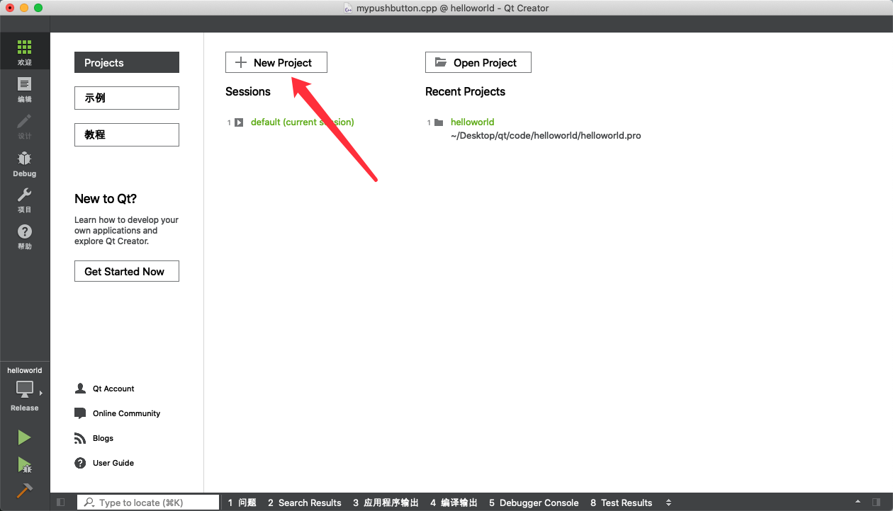
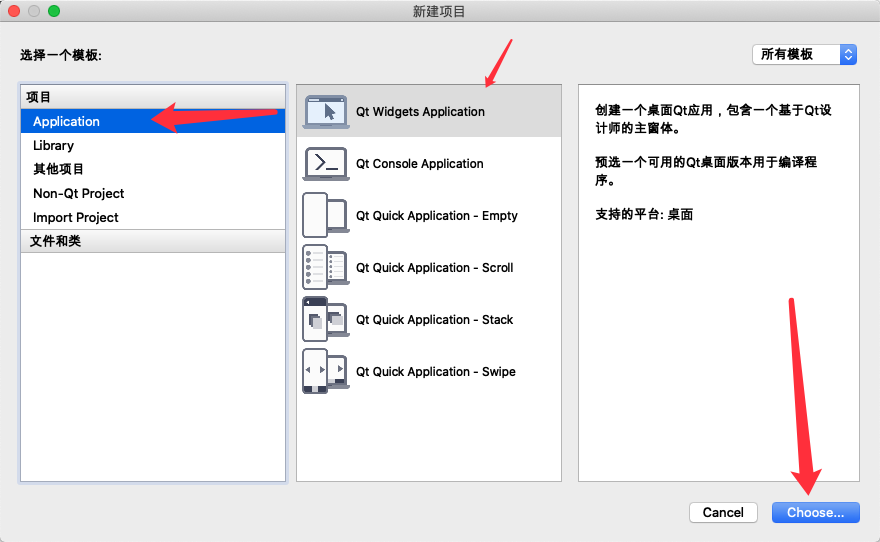
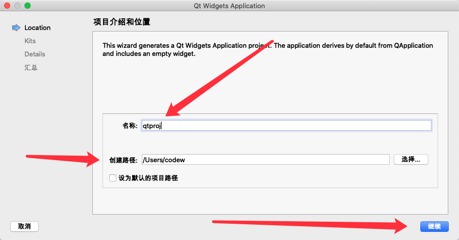
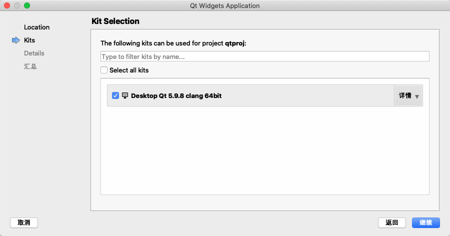
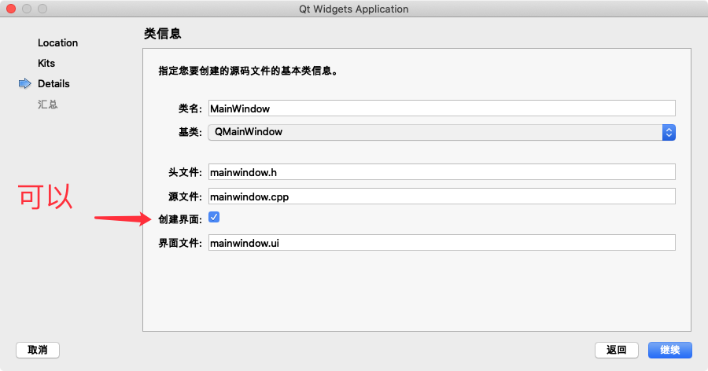
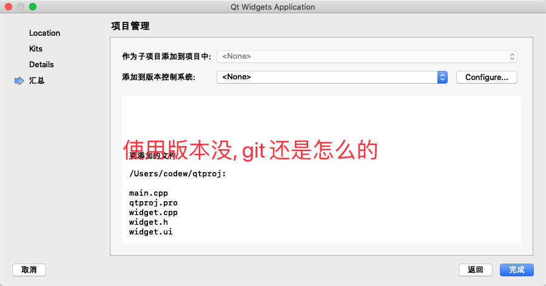
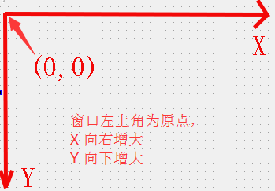
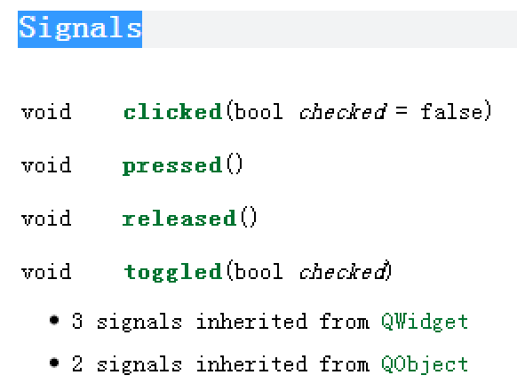

# 目录

1. [1. Qt概述](#qt1)
    1. [1.1 什么是Qt](#qt1a)
    2. [1.2 Qt的发展史](#qt1b)
    3. [1.3 Qt的优势](#qt1c)
    4. [1.4 Qt版本](#qt1d)
    5. [1.5 成功案例](#qt1e)
2. [2. 创建Qt项目](#qt2)
    1. [2.1 使用向导创建](#qt2a)
    2. [2.2 一个最简单的Qt应用程序](#qt2b)
        1. [2.2.1 main函数中](#qt2b1)
        2. [2.2.2 类头文件](#qt2b2)
    3. [2.3 .pro文件](#qt2c)
    4. [2.4 命名规范](#qt2d)
    5. [2.5 QtCreator常用快捷键](#qt2e)
3. [3. Qt按钮小程序](#qt3)
    1. [3.1 按钮的创建和父子关系](#qt3a)
    2. [3.2 Qt窗口坐标体系](#qt3b)
    3. [3.3 对象树模型](#qt3c)
4. [4. 信号和槽机制](#qt4)
    1. [4.1 系统自带的信号和槽](#qt4a)
    2. [4.2 自定义信号和槽](#qt4b)
        1. [4.2.1 自定义信号使用条件](#qt4b1)
        2. [4.2.2 自定义槽函数使用条件](#qt4b2)
        3. [4.2.3 使用自定义信号和槽](#qt4b3)
    3. [4.3 信号和槽的拓展](#qt4c)
    4. [4.4 Qt4版本的信号槽写法](#qt4d)
    5. [4.5 Lambda表达式](#qt4e)
        1. [4.5.1 局部变量引入方式](#qt4e1)
        2. [4.5.2 函数参数](#qt4e2)
        3. [4.5.3 选项Opt](#qt4e3)
        4. [4.5.4 函数返回值 ->retType](#qt4e4)
        5. [4.5.5 是函数主体{}](#qt4e5)
        6. [4.5.6 槽函数使用Lambda表达式](#qt4e6)


### qt1
# 1. Qt概述

### qt1a
## 1.1 什么是Qt

Qt是一个**跨平台**的C++**图形用户界面应用程序框架**。它为应用程序开发者提供建立图形界面所需的所有功能。它是完全面向对象的，很容易扩展，并且允许真正的组件编程。

### qt1b
## 1.2 Qt的发展史

- 1991年 Qt最早由芬兰奇趣科技开发

- 1996年 进入商业领域，它也是目前流行的Linux桌面环境KDE的基础

- 2008年 奇趣科技被诺基亚公司收购，Qt称为诺基亚旗下的编程基础

- 2012年 Qt又被Digia公司（芬兰一家软件公司）收购

- 2014年4月 跨平台的集成开发环境Qt Creator3.1.0发布，同年5月20日配发了Qt5.3正式版，至此Qt实现了对iOS、Android、WP等各平台的全面支持。

### qt1c
## 1.3 Qt的优势

1. 跨平台，几乎支持所有的平台
    - Windows – XP、Vista、Win7、Win8、Win2008、Win10
    - Uinux/X11 – Linux、Sun Solaris、HP-UX、Compaq Tru64 UNIX、IBM AIX、SGI IRIX、FreeBSD、BSD/OS、和其他很多X11平台
    - Macintosh – Mac OS X
    - Embedded– 有帧缓冲支持的嵌入式Linux平台，Windows CE

2. 接口简单，容易上手，学习QT框架对学习其他框架有参考意义。
3. 一定程度上简化了内存回收机制
4. 开发效率高，能够快速的构建应用程序。
5. 有很好的社区氛围，市场份额在缓慢上升。
6. 可以进行嵌入式开发。

### qt1d
## 1.4 Qt版本

Qt按照不同的版本发行，分为商业版和开源版

- 商业版

为商业软件提供开发，他们提供传统商业软件发行版，并且提供在商业有效期内的免费升级和技术支持服务。

- 开源的LGPL协议版本：

为了开发自有而设计的开放源码软件，它提供了和商业版本同样的功能，在GNU通用公共许可下，它是免费的。

目前我们学习上使用的就是这个版本。可以到官网下载最新版本：

[http://download.qt.io/archive/qt/](http://download.qt.io/archive/qt/)

### qt1e
## 1.5 成功案例

- Linux桌面环境KDE（K Desktop Environment）

- WPS Office 办公软件

- Skype 网络电话

- Google Earth 谷歌地球

- VLC多媒体播放器

- VirtualBox虚拟机软件

- 等等

### qt2
# 2. 创建Qt项目

### qt2a
## 2.1 使用向导创建

打开`Qt Creator` 界面选择 `New Project`或者选择菜单栏 【文件】-【新建文件或项目】菜单项








### qt2b
## 2.2 一个最简单的Qt应用程序

### qt2b1
### 2.2.1 main函数中

```cpp

#include "widget.h"
#include <QApplication>

int main(int argc, char *argv[])
{
    QApplication a(argc, argv);
    Widget w;
    w.show();

    return a.exec();
}

```


- Qt系统提供的类头文件没有.h后缀

- Qt一个类对应一个头文件，类名和头文件名一致

- QApplication应用程序类
    - 管理图形用户界面应用程序的控制流和主要设置。

    - 是Qt生命，一个程序要确保一直运行，就肯定至少得有一个循环，**这就是Qt主消息循环**，在其中完成来自窗口系统和其它资源的**所有事件消息处理和调度**。它也处理**应用程序的初始化和结束**，并且**提供对话管理**。

    - 对于任何一个使用Qt的图形用户界面应用程序，都正好存在一个QApplication 对象，不论这个应用程序在同一时刻有多少个窗口。

- a.exec()

  - **程序进入消息循环**，等待对用户输入进行响应。这里main()把控制权转交给Qt，Qt完成事件处理工作，当应用程序退出的时候exec()的值就会返回。**在exec()中，Qt接受并处理用户和系统的事件并且把它们传递给适当的窗口部件。**

### qt2b2
### 2.2.2 类头文件

```cpp

#include <QWidget>

class MyWidget : public QWidget
{
    //引入Qt信号和槽机制的一个宏
    Q_OBJECT

public:
//构造函数中parent是指父窗口
//如果parent是0，那么窗口就是一个顶层的窗口
    MyWidget (QWidget *parent = 0);
    ~ MyWidget ();
};

```


### qt2c
## 2.3 .pro文件


`.pro`就是工程文件(`project`)，它是`qmake`自动生成的用于生产`makefile`的配置文件。类似于`VS`中的`.sln` 和`vsproj`文件

以下是`.pro`文件的一个案例：

```cpp

#引入Qt的模块，core gui
QT       += core gui
#如果qt版本大于4，那么引入widgets模块
greaterThan(QT_MAJOR_VERSION, 4): QT += widgets
#生成最终文件的文件名，可执行文件exe
TARGET = 01_MyWidget
#项目类型，生成什么类型的文件，可执行程序还是库文件
TEMPLATE = app
#要编译的源文件列表
SOURCES += \
        main.cpp \
        mywidget.cpp
#要编译的头文件列表
HEADERS += \
        mywidget.h

```


.pro文件的规则：

- 注释

  - 从“#”开始，到这一行结束。

- 模块引入

  - QT += 模块名，表示当前项目引入Qt哪些模块。

  - 引入模块的意思就简单理解为引入C/C++头文件搜索路径，如果没引入对应模块就使用该头文件的话会报错说找不到该头文件。当然不必要的模块还是别引入，因为引入模块不仅仅是引入头文件搜索路径那么简单，还包括引入连接的库等一系列操作，会让程序变臃肿。

  - Qt详细模块有哪些可以参照附录。

- 模板变量告诉qmake为这个应用程序生成哪种makefile。下面是可供使用的选择：**TEMPLATE** = app

    - app -建立一个应用程序的makefile。这是默认值，所以如果模板没有被指定，这个将被使用。

    - lib - 建立一个库的makefile。

    - vcapp - 建立一个应用程序的VisualStudio项目文件。

    - vclib - 建立一个库的VisualStudio项目文件。

    - subdirs -这是一个特殊的模板，它可以创建一个能够进入特定目录并且为一个项目文件生成makefile并且为它调用make的makefile。

- 指定生成的应用程序名：

  - **TARGET** = QtDemo

- 工程中包含的头文件

  - **HEADERS** += include/painter.h

- 工程中包含的.ui设计文件

  - **FORMS** += forms/painter.ui

- 工程中包含的源文件

  - **SOURCES** += sources/main.cpp sources

- 工程中包含的资源文件

  - **RESOURCES** += qrc/painter.qrc

  - **greaterThan(QT_MAJOR_VERSION, 4): QT += widgets**

  - **这条****语句的含义是，如果QT_MAJOR_VERSION****大于4（也就是****当前使用的Qt5****及****更高版本）****需要****增加widgets模块。如果****项目****仅需****支持****Qt5****，****也可以直接添加“QT += widgets”一句。不过为了保持代码****兼容****，最好还是按照QtCreator生成的语句编写。**

- 配置信息

  - CONFIG用来告诉qmake关于应用程序的配置信息。

  - CONFIG += `c++11`  //使用`c++11`的特性（`qt5.6`以上版本默认使用`C++11`）

  - 在这里使用“+=”，是因为我们添加我们的配置选项到任何一个已经存在中。这样做比使用“=”那样替换已经指定的所有选项更安全。


### qt2d
## 2.4 命名规范

类名：单词首字母大写，单词和单词之间直接连接，无需连接字符 。

```cpp

MyClass，QPushButton

class MainWindow

```


Qt中内置的类型，头文件和类命名同名

```cpp

#include <QString>

QSring str;

#include <QWidget>

QWidget w;

```

函数名字，变量名：首字母小写，之后每个单词首字母大写，单词和单词之间直接连接，无需连接字符

```cpp

void connectTheSignal();

```

类的成员变量设置函数用使用 set+成员变量名，获取成员变量的函数直接用成员变量名（如果是bool类型，有可能会用一些表示状态的术语，如isVisilble，hasFocus）：

```cpp

//普通成员变量设置和获取

void setText(QString text);

QString text()const;

//bool的成员变量设置和获取

void setEnabled(bool enabled);

bool isEnabled()const;

```


### qt2e
## 2.5 QtCreator常用快捷键

- 运行  ctrl +R

- 编译  ctrl +B

- 帮助文档  F1 ，点击F1两次跳到帮助界面

- 跳到符号定义 F2 或者ctrl + 鼠标点击

- 注释 ctrl+/

- 字体缩放  ctrl + 鼠标滚轮

- 整行移动代码 ctrl + shift + ↑或↓

- 自动对齐   ctrl + i

- 同名之间的.h和.cpp文件跳转 F4


### qt3
# 3. Qt按钮小程序

### qt3a
## 3.1 按钮的创建和父子关系

在Qt程序中，最常用的控件之一就是按钮了，首先我们来看下如何创建一个按钮

```cpp

#include <QPushButton>

QPushButton * btn = new QPushButton; 

    //设置父亲
    btn->setParent(this);
    //设置文字
    btn->setText("德玛西亚");
    //移动位置
    btn->move(100,100);

    //第二种创建
    QPushButton * btn2 = new QPushButton("孙悟空",this);
    //重新指定窗口大小
    this->resize(600,400);

    //设置窗口标题
    this->setWindowTitle("第一个项目");

    //限制窗口大小
    this->setFixedSize(600,400);

```


上面代码中，一个按钮其实就是一个`QPushButton`类的对象，如果只是创建出对象，是无法显示到窗口中的，所以我们需要依赖一个父窗口，也就是指定一个父亲，利用`setParent`函数或者按钮创建的时候通过构造函数传参，此时我们称两个窗口建立了**父子关系**。在有父窗口的情况下，窗口调用`show`会显示在父窗口中，如果没有父窗口，那么窗口调用`show`显示的会是一个顶层的窗口（顶层窗口是能够在任务栏中找到的，不依赖于任何一个窗口而独立存在）（按钮也是继承于`QWidget`，也属于窗口）。

如果想设置按钮上显示的文字可以用`setText`，移动按钮位置用`move`。

对于窗口而言，我们可以修改左上角窗口的标题`setWindowTitle`，重新指定窗口大小：`resize`，或者设置固定的窗口大小`setFixedSize`。

### qt3b
## 3.2 Qt窗口坐标体系

通过以上代码可以看出Qt的坐标体系。

以左上角为原点（0,0），以向右的方向为x轴的正方向，以向下方向为y轴的正方向。



对于嵌套窗口，其坐标是**相对于父窗口**来说的。顶层窗口的父窗口就是屏幕。

### qt3c
## 3.3 对象树模型

`QObject`是Qt里边绝大部分类的根类

 - `QObject`对象之间是以对象树的形式组织起来的。

    - 当两个`QObject`（或子类）的对象建立了**父子关系**的时候。子对象就会加入到父对象的一个成员变量叫`children`（孩子）的`list`（列表）中。

    - 当**父对象析构的时候**，这个列表中的**所有对象也会被析构**。（注意，这里是说父对象和子对象，不要理解成父类和子类）

- `QWidget`是能够在屏幕上显示的一切组件的父类

  - **QWidget继承自QObject，因此也继承了这种对象树关系。一个孩子自动地成为父组件的一个子组件**。我们向某个窗口中添加了一个按钮或者其他控件（建立父子关系），当用户关闭这个窗口的时候，该窗口就会被析构，之前添加到他上边的按钮和其他控件也会被一同析构。这个结果也是我们开发人员所期望的。

  - 当然，**我们也可以手动删除子对象。当子对象析构的时候会发出一个信号destroyed，父对象收到这个信号之后就会从children列表中将它剔除。**比如，当我们删除了一个按钮时，其所在的主窗口会自动将该按钮从其子对象列表（`children`）中删除，并且自动调整屏幕显示，按钮在屏幕上消失。当这个窗口析构的时候，`children`列表里边已经没有这个按钮子对象，所以我们手动删除也不会引起程序错误。

Qt 引入对象树的概念，在一定程度上解决了内存问题。

- 对象树中对象的顺序是没有定义的。这意味着，销毁这些对象的顺序也是未定义的。

- 任何对象树中的 `QObject`对象 `delete` 的时候，如果这个对象有 `parent`，则自动将其从 `parent` 的`children()`列表中删除；如果有孩子，则自动 `delete` 每一个孩子。`Qt` 保证没有`QObject`会被 `delete` 两次，这是由析构顺序决定的。

如果`QObject`在栈上创建，`Qt` 保持同样的行为。正常情况下，这也不会发生什么问题。来看下下面的代码片段：

```cpp

{

    QWidget window;

    QPushButton quit("Quit", &window);

}

```


作为父组件的 `window` 和作为子组件的 `quit` 都是`QObject`的子类（事实上，它们都是`QWidget`的子类，而`QWidget`是`QObject`的子类）。这段代码是正确的，`quit` 的析构函数不会被调用两次，因为标准 `C++`要求，**局部对象的析构顺序应该按照其创建顺序的相反过程**。因此，这段代码在超出作用域时，会先调用 `quit` 的析构函数，将其从父对象 `window` 的子对象列表中删除，然后才会再调用 `window` 的析构函数。

但是，如果我们使用下面的代码：

```cpp


{
    QPushButton quit("Quit");
    QWidget window;
    quit.setParent(&window);
}

```

情况又有所不同，析构顺序就有了问题。我们看到，在上面的代码中，作为父对象的 `window` 会首先被析构，因为它是最后一个创建的对象。在析构过程中，它会调用子对象列表中每一个对象的析构函数，也就是说， `quit` 此时就被析构了。然后，代码继续执行，在 `window` 析构之后，`quit` 也会被析构，因为 `quit` 也是一个局部变量，在超出作用域的时候当然也需要析构。但是，这时候已经是第二次调用 `quit` 的析构函数了，`C++` 不允许调用两次析构函数，因此，程序崩溃了。

由此我们看到，`Qt` 的对象树机制虽然帮助我们在一定程度上解决了内存问题，但是也引入了一些值得注意的事情。这些细节在今后的开发过程中很可能时不时跳出来烦扰一下，所以，我们最好从开始就养成良好习惯，在 `Qt` 中，尽量在构造的时候就指定 `parent` 对象，并且大胆在堆上创建。


### qt4
# 4. 信号和槽机制

**信号：各种事件**

**槽： 响应信号的动作**

当某个事件发生后，如某个按钮被点击了一下，它就会发出一个被点击的信号（`signal`）。

某个对象接收到这个信号之后，就会做一些相关的处理动作（称为槽`slot`）。

但是`Qt`对象不会无故收到某个信号，要想让一个对象收到另一个对象发出的信号，这时候需要建立连接（`connect`）

### qt4a
## 4.1 系统自带的信号和槽

下面我们完成一个小功能，上面我们已经学习了按钮的创建，但是还没有体现出按钮的功能，按钮最大的功能也就是点击后触发一些事情，比如我们点击按钮，就把当前的窗口给关闭掉，那么在Qt中，这样的功能如何实现呢？

其实两行代码就可以搞定了，我们看下面的代码

```cpp

QPushButton * quitBtn = new QPushButton("关闭窗口",this);

  connect(quitBtn,&QPushButton::clicked,this,&MyWidget::close);

```


第一行是创建一个关闭按钮，这个之前已经学过，第二行就是核心了，也就是信号槽的使用方式

**connect函数是建立信号发送者、信号、信号接收者、槽四者关系的函数**：

`connect(sender, signal, receiver, slot);`

参数解释：

- sender：信号发送者

- signal：信号

- receiver：信号接收者

- slot：接收对象在接收到信号之后所需要调用的函数（槽函数）

这里要注意的是connect的四个参数都是指针，**信号和槽是函数指针**。

系统自带的信号和槽如何查找呢，这个就需要利用帮助文档了，在帮助文档中比如我们上面的按钮的点击信号，在帮助文档中输入QPushButton，首先我们可以在Contents中寻找关键字 signals，信号的意思，但是我们发现并没有找到，这时候我们应该想到也许这个信号的被父类继承下来的，因此我们去他的父类QAbstractButton中就可以找到该关键字，点击signals索引到系统自带的信号有如下几个




这里的`clicked`就是我们要找到，槽函数的寻找方式和信号一样，只不过他的关键字是`slot`。

### qt4b
## 4.2 自定义信号和槽

Qt框架默认提供的**标准信号和槽不足以完成我们日常应用开发的需求**，比如说点击某个按钮让另一个按钮的文字改变，这时候标准信号和槽就没有提供这样的函数。但是**Qt信号和槽机制提供了允许我们自己设计自己的信号和槽**。

### qt4b1
### 4.2.1 自定义信号使用条件

1. 声明在类的signals域下

2. 没有返回值，void类型的函数

3. 只有函数声明，没有定义

4. 可以有参数，可以重载

5. 通过emit关键字来触发信号，形式：emit object->sig(参数);

### qt4b2
### 4.2.2 自定义槽函数使用条件

1. qt4 必须声明在 private/public/protected slots域下面，qt5之后可以声明public下，同时还可以是静态的成员函数，全局函数，lambda表达式

2. 没有返回值，void类型的函数

3. 不仅有声明，还得要有实现

4. 可以有参数，可以重载

### qt4b3
### 4.2.3 使用自定义信号和槽

定义场景：下课了，老师跟同学说肚子饿了（信号），学生请老师吃饭（槽）

首先定义一个学生类和老师类：

老师类中声明信号 饿了 `hungry`

```cpp

signals:

void hungry();

```

学生类中声明槽 请客`treat`

```cpp

public slots:

void treat();

```

在窗口中声明一个公共方法下课，这个方法的调用会触发老师饿了这个信号，而响应槽函数学生请客

```cpp

void MyWidget::ClassIsOver()

{

    //发送信号

    emit teacher->hungry();

}

```

学生响应了槽函数，并且打印信息

//自定义槽函数 实现


```cpp

void Student::treat()

{

       qDebug() << "Student treat teacher";

}

```

在窗口中连接信号槽

```cpp

teacher = new Teacher(this);

    student = new Student(this);

    connect(teacher,&Teacher::hungury,student,&Student::treat);

```

并且调用下课函数，测试打印出相应log

自定义的信号 hungry带参数，需要提供重载的自定义信号和 自定义槽


```cpp

void hungry(QString name);  自定义信号

void treat(QString name );    自定义槽

但是由于有两个重名的自定义信号和自定义的槽，直接连接会报错，所以需要利用函数指针来指向函数地址， 然后在做连接

void (Teacher:: * teacherSingal)(QString) = &Teacher:: hangry;

void (Student:: * studentSlot)(QString) = &Student::treat;

connect(teacher,teacherSingal,student,studentSlot);

也可以使用static_cast静态转换挑选我们要的函数

connect(

teacher,

static_cast<void(Teacher:: *)(QString)>(&Teacher:: hangry),

student,

static_cast<void(Student:: *)(QString)>(& Student::treat));


```


### qt4c
## 4.3 信号和槽的拓展

- **一个信号可以和多个槽相连**

  - 如果是这种情况，这些槽会一个接一个的被调用，但是**槽函数调用顺序是不确定的**。像上面的例子，可以将一个按钮点击信号连接到关闭窗口的槽函数，同时也连接到学生请吃饭的槽函数，点击按钮的时候可以看到关闭窗口的同时也学生请吃饭的log也打印出来。

- **多个信号可以连接到一个槽**

  - 只要任意一个信号发出，这个槽就会被调用。如：一个窗口多个按钮都可以关闭这个窗口。

- **一个信号可以连接到另外的一个信号**

  - 当第一个信号发出时，第二个信号被发出。除此之外，这种信号-信号的形式和信号-槽的形式没有什么区别。**注意这里还是使用connect函数，只是信号的接收者和槽函数换成另一个信号的发送者和信号函数**。如上面老师饿了的例子，可以新建一个按钮btn。

```cpp

connect(btn,&QPushButton::clicked,teacher,&Teacher::hungry);

```


- **信号和槽可以断开连接**

  - 可以**使用disconnect函数**，当初建立连接时connect参数怎么填的，disconnect里边4个参数也就怎么填。这种情况并不经常出现，因为**当一个对象delete之后，Qt自动取消所有连接到这个对象上面的槽**。

- **信号和槽函数参数类型和个数必须同时满足两个条件**

  - 1) **信号函数的参数个数必须大于等于槽函数的参数个数**

  - 2) **信号函数的参数类型和槽函数的参数类型必须一一对应**


### qt4d
## 4.4 Qt4版本的信号槽写法


```cpp

connect(
teacher,
SIGNAL(hungry(QString)),
student,
SLOT(treat(QString))
);

```

这里使用了**SIGNAL和SLOT这两个宏，宏的参数是信号函数和槽函数的函数原型。**

因为直接填入了函数原型，所有这里边编译不会出现因为重载导致的函数指针二义性的问题。但问题是如果函数原型填错了，或者不符合信号槽传参个数类型约定，编译期间也不会报错，只有运行期间才会看到错误log输出。

原因就是**这两个宏将后边参数（函数原型）转化成了字符串**。目前编译器还没有那么智能去判断字符串里边的内容符不符合运行条件。


### qt4e
## 4.5 Lambda表达式

C++11中的Lambda表达式**用于定义匿名的函数对象**，以简化编程工作。首先看一下Lambda表达式的基本构成：

分为四个部分：[局部变量捕获列表]、（函数参数）、函数额外属性设置opt、函数返回值->retype、{函数主体}

```cpp

[capture](parameters) opt ->retType
{
……;
}

```


### qt4e1
### 4.5.1 局部变量引入方式

[ ]，标识一个**Lambda的开始**。由于lambda表达式可以定义在某一个函数体A里边，所以lambda表达式有可能会去访问A函数中的局部变量。中括号里边内容是描述了在lambda表达式里边可以使用的外部局部变量的列表：

- `[]`: 表示`lambda`表达式不能访问外部函数体的任何局部变量

- `[a]`:  在函数体内部使用值传递的方式访问a变量

- `[&b]`: 在函数体内部使用引用传递的方式访问b变量

- `[=]`: 函数外的所有局部变量都通过值传递的方式使用, 函数体内使用的是副本

- `[&]`: 引用的方式使用lambda表达式外部的所有变量

- `[=, &foo]`: foo使用引用方式, 其余是值传递的方式

- `[&,foo]`: foo使用值传递方式, 其余是引用传递的方式

- `[this]`: 在函数内部可以使用类的成员函数和成员变量，=和&形式也都会默认引入

由于引用方式捕获对象会有局部变量释放了而`lambda`函数还没有被调用的情况。如果执行`lambda`函数那么引用传递方式捕获进来的局部变量的值不可预知。

所以在无特殊情况下**建议使用[=](){}的形式**

### qt4e2
### 4.5.2 函数参数

(`params`)表示`lambda`函数对象接收的参数，类似于函数定义中的小括号表示函数接收的参数类型和个数。参数可以通过按值（如：`(int a,int b)`）和按引用（如：`(int &a,int &b)`）两种方式进行传递。函数参数部分可以省略，省略后相当于无参的函数。

### qt4e3
### 4.5.3 选项Opt

`Opt` 部分是可选项，最常用的是`mutable`声明，这部分可以省略。外部函数**局部变量**通过**值传递**引进来时，其默认是`const`，所以不能修改这个局部变量的拷贝，加上`mutable`就可以

```cpp

int a = 10 ;
    [=]()
    {
        a=20;//编译报错，a引进来是const
    }
    [=]()mutable
    {
        a=20;//编译成功
    };

```


### qt4e4
### 4.5.4 函数返回值 ->retType

`->retType`，标识`lambda`函数返回值的类型。这部分可以省略，但是省略了并不代表函数没有返回值，编译器会自动根据函数体内的`return`语句判断返回值类型，但是如果有多条`return`语句，而且返回的类型都不一样，编译会报错，如：

```cpp

[=]()mutable
    {
        int b = 20;
        float c = 30.0;
        if(a>0)
            return b;
        else
            return c;//编译报错，两条return语句返回类型不一致
    };

```


### qt4e5
### 4.5.5 是函数主体{}

```cpp

{}，标识函数的实现，这部分不能省略，但函数体可以为空。

```


### qt4e6
### 4.5.6 槽函数使用Lambda表达式


以`QPushButton`点击事件为例：

```cpp

connect(btn,&QPushButton::clicked,[=](){

        qDebug()<<"Clicked";

});

```


这里可以看出使用`Lambda`表达式作为槽的时候不需要填入信号的接收者。当点击按钮的时候，`clicked`信号被触发，`lambda`表达式也会直接运行。当然`lambda`表达式还可以指定函数参数，这样也就能够接收到信号函数传递过来的参数了。

由于`lambda`表达式比我们自己自定义槽函数要方便而且灵活得多，所以在实现槽函数的时候优先考虑使用`Lambda`表达式。一般我们的使用习惯也是`lambda`表达式外部函数的局部变量全部通过值传递捕获进来，也就是:

`[=](){  }`的形式

