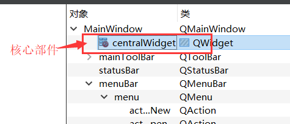
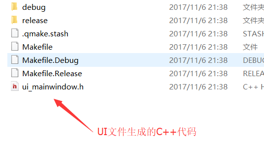

# 目录

1. [5. QMainWindow](#qt5)
    1. [菜单栏](#qt5a)
    2. [工具栏](#qt5b)
    3. [状态栏](#qt5c)
    4. [停靠部件（也称为铆接部件、浮动窗口）](#qt5d)
    5. [核心部件（中心部件）](#qt5e)
    6. [使用UI文件创建窗口](#qt5f)
        1. [UI设计窗口介绍](#qt5f1)
        2. [菜单栏](#qt5f2)
            1. [添加/删除菜单栏](#qt5f2a) 
            2. [添加菜单](#qt5f2b) 
            3. [添加菜单项](#qt5f2c) 
            4. [添加多级菜单](#qt5f2d) 
        3. [工具栏](#qt5f3)
            1. [添加/删除工具栏](#qt5f3a)
            2. [工具栏添加动作](#qt5f3b)
        4. [状态栏](#qt5f4)
        5. [停靠部件](#qt5f5)
        6. [核心部件](#qt5f6)
    7. [UI文件原理](#qt5g)
    8. [UI文件下使用信号和槽](#qt5h)
        1. [转到槽](#qt5h1)
        2. [信号槽编辑器](#qt5h2)
    9. [资源文件](#qt5i)

2. [6.QDialog对话框](#qt6)
    1. [基本概念](#qt6a)
        1. [模态对话框](#qt6a1)
        2. [非模态对话框](#qt6a2)
    2. [标准对话框](#qt6b)
    3. [消息对话框](#qt6c)
    4. [标准文件对话框](#qt6d)
3. [7.布局](#qt7)
    1. [系统提供的布局控件](#qt7a)
    2. [利用widget做布局](#qt7b)
4. [8.常用控件](#qt8)
    1. [QLabel控件使用](#qt8a)
        1. [显示文字 （普通文本、html）](#qt8a1)
        2. [显示图片](#qt8a2)
        3. [显示动画](#qt8a3)
    2. [QLineEdit](#qt8b)
        1. [设置/获取内容](#qt8b1)
        2. [设置显示模式](#qt8b2)
    3. [其他控件](#qt8c)
    4. [自定义控件](#qt8d)


### qt5
# 5. QMainWindow

### qt5a
## 5.1 菜单栏

一个主窗口最多只有一个菜单栏。位于主窗口顶部、主窗口标题栏下面。

- 通过`QMainWindow`类的`menubar（）`函数获取主窗口菜单栏指针，如果当前窗口没有菜单栏，该函数会自动创建一个。

```cpp

QMenuBar *	menuBar() const;

```

- 创建菜单，调用`QMenu`的成员函数`addMenu`来添加菜单

```cpp

    QAction* addMenu(QMenu * menu);
    QMenu* addMenu(const QString & title);
    QMenu* addMenu(const QIcon & icon, const QString & title);

```

- 创建菜单项，调用`QMenu`的成员函数`addAction`来添加菜单项

```cpp

    QAction* activeAction() const;
    QAction* addAction(const QString & text);
    QAction* addAction(const QIcon & icon, const QString & text);
    QAction* addAction(const QString & text, const QObject * receiver,
     const char * member, const QKeySequence & shortcut = 0);
    QAction* addAction(const QIcon & icon, const QString & text, 
    const QObject * receiver, const char * member, 
    const QKeySequence & shortcut = 0);

```

`Qt` 并没有专门的菜单项类，只是使用一个`QAction`类，抽象出公共的动作。当我们把`QAction`对象添加到菜单，就显示成一个菜单项，添加到工具栏，就显示成一个工具按钮。用户可以通过点击菜单项、点击工具栏按钮、点击快捷键来激活这个动作。


### qt5b
## 5.2 工具栏

主窗口的工具栏上可以有多个工具条，通常采用一个菜单对应一个工具条的的方式，也可根据需要进行工具条的划分。

- 调用`QMainWindowd`对象的成员函数`addToolBar（）,`该函数每次调用都会创建一个新的工具栏，并且返回该工具栏的指针。

- 插入属于工具条的项，这时工具条上添加项也是用`QAction`。

  - 通过`QToolBar`类的`addAction`函数添加。

- 工具条是一个可移动的窗口，它的停靠区域由`QToolBar`的`allowAreas`决定，包括（以下值可以通过查帮助文档`allowAreas`来索引到）：

    - Qt::LeftToolBarArea  停靠在左侧

    - Qt::RightToolBarArea  停靠在右侧

    - Qt::TopToolBarArea  停靠在顶部

    - Qt::BottomToolBarArea     停靠在底部

    - Qt::AllToolBarAreas  以上四个位置都可停靠

使用`setAllowedAreas（）`函数指定停靠区域：


- `setAllowedAreas（Qt::LeftToolBarArea | Qt::RightToolBarArea）`

- 使用`setFloatable（trueOrFalse）`函数来设定工具栏可否浮动

- 使用`setMoveable（trueOrFalse）`函数设定工具栏的可移动性：

- `setMoveable（false）`//工具条不可移动, 只能停靠在初始化的位置上

### qt5c
## 5.3 状态栏

一个`QMainWindow`的程序最多只有一个状态栏。`QMainWindow`中可以有多个的部件都使用`add…`名字的函数，而只有一个的部件，就直接使用获取部件的函数，如`menuBar`。同理状态栏也提供了一个获取状态栏的函数`statusBar()`，没有就自动创建一个并返回状态栏的指针。

```cpp

QMenuBar *	menuBar() const;

```

- 添加小部件（从状态栏左侧添加）

```cpp

    void addWidget(QWidget * widget, int stretch = 0);
    //插入小部件
    int	insertWidget(int index, QWidget * widget, int stretch = 0);
    //删除小部件
    void removeWidget(QWidget * widget);

```

- 添加小部件（从状态栏右侧添加）

```cpp

void addPermenentWidget (QWidget *widget, int stretch = 0);

```


### qt5d
## 5.4 停靠部件（也称为铆接部件、浮动窗口）

停靠部件 `QDockWidget`，也称浮动窗口，可以有多个

```cpp

    QDockWidget * dock = new QDockWidget("标题",this);
    //添加停靠部件到mainWindow中，并且设定默认停靠在左边
    addDockWidget(Qt::LeftDockWidgetArea,dock);
    //设定停靠部件允许停靠的范围
    dock->setAllowedAreas(Qt::LeftDockWidgetArea |
     Qt::RightDockWidgetArea | Qt::TopDockWidgetArea); 

```


### qt5e
## 5.5 核心部件（中心部件）

除了以上几个部件，中心显示的部件都可以作为核心部件，例如一个记事本程序中，就是一个`QTextEdit`（编辑框控件）做核心部件

```cpp

QTextEdit * edit = new QTextEdit(this);
//设置mainWindow的核心部件
setCentralWidget(edit);

```


### qt5f
## 5.6 使用UI文件创建窗口

创建工程的时候把`UI`文件留着

### qt5f1
### 5.6.1 UI设计窗口介绍


### qt5f2
### 5.6.2 菜单栏

### qt5f2a
#### 5.6.2.1 添加/删除菜单栏

默认情况下`QMainWindow`项目一创建就自带了菜单栏，可以在对象树窗口中，右键菜单栏对象，移除菜单栏：


删除后也可以创建菜单栏，此时在对象树中右键`MainWindow`对象，菜单里边会多了创建菜单栏的功能


### qt5f2b
#### 5.6.2.2 添加菜单


点击菜单栏的“在这里输入”可以输入一个菜单名字创建一个菜单。


### qt5f2c
#### 5.6.2.3 添加菜单项


在UI界面中添加菜单项只能用英文，因为此时会创建一个`QAction`对象，会用输入的值作为对象名，所以不能用中文，得添加后再属性窗口改中文。


### qt5f2e
#### 5.6.2.4 添加多级菜单


### qt5f3
### 5.6.3 工具栏

### qt5f3a
### 5.6.3.1 添加/删除工具栏

删除工具栏方法和删除菜单栏方法一样，不过工具栏可以有多个，所以每次右键`MainWindow`对象，都可以看到添加工具栏的选项。


### qt5f3b
### 5.6.3.2 工具栏添加动作

新添加的`QAction`对象会在动作编辑器里找到（`Action Editor`），可以直接拖拽上来添加到工具栏里。


可以对工具栏设定停靠区域、能否浮动、能否移动等


### qt5f4
### 5.6.4 状态栏

添加和删除状态栏的方法和添加删除菜单栏方法一样。

状态栏添加左侧控件、右侧控件只能通过代码来添加。

### qt5f5
### 5.6.5 停靠部件

从工具箱中拖出一个停靠部件就行。也可以像设定工具栏停靠范围一样，在停靠部件的属性窗口中设定他可以停靠的范围。


### qt5f6
### 5.6.6 核心部件

`UI`窗口中默认核心部件就是一个`widget`



### qt5g
## 5.7 UI文件原理

使用UI文件创建界面很轻松很便捷，他的原理就是每次我们保存`UI`文件的时候，`QtCreator`就自动帮我们将UI文件翻译成`C++`的图形界面创建代码。可以通过以下步骤查看代码

到工程编译目录，一般就是工程同级目录下会生成另一个编译目录，会找到一个带`ui_`前缀跟`ui`文件同名的`.h`文件，这就是代码




代码内容：


在项目`MainWindow`的构造函数中会调用这个函数来初始化窗口，其实这里边就是初始化我们的各个控件。

```cpp

MainWindow::MainWindow(QWidget *parent) :
    QMainWindow(parent),
    ui(new Ui::MainWindow)
{
    ui->setupUi(this);
    //如果想要使用ui里边的控件对象
    //代码必须写在setupUi之下
    //否则ui各个控件没有初始化时使用会出问题
    ui->pushButton->setText("Hello");
}

```


### qt5h
## 5.8 UI文件下使用信号和槽

### qt5h1
### 5.8.1 转到槽

在UI编辑界面中使用信号和槽很方便，比如，拖出一个`Button`到窗口上，右键这个`button`，选择转到槽：


此时会出现这个控件（`QPushButton`）可以连接的各个信号，我们可以根据具体需求选中信号来创建一个连接这个信号的槽函数：


以`click(bool)`信号为例，创建了一个槽函数


这个槽函数是`QtCreator`自动帮我们创建的，而且也使用生成`C++`代码的方式帮我们做好了连接，我们可以直接在这个函数体内实现功能就行。很方便，比使用`Lambda`表达式还方便。


### qt5h2
### 5.8.2 信号槽编辑器

可以使用动作编辑器旁边的信号槽编辑器，里边也可以添加信号和槽的连接，比如添加`actionQuit`的`triggered`信号和窗口`close`槽的连接：


### qt5i
## 5.9 资源文件

Qt 资源系统是一个跨平台的资源机制，用于将程序运行时所需要的资源以二进制的形式存储于可执行文件内部。如果你的程序需要加载特定的资源（图标、文本翻译等），那么，将其放置在资源文件中，就再也不需要担心这些文件的丢失。也就是说，如果你将资源以资源文件形式存储，它是会编译到可执行文件内部。

使用 Qt Creator 可以很方便地创建资源文件。我们可以在工程上点右键，选择“添加新文件…”，可以在 Qt 分类下找到“Qt 资源文件”：


点击“选择…”按钮，打开“新建 Qt 资源文件”对话框。在这里我们输入资源文件的名字和路径：


点击下一步，选择所需要的版本控制系统，然后直接选择完成。我们可以在 Qt Creator 的左侧文件列表中看到“资源文件”一项，也就是我们新创建的资源文件：


右侧的编辑区有个“添加”，我们首先需要添加前缀，比如我们将前缀取名为 `images`。然后选中这个前缀，继续点击添加文件，可以找到我们所需添加的文件。这里，我们选择 document-open.png 文件。当我们完成操作之后，`Qt Creator `应该是这样子的：


接下来，我们还可以添加另外的前缀或者另外的文件。这取决于你的需要。当我们添加完成之后，我们可以像前面一章讲解的那样，通过使用 : 开头的路径来找到这个文件。比如，我们的前缀是 /images，文件是 document-open.png，那么就可以使用:/images/document-open.png找到这个文件。

这么做带来的一个问题是，如果以后我们要更改文件名，比如将 docuemnt-open.png 改成 docopen.png，那么，所有使用了这个名字的路径都需要修改。所以，更好的办法是，我们给这个文件去一个“别名”，以后就以这个别名来引用这个文件。具体做法是，选中这个文件，添加别名信息：


这样，我们可以直接使用:/images/doc-open引用到这个资源，无需关心图片的真实文件名。

Qrc文件只是记录了我们要用到的资源文件在项目路径哪个位置的一个信息，如果我们使用文本编辑器打开 res.qrc 文件，就会看到以下内容：

```cpp

<RCC>
    	<qresource prefix="/images">
        	<file alias="doc-open">document-open.png</file>
    	</qresource>
    	<qresource prefix="/images/fr" lang="fr">
        	<file alias="doc-open">document-open-fr.png</file>
    	</qresource>
</RCC>

```


当我们编译工程之后，我们可以在构建目录中找到 qrc_res.cpp 文件。


这就是 Qt 将我们的资源编译成了 C++ 代码：


可以看出Qt帮我们将资源文件内容一个字节一个字节的读出来最终放到了代码里，使用字符数组的形式保存着，所以程序启动的时候这些资源就会以数组的形式占用到程序内存里。当我们使用qt的qrc资源文件时要考虑内存占用的问题，如果Qt程序资源很多，而且并不是每次运行程序都会加载所有的资源，比如制作一个游戏，所需要的图片声音资源量很大，可能超过了机器内存大小，这时候使用qrc加载资源的方式很不合适。

可以考虑动态加载资源的方式，当切入到某个游戏场景的时候才加载场景相关的图片声音资源。Qt有提供rcc的方式动态加载资源，不过不常用，所以一般游戏资源都放在可执行文件exe所在目录或者子目录下，程序运行的时候就从游戏exe文件路径去搜寻资源。

### qt6
# 6.QDialog对话框

### qt6a
## 6.1 基本概念

对话框是 GUI 程序中不可或缺的组成部分。很多不能或者不适合放入主窗口的功能组件都必须放在对话框中，比如用于完成一次性任务的功能（如登录功能、选择某个文件打开、保存文件）。对话框通常会是一个顶层窗口，出现在程序最上层，用于实现短期任务或者简洁的用户交互。

Qt 中使用QDialog类实现对话框，但是声明一个QDilaog对象的时候，不管这个对话框对象跟哪个窗口建立了父子关系，当他显示出来的时候都还是一个顶层的窗口。

对话框分为模态对话框和非模态对话框。

- **模态对话框**，当对话框打开时，不能操作同一个应用程序的其他窗口，只有当对话框关闭的时候才可以操作。

模态对话框很常见，比如“打开文件”功能。你可以尝试一下记事本的打开文件，当打开文件对话框出现时，我们是不能对除此对话框之外的窗口部分进行操作的。

- 与此相反的是非模态对话框，例如查找对话框，我们可以在显示着查找对话框的同时，继续对记事本的内容进行编辑。

### qt6a1
### 6.1.1 模态对话框


Qt 有两种级别的模态对话框：

- 应用程序级别的模态

  - 当该种模态的对话框出现时，用户必须首先对对话框进行交互，直到关闭对话框，然后才能访问程序中其他的窗口。

  - 使用`QDialog::exec()`实现应用程序级别的模态对话框

- 窗口级别的模态

  - 该模态仅仅阻塞与对话框关联的窗口，但是依然允许用户与程序中其它窗口交互。窗口级别的模态尤其适用于多窗口模式。

  - 使用`QDialog::open()`实现窗口级别的模态对话框

  - 一般情况下我们只使用应用程序级别的模态对话框。

  - 在下面的示例中，我们调用了`exec()`将对话框显示出来，因此这就是一个模态对话框。当对话框出现时，我们不能与主窗口进行任何交互，直到我们关闭了该对话框。


```cpp

    QDialog dialog;

    dialog.setWindowTitle(tr("Hello, dialog!"));

```


### qt6a2
### 6.1.2 非模态对话框

下面我们试着将`exec()`修改为`show()`，看看非模态对话框：

```cpp

    QDialog dialog(this);
    dialog.setWindowTitle(tr("Hello, dialog!"));
    dialog.show();

```

是不是事与愿违？对话框竟然一闪而过！这是因为，**show()函数不会阻塞当前线程，对话框会显示出来，然后函数立即返回，代码继续执行。**注意，dialog 是建立在栈上的，show()函数返回，`MainWindow::open()`函数结束，dialog 超出作用域被析构，因此对话框消失了。知道了原因就好改了，我们将 dialog 改成堆上建立，当然就没有这个问题了：


```cpp

    QDialog *dialog = new QDialog;
    dialog->setWindowTitle(tr("Hello, dialog!"));
    dialog->show();

```

如果你足够细心，应该发现上面的代码是有问题的：dialog 存在内存泄露！dialog 使用 new 在堆上分配空间，却一直没有 delete。解决方案也很简单：将 MainWindow 的指针赋给 dialog 即可。还记得我们前面说过的 Qt 的对象树吗？

不过，这样做有一个问题：如果我们的对话框不是在一个界面类中出现呢？由于QWidget的 parent 必须是QWidget指针，那就限制了我们不能将一个普通的 C++ 类指针传给 Qt 对话框。另外，如果对内存占用有严格限制的话，当我们将主窗口作为 parent 时，主窗口不关闭，对话框就不会被销毁，所以会一直占用内存。在这种情景下，我们可以设置 dialog 的WindowAttribute：

```cpp

QDialog *dialog = new QDialog;
dialog->setAttribute(Qt::WA_DeleteOnClose);
dialog->setWindowTitle(tr("Hello, dialog!"));
dialog->show();   

```


`setAttribute()`函数设置对话框关闭时，自动销毁对话框。


### qt6b
## 6.2 标准对话框

所谓标准对话框，是 Qt 内置的一系列对话框，用于简化开发。事实上，有很多对话框都是通用的，比如打开文件、设置颜色、打印设置等。这些对话框在所有程序中几乎相同，因此没有必要在每一个程序中都自己实现这么一个对话框。

Qt 的内置对话框大致分为以下几类：

- `QMessageBox`：  模态对话框，用于显示信息、询问问题等；

- `QColorDialog`：  选择颜色；

- `QFontDialog`：  选择字体；

- `QFileDialog`：  选择文件或者目录；

- `QInputDialog`：  允许用户输入一个值，并将其值返回；

- `QPageSetupDialog`：  为打印机提供纸张相关的选项；

- `QPrintDialog`：  打印机配置；

- `QPrintPreviewDialog`：打印预览；

- `QProgressDialog`：  显示操作过程。

### qt6c
## 6.3 消息对话框

`QMessageBox`用于显示消息提示。我们一般会使用其提供的几个 `static` 函数：

- About

> 显示关于对话框。


```cpp

void about(QWidget * parent, const QString & title, const QString & text)

```

> 这是一个最简单的对话框，其标题是 `title`，内容是 `text`，父窗口是 `parent`。对话框只有一个 `OK` 按钮。


- AboutQt

> 显示关于 Qt 对话框。该对话框用于显示有关 Qt 的信息。

```cpp

void aboutQt(QWidget * parent, const QString & title = QString());

```


- Critical

> 显示严重错误对话框。

```cpp

StandardButton critical(QWidget * parent, 
const QString & title, 
const QString & text, 
StandardButtons buttons = Ok, 
StandardButton defaultButton = NoButton);

```

> 这个对话框将显示一个红色的错误符号。我们可以通过 `buttons` 参数指明其显示的按钮。默认情况下只有一个 `Ok` 按钮，我们可以使用`StandardButtons`类型指定多种按钮。


- Infomation

> 与`critical`类似，不同之处在于这个对话框提供一个普通信息图标。

```cpp

StandardButton information(QWidget * parent,

const QString & title,

const QString & text,

StandardButtons buttons = Ok,

StandardButton defaultButton = NoButton)

```


- Question

> 与QMessageBox::critical ()类似，不同之处在于这个对话框提供一个问号图标，并且其显示的按钮是“是”和“否”。

```cpp

StandardButton question(QWidget * parent,
const QString & title, 
const QString & text, 
StandardButtons buttons = StandardButtons( Yes | No ), 
StandardButton defaultButton = NoButton) 

```

- 第一个参数是对话框的父窗口是 this。

> QMessageBox是QDialog的子类，这意味着它的初始显示位置将会是在 parent 窗口的中央。

    - 第二个参数是对话框的标题。

    - 第三个参数是我们想要显示的内容。

    - 第四个参数是关联的按键类型，我们可以使用或运算符（|）指定对话框应该出现的按钮。比如我们希望是一个 Yes 和一个 No。

    - 最后一个参数指定默认选择的按钮。

     这个函数有一个返回值，用于确定用户点击的是哪一个按钮。按照我们的写法，应该很容易的看出，这是一个模态对话框，因此我们可以直接获取其返回值。

     我们可以通过以下代码来判断问题对话框的返回值：


```cpp

        if (QMessageBox::Yes == QMessageBox::question(this,
                      tr("Question"), tr("Are you OK?"),
                      QMessageBox::Yes | QMessageBox::No,
                      QMessageBox::Yes))
        {
            QMessageBox::information(this, tr("Hmmm..."),
        tr("I'm glad to hear that!"));
        }
        else
        {
            QMessageBox::information(this, tr("Hmmm..."),
        tr("I'm sorry!"));
        }

```


- warning

与`QMessageBox::critical()`类似，不同之处在于这个对话框提供一个黄色叹号图标。

```cpp

StandardButton warning(QWidget * parent, 
const QString & title, 
const QString & text, 
StandardButtons buttons = Ok, 
StandardButton defaultButton = NoButton)

```


`QMessageBox`类的 `static` 函数优点是方便使用，缺点也很明显：非常不灵活。我们只能使用简单的几种形式。为了能够定制`QMessageBox`细节，我们必须使用`QMessageBox`的属性设置 `API`。如果我们希望制作一个询问是否保存的对话框，我们可以使用如下的代码：

```cpp

QMessageBox msgBox;
msgBox.setText(tr("The document has been modified."));
msgBox.setInformativeText(tr("Do you want to save your changes?"));
msgBox.setDetailedText(tr("Differences here..."));
msgBox.setStandardButtons(QMessageBox::Save
                          | QMessageBox::Discard
                          | QMessageBox::Cancel);
msgBox.setDefaultButton(QMessageBox::Save);
int ret = msgBox.exec();
switch (ret) 
{
case QMessageBox::Save:
    qDebug() << "Save document!";
    break;
case QMessageBox::Discard:
    qDebug() << "Discard changes!";
    break;
case QMessageBox::Cancel:
    qDebug() << "Close document!";
    break;
}

```


`msgBox` 是一个建立在栈上的`QMessageBox`实例。我们设置其主要文本信息为“The document has been modified.”，`informativeText` 则是会在对话框中显示的简单说明文字。下面我们使用了一个`detailedText`，也就是详细信息，当我们点击了详细信息按钮时，对话框可以自动显示更多信息。我们自己定义的对话框的按钮有三个：保存、丢弃和取消。然后我们使用了`exec()`是其成为一个模态对话框，根据其返回值进行相应的操作。


### qt6e
## 6.4 标准文件对话框


`QFileDialog`，也就是文件对话框。在本节中，我们将尝试编写一个简单的文本文件编辑器，我们将使用`QFileDialog`来打开一个文本文件，并将修改过的文件保存到硬盘。

首先，我们需要创建一个带有文本编辑功能的窗口。借用我们前面的程序代码，应该可以很方便地完成：


```cpp

openAction = new QAction(QIcon(":/images/file-open"),tr("&Open..."), this);
openAction->setStatusTip(tr("Open an existing file"));
saveAction = new QAction(QIcon(":/images/file-save"), tr("&Save..."), this);
saveAction->setStatusTip(tr("Save a new file"));
QMenu *file = menuBar()->addMenu(tr("&File"));
file->addAction(openAction);
file->addAction(saveAction);
        
QToolBar *toolBar = addToolBar(tr("&File"));
toolBar->addAction(openAction);
toolBar->addAction(saveAction);
        
textEdit = new QTextEdit(this);
setCentralWidget(textEdit);

```

我们在菜单和工具栏添加了两个动作：打开和保存。接下来是一个QTextEdit类，这个类用于显示富文本文件。也就是说，它不仅仅用于显示文本，还可以显示图片、表格等等。不过，我们现在只用它显示纯文本文件。`QMainWindow`有一个`setCentralWidget()`函数，可以将一个组件作为窗口的中心组件，放在窗口中央显示区。显然，在一个文本编辑器中，文本编辑区就是这个中心组件，因此我们将`QTextEdit`作为这种组件。

我们使用`connect()`函数，为这两个`QAction`对象添加响应的动作：

```cpp

        connect(openAction, &QAction::triggered, 
        this, &MainWindow::openFile);
        connect(saveAction, &QAction::triggered, 
        this, &MainWindow::saveFile);

```

下面是最主要的`openFile()`和`saveFile()`这两个函数的代码：

```cpp


//打开文件
void MainWindow::openFile()
{
    QString path = QFileDialog::getOpenFileName(this,
                                                tr("Open File"), ".", tr("Text Files(*.txt)"));
    if(!path.isEmpty()) 
    {
        QFile file(path);
        if (!file.open(QIODevice::ReadOnly | QIODevice::Text)) 
        {
            QMessageBox::warning(this, tr("Read File"),
                                 tr("Cannot open file:\n%1").arg(path));
            return;
        }
        QTextStream in(&file);
        textEdit->setText(in.readAll());
        file.close();
    } 
    else 
    {
        QMessageBox::warning(this, tr("Path"),
                             tr("You did not select any file."));
    }
}

//保存文件
void MainWindow::saveFile()
{
    QString path = QFileDialog::getSaveFileName(this,
                                                tr("Open File"), ".", tr("Text Files(*.txt)"));
    if(!path.isEmpty()) 
    {
        QFile file(path);
        if (!file.open(QIODevice::WriteOnly | QIODevice::Text)) 
        {
            QMessageBox::warning(this, tr("Write File"),
                                 tr("Cannot open file:\n%1").arg(path));
            return;
        }
        QTextStream out(&file);
        out << textEdit->toPlainText();
        file.close();
    } 
    else 
    {
        QMessageBox::warning(this, tr("Path"),
                             tr("You did not select any file."));
    }
}

```

在`openFile()`函数中，我们使用`QFileDialog::getOpenFileName()`来获取需要打开的文件的路径。这个函数原型如下：

```cpp

QString getOpenFileName(QWidget * parent = 0,
                        const QString & caption = QString(),
                        const QString & dir = QString(),
                        const QString & filter = QString(),
                        QString * selectedFilter = 0,
                        Options options = 0);

```


不过注意，它的所有参数都是可选的，因此在一定程度上说，这个函数也是简单的。这六个参数分别是：

- parent：父窗口。

- caption：对话框标题；

- dir：对话框打开时的默认目录

    - “.” 代表程序运行目录

    - “/” 代表当前盘符的根目录（特指 Windows 平台；Linux 平台当然就是根目录），这个参数也可以是平台相关的，比如“C:\\”等；

- filter：过滤器。

> 我们使用文件对话框可以浏览很多类型的文件，但是，很多时候我们仅希望打开特定类型的文件。比如，文本编辑器希望打开文本文件，图片浏览器希望打开图片文件。**过滤器就是用于过滤特定的后缀名**。如果我们使用“Image Files(*.jpg *.png)”，则只能显示后缀名是 jpg 或者 png 的文件。**如果需要多个过滤器，使用“;;”分割**，比如“JPEG Files(*.jpg);;PNG Files(*.png)”；

- selectedFilter：默认选择的过滤器；

- options：对话框的一些参数设定

    - 比如只显示文件夹等等，它的取值是enum QFileDialog::Option，每个选项可以使用 | 运算组合起来。

    - **QFileDialog::getOpenFileName()返回值是选择的文件路径。**我们将其赋值给 path。通过判断 path 是否为空，可以确定用户是否选择了某一文件。只有当用户选择了一个文件时，我们才执行下面的操作。

    - 在saveFile()中使用的QFileDialog::getSaveFileName()也是类似的。使用这种静态函数，在 Windows、Mac OS 上面都是直接调用本地对话框，但是 Linux 上则是QFileDialog自己的模拟。这暗示了，如果你不使用这些静态函数，而是直接使用QFileDialog进行设置，那么得到的对话框很可能与系统对话框的外观不一致。这一点是需要注意的。


### qt7
# 7.布局

所谓 GUI 界面，归根结底，就是一堆组件的叠加。我们创建一个窗口，把按钮放上面，把图标放上面，这样就成了一个界面。在放置时，组件的位置尤其重要。我们必须要指定组件放在哪里，以便窗口能够按照我们需要的方式进行渲染。这就涉及到组件布局定位的机制。

Qt 提供了两种组件布局定位机制：静态布局和动态布局。

- **静态****布局**就是一种最原始的定位方法：给出这个组件的坐标和长宽值。

>这样，Qt 就知道该把组件放在哪里以及如何设置组件的大小。但是这样做带来的一个问题是，如果用户改变了窗口大小，比如点击最大化按钮或者使用鼠标拖动窗口边缘，采用静态布局的组件是不会有任何响应的。这也很自然，因为你并没有告诉 Qt，在窗口变化时，组件是否要更新自己以及如何更新。或者，还有更简单的方法：禁止用户改变窗口大小。但这总不是长远之计。

- **动态布局**：你只要把组件放入某一种布局(layout)，布局由专门的布局管理器进行管理。当需要调整大小或者位置的时候，Qt 使用对应的布局管理器进行调整。

>**动态布局**解决了使用**静态****布局**的缺陷。

>Qt 提供的动态布局中以下三种是我们最常用的：

- QHBoxLayout：按照水平方向从左到右布局；

- QVBoxLayout：按照竖直方向从上到下布局；

- QGridLayout：在一个网格中进行布局，类似于 HTML 的 table；

### qt7a
## 7.1 系统提供的布局控件


这4个为系统给我们提供的布局的控件，但是使用起来不是非常的灵活，这里就不详细介绍了。


### qt7b
## 7.2 利用widget做布局

第二种布局方式是利用控件里的widget来做布局，在Containers中


在`widget`中的控件可以进行水平、垂直、栅格布局等操作，比较灵活。

再布局的同时我们需要灵活运用弹簧的特性让我们的布局更加的美观，下面是一个登陆窗口，利用`widget`可以搭建出如下登陆界面：


### qt8
# 8.常用控件

Qt为我们应用程序界面开发提供的一系列的控件，下面我们介绍两种最常用一些控件，所有控件的使用方法我们都可以通过帮助文档获取。

### qt8a
## 8.1 QLabel控件使用

QLabel是我们最常用的控件之一，其功能很强大，我们可以用来显示文本，图片和动画等。

### qt8a1
## 8.1.1 显示文字 （普通文本、html）


通过QLabel类的setText函数设置显示的内容:

void  setText(const QString &)

- 可以显示普通文本字符串

```cpp

QLable *label = new QLable;

label->setText(“Hello, World!”);

```


- 可以显示HTML格式的字符串

```cpp

//比如显示一个链接:

QLabel * label = new QLabel(this);

label ->setText("Hello, World");

label ->setText("<h1><a href=\"https://www.baidu.com\">百度一下</a></h1>");

label ->setOpenExternalLinks(true);

//其中setOpenExternalLinks()函数是用来设置用户点击链接之后是否自动打开链接，如果参数指定为true则会自动打开。

```


### qt8a2
## 8.1.2 显示图片

可以使用QLabel的成员函数setPixmap设置图片

`void  setPixmap(const QPixmap &)`

首先定义QPixmap对象

`QPixmap pixmap;`

然后加载图片

`pixmap.load(":/Image/boat.jpg");`

最后将图片设置到QLabel中

`QLabel *label = new QLabel;`

`label.setPixmap(pixmap);`

### qt8a3
## 8.1.3 显示动画

可以使用QLabel 的成员函数setMovie加载动画，可以播放gif格式的文件

`void  setMovie(QMovie * movie)`

首先定义QMovied对象，并初始化:

`QMovie *movie = new QMovie(":/Mario.gif");`

播放加载的动画：

`movie->start();`

将动画设置到QLabel中：

`QLabel *label = new QLabel；`

`label->setMovie(movie);`

### qt8b
## 8.2 QLineEdit

Qt提供的单行文本编辑框。

### qt8b1
## 8.2.1 设置/获取内容

- 获取编辑框内容使用`text（）`，函数声明如下：

`QString  text() const`

- 设置编辑框内容

`void  setText(const QString &)`

### qt8b2
## 8.2.2 设置显示模式

### 1.1.1 **设置显示模式**

使用`QLineEdit`类的`setEchoMode () `函数设置文本的显示模式,函数声明:

`void  setEchoMode(EchoMode mode)`

**EchoMode是一个枚举类型,一共定义了四种显示模式:**

- `QLineEdit::Normal `  模式显示方式，按照输入的内容显示。

- `QLineEdit::NoEcho`  不显示任何内容，此模式下无法看到用户的输入。

- `QLineEdit::Password`  密码模式，输入的字符会根据平台转换为特殊字符。

- `QLineEdit::PasswordEchoOnEdit`  编辑时显示字符否则显示字符作为密码。

另外，我们再使用`QLineEdit`显示文本的时候，希望在左侧留出一段空白的区域，那么，就可以使用`QLineEdit`给我们提供的`setTextMargins`函数：

`void setTextMargins(int left, int top, int right, int bottom)`

用此函数可以指定显示的文本与输入框上下左右边界的间隔的像素数。

### qt8c
## 8.3 其他控件

Qt中控件的使用方法可参考Qt提供的帮助文档。

### qt8d
## 8.4 自定义控件

在搭建`Qt`窗口界面的时候，在一个项目中很多窗口，或者是窗口中的某个模块会被经常性的重复使用。一般遇到这种情况我们都会将这个窗口或者模块拿出来做成一个独立的窗口类，以备以后重复使用。

在使用`Qt`的`ui`文件搭建界面的时候，工具栏栏中只为我们提供了标准的窗口控件，如果我们想使用自定义控件怎么办？

例如：我们从`QWidget`派生出一个类`SmallWidget`，实现了一个自定窗口，


```cpp


// smallwidget.h
class SmallWidget : public QWidget
{
    Q_OBJECT
public:
    explicit SmallWidget(QWidget *parent = 0);
    
signals:
    
public slots:
private:
    QSpinBox* spin;
    QSlider* slider;
};

// smallwidget.cpp
SmallWidget::SmallWidget(QWidget *parent) : QWidget(parent)
{
    spin = new QSpinBox(this);
    slider = new QSlider(Qt::Horizontal, this);
    
    // 创建布局对象
    QHBoxLayout* layout = new QHBoxLayout;
    // 将控件添加到布局中
    layout->addWidget(spin);
    layout->addWidget(slider);
    // 将布局设置到窗口中
    setLayout(layout);
    
    // 添加消息响应
    connect(spin, 
            static_cast<void (QSpinBox::*)(int)>(&QSpinBox::valueChanged),
            slider, &QSlider::setValue);
    connect(slider, &QSlider::valueChanged, 
            spin, &QSpinBox::setValue);
}

```


那么这个`SmallWidget`可以作为独立的窗口显示,也可以作为一个控件来使用：

打开`Qt`的`.ui`文件,因为`SmallWidget`是派生自`Qwidget`类,所以需要在ui文件中先放入一个`QWidget`控件, 然后再上边鼠标右键


弹出提升窗口部件对话框


添加要提升的类的名字,然后选择 添加


添加之后,类名会显示到上边的列表框中,然后单击提升按钮,完成操作.

我们可以看到, 这个窗口对应的类从原来的`QWidget`变成了`SmallWidget`


再次运行程序,这个widget_3中就能显示出我们自定义的窗口了.

