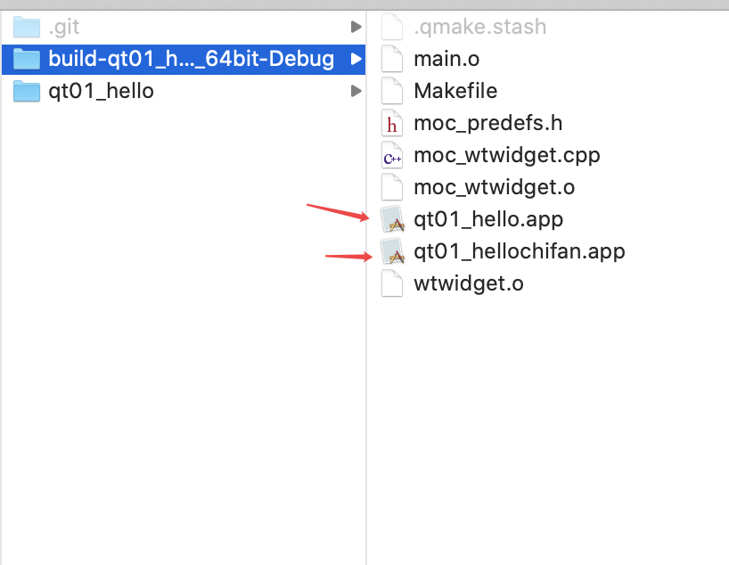

# 1. 创建工程


# 2. QTCreator 简介


## 2.1 .pro

- 这个文件哈相当于`xcode`的`.xcodeproj`和 `.xcworkspace`文件
- 这里面写的是编译配置信息


```

#-------------------------------------------------

#

#  Project  created  by  QtCreator  2020-10-31T17:09:03

#

#-------------------------------------------------

QT  +=  core  gui

greaterThan(QT_MAJOR_VERSION,  4):  QT  +=  widgets

TARGET  =  qt01_hello

TEMPLATE  =  app

#  The  following  define  makes  your  compiler  emit  warnings  if  you  use

#  any  feature  of  Qt  which  has  been  marked  as  deprecated  (the  exact  warnings

#  depend  on  your  compiler).  Please  consult  the  documentation  of  the

#  deprecated  API  in  order  to  know  how  to  port  your  code  away  from  it.

DEFINES  +=  QT_DEPRECATED_WARNINGS

#  You  can  also  make  your  code  fail  to  compile  if  you  use  deprecated  APIs.

#  In  order  to  do  so,  uncomment  the  following  line.

#  You  can  also  select  to  disable  deprecated  APIs  only  up  to  a  certain  version  of  Qt.

#DEFINES  +=  QT_DISABLE_DEPRECATED_BEFORE=0x060000  #  disables  all  the  APIs  deprecated  before  Qt  6.0.0

CONFIG  +=  c++11

SOURCES  +=  \

  main.cpp  \

  wtwidget.cpp

HEADERS  +=  \

  wtwidget.h

#  Default  rules  for  deployment.

qnx:  target.path  =  /tmp/$${TARGET}/bin

else:  unix:!android:  target.path  =  /opt/$${TARGET}/bin

!isEmpty(target.path):  INSTALLS  +=  target


```


- `QT  +=  core  gui` : 
  - `QT`: 工程模块变量, 引入相关模块, 如上引入了 `core`和`gui`模块

- `greaterThan(QT_MAJOR_VERSION,  4):  QT  +=  widgets`
  - 解释: 如果qt版本号大于4，就引入widgets模块


- `TARGET  =  qt01_hello`: 这个是对生成的程序的命名如图




- `TEMPLATE  =  app`: 模板，生成什么文件，
  - **app** 表示应用程序,如果是Windows呢就是`qt01_hello.exe`, 如果是mac呢就是`qt01_hello.app`
  - **lib**  就是生成库


- `DEFINES  +=  QT_DEPRECATED_WARNINGS`:  如果你用了过时的`api`，就会报`warning`


## 2.2 wtwidget(QWidget) 类

像这个类哈, 就是我创建工程的时候创建的,  是一个UI窗口空间, 下面的注释中说`顶层窗口就是在任务栏可以找到的窗口`这个我在`mac`里面没看到


### 2.2.1 .h文件

```cpp

#ifndef  WTWIDGET_H

#define  WTWIDGET_H

#include  <QWidget>

class  WTWidget  :  public  QWidget

{

  // 宏，引入qt信号和槽的一个宏
  Q_OBJECT

public:

  //parent窗口指针，父窗口对象的指针
  //如果parent为0或者NULL，表示当前窗口对象是个顶层窗口
  //顶层窗口就是在任务栏可以找到的窗口
  WTWidget(QWidget  *parent  =  0);

  ~WTWidget();

};

#endif  //  WTWIDGET_H

```


### 2.2.2 main 

- `QApplication` : 好比`iOS`的`UIApplicationMain`

- `WTWidget`好像`AppDelegate.window.rootViewController`

```cpp

#include  "wtwidget.h"

#include  <QApplication>

#include  <QDebug>

int  main(int  argc,  char  *argv[])

{

  //创建一个应用程序对象
  //维护qt应用程序生命的一个对象，每个qt有且仅有一个的对象
  //  iOS也有类似的  UIApplicationMain
  QApplication  a(argc,  argv);

  //  窗口类的一个对象
  WTWidget  w;

  //把窗口显示出来
  w.show();

  qDebug()<<"hello  my  qt  吃饭了没";

  return  a.exec();

//  a.exec();
//  return  0;

}

```


# 如果打开多个工程哈


# 新建对象


# 快捷键什么的

option + 回车 自动实现方法, 前提是你光标要在方法定义上面哈.....还有一个小bug是, 多个工程实现了某个相同的方法的时候, 你在其中一个工程里面点击无效.....


# 信号和信号槽

## 信号 signals
## 槽 slots

- `connect(btn,  &QPushButton::clicked,  this,  &Widget::close);`

conncet(信号发送者，信号，信号接收者，槽)

- 信号发送者: `btn`
- 信号: `&QPushButton::clicked`
- 信号接收者: `this`
- 槽: `&Widget::close`

OC的情况`[btn  addTarget:self  action:@selector(btnClick:) forControlEvents:UIControlEventTouchUpInside];`
- 信号发送者: `btn`
- 信号: `UIControlEventTouchUpInside`
- 信号接收者: `self`
- 槽: `@selector(btnClick:)`

所以槽就是执行的操作

```cpp

void  Widget::test2()

{

  /*

  这个方法重载时的

  */

  pTeacher  =  new  XYTeacher(this);

  pStudent  =  new  WtStudent(this);

  void  (XYTeacher::*teacher_qString)(QString)  =  &XYTeacher::hungry;

  void  (WtStudent::*student_qString)(QString)  =  &WtStudent::treat;

  connect(pTeacher,  teacher_qString,  pStudent,  student_qString);

  this->xtClassIsOver();

}

void  Widget::test3()

{

  pTeacher  =  new  XYTeacher(this);

  pStudent  =  new  WtStudent(this);

  //使用static_cast  来转换无参的函数

  connect(pTeacher,

  static_cast<  void  (XYTeacher::*)(void)  >(&XYTeacher::hungry),

  pStudent,

  static_cast<  void  (WtStudent::*)(void)  >(&WtStudent::treat)  );

  this->xtClassIsOver();

}

void  Widget::test4()

{

  pTeacher  =  new  XYTeacher(this);

  pStudent  =  new  WtStudent(this);

  //使用static_cast  来转换有参的函数

  connect(pTeacher,

  static_cast<  void  (XYTeacher::*)(QString)  >(&XYTeacher::hungry),

  pStudent,

  static_cast<  void  (WtStudent::*)(QString)  >(&WtStudent::treat)  );

  this->xtClassIsOver();

}

void  Widget::test5()

{

  pTeacher  =  new  XYTeacher(this);

  pStudent  =  new  WtStudent(this);

  connect(pTeacher,

  static_cast<  void  (XYTeacher::*)()  >(&XYTeacher::hungry),

  pStudent,

  static_cast<  void  (WtStudent::*)()  >(&WtStudent::treat)  );

  QPushButton  *btn  =  new  QPushButton("按钮1",this);

  connect(btn,

  &QPushButton::clicked,

  pTeacher,

  static_cast<  void  (XYTeacher::*)()  >(  &XYTeacher::hungry  ));

//  this->xtClassIsOver();

}

void  Widget::test6()

{

  pTeacher  =  new  XYTeacher(this);

  pStudent  =  new  WtStudent(this);

  void  (XYTeacher::*teacher_qString)()  =  &XYTeacher::hungry;

  void  (WtStudent::*student_qString)()  =  &WtStudent::treat;

  connect(pTeacher,  teacher_qString,  pStudent,  student_qString);

  QPushButton  *btn  =  new  QPushButton("按钮1",this);

  connect(btn,

  &QPushButton::clicked,

  pTeacher,

  teacher_qString  );

  //信号可以断开连接

//  disconnect(pTeacher,teacher_qString,pStudent,student_qString);

  this->xtClassIsOver();

}

void  Widget::test7()

{

  pTeacher  =  new  XYTeacher(this);

  pStudent  =  new  WtStudent(this);

  /*

  2020年11月01日22:51:31

  实际上这个是没意义的,  信号有只是函数,  不能继承,  所以只能用空参数的就ok了

  */

  connect(pTeacher,

  static_cast<  void  (XYTeacher::*)(QString)  >(&XYTeacher::hungry),

  pStudent,

  static_cast<  void  (WtStudent::*)(QString)  >(&WtStudent::treat)  );

  WTQPushButton  *btn  =  new  WTQPushButton("ss",  this);//new  WTQPushButton("按钮1",this);

  connect(btn,

  static_cast<  void  (WTQPushButton::*)(QString)  >(  &WTQPushButton::clicked),

  pTeacher,

  static_cast<  void  (XYTeacher::*)(QString)  >(&XYTeacher::hungry)  );

}


void  Widget::xtClassIsOver()

{

//  emit  pTeacher->hungry();
  emit  pTeacher->hungry("黄焖鸡");

}

```


