# 目录

1. [01day网络基础概念](#tcp001)
    1. [1.1 OSI七层模型](#tcp001a)
    2. [1.2 TCP/IP四层模型](#tcp001b)
2. [02tcp并发服务器](#tcp002)
    1. [2.0 结构体](#tcp002z) 
        1. [2.0.1 ipv4套接字结构体sockaddr_in](#tcp002z1)
        2. [2.0.2 ipv6套接字结构体了解看一眼](#tcp002z2)
        3. [2.0.2 通用套接字结构体](#tcp002z3)
    1. [2.1 Socket 编程](#tcp002a)
    2. [2.2 网路字节序](#tcp002b)
    3. [2.3 点分十进制串转成大小端](#tcp002c)
    4. [2.4 inet_pton](#tcp002d)
    5. [2.5 inet_ntop](#tcp002e)
    6. [2.6 Socket  TCP](#tcp002f)
    7. [2.7创建套接字socket](#tcp002g)
    8. [2.8  连接服务器 connect](#tcp002h)
    9. [2.9 bind绑定](#tcp002i)
    10. [2.10  listen](#tcp002j)
    11. [2.11 accept](#tcp002k)

3. [03tcp状态和多路IO](#tcp003)
4. [04epoll](#tcp004)
5. [05反应堆线程池](#tcp005)
6. [06libevent](#tcp006)
7. [07IO补充](#tcp007)
    1. [7.1 write函数](#tcp007a)
    2. [7.2 read](#tcp007b)
8. [命令](#tcp008)
    1. [netstat -n 查看会话](#tcp008a) 

9. [TCP/UDP详解](#tcp009)

### tcp001
# 01day网络基础概念

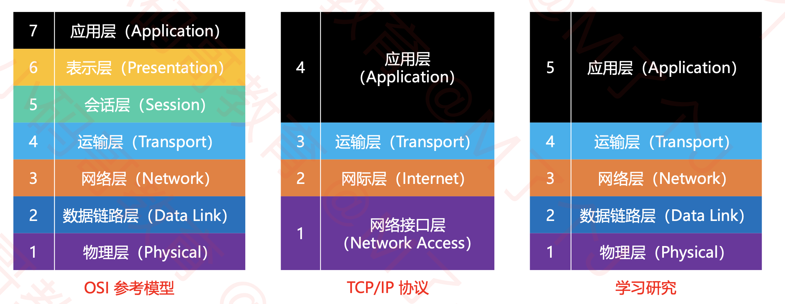
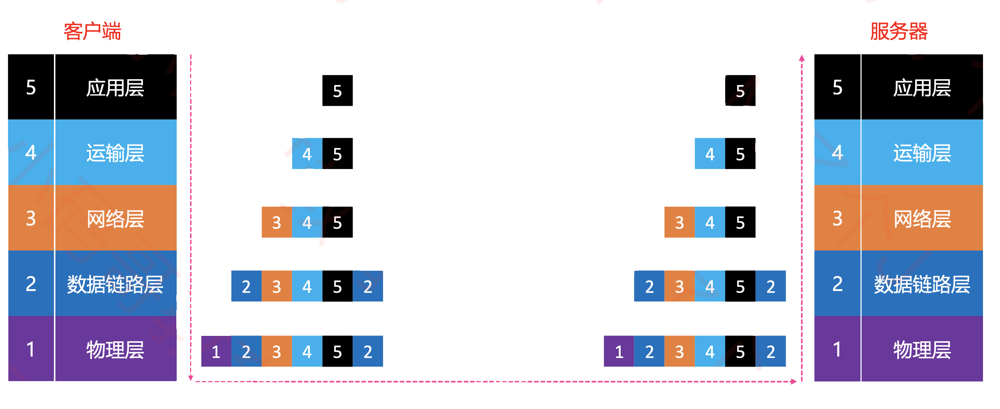
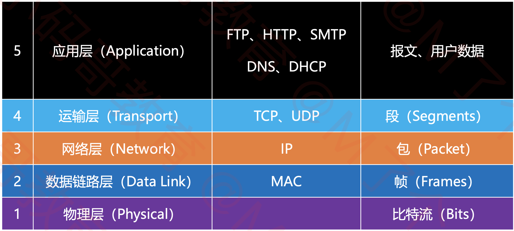

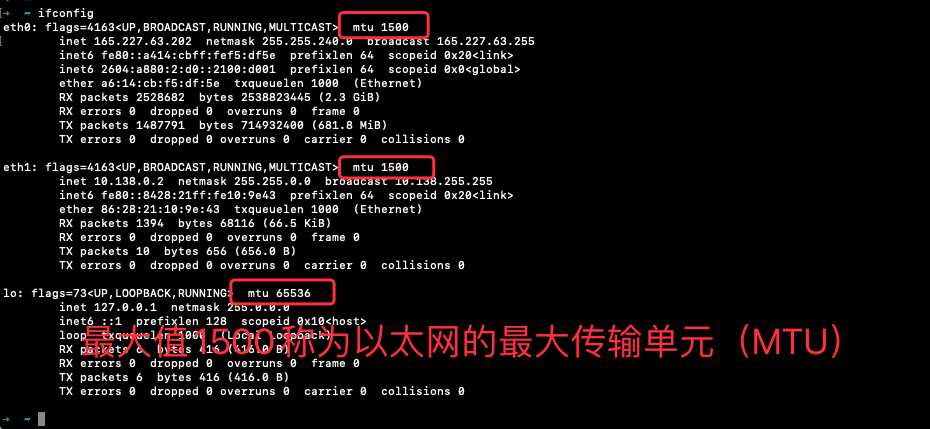
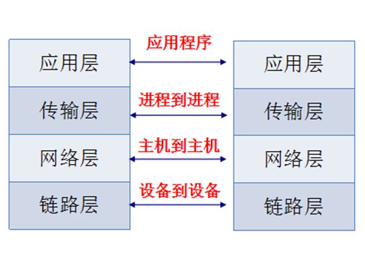

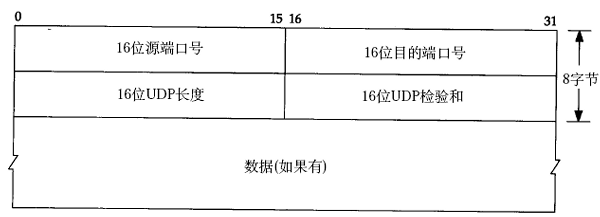

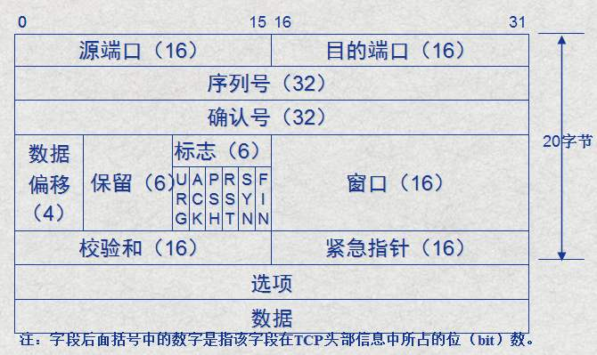

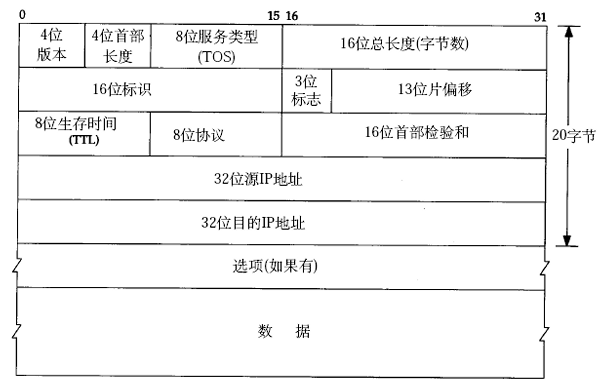
- 以太网的帧格式如下所示:
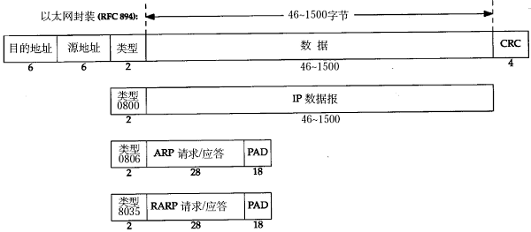

1. IP地址
    1. IPv4 **4个字节**   `32位`
    2. IPV6 **16个字节**  `128位`

2. 程序可以占有多个端口
    1. 端口 **2个字节** `0-65535`


1. UDP 头8个字节
2. TCP 头20个字节
3. IP 头 20个字节


| 层级      | 协议    |  - | - |
| --------- | -------- | -----: | --: |
| 应用层     | Http, Ftp, ...  | - |   - |
| 传输层     | TCP , UDP     |   - |   - |
| 网络层     | ICMP, IP, IGMP |   - |  - |
| 链路层     | ARP, RARP    |   - |   - |


ICMP:  **ping**命令
ARP: 通过ip找mac

### tcp001a
## 1.1 OSI七层模型

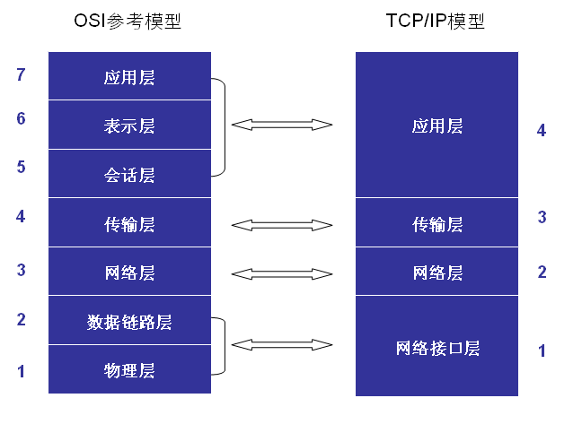

1. **物理层**：主要定义物理设备标准，如网线的接口类型、光纤的接口类型、各种传输介质的传输速率等。它的主要作用是传输比特流（就是由1、0转化为电流强弱来进行传输，到达目的地后再转化为1、0，也就是我们常说的数模转换与模数转换）。这一层的数据叫做比特。

2. **数据链路层**：定义了如何让格式化数据以帧为单位进行传输，以及如何让控制对物理介质的访问。这一层通常还提供错误检测和纠正，以确保数据的可靠传输。如：串口通信中使用到的115200、8、N、1

3. **网络层**：在位于不同地理位置的网络中的两个主机系统之间提供连接和路径选择。Internet的发展使得从世界各站点访问信息的用户数大大增加，而网络层正是管理这种连接的层。

4. **传输层**：定义了一些传输数据的协议和端口号（WWW端口80等），如：TCP（传输控制协议，传输效率低，可靠性强，用于传输可靠性要求高，数据量大的数据），UDP（用户数据报协议，与TCP特性恰恰相反，用于传输可靠性要求不高，数据量小的数据，如QQ聊天数据就是通过这种方式传输的）。 主要是将从下层接收的数据进行分段和传输，到达目的地址后再进行重组。常常把这一层数据叫做段。

5. **会话层**：通过传输层(端口号：传输端口与接收端口)建立数据传输的通路。主要在你的系统之间发起会话或者接受会话请求（设备之间需要互相认识可以是IP也可以是MAC或者是主机名）。

6. **表示层**：可确保一个系统的应用层所发送的信息可以被另一个系统的应用层读取。例如，PC程序与另一台计算机进行通信，其中一台计算机使用扩展二一十进制交换码(EBCDIC)，而另一台则使用美国信息交换标准码（ASCII）来表示相同的字符。如有必要，表示层会通过使用一种通格式来实现多种数据格式之间的转换。

**应用层**：是最靠近用户的OSI层。这一层为用户的应用程序（例如电子邮件、文件传输和终端仿真）提供网络服务。

### tcp001b
## 1.2 TCP/IP四层模型

TCP/IP网络协议栈分为应用层（`Application`）、传输层（`Transport`）、网络层（`Network`）和链路层（`Link`）四层。如下图所示：

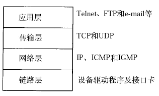

**应用层** 常见的协议有`HTTP`协议，`FTP`协议。

**传输层** 常见协议有`TCP/UDP`协议。

**网络层** 常见协议有`IP`协议、`ICMP`协议、`IGMP`协议。

**网络接口层** 常见协议有`ARP`协议、`RARP`协议。

---

TCP[传输控制协议](http://baike.baidu.com/view/544903.htm)（Transmission Control Protocol）是一种面向连接的、可靠的、基于字节流的[传输层](http://baike.baidu.com/view/239605.htm)通信协议。

---

UDP用户数据报协议（User Datagram Protocol）是[OSI](http://baike.baidu.com/view/113948.htm)参考模型中一种无连接的[传输层](http://baike.baidu.com/view/239605.htm)协议，提供面向事务的简单不可靠信息传送服务。

---

HTTP[超文本传输协议](http://baike.baidu.com/view/468465.htm)（Hyper Text Transfer Protocol）是[互联网](http://baike.baidu.com/view/6825.htm)上应用最为广泛的一种[网络协议](http://baike.baidu.com/view/16603.htm)。

---

FTP文件传输协议（File Transfer Protocol）

---

IP协议是[因特网](http://baike.baidu.com/view/1706.htm)互联协议（Internet Protocol）

---

ICMP协议是Internet控制[报文](http://baike.baidu.com/view/175122.htm)协议（Internet Control Message Protocol）它是[TCP/IP协议族](http://baike.baidu.com/view/2221037.htm)的一个子协议，用于在IP[主机](http://baike.baidu.com/view/23880.htm)、[路由](http://baike.baidu.com/view/18655.htm)器之间传递控制消息。

---

IGMP协议是 Internet 组管理协议（Internet Group Management Protocol），是因特网协议家族中的一个组播协议。该协议运行在主机和组播路由器之间。

---

[ARP](http://baike.baidu.com/view/32698.htm)协议是正向[地址解析协议](http://baike.baidu.com/view/149421.htm)（Address Resolution Protocol），通过已知的IP，寻找对应主机的[MAC地址](http://baike.baidu.com/view/69334.htm)。

---

[RARP](http://baike.baidu.com/view/32772.htm)是反向地址转换协议，通过MAC地址确定IP地址。

### tcp002
# 02tcp并发服务器

### tcp002z
## 2.0 结构体

### tcp002z1
### 2.0.1 ipv4套接字结构体sockaddr_in

> **man 7 ip**

```c


 struct sockaddr_in {

  sa_family_t    sin_family; /* address family: AF_INET */
  in_port_t      sin_port;   /* port in network byte order */
  struct in_addr sin_addr;   /* internet address */
};

/* Internet address. */
struct in_addr {
   uint32_t       s_addr;     /* address in network byte order */
};

```

- `sin_family`: 协议  `AF_INET`
- `sin_port`: 端口
- `sin_addr`:  ip地址

```c

// INADDR_ANY 通配地址, 值为0 通配地址, 值为0
// 如果 服务器又很多ip地址, 你赋值为0的话就是一个通配地址
// 通配地址的话呢你访问哪一个地址都能访问
sock.sin_addr.s_addr = INADDR_ANY;


```

//
nc 192.168.1.1 8000


### tcp002z2
### 2.0.2 ipv6套接字结构体

使用 `sudo grep -r "struct sockaddr_in {"  /usr 命令可查看到struct sockaddr_in`结构体的定义。一般其默认的存储位置：`/usr/include/linux/in.h` 文件中。

```c

 struct sockaddr_in6 {

    unsigned short int sin6_family;        /* AF_INET6 */

    __be16 sin6_port;                  /* Transport layer port # */

    __be32 sin6_flowinfo;              /* IPv6 flow information */

    struct in6_addr sin6_addr;         /* IPv6 address */

    __u32 sin6_scope_id;               /* scope id (new in RFC2553) */

};

struct in6_addr {

    union {

        __u8 u6_addr8[16];

        __be16 u6_addr16[8];

        __be32 u6_addr32[4];

    } in6_u;

    #define s6_addr        in6_u.u6_addr8

    #define s6_addr16      in6_u.u6_addr16

    #define s6_addr32     in6_u.u6_addr32

};

#define UNIX_PATH_MAX 108

    struct sockaddr_un {

    __kernel_sa_family_t sun_family;   /* AF_UNIX */

    char sun_path[UNIX_PATH_MAX]; /* pathname */

};

```


### tcp002z3
### 2.0.2 通用套接字结构体


```c

 

struct sockaddr {

    sa_family_t sa_family;     /* address family, AF_xxx */

    char sa_data[14];          /* 14 bytes of protocol address */

};

```


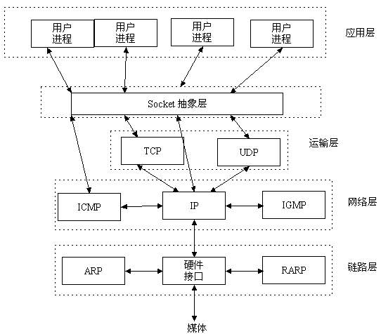

### tcp002a
## 2.1 Socket 编程

`Socket`本身有“插座”的意思，在`Linux`环境下，用于表示进程间网络通信的特殊`文件类型`。本质为内核借助缓冲区形成的`伪文件`。

- 在TCP/IP协议中，“IP地址+TCP或UDP端口号”唯一标识网络通讯中的一个进程。

- “IP地址+端口号”就对应一个socket。


### tcp002b
## 2.2 网路字节序

大端:  高位, 存低地址, 低位, 存高地址 
小端:  低位, 存低地址, 高位, 存高地址

`TCP/IP`协议规定，**网络数据流应采用大端字节序**，即低地址高字节.(**大端**)


```c

#include <arpa/inet.h>

// 主机转网络 转ip地址
uint32_t htonl(uint32_t hostlong);
// 主机转网络 转端口
uint16_t htons(uint16_t hostshort);

// 网络转主机  转ip地址
uint32_t ntohl(uint32_t netlong);
// 网络转主机  转端口
uint16_t ntohs(uint16_t netshort);

```

### tcp002c
## 2.3 点分十进制串转成大小端

```c

#include <arpa/inet.h>

int inet_pton(int af, const char *src, void *dst);

const char *inet_ntop(int af, const void *src, char *dst, socklen_t size);

```

支持IPv4和IPv6

可重入函数

其中`inet_pton`和`inet_ntop`不仅可以转换`IPv4`的`in_addr`，还可以转换`IPv6`的`in6_addr`。

因此函数接口是`void *addrptr`。

### tcp002d
### 2.4 inet_pton

参数说明
- af: 
  - **AF_INET**  表示IPV4
  - **AF_INET6** 表示IPV6

- src: 点分十进制的地址
  - `"192.168.1.1"`像这样

- dst: 32位网络数据的 地址
  - 你要把转换 后的存到哪里去

- 返回值: 1代表成功


### tcp002e
### 2.5 inet_ntop

`INET_ADDRSTRLEN` ipv4的时候写,值是16

- af:  **AF_INET**
- src: 32位网络数据的 地址
- dst:  点分十进制的地址
- size: 存储点分十进制数组的大小
- 返回值: 存储点分十进制串数组 首地址和`dst`地址一样


### tcp002f
### 2.6 Socket  TCP

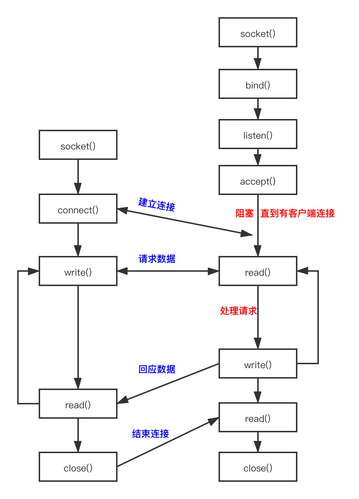

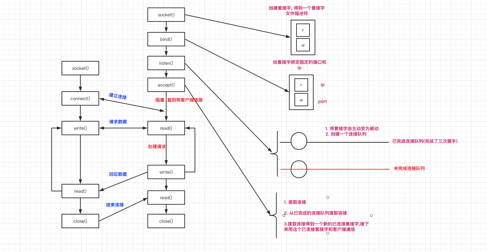

函数解释


### tcp002g
### 2.7 **创建套接字socket**
```c

#include <sys/socket.h>

int socket(int domain, int type, int protocol);

```


参数:

- `domain`:AF_INET

- `type`: SOCK_STREAM 流式套接字 用于tcp通信

- `protocol`: 0

成功返回文件描述符,失败返回-1

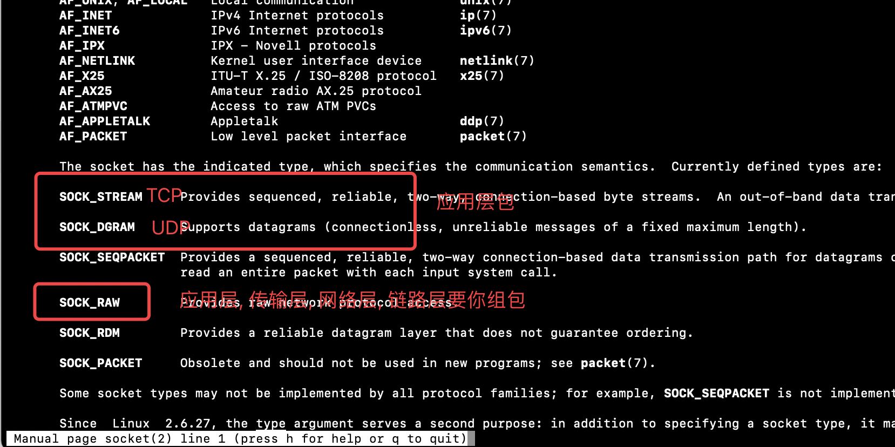

### tcp002h
### 2.8  **连接服务器 connect**

```c

 #include <sys/socket.h>

 int connect(int sockfd , const struct sockaddr *addr,socklen_t addrlen);

```

 功能: 连接服务器

- `sockfd`:  socket套接字

- `addr`:  ipv4套接字结构体的地址

- `addrlen`: ipv4套接字结构体的长度


### tcp002i
### 2.9 **bind绑定**

给套接字绑定固定的端口和ip

```c

#include <sys/socket.h>
int bind(int sockfd, const struct sockaddr *addr, socklen_t addrlen);

```


- `sockfd`: 套接字

- `addr`: ipv4套接字结构体地址

- `addrlen`: ipv4套接字结构体的大小

- 返回值: 成功返回0 失败返回;-1


### tcp002j
### 2.10  **listen**

```c

#include <sys/socket.h>

int listen(int sockfd, int backlog);

```


参数:

- `sockfd` : 套接字
- `backlog` :  已完成连接队列和未完成连接队里数之和的最大值  128 


### tcp002k
### 2.11  **accept**

```c

#include <sys/socket.h>

int accept(int socket, struct sockaddr *restrict address, socklen_t *restrict address_len);

```

**如果连接队列没有新的连接,accept会阻塞**

功能: **从已完成连接队列提取新的连接**

参数:

- `socket` : 套接字

-  `address` : 获取的客户端的的ip和端口信息  iPv4套接字结构体地址 

- `address_len`: iPv4套接字结构体的大小的地址

- socklen_t len = sizeof(struct sockaddr );

- `返回值`:  新的已连接套接字的文件描述符


### tcp003
# 03tcp状态和多路IO

### tcp004
# 04epoll

### tcp005
# 05反应堆线程池

### tcp006
# 06libevent

### tcp007
# 07IO补充

### tcp007a
## 7.1 write函数

```c


#include <unistd.h>
ssize_t write(int fd, const void *buf, size_t count);

```


- 功能：
    - 把指定数目的数据写到文件（fd）
- 参数：
    - `fd` :  文件描述符
    - `buf` : 数据首地址
    - `count` : 写入数据的长度（字节）
- 返回值：
    - `成功`：实际写入数据的字节个数
    - `失败`： - 1


### tcp007b
## 7.2 read

```c

#include <unistd.h>
ssize_t read(int fd, void *buf, size_t count);

```


- 功能：
    把指定数目的数据读到内存（缓冲区）
- 参数：
    - fd : 文件描述符
    - buf : 内存首地址
    - count : 读取的字节个数
- 返回值：
    -  成功：实际读取到的字节个数
    - 失败： - 1

**阻塞和非阻塞的概念**

读常规文件是不会阻塞的，不管读多少字节，read一定会在有限的时间内返回。

从终端设备或网络读则不一定，如果从终端输入的数据没有换行符，调用read读终端设备就会阻塞，如果网络上没有接收到数据包，调用read从网络读就会阻塞，至于会阻塞多长时间也是不确定的，如果一直没有数据到达就一直阻塞在那里。

同样，写常规文件是不会阻塞的，而向终端设备或网络写则不一定。

【注意】阻塞与非阻塞是对于文件而言的，而不是指read、write等的属性。

以非阻塞方式打开文件程序示例：

```c

#include <unistd.h>  //read

#include <sys/types.h>

#include <sys/stat.h>

#include <fcntl.h>

#include <stdio.h>

#include <errno.h> //EAGAIN

int  main()

{

  // /dev/tty --> 当前终端设备

  // 以不阻塞方式(O_NONBLOCK)打开终端设备

 int fd = open("/dev/tty", O_RDONLY | O_NONBLOCK);

​

 char buf[10];

 int n;

 n = read(fd, buf, sizeof(buf));

 if (n < 0)

 {

  // 如果为非阻塞，但是没有数据可读，此时全局变量 errno 被设置为 EAGAIN

 if (errno != EAGAIN)

 {

 perror("read /dev/tty");

 return -1;

 }

 printf("没有数据\n");

 }

 return 0;

}

```


### tcp008
# 8. 命令

### tcp008a
## 8.1 查看会话

netstat -n


### tcp009
# 9.TCP/UDP详解


### tcp009a
## 9.1 UDP

- UDP是无连接的，即发送数据之前不需要建立连接。
- UDP使用尽最大努力交付，即不保证可靠交付，同时也不使用拥塞控制。
- UDP是面向报文的。UDP没有拥塞控制，很适合多媒体通信的要求。
- UDP支持一对一、一对多、多对一和多对多的交互通信。
- UDP的首部开销小，只有`8个字节`。

UDP检验和求发

第一个15是UDP的数据包长度
第二个15也是UDP的长度

15 = 8个字节的首部 + 7个字节的数据

17是协议号

只要记住一点就是UDP检验和算法里面用到了ip层的地址什么的就ok了

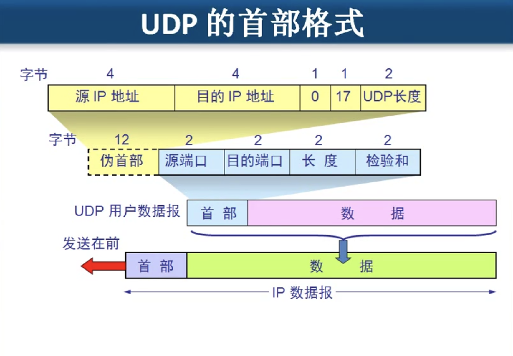
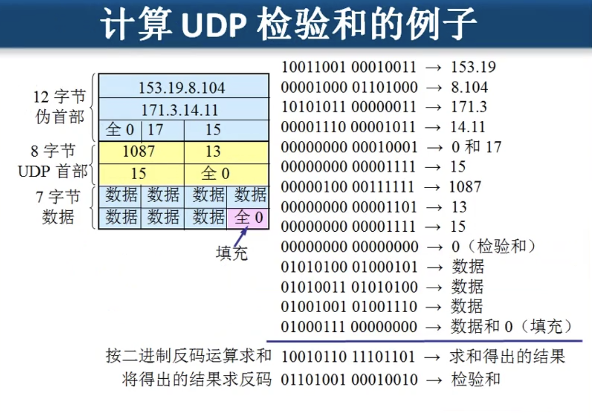

### tcp009b
## 9.2 TCP

协议号是6

停止等待协议, 你没确认收到我就等一个往返时间再发一个
滑动窗口

客户端收的慢, 服务端性能很好, 服务端一股脑使劲发,客户端收不过来了, 客户端就会发条消息说“你发慢点”~等处理完了就说“好了你继续”

网络不稳定, 等于说两台主机使用 的链路不只是他们两. 路由器处理不过来了. 路由器丢包了,是网有点堵而不是两台计算机处理不过来. 这个时候两台计算机还是敞开了发数据给对方的话, 路由器越来越堵你发多少路由器就丢多少, TCP有一种机制就是解决这事的就是拥塞控制


不管你的文件多大, 传的时候需要一部分一部分的传, 他先把要传的一部分放到一个缓存里面去. 应用程序往缓存里放数据一次放的块大小没有规律, 一次5个字节一次8个字节? 没有规律.

- TCP 如何实现可靠传输?
- TCP协议如何实现流量控制?
- TCP 协议如何避免网络堵塞?

1. TCP是面向连接的传输层协议。
2. 每一条TCP连接只能有两个端点(endpoint)，每一条TCP连接只能是点对点的(一对一)
3. TCP提供可靠交付的服务。
4. TCP提供全双工通信。
5. 面向字节流


### tcp009b1
### 9.2.1 TCP 头部字段详解

可选部分就是商量事情的
- 有数据直接是固定头部加上数据
- 有个数据是固定头部加选项然后没有数据部分
- 

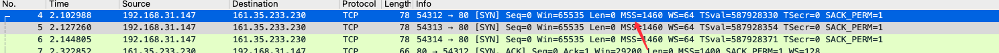
- `MSS`: 一个数据包最大可以是多少个字节, 大了我就处理不了了, 这个是处于选项中的,不是固定20个字节里面的
- `Win(Window Size)`(就是窗口): 接收/发送缓存窗口大小
- `Seq(Sequence number)`: 序号, 序号是针对发送方的, 是本次发送包所处整个文件的多少字节
- `Acknowledgment number`(32位4字节那个): 确认号,确认收到对方的序号, 下次该发多少个字节 了
- `ACK`(1位那个): 0的话`确认号`无效, 1的话`确认号`有效, 因为这个家伙是对之前收到的数据的确认
- `保留`:
- `URG`: 0代表普通, 1的话代表不在发送缓存里排队
- `紧急指针`: 需要`URG`是1, 然后它的值代表,传输层数据域里面前多少个字节需要紧急处理, 等于说紧急指针的值是50的话, 就是说前50个字节的数据需要紧急处理, 后面的话就普通.

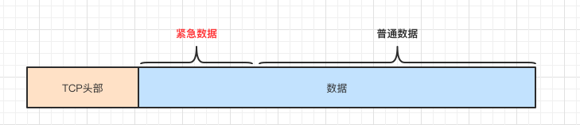

- `checkusm`(校验和): 和UPD算法一样,检验传输层数据和头部, 要带上`ip`层的数据 
- `数据偏移`(4位): 告诉别人多少字节以后是数据, 4位能表示15, 一个代表4个字节等于说最大是15x4=60.固定字节是20,也就是说选项部分最大是40..如果数据偏移是15也就是4个1(1111)就代表传输层这一坨前面60个字节是传输层的头, 后面开始才是数据部分.
- `目标端口`:
- `源端口`: 
- `PUSH`: 的话是针对接收方说的. 不在接收缓存里排队直接发给应用层
- `RST`: 就是说TCP通讯出现严重的错误, 需要断开连接,然后重新连接才能通讯, 例如传输一张图片传的好好的没传完,突然你关闭浏览器了.
- `FIN`:的话就是传输完成了是否连接

- `MTU`: 最大传输单元

### tcp009b2
### 9.2.2 TCP 头部字段选项部分

-  `SACK permitted`选择性确认
- `TSval`:(timestamp) 时间戳


### tcp009b3
### 9.2.3 TCP 超时重传

TCP没发送一个报文段,  就对这个报文段设置一次计时器, 只需要计时器设置的重传时间到但还没有收到确认, 就要重传一个报文段.


### tcp009b4
### 9.2.4 TCP 四次挥手

因为他是全双工的模式, 你可以给我发, 我可以给你发, 也就是我发给你你接收, 你发给我我接收.

你发->我收
我发->你收

你说你不发了, 不代表我不发
我说我不发了, 不代表你不发

1. 第一次挥手收我没得数据要发送给你了我要关闭. (我说我不发, 此时不代表你不发)
2. 第二次挥手你说你收到了,但是你可能还有数据要发给我.
3. 第三次挥手你说也没得数据要发了. 关闭吧
4. 第四次挥手我说我知道你也没得数据过来了, 关吧

TCP协议是一种`面向连接的`、`可靠的`、`基于字节流`的运输层通信协议。TCP是**全双工模式**，这就意味着，当主机1发出`FIN`报文段时，`只是表示主机1已经没有数据要发送了`，主机1告诉主机2，它的数据已经全部发送完毕了；但是，这个时候主机1`还是可以接受`来自主机2的数据；当主机2返回`ACK`报文段时，表示它已经知道主机1没有数据发送了，但是主机2还是可以发送数据到主机1的；当主机2也发送了`FIN`报文段时，这个时候就表示主机2也没有数据要发送了，就会告诉主机1，`我也没有数据要发送了`，之后彼此就会愉快的中断这次TCP连接。如果要正确的理解四次分手的原理，就需要了解四次分手过程中的状态变化。


### tcp009b5
### 9.2.5 TCP 三次握手

1. 怕攻击
2. 怕丢失

