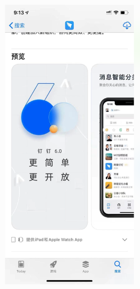

# 1. 图片 下面的尺寸


```c

5.5
1242*2208


6.5
1242*2688

```


# 2. 技术支持网址 (URL)


# 3. 描述--本次版本有哪些东西å

```

对您 App 的描述，用以详细说明特性和功能。

```


# 4. 宣传文本--暂时可以不要

```c

宣传文本可使您在无需提交更新请求的情况下，通知 App Store 访客当前最新的 App 功能。如果客户的设备运行 iOS 11 或更高版本，以及 macOS 10.13 或更高版本，那么在 App Store 中，宣传文本会显示在您的 App 描述上方。

```


