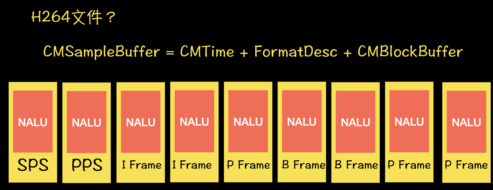
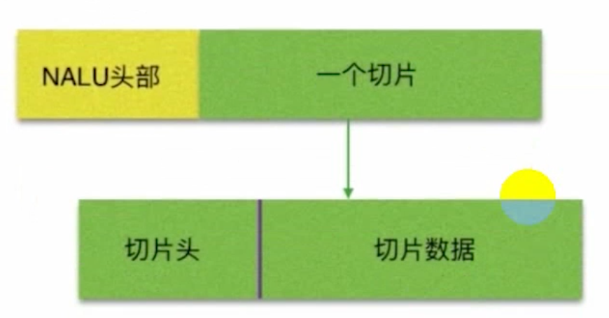

# 0. 总览

yuv->h264->mp4
pcm->aac->mp3

# 1. h264

1. 它是视频的编码格式的一种
2. 包括: 关键帧(I帧), 非关键帧(B,P), sps, pps

## 1.1 sps

## 1.2 pps

## 1.3 NAL 网络抽象成, 把一帧大的数据拆成下的数据再网络中传输,拆包

## 1.4 NALU = NAL Header(1B) + 00 00 00 01

I帧, B帧, P帧 他们是有多个片组成

# 2. aac

# 3. video Toolbox 工作流程

C语言的, 基于core Foundation

iOS8.0-->

1. 创建Session -> 设置编码相关参数 -> 开始编码 -> 循环输入源数据(yuv类型的数据, 摄像头提供 ) -> 获取编码后的h264流数据 -> 结束编码

只是获得h264流数据 ,  但是不构成h264 文件, 从 `CMSampleBuffer`的`CMBlockBufferRef`里面装的是h264流数据,

`CVPixelBufferRef`用于解码

`CMSampleBuffer`是h264流数据, 我们要将h264流变成h264 文件文件数据, 我们会给这个数据加个头, 加起始位00 00 00 01加一个pps或者sps的头

5--是I帧
7--序列参数集
8--图像参数集

# 4. 序列参数集sps----7

# 5. 图像参数集pps---8