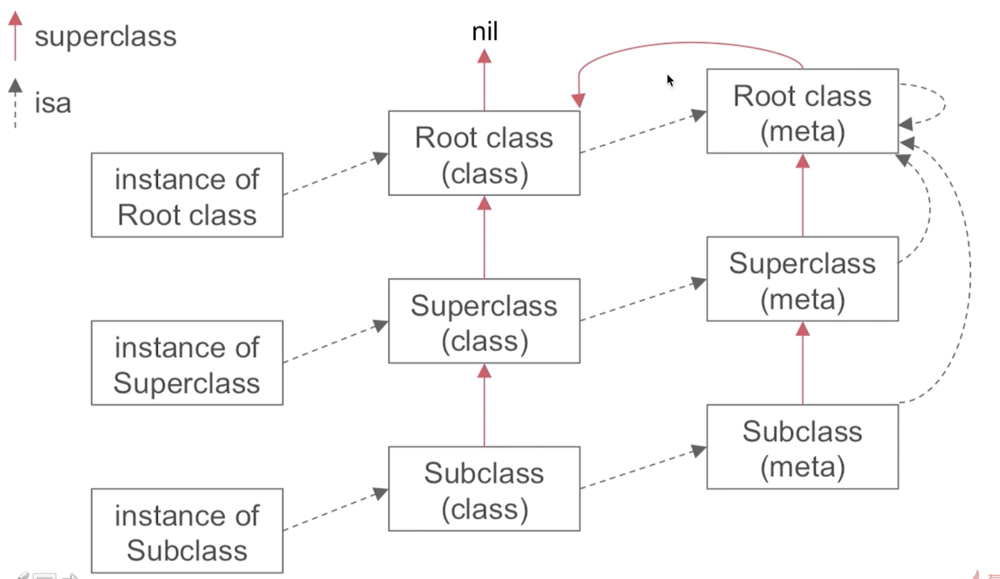
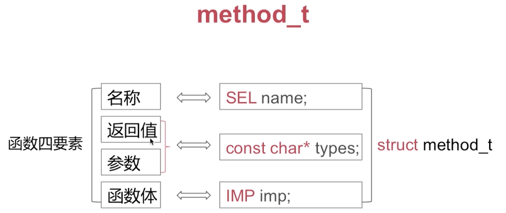
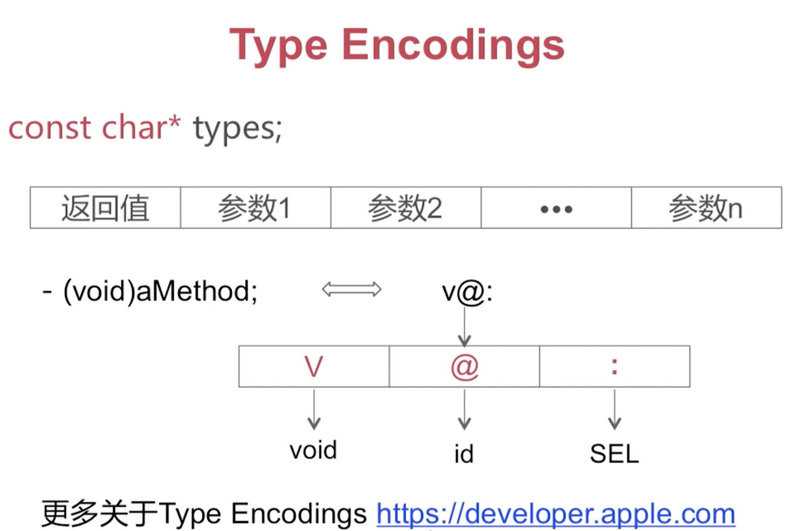
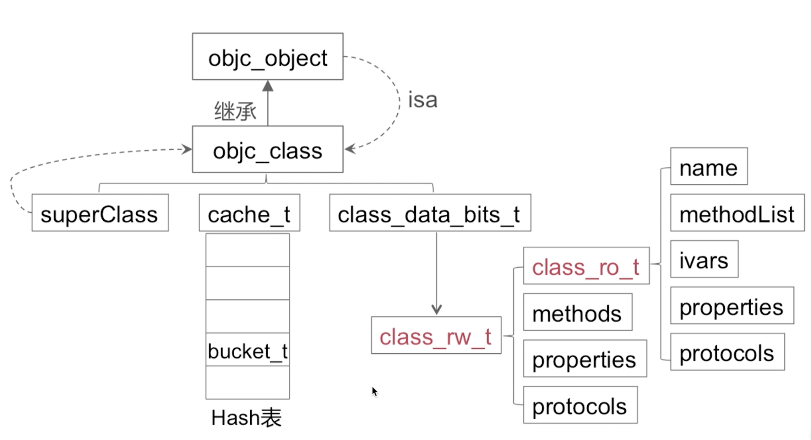

# 目录

1. [1. KVC](#v1)
2. [2. KVO](#v2)
3. [3. 手动 KVO](#v3)
4. [4. 属性关键字](#v4)
5. [5. 属性关键字之--assign 和weak的区别是什么?](#v5)
    1. [5.1 assign](#v5a)
    2. [5.2 weak](#v5b)
6. [6. 属性关键字之-copy 老大妈和深浅拷贝](#v6)
    1. [6.1 浅拷贝--就是不同指针,指向同一块内存地址](#v6a)
    2. [6.2 深拷贝-- 拿着被拷贝的对象, 重新分配一块内存产生新的指针指向](#v6b)
    3. [6.3 copy 出来的都是不可变对象](#v6c)
     
7. [7. Runtime](#v7)
   1. [7.1 Runtime包含哪些内容?](#v7a)
   2. [7.2 数据结构](#v7b)
       1. [7.2.1 objc_object](#v7b1) 
       2. [7.2.2 `objc_class` 集成至  `objc_object`----类对象](#v7b2) 
       3. [7.2.3 isa指针](#v7b3) 
       4. [7.2.4 isa指向](#v7b4) 
       5. [7.2.5 cache_t](#v7b5) 
       6. [7.2.6 bucket_t](#v7b6) 
       7. [7.2.7 class data bits t ](#v7b7)
       8. [7.2.8 class rw t](#v7b8) 
       9. [7.2.9 class_ro_t](#v7b9) 
       10. [7.2.10 method_t](#v7b10)
       11. [7.2.11 总结](#v7b11)

8. [value](#v8)


#### v1
# 1. KVC 设置值可触发KVO, KVC也是调用setter方法


#### v2
# 2. KVO 是 继承了原类,然后再setter方法里面做文章,发消息出去, isa混写技术


#### v3
# 3. 手动 KVO

```objc

- (void)willChangeValueForKey:(NSString *)key;
- (void)didChangeValueForKey:(NSString *)key;

```


#### v4
# 4. 属性关键字

引用计数
```objc

retain/strong

assign/unsafe_unretained

weak

copy
```

#### v5
# 5. 属性关键字之--assign 和weak的区别是什么?

#### v5a
## 5.1 assign

- 修饰基本数据类型, int, BOOL等
- 修饰对象类型时,  不改变其引用计数
- 修饰的对象被释放, 它还指着原对象的内存地址. ( **会产生悬垂指针** )

#### v5b
## 5.2 weak

- 不改变被修饰的对象的引用计数
- 所指向的对象在被释放以后呢, 它会自动置为`nil`


#### v6
# 6. 属性关键字之-copy 老大妈和深浅拷贝 

下面这句有啥问题??

```objc

@property (nonatomic, copy) NSMutableArray * array;

```


#### v6a
## 6.1 浅拷贝--就是不同指针,指向同一块内存地址

根据浅拷贝意思可得到
- 1. 被拷贝对象引用计数加一
- 

#### v6b
## 6.2 深拷贝-- 拿着被拷贝的对象, 重新分配一块内存产生新的指针指向

- 目标对象指针和原对象指针, 分别指向不同的内存空间
- 不会改变原对象的引用计数


#### v6c
## 6.3 copy 出来的都是不可变对象

| 源对象类型  | 拷贝方式  | 目标对象类型  | 拷贝类型(深/浅)  |
|---|---|---|---|
| mutable对象  | copy  | 不可变  | 深拷贝  |
| mutable对象  | mutableCopy  | 可变  |  深拷贝 |
| immutable对象  | copy  | 不可变  | 浅拷贝  |
| immutable对象  | mutableCopy  | 可变  | 深拷贝  |

1. 可变对象的`copy`和`mutableCopy`都是深拷贝
2. 不可变对象的`copy`是浅拷贝, `mutableCopy`都是深拷贝
3. `copy`方法返回的都是不可变对象

## 答: copy修饰的NSMutableArray,其实是NSArray


#### v7
# 7. Runtime

- 1. 编译型语言和动态运行时语言的区别?

- 2. 消息传递和函数调用有啥区别?

- 3. 当我调用一个方法没有实现,系统是如何给我实现转发过程的?

#### v7a
## 7.1 Runtime包含哪些内容?

1. 数据结构
2. 类对象与元类对象
3. 消息传递
4. 方法缓存
5. 消息转发
6. Method-Swizzling
7. 动态添加方法
8. 动态方法解析

#### v7b
## 7.2 数据结构

- **objc_object**
- **objc_class**
- **isa指针**
- **method_t**

#### v7b1
### 7.2.1 objc_object ----根元类对象

`objc_object` 对应 `OC`里面的`id`类型

**objc_object**包含如下:
- isa_t
- 关于`isa`操作相关
- 弱引用相关
- 关联对象相关
- 内存管理相关


#### v7b2
### 7.2.2 `objc_class` 集成至  `objc_object`----类对象

**objc_object** 就是**元类对象**

**objc_class** 这玩意是不是对象呢?
答: 它是对象, 他有个专有名字 **类对象**, 类对象就是它了!


**objc_class**包含如下:

- `Class SuperClass`, 指向父类对象
- `cache_t  cache`, 方法缓存, 消息传递过程中会用到
- `class_data_bits_t bits`, 一个类变量,属性, 方法啥的,都在这里


#### v7b3
### 7.2.3 isa指针

它是共用体

> 32位时: 32个0或者1 
> 64位时: 64个0或者1


它有两种, `指针型的isa` 和 `非指针型的isa`

- **指针型的isa**:  64位的0或者一整个都代表地址, 代表的Class的地址
- **非指针型的isa**: isa的**值的部分**代表Class地址,  可能有33位或者45位是地址, 其他部分的意思不是地址


这么做的原因是, 我们在寻址的时候, 可能有33位或者45位就够寻址用了, 那么多出来的这些位呢, 就可以用来存储一些其他内容..为了节省内存


#### v7b4
### 7.2.4 isa指向

- 1. 关于**对象**的 isa指针,  其指向**类对象**
- 2. 关于**类对象**的 isa指针, 其指向**元类对象**
- 3. 任何一个**元类对象**的isa指针, 其指向**根元类对象**
- 4. **根元类对象**的isa指针, 也指向**根元类对象**



#### v7b5
### 7.2.5 cache_t

可以理解为他就是用一个数组实现的, 数组里面的元素就是`bucket_t`

- 它是用于**快速**查找方法执行函数的一个结构

- 它是可增量扩展的哈希表结构

- 是局部性原理的最佳应用


#### v7b6
### 7.2.6 bucket_t

**bucket_t**包含如下:

- **key**: 就是方法名称, 好比如下`btnShareClick`

```objc

[btn addTarget:self  action:@selector(btnShareClick) forControlEvents:UIControlEventTouchUpInside];

```


- **IMP**: 方法的具体实现. 可以理解为它是一个无类型的函数指针...


#### v7b7
### 7.2.7 `class_data_bits_t`

**class_data_bits_t** 主要是对 **class_rw_t**的封装

rw: 读写
ro: 只读

- **class_data_bits_t** 主要是对 **class_rw_t**的封装

- **class_rw_t** 代表了类相关的读写信息, 对**class_ro_t**的封装

- **class_ro_t**代表了类的相关只读信息


#### v7b8
### 7.2.8 `class_rw_t`
**class_rw_t** 包含如下:
- 1. **class_ro_t**

下面这三个是**list_array_tt**二维数组
- 2. **protocols**: 分类中的协议
- 3. **properties**: 分类中的属性
- 4. **methods** 分类中的方法


#### v7b9
### 7.2.9 `class_ro_t`
**class_ro_t** 包含如下:

- 1. **name**: 类名
下面这四个是一维数组
- 2. **ivars** : 声明和定的成员变量
- 3. **propertise** 类的属性
- 4. **Protocols**: 类遵从的协议
- 5. **methodList**: 类的方法列表, 存的是`method_t`


#### v7b10
### 7.2.10 method_t

函数四要素:
- 1. 名称
- 2. 返回值
- 3. 参数
- 4. 函数体





#### v7b11
### 7.2.11 总结




#### v8
### 8.1 对象, 类对象, 元类对象

- **类对象** 存储实例方法列表等信息.
- **元类对象**存储类方法列表等信息