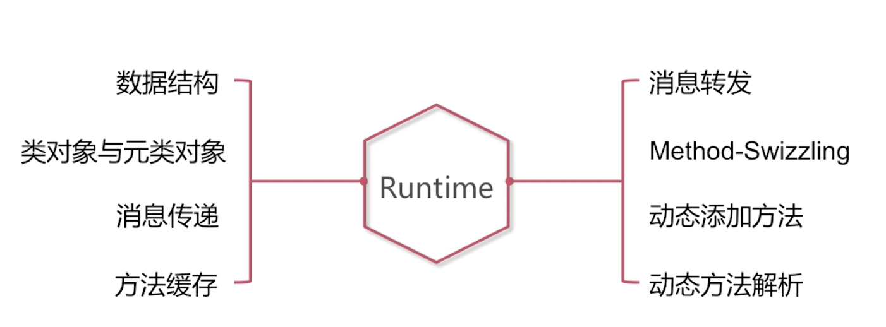

# 编译时语言和OC这种动态运行时语言的区别是什么?

# 消息传递和函数调用的区别是什么?

# 当我们调用一个没有实现的方法时, 系统是怎么为我实现消息转发过程的?

# objc_object

# objc_class

cache: 方法缓存, 我们在消息传递的过程中会使用到方法缓存.

bits: 一个类的变量属性,方法

# isa指针
共用体isa_t (C++共用体)
共用体是32或者64个0或者数字
指针型的isa, 非指针型的isa

- 指针型的isa: 64位的0或者1, 它的整体内容代表的是所指向的Class类型的内存地址.
比如说我使用objc_object对象的时候, 可以通过isa的内容获得他的类对象的地址.

- 非指针型isa:  isa的值的部分代表Class的地址
` 比如说64位的ARM架构,  可能对应的其中某44位,33位, 所代表的值意味着是clas的地址, 而并不是所有的64位都是Class的地址,  这样做的目的实际上是因为寻址过程当中, 有3,40位的位数就能保证我们能找到所有的Class的地址., 多出来的为可以存些其他的内容.`

# 问isa指针的含义?
有指针型的isa, 和非指针型的isa.

# isa指向

- 关于`对象`, 其指向类对象.
实例就是OC中的id类型, runtime中的话就是objc_object,  objc_object里面了有个isa指针, isa指针指向它的Class(也就是类对象.)

- 关于`类对象`,  其指向`元类对象`.
Class就代表objc_class, 而objc_class又继承objc_object,  所以我们可以说objc_class也是一种对象. 我们称之为类对象.
那

