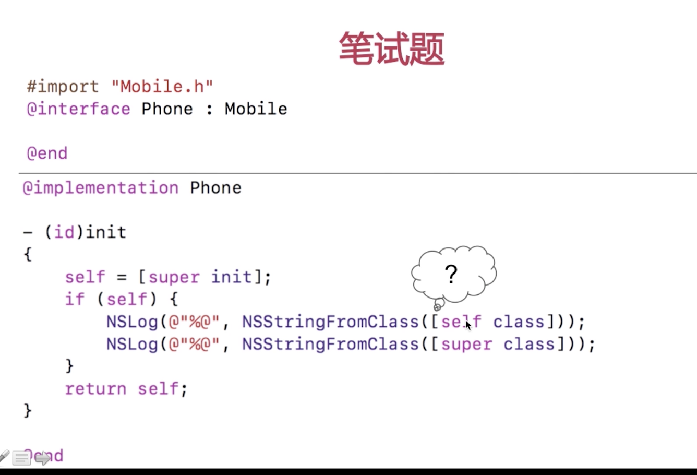
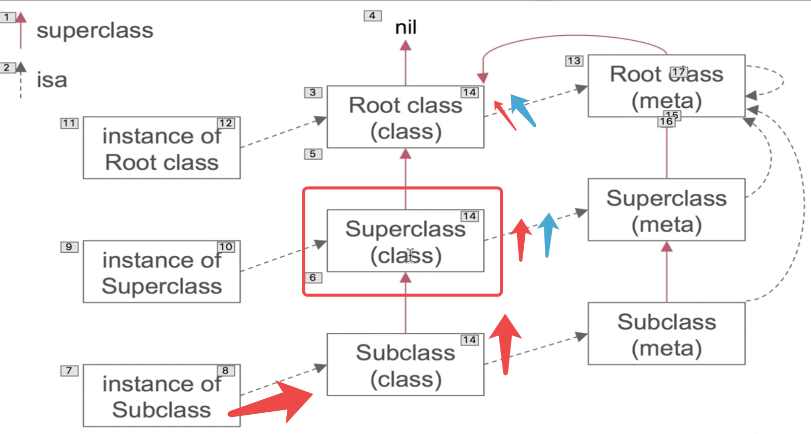

类对象和元类对象分别是什么?
类对象和元类对象的区别是什么?

# 对象, 类对象, 元类对象


- `类对象`存储实例方法列表等信息

- `元类对象`存储类方法列表等信息


根元类对象的superclass指针指向跟类对象, 这个指向决定了一个性质, 比如说我们调用了一个类方法, 类方法当然要冲元类对象中查找,逐级安装父类去查找, 然后在元类中找不到的时候就会找根类对象中同名的方法实例方法实现,

#  说我们调用的一个类方法,没有对应的实现,但是有同名的实例方法实现, 会不会发生崩溃?

不会! 因为根元类对象的superclass指针指向了根类对象, 当我们在元类对象中没有找到方法的情况下, 他就会顺着查找实例对象中的方法.找到同名方法就会进行实例方法的调用.


# 消息传递

/**
固定的要接收两个参数, id self,  SEL op(方法选择器名称), 然后后续才是我们方法传递参数. 
*/
## void objc_msgSend(void /* id self, SEL op,... */);

我们对于任何一个消息传递的书写如`[self class]`实际上通过编译器都会给我转换成 objc_msgSend(self, @selector(class) )的函数调用, 第一个参数就是消息传递的接收者self, 第二参数就是我们传递的消息名称或者说选择器, 实际上消息传递就是函数调用. 是发生在编译器层面的.





## void objc_msgSendSuper(void /* struct objc_super * super, SEL op, .... */)


```
/**

receiver 实际上就是当前对象
因为super关键字实际上是一个编译器关键字, 编译器编译后会解析成struct objc_super *指针, struct objc_super里面的receiver就是当前对象.  

所以上面那个题super是Mobile, 当前对象时Phone, 就能得到receiver是Phone, 我们虽然传递的是super的结构体, 但是消息的接收者任然是当前对象, 

所以不管是[self class], 还是[super class]当前消息的接收者都是self.

*/ 
struct objc_super
{

/// Specifies an instance of a class
__unsafe_unretained id receiver;

}


```

 

#  objc_msgSendSuper 和 objc_msgSend的区别?

我们在调用一个方法的时候, 消息传递的大致过程:
1. 我们调用方法的时候先会查找缓存, 看看缓存中是否有对应选择器名称的方法实践. 如果有的话我们就用函数指针调用函数,这就完成了一次消息传递.

2. 如果缓存没有命中的话, 我们就会根据当前实例的isa指针, 查找当前类对象的方法列表, 看看是否有同样名称的方法, 如果有就用函数指针调用函数

3. 如果当前类对象中没有同名的方法, 就逐级查找父类中的方法列表, 某一级父类中找到了方法就调用, 一直查到跟类都找不到就要进入`消息转发流程`然后结束消息传递过程.


`然后上面那道题, self就是沿着红色箭头一直往上找的, 而super则是沿着蓝色箭头往上找的.objc_msgSendSuper就是说从父类开始找,跨越当前对象.`





#  消息传递机制?

- 一般答: 首先查缓存,然后查当前类方法列表, 再就是逐级查父类的方法列表.都没命中就转到消息转发流程.


详见下面....


# 缓存查找