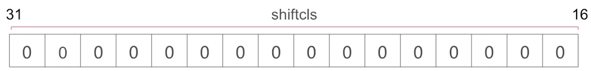
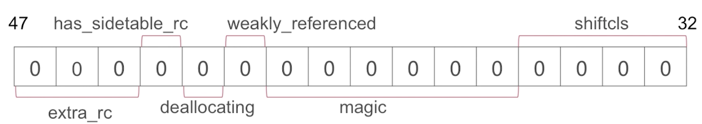

 # 内存管理方案
` 这里关于内存管理的讨论全部基于objc-runtime-680 `
# iOS操作系统是怎样对内存进行管理的?

针对不同场景会有不同的管理方案. 

## 场景:

- 1.TaggedPointer: 对于一些小对象,比如说NSNumber等, 对于这些小对象采用的就是TaggedPointer这种管理方案

- 2. NONPOINTER_ISA: 对于64架构下的应用程序采用的是`NONPOINTER_ISA`
  - 实际在64位架构下 ISA这个指针是占64个比特位的. 但是实际上有32位或者说40位就够用了.剩余的一些比特位是浪费的.苹果为了提搞内存的利用率, 在ISA当中剩余的这些比特位存储了关于内存管理方面数据内容. 所以这个叫做`非指针型的ISA `

- 3. 散列表: 复杂的数据结构,这里面包括了 `引用计数表` 和 ` 弱引用表`

 
# 非指针型的isa NONPOINTER_ISA 内存管理方案

在arm64架构下, isa指针一共有64个比特位, 我们来看看这64个比特位都存了那些内容

# 首先来看0~15位

- 第一位indexed
  - 图中第一位是一个叫indexed的标志位,  如果是0就表示这个isa指针是一个存的isa指针, 就是说这个isa指针就是当前对象的类对象的地址

  - 如果是1的话就表示这个isa指针存的内 容不仅仅是类对象的地址,  他里面还有一些关于内存管理方面的数据, 

- 第二位has_accoc(是否有关联对象)
 - 0就代表没有, 1就代表有

- 第三位has_cxx_dtor (这个函数或者这个变量标志表示的是当前对象是否有使用到c++相关的一些代码,或者c++语言方面的一些内容)
  - 在ARC当中, 实际上也可以通过这个标志位来表示有些对象是通过ARC来进行内存管理 的

- shiftcls剩下的13位就是当前对象的类对象的指针地址

# 16~31位也是当前对象的类对象的指针地址

# 32~47

### 32~35位也是当前对象的类对象的指针地址
### 36~41 magic不做深入探讨

### 42: weakly_referenced:弱引用, 标识了这个对象是否有相应的一个弱引用指针

### 43deallocating: 标识当前对象是否正在进行dealloc操作, 

### 44has_sidetable_rc:  指当前这个isa指针当中, 如果所存储的引用计数达到了上线的话, 那么需要外挂一个`sidetable`, 这样一个数据结构, 去存储相关的引用计数内容,就是后面要说的散列表.

### 45~47extra_rc: 额外的引用计数, 当我们引用计数在一个很小的值得范围之内呢,就会存到isa指针当中, 而不是有一个单独的引用计数表去存.

# 48~63 也都是extra_rc 

# 散列表方式

散列表方式在源码中是通过, `SideTables()`结构实现的. 

在SideTables()下面, 挂了很多`sideTable`这么样一个数据结构.这些数据结构在不同的架构上面是不同个数的. 在非嵌入式系统当中,`sideTable` 这种表一共有64个. 要说明一下的是`SideTables()`这个表示哈希表,  我们可以通过一个对象指针来具体找到他对应的引用计数表或者说弱引用表. 在哪一张`sideTable`当中. 

### sideTable结构

# 问: 为什么不是一个SideTable?
为什么不是一个SideTable, 而是多个SideTable组成一个SideTables()这样一个数据结构了?

说: 假如只有一张SideTable,  相当于我们在内存当中,分配的所有对象的引用计数或者是弱引用存储, 放到一张大表当中, 这个时候如果说我们要操作某一个对象的引用计数值,进行修改, 进行加一或者减一的操作的话, 由于所有的这个对象可能是在不同的线程中分配创建的,  包括调用他们的release, retain

