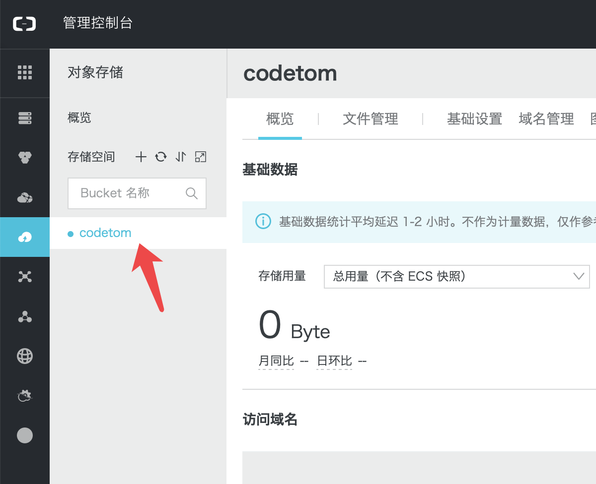

# 配置参数

## 1.  bucketName, 问后台要, 如图


## 2. objectKey, 这个坑点就是upload前面不能有/

**正确**
```
put.objectKey = @"upload/2018/12/25/314/test12345.jpg";


```

**错误**
```
put.objectKey = @"/upload/2018/12/25/314/test12345.jpg";


```


```objc


+ (void)uploadTest
{
    
    VSAPIRequestOSSGetOssInfo * request = [[VSAPIRequestOSSGetOssInfo alloc] init];
    request.userId = [self userIdStr];
    
    [VSHTTPRequest ossGetOssInfoParameter:request
                      successRequestBlock:^(VSAPIResponseOSSGetOssInfo *response) {
                          
                          
                          
                          [self updateImage];
                          
                          
                      } failRequestBlock:^(NVAPICommonResultResponse *responseErr, NSError *error) {
                          
                      }];
}


+ (void)updateImage
{
    
    [self inItOSS];
    [self uploadObjectAsync];
}


+ (void)inItOSS
{
    // 打开调试log
    [OSSLog enableLog];
    
    VSAPIResponseOSSGetOssInfoData * ossInfo = [VS_SDK shared].ossInfo;
    
    id<OSSCredentialProvider> credential = [[OSSStsTokenCredentialProvider alloc] initWithAccessKeyId:ossInfo.accessKeyId secretKeyId:ossInfo.accessKeySecret securityToken:ossInfo.securityToken];
    
    
    OSSClientConfiguration * conf = [OSSClientConfiguration new];
    conf.maxRetryCount = 2;
    conf.timeoutIntervalForRequest = 30;
    conf.timeoutIntervalForResource = 24 * 60 * 60;
    
    client = [[OSSClient alloc] initWithEndpoint:endPoint credentialProvider:credential clientConfiguration:conf];
}

+ (void)uploadObjectAsync {
    OSSPutObjectRequest * put = [OSSPutObjectRequest new];
    
    //    UIImage * image = [UIImage imageNamed:@"sss"];
    //    NSData *data1=UIImageJPEGRepresentation(image, 1);
    
    NSData * data1 = UIImageJPEGRepresentation([UIImage imageNamed:@"login_userIcon"], 1.0) ;
    // required fields
    put.bucketName = @"bucketName";
    //    put.objectKey = @"file1m";
    put.objectKey = @"upload/2018/12/25/314/test12345.jpg";
    put.uploadingData = data1;
    put.contentType=@"image/jpeg";
    //    NSString * docDir = [self getDocumentDirectory];
    //    put.uploadingFileURL = [NSURL fileURLWithPath:[docDir stringByAppendingPathComponent:@"file1m"]];
    
    // optional fields
    put.uploadProgress = ^(int64_t bytesSent, int64_t totalByteSent, int64_t totalBytesExpectedToSend) {
        NSLog(@"%lld, %lld, %lld", bytesSent, totalByteSent, totalBytesExpectedToSend);
    };
    //    put.contentType = @"";
    //    put.contentMd5 = @"";
    //    put.contentEncoding = @"";
    //    put.contentDisposition = @"";
    
    OSSTask * putTask = [client putObject:put];
    
    [putTask continueWithBlock:^id(OSSTask *task) {
        NSLog(@"objectKey: %@", put.objectKey);
        if (!task.error) {
            NSLog(@"upload object success!");
        } else {
            NSLog(@"upload object failed, error: %@" , task.error);
        }
        return nil;
    }];
}


```


