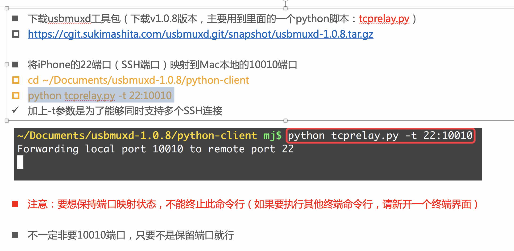

[https://cgit.sukimashita.com/usbmuxd.git/snapshot/usbmuxd-1.0.8.tar.gz](https://cgit.sukimashita.com/usbmuxd.git/snapshot/usbmuxd-1.0.8.tar.gz)


tcprelay.py

```

python tcprelay.py -t  22:10010


ssh root@localhost -p 10010


```





```shell


scp -P 10010 ./MRCode2.m root@localhost:~/WuST


```


