# 响应者链条

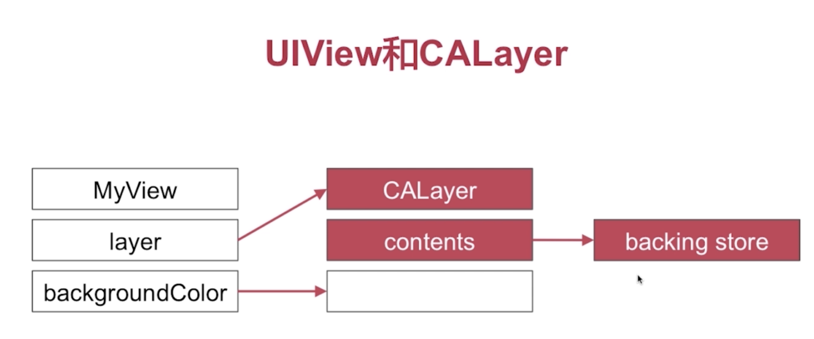

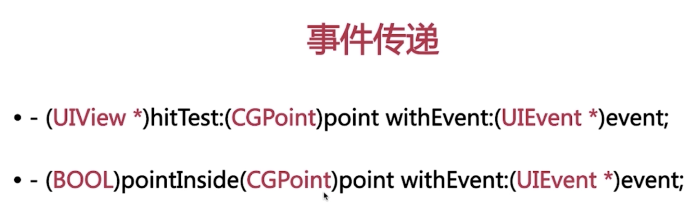
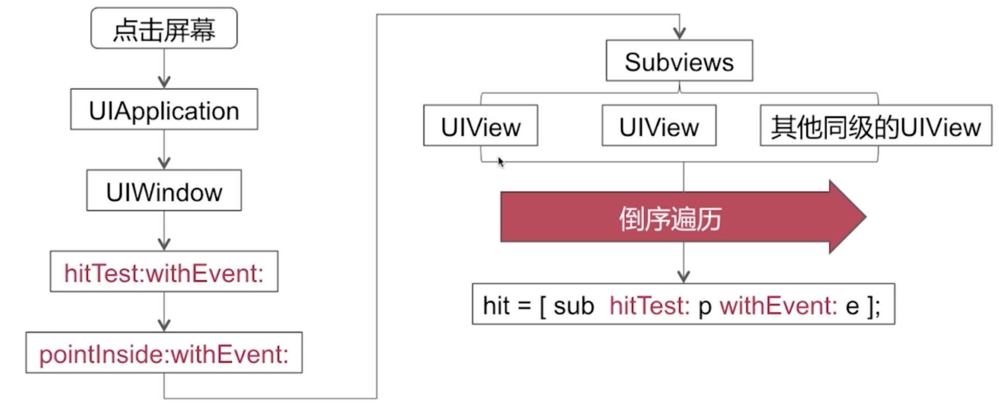
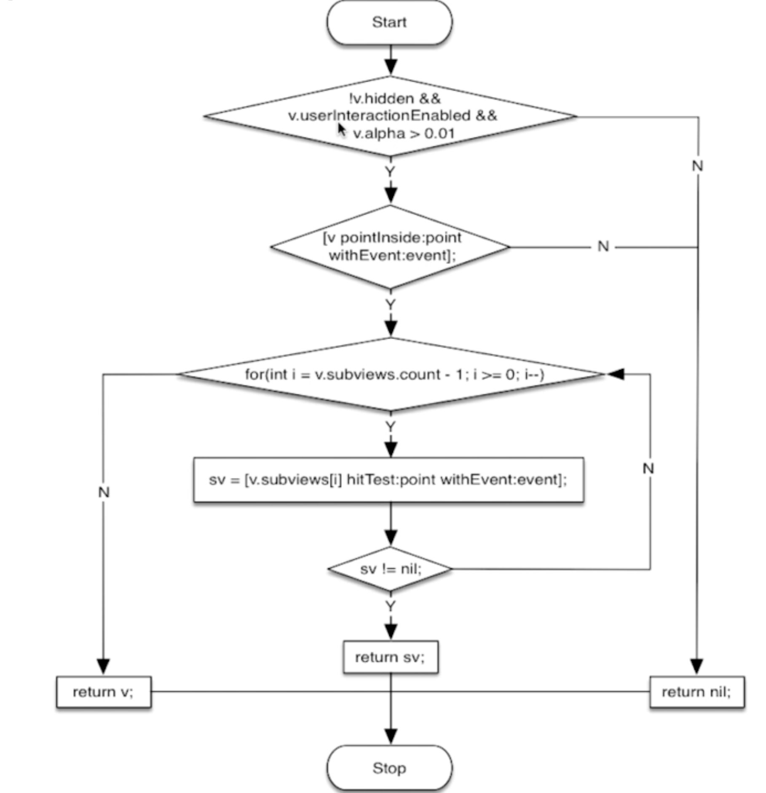
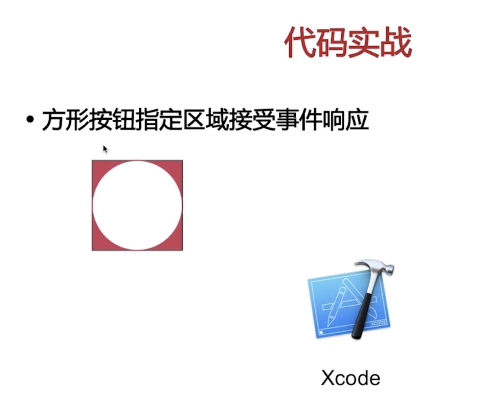
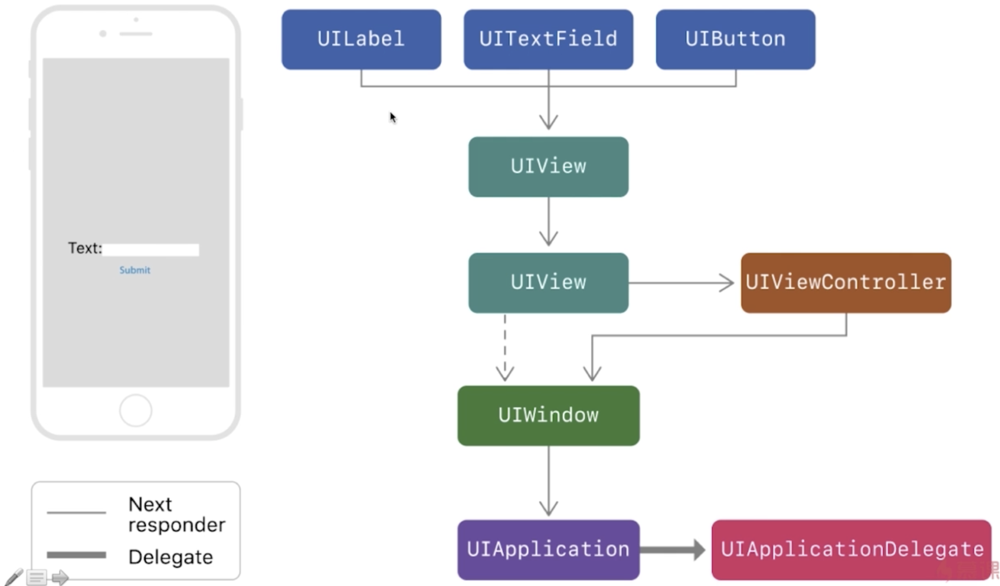
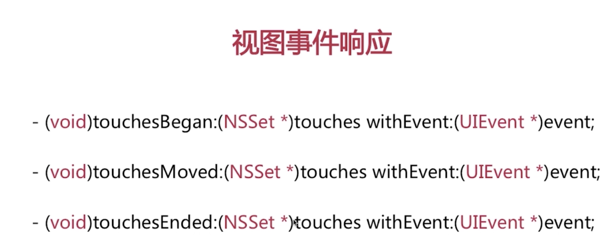

# UI图像显示原理

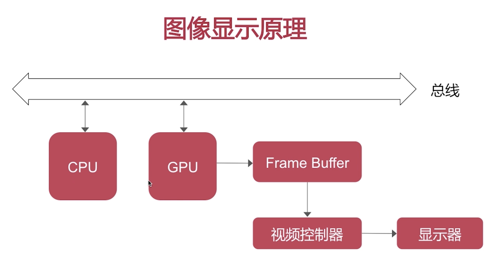
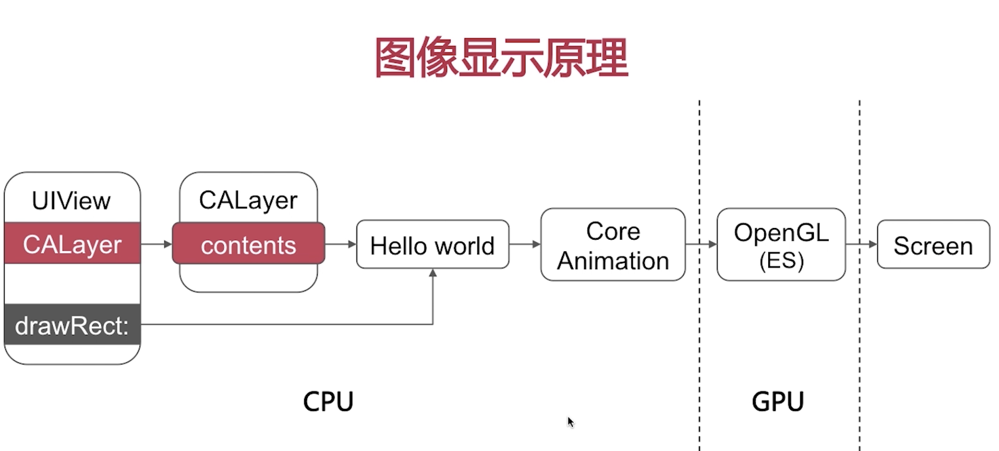
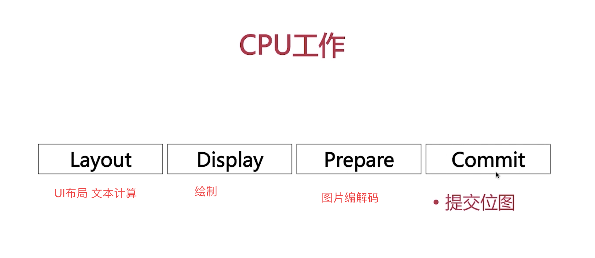
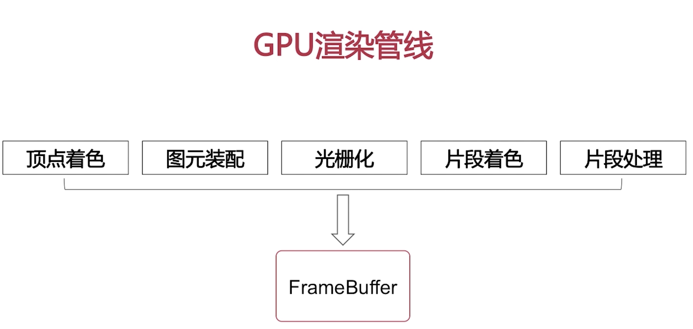

# UI卡顿掉帧的原因

VSync 垂直信号
页面滑动的流畅性是60fps, 每一秒中有60帧的画面更新.所以一帧画面就是16.7ms.
每一帧画面又是由CPU, GPU共同完成的. 他俩要在16.7ms时间内绘制好图片显示. 如果CPU占用的时间太长留给GPU的时间不太够了就会出现卡顿掉帧.

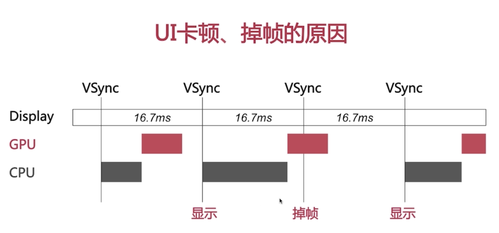
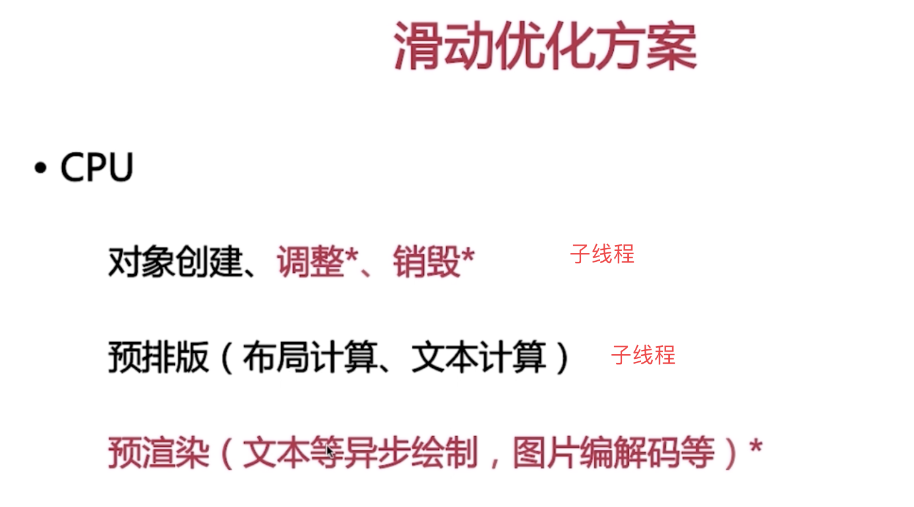

# UI绘制原理  & 异步绘制

[UIView setNeedsDisplay] 方法调用后并没有马上进行绘制工作,而是后面某个时间进行的
当前将要结束的时候调用[CALayer display]

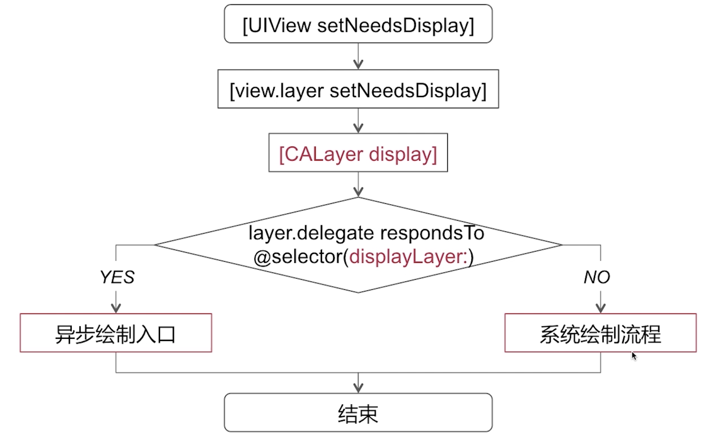

### 系统绘制流程
backing store 就是位图

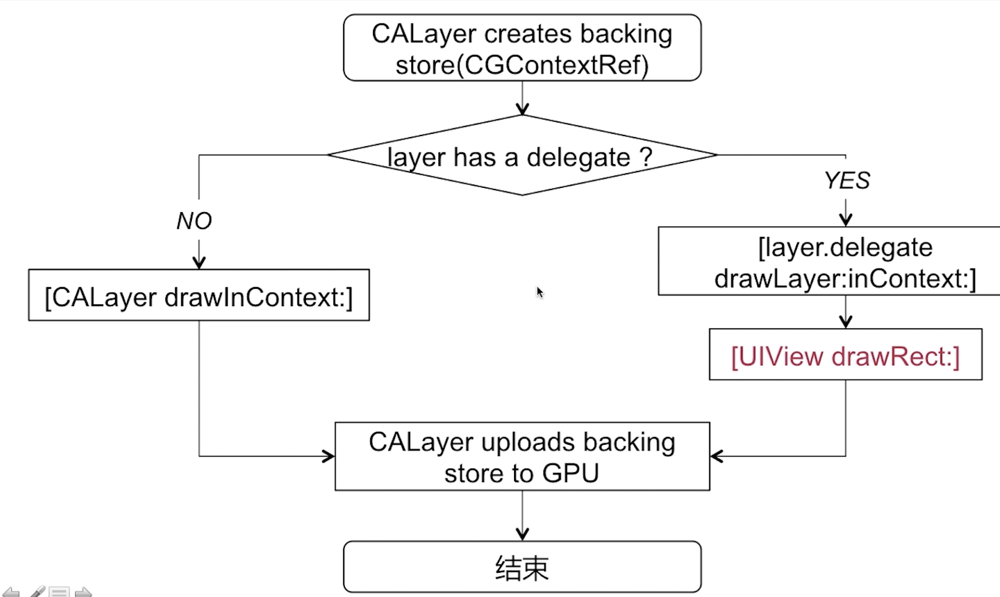

### 异步绘制

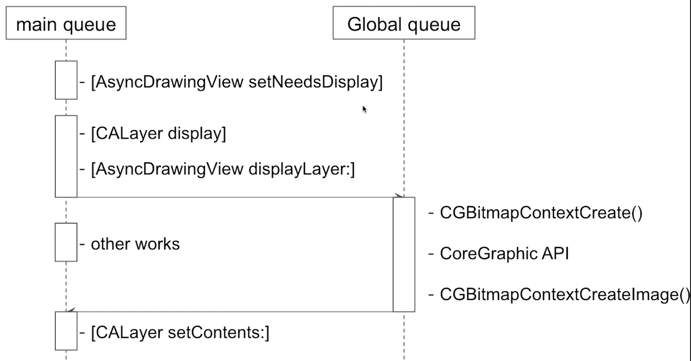

# 离屏渲染
什么是离屏渲染,你对离屏渲染是怎么理解的了?

当我们指定了UI视图的某些属性, 标记为他在未合成之前, 不能用于当前屏幕上面直接显示的时候, 就会触发离屏渲染. 而离屏渲染的概念起源于GPU层面, 指的是GPU在当前屏幕缓冲区以外新开辟一个缓冲区进行渲染操作.
典型的就是我们设置视图的圆角属性.一些朦层,遮罩.

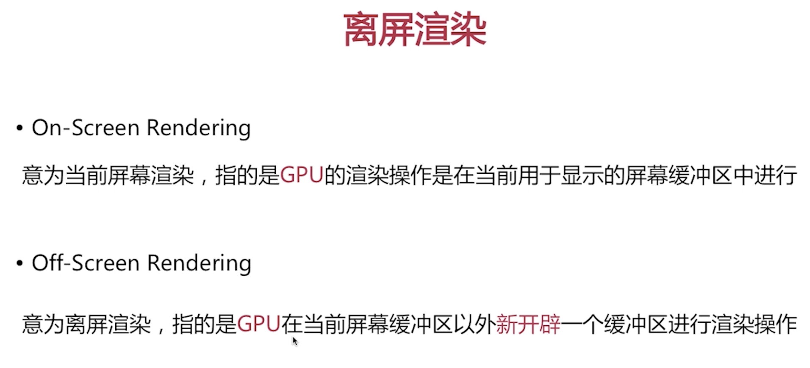

何时触发?

###为什么要避免离屏渲染?
离屏渲染触发了opengl的多通道渲染管线,造成了额外的开销.所以我们要避免.
触发离屏渲染的时候会增加GPU的工作量. 会造成GPU+CPU绘制一帧画面的时间超过16.7毫秒. 就会导致UI的卡顿和掉帧

离屏渲染会创建新的渲染缓冲区增加内存开销.
上下文的切换

# 使UITableView滚动更流畅的方案或思路有哪些?
CPU和GPU两方面
CPU:在子线程上面进行对象的创建调整和销毁.预排版图片的解码采用异步绘制方案.