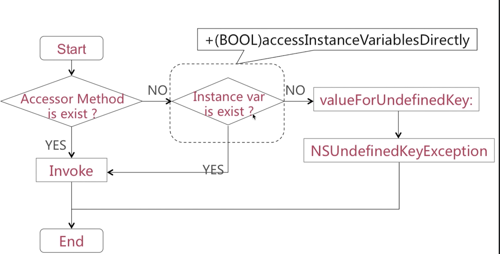
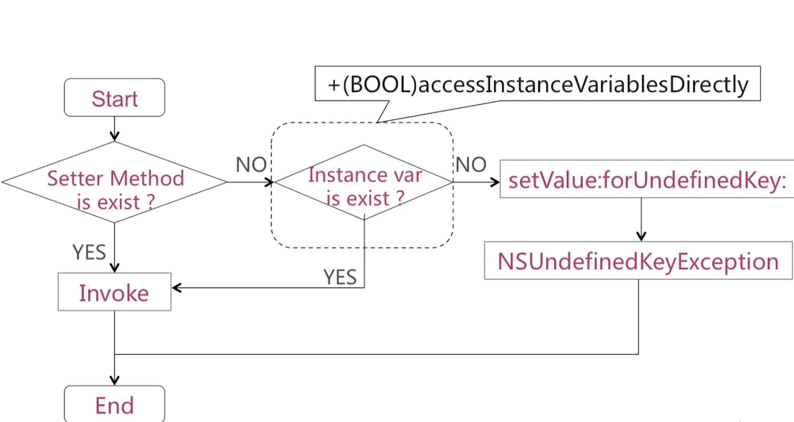

# 1. 请简述分类实现原理?
分类的实现原理是运行时来决议的.不同分类当中含有同名方法,谁最终生效取决于谁最后编译.最后参与编译的那个分类的同名方法会最终生效.分类中的方法恰好是属主类中的某一个方法,分类方法会"覆盖"宿主类的方法,


# 2. KVO的实现原理是怎样的?

KVO是系统关于观察者模式的一种实现,  KVO运用了isa混写技术, 来动态运行时去为某一个类添加一个子类,子类中重写setter方法.将原有类中的isa指针指向新的子类.


# 3. 能否为分类添加成员变量?
可以用关联对象技术来为一个分类添加成员变量.


# 说说关联对象技术, 用关联对象技术,实现为分类添加"成员变量", 成员变量被添加到哪了了?

```

objc_getAssociatedObject
objc_setAssociatedObject


```
关联对象由AssociationsManager管理并在AssociationsHashMap 中存储, 所有对象的关联内容都在`同一个全局容器中`.


联对象的释放时机与被移除的时机并不总是一致的

### 一个对象的所有关联对象是在这个对象被释放时调用的 `_object_remove_assocations` 函数中被移除的。


# 4. 通过kvc设置Value, KVO能否生效?
通过kvc的方式可以生效.
为什么通过kvc设置可以生效了?
因为通过kvc设置值最终会调用setter方法...

## 5. 通过成员变量直接赋值value, KVO能否生效?
不能生效. 如果想让其生效, 就手动KVO

```

 [self  willChangeValueForKey:@""];

 _value = newValue;

 [self  didChangeValueForKey:@""];


```


# 6.  ValueForKey的实现流程



我们使用ValueForKey, 第一步系统回去看是否有对应 的get方法?有的话直接调用然后拿值.  没有get方法,就看实例变量是否存在,如果存在看看+ (BOOL)accessInstanceVariablesDirectly (是否允许直接访问实例变量)是否是yes, 如果是yes就能返回值, 如果不是就报错.


# 7. setValue:forKey:的实现流程


我们使用setValue:forKey:, 第一步就是看看有没有set方法, 没有的话看看有没有实例变量, 看看你能不能直接访问实例变量, .....


# 8.
# assign 和weak的区别有哪些?

## assign
- 修饰基本数据类型,  如int, BOOL等. 
- 修饰对象类型时, 不改变其引用计数
- 会产生悬垂指针

```

悬垂指针, assign所修饰的对象被释放之后, assign指针任然指向原对象内存地址, 这是我们通过assign指针继续访问原对象的话就会出现异常.

```

## weak

- 不改变被修饰对象的引用计数.
- 所指对象在被释放之后会自动置为nil.

# weak修饰的对象为什么会在被释放之后会自动置为nil?
