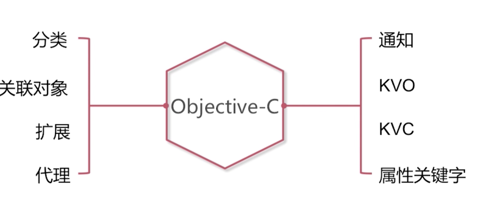
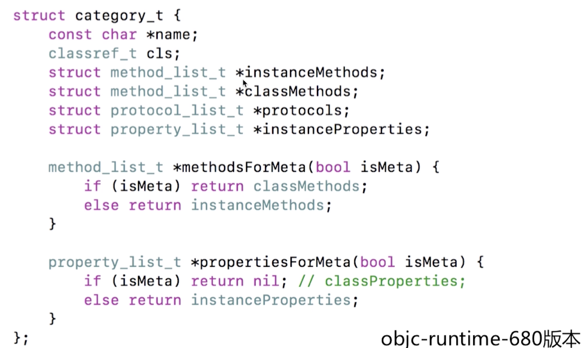
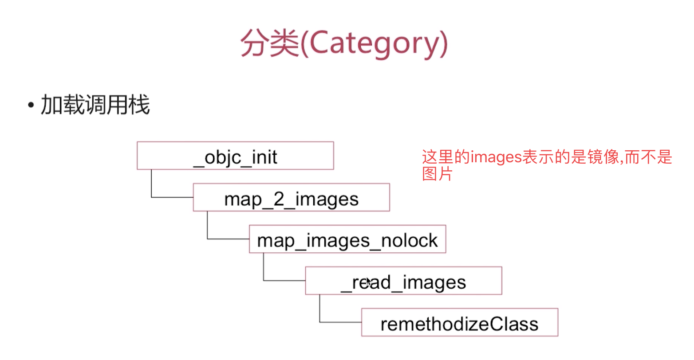
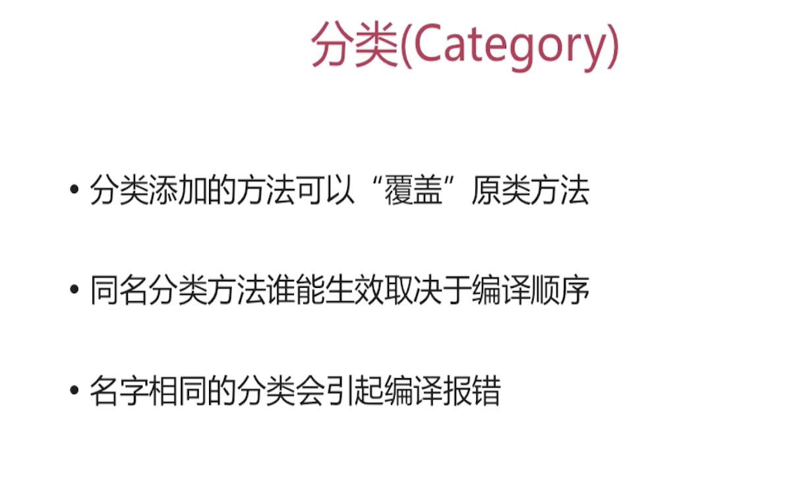
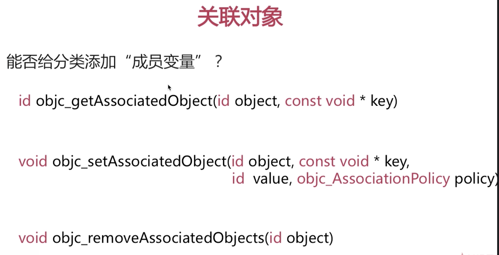
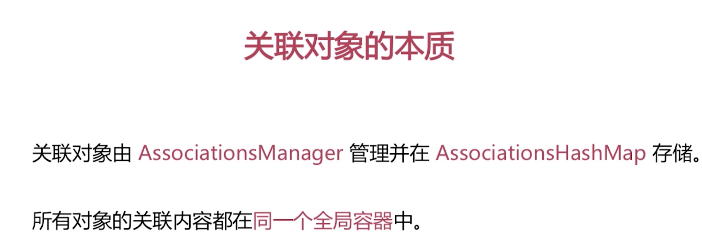
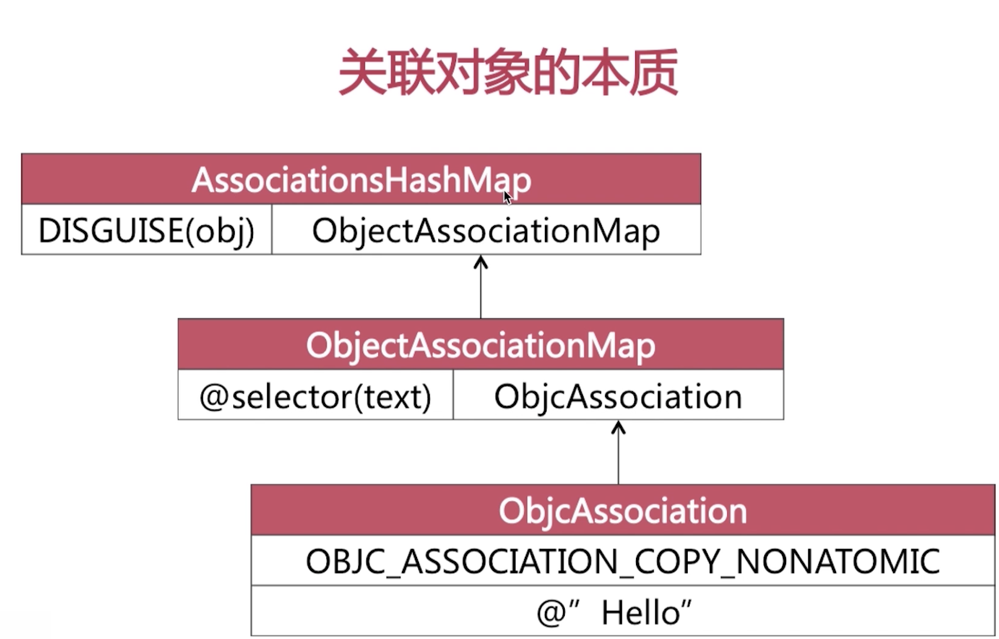
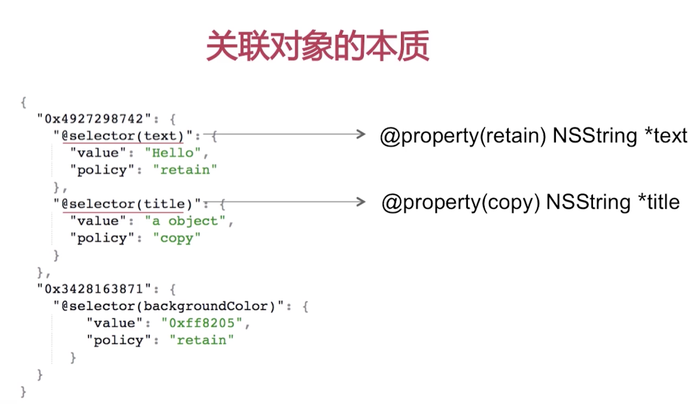

OC语言的技术特性


1.什么是分类, 分类的实现机制和原理是怎样的?
2.能否为分类添加实例变量(关联对象)
3.分类和扩展的区别
4. 代理
5.通知的实现机制和原理
6. KVO的实现机制
7.KVC的实现原理?
8. 属性关键字





# 分类(Category)



问: 你用分类都做了哪些事情?

- 声明私有方法
- 分解体积庞大的类文件
- 把Framework的私有方法公开

# 分类的特点

- 运行时决议
- 可以为系统类添加分类

# 分类中都可以添加哪些内容?

- 实例方法
- 类方法
- 协议
- 属性 (只是GET/SET)


# 有很多分类每个分类里面都有一个相同方法, 最后是哪个方法生效?

最后编译的那个分类生效





# 关联对象
我们用关联对象技术,实现为分类添加"成员变量", 成员变量被添加到哪了了?










# 补充


```

#import <Foundation/Foundation.h>

@interface NSString (AssociatedTest)

@property (nonatomic, strong) NSNumber * testCounnt;

@end


// ========
#import "NSString+AssociatedTest.h"

#import <objc/runtime.h>

@implementation NSString (AssociatedTest)

- (void)setTestCounnt:(NSNumber *)testCounnt

{

  objc_setAssociatedObject(self, @selector(testCounnt), testCounnt, OBJC_ASSOCIATION_RETAIN_NONATOMIC);

}

- (NSNumber *)testCounnt

{

  return  objc_getAssociatedObject(self, @selector(testCounnt));

}

@end


```


```

// objc_getAssociatedObject(<#id _Nonnull object#>, <#const void * _Nonnull key#>)

// objc_setAssociatedObject(<#id _Nonnull object#>, <#const void * _Nonnull key#>, <#id _Nullable value#>, <#objc_AssociationPolicy policy#>)

// objc_removeAssociatedObjects(<#id _Nonnull object#>)


```


### key 值

关于前两个函数中的 `key` 值是我们需要重点关注的一个点，这个 `key` 值必须保证是一个对象级别（为什么是对象级别？看完下面的章节你就会明白了）的唯一常量。一般来说，有以下三种推荐的 `key` 值：

1.  声明 `static char kAssociatedObjectKey;` ，使用 `&kAssociatedObjectKey` 作为 `key` 值;
2.  声明 `static void *kAssociatedObjectKey = &kAssociatedObjectKey;` ，使用 `kAssociatedObjectKey` 作为 `key` 值；
3.  用 `selector` ，使用 `getter` 方法的名称作为 `key` 值。

我个人最喜欢的（没有之一）是第 `3` 种方式，因为它省掉了一个变量名，非常优雅地解决了计算科学中的两大世界难题之一（命名）。

### 关联策略

在给一个对象添加关联对象时有五种关联策略可供选择：

| 关联策略 | 等价属性 | 说明 |
| OBJC_ASSOCIATION_ASSIGN | @property (assign) or @property (unsafe_unretained) | 弱引用关联对象 |
| OBJC_ASSOCIATION_RETAIN_NONATOMIC | @property (strong, nonatomic) | 强引用关联对象，且为非原子操作 |
| OBJC_ASSOCIATION_COPY_NONATOMIC | @property (copy, nonatomic) | 复制关联对象，且为非原子操作 |
| OBJC_ASSOCIATION_RETAIN | @property (strong, atomic) | 强引用关联对象，且为原子操作 |
| OBJC_ASSOCIATION_COPY | @property (copy, atomic) | 复制关联对象，且为原子操作 |

其中，第 `2` 种与第 `4` 种、第 `3` 种与第 `5` 种关联策略的唯一差别就在于操作是否具有原子性。由于操作的原子性不在本文的讨论范围内，所以下面的实验和讨论就以前三种以例进行展开。
