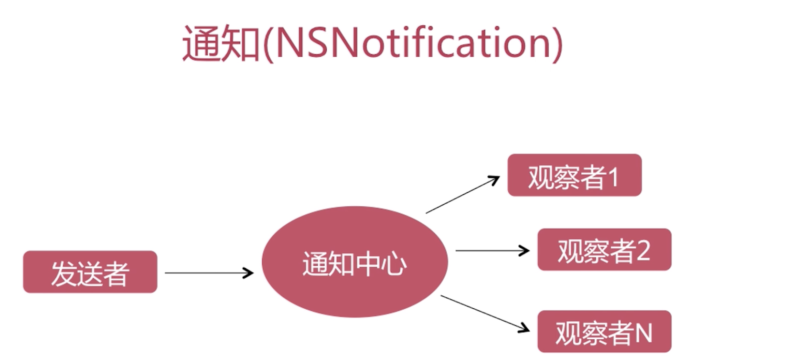
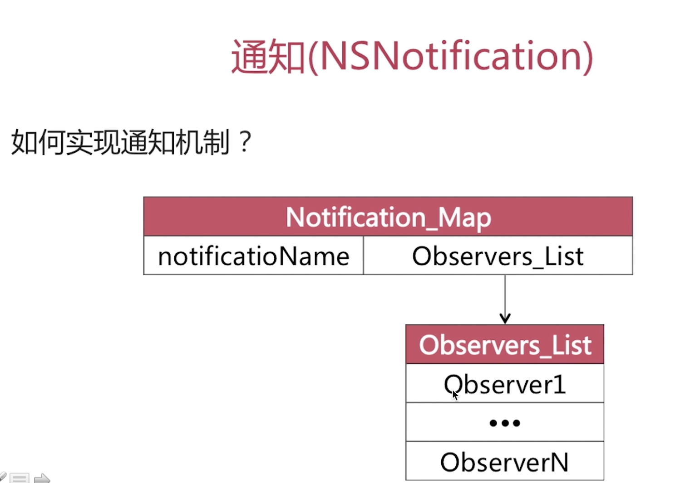

数据层, 网络层, 业务逻辑层,UI层
一般都是网络层==>数据层==>业务逻辑层==>UI层

有时候可能会涉及到直接网络层==>UI层, 就有了所谓的跨层传递

# 通知和代理的区别?
代理是用代理模式实现的, 而通知是观察者模式实现的.
代理传递是一对一, 通知是一对多.

# 通知的实现机制?

在通知中心中可能会维护一个Map表, 或者一个字典,然后这个字典中的key是notificationName, value就是Observe_List, 同一个notificationName可能添加多个Observe, 所以是Observe_List, 然后这个列表中的每一个成员首先要包含这个通知接收的一个观察者其次包含这个观察者调用的方法.