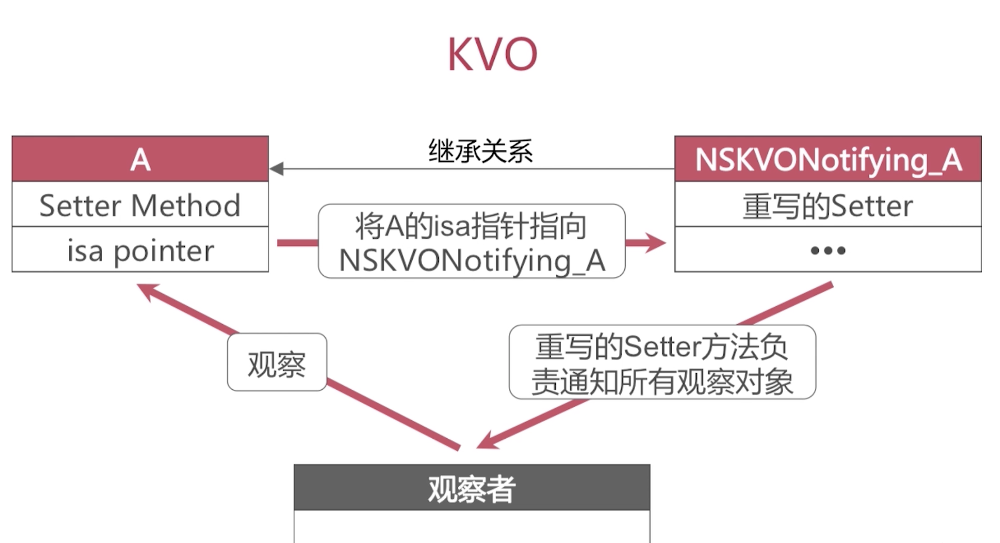
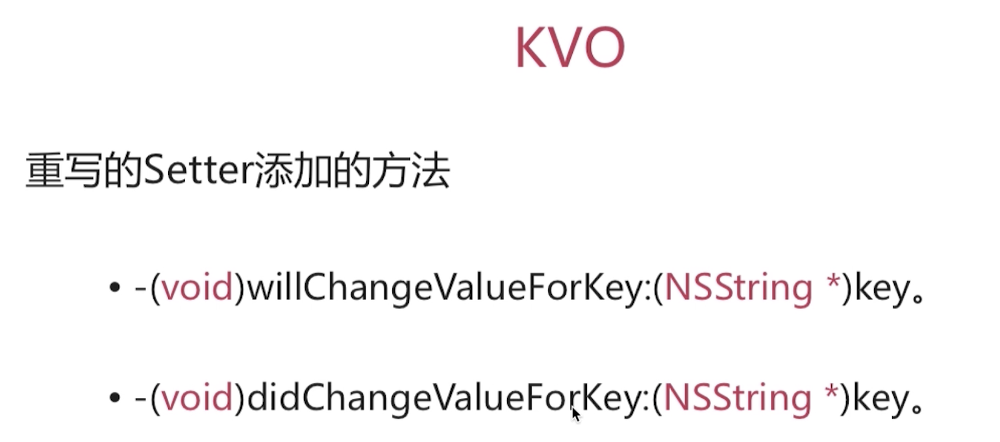
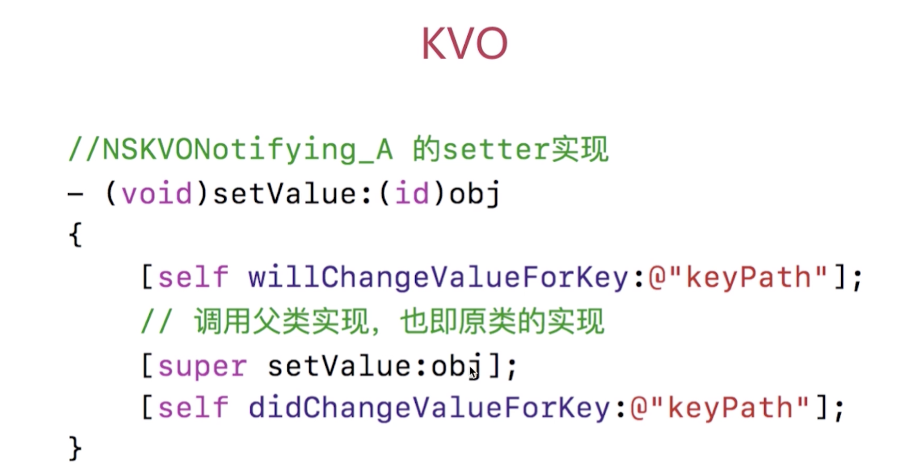

# 什么是KVO?

KVO全称是Key-value observing
KVO是OC对观察者设计模式的又一实现.
苹果使用了isa混写(isa-swizzling)技术来实现KVO.

# isa-swizzling技术在iOS中是如何实现的?


# KVO的实现机制?

当我们注册一个对象的观察者的时候,实际上是调用了系统的
```

- (void)addObserver:(NSObject *)observer forKeyPath:(NSString *)keyPath options:(NSKeyValueObservingOptions)options context:(nullable void *)context;

```
观察者观察A对象中的某一个属性,  当调用了addObserver:..方法后, 系统会在运行是为我们动态创建一个NSKVONotifying_A类, 这时会将A的isa指针指向NSKVONotifying_A类, 将isa指向修改实际上就是isa混写的一个标志,这个就是isa混写技术.NSKVONotifying_A实际上是原理A类的一个子类. NSKVONotifying_A重写setter方法,然后发生变化后就能通知所有观察者.


# 通过kvc设置Value, KVO能否生效?
通过kvc的方式可以生效.
为什么通过kvc设置可以生效了?
因为通过kvc设置值最终会调用setter方法...

## 通过成员变量直接赋值value, KVO能否生效?
不能生效. 如果想让其生效, 就手动KVO

```

 [self  willChangeValueForKey:@""];

 _value = newValue;

 [self  didChangeValueForKey:@""];


```




