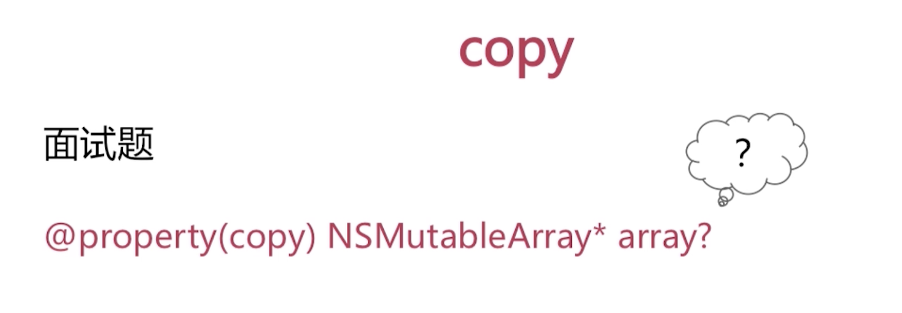
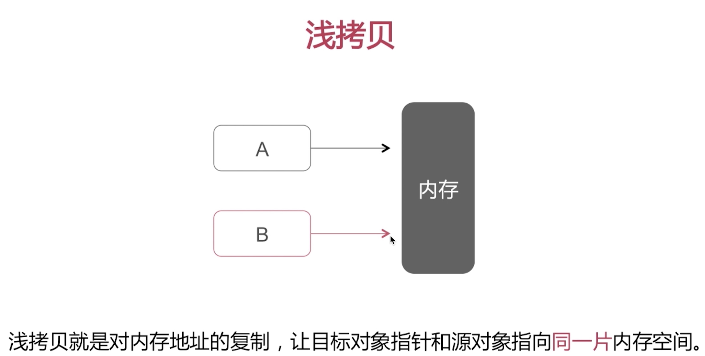
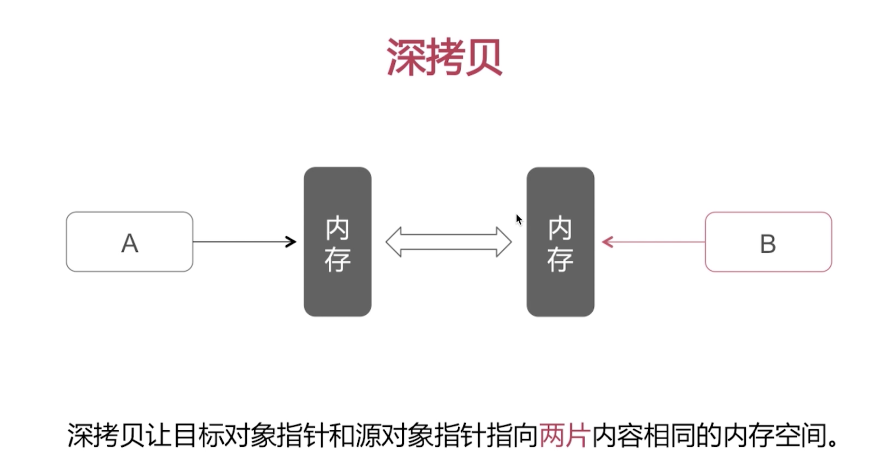
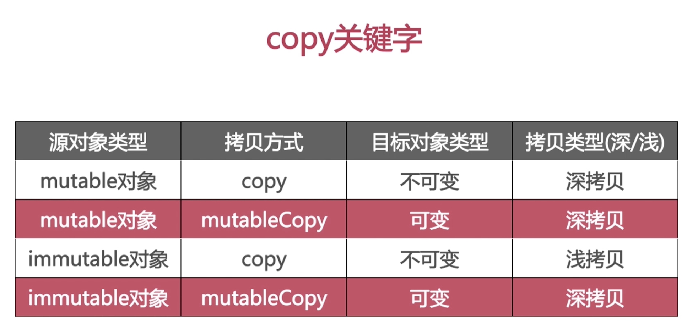
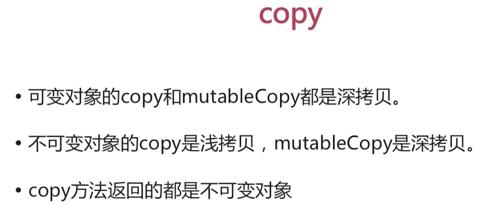
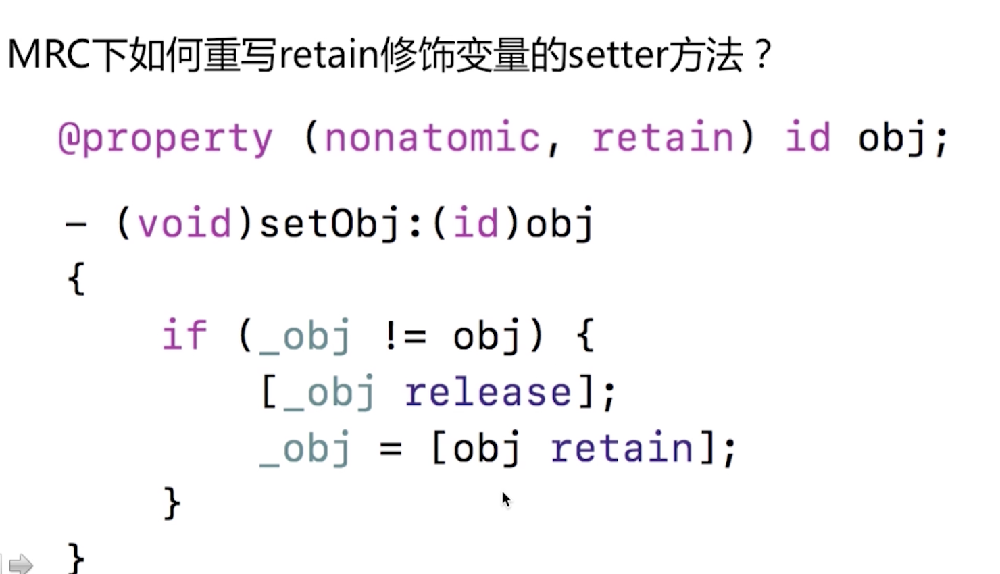

读写权限

原子性

引用计数


# 读写权限


# 原子性

atomic只是对属性的赋值和获取保证线程安全, 被atomic修饰的一个数组添加元素或者删除元素都不在atomic管辖的线程范围内.

# 引用计数

retain/strong
assign/unsafe_unretained // unsafe_unretained 在MRC中使用已经退出历史舞台了


# assign 和weak的区别有哪些?

## assign
- 修饰基本数据类型,  如int, BOOL等. 
- 修饰对象类型时, 不改变其引用计数
- 会产生悬垂指针

```

悬垂指针, assign所修饰的对象被释放之后, assign指针任然指向原对象内存地址, 这是我们通过assign指针继续访问原对象的话就会出现异常.

```

## weak

- 不改变被修饰对象的引用计数.
- 所指对象在被释放之后会自动置为nil.

weak修饰的对象为什么会在被释放之后会自动置为nil?


# copy


如图那样修饰会有啥问题?(考浅拷贝, 深拷贝)
浅拷贝只是指针拷贝,都指向了同一块内存空间. 增加了对象的引用计数, 没有发生新的内存分配.
深拷贝是内存拷贝, 新增加了一块内存, 不会增加对象的引用计数,有新内存分配.






```

 NSArray * addrKI = @[@"1", @"2"];

// NSLog(@"%@", addrKI);

 NSMutableArray * sfAdd = [addrKI mutableCopy];

 [sfAdd addObject:@"3"];

 NSLog(@"%@", sfAdd);

 NSLog(@"%@", addrKI);


```



```

#import <Foundation/Foundation.h>

@interface NVCopyObjTest : NSObject

@property (nonatomic, copy) NSMutableArray *addr;

@end


--------


#import <Foundation/Foundation.h>

#import "NVCopyObjTest.h"

int main(int argc, const char * argv[]) {

  NVCopyObjTest * obj = [[NVCopyObjTest  alloc] init];

  NSMutableArray * arr = [NSMutableArray  array];

 obj.addr = arr;

 [obj.addr addObject:@"1111"];

 NSLog(@"%@", obj.addr);

  return  0;

}


```
奔溃=========......


深浅拷贝小结:
- 是否开辟了新的内存空间
- 是否影响了引用计数


# MRC 下如何重写retain修饰变量的setter方法?



