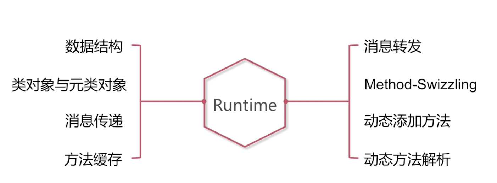
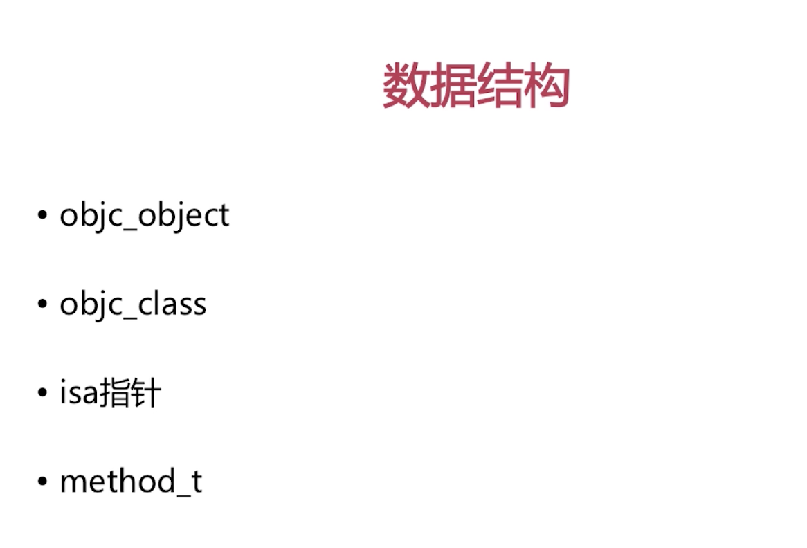
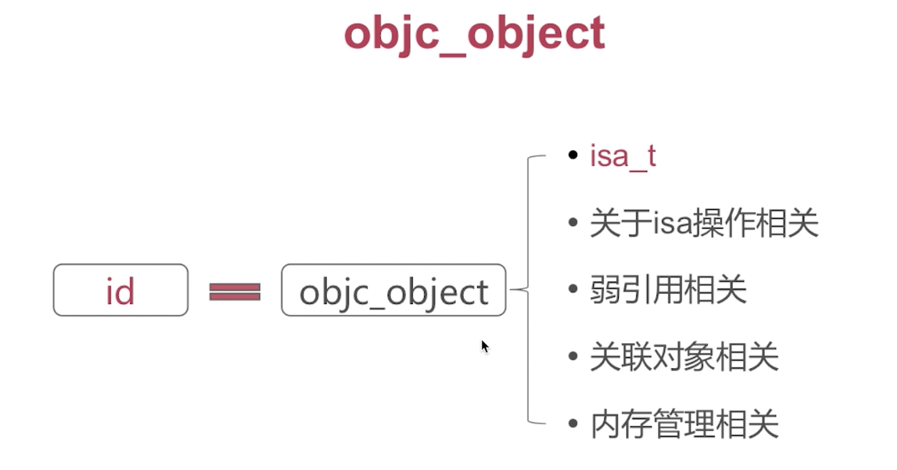
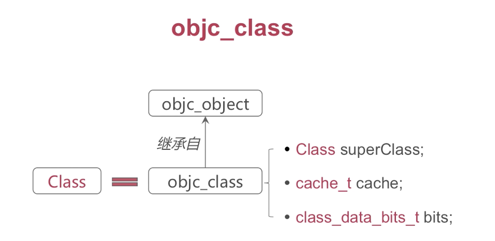
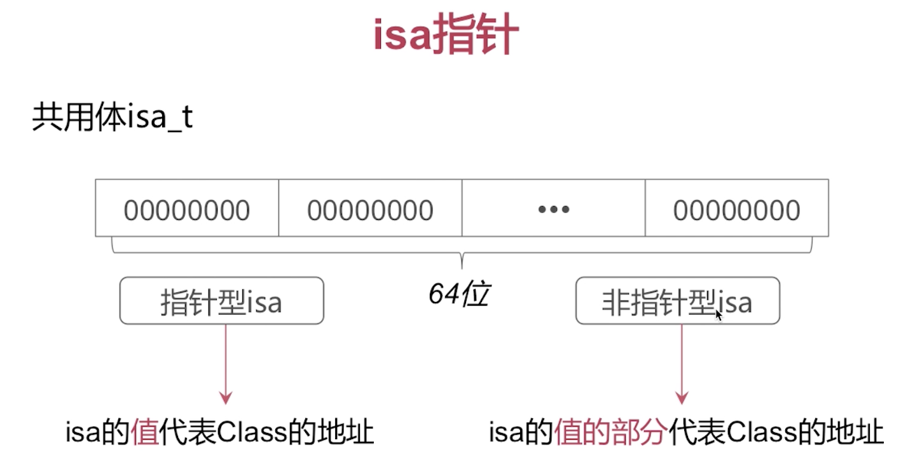
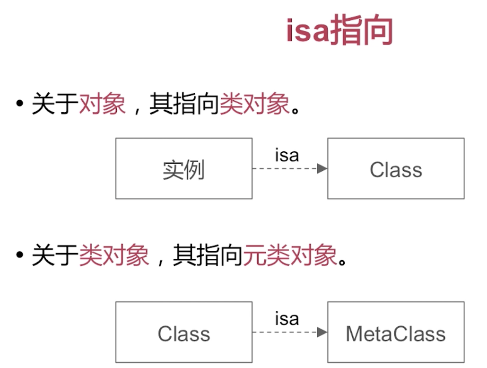
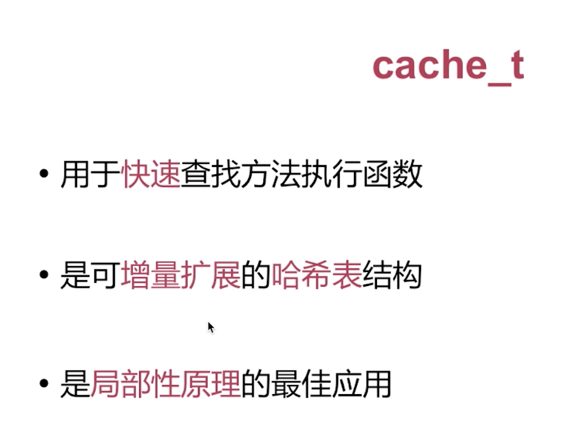
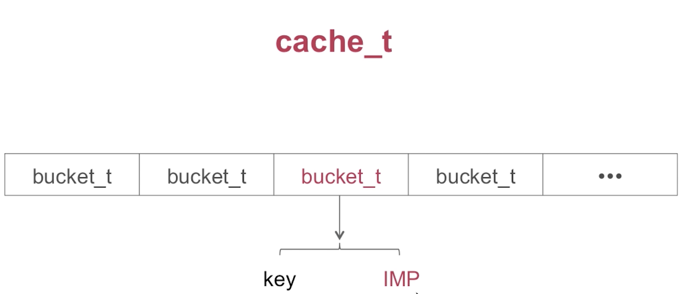
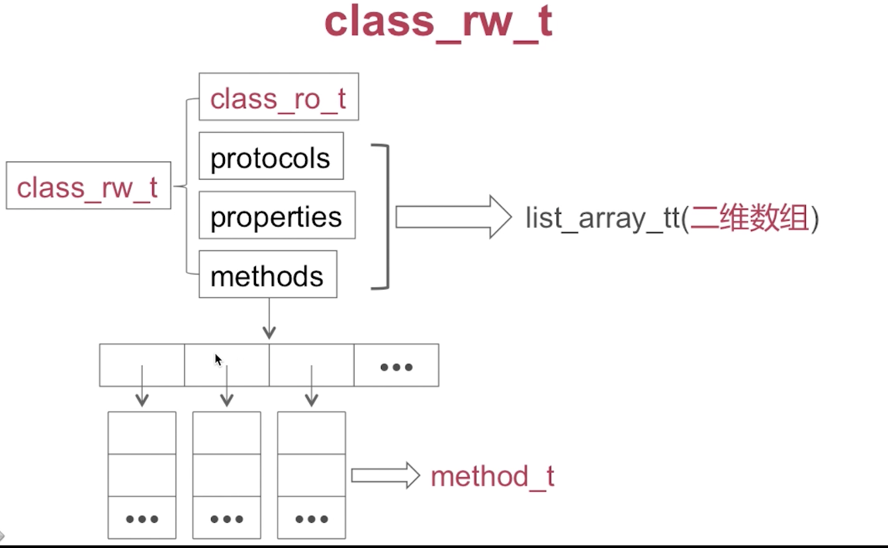
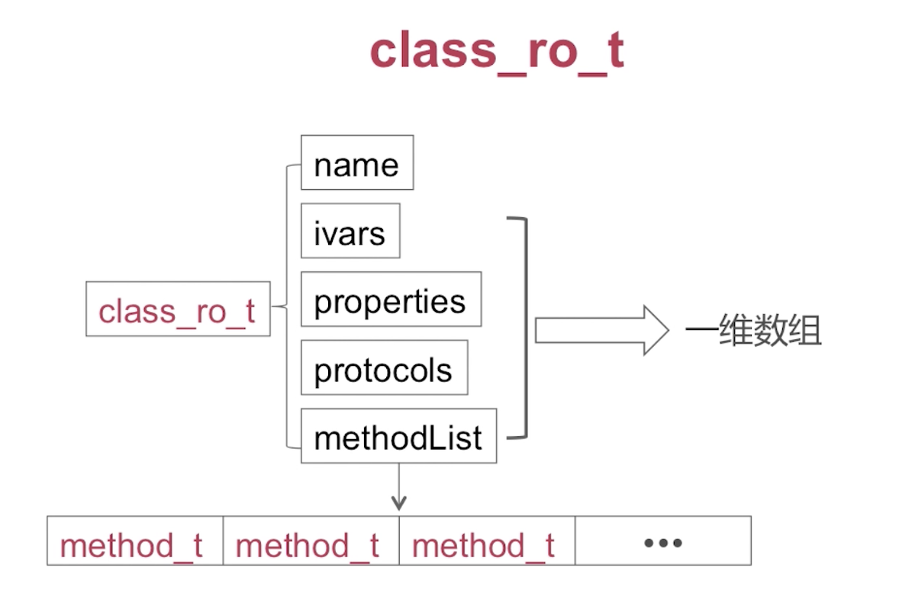

# 编译时语言和OC这种动态运行时语言的区别是什么?

# 消息传递和函数调用的区别是什么?

# 当我们调用一个没有实现的方法时, 系统是怎么为我实现消息转发过程的?

# objc_object

# objc_class

cache: 方法缓存, 我们在消息传递的过程中会使用到方法缓存.

bits: 一个类的变量属性,方法

# isa指针
共用体isa_t (C++共用体)
共用体是32或者64个0或者数字
指针型的isa, 非指针型的isa

- 指针型的isa: 64位的0或者1, 它的整体内容代表的是所指向的Class类型的内存地址.
比如说我使用objc_object对象的时候, 可以通过isa的内容获得他的类对象的地址.

- 非指针型isa:  isa的值的部分代表Class的地址
` 比如说64位的ARM架构,  可能对应的其中某44位,33位, 所代表的值意味着是clas的地址, 而并不是所有的64位都是Class的地址,  这样做的目的实际上是因为寻址过程当中, 有3,40位的位数就能保证我们能找到所有的Class的地址., 多出来的为可以存些其他的内容.`

# 问isa指针的含义?
有指针型的isa, 和非指针型的isa.

# isa指向

- 关于`对象`, 其指向类对象.
实例就是OC中的id类型, runtime中的话就是objc_object,  objc_object里面了有个isa指针, isa指针指向它的Class(也就是类对象.)

- 关于`类对象`,  其指向`元类对象`.
Class就代表objc_class, 而objc_class又继承objc_object,  所以我们可以说objc_class也是一种对象. 我们称之为类对象.
那objc_class 继承objc_object, 那他当中也有一个isa指针. 这个isa指针指向其元类对象.

  - 那么我们在进行方法调用的时候, 我们调用一个实例的实例方法, 实际上是通过isa指针去他的类对象当中, 进行方法查找, 
  - 如果我们调用的是类方法, 那就是通过类对象的isa指针, 去他的元类对象中去查找

# cache_t
- 它是用于`快速`查找方法执行函数的结构
  - 说我们在调用一个方法的时候, 如果有一个缓存, 我们就不用到他方法列表中去遍历查找了这个方法的具体实现.可以提高我们调用方法的速度(消息传递的速度).

- 是可`增量扩展`的`哈希表`结构
  - 当我的这个结构存储的量, 在增大的过程当中, 他也会增大扩展他的内存空间,支持更多的缓存.  用哈希表来实现主要是为了增加查找效率. 

- 是`局部性原理`的最佳应用
  - 局部性原理: 我们一般在调用方法的时候, 可能我们往往调用的就那么几个方法. 也就是那几个方法是调用频次最高的, 然后我们把调用频次最高的几个方法, 放到缓存中, 下次的命中率就更高一些. 

# cache_t 具体数据结构说明

可以理解为是一个数组实现的, 每一个元素就是一个bucket_t机构提.

bucket_t:
   - key: 相当于OC中`selector`, 我们在调用一个方法的时候它实际上是一个选择器SEL. 我们可以通过一个方法的名称来寻址一个方法的具体实践. 
   - IMP: 是一个无类型的函数指针. 具体函数实现

`比如说现在给你一个key,  我们可以同哈希查找算法, 来定位当前这个key所对应的bucket_t位于数组中的哪一个位置, 然年通过提取bucket_t中的具体函数实现IMP来调用这个函数.`

# class_data_bits_t

这是objc_class中的成员结构

- class_data_bits_t主要是对class_rw_t的封装

- class_rw_t 代表了类相关的读写信息, 也是对class_ro_t的封装.
   - 比如说给类添加的一些分类当中的一些方法或者属性以及协议,都是在class_rw_t这个结构当中.
   - rw是read write的缩写, 代表的是可读可写的. 我们可以随时为这个类增加一些属性方法.
   - class_ro_t的ro是readOnly的意思,  我在创建一个类的时候,我们添加的成员变量或者说方法列报表,我们之后就没办法进行修改了, 类的基本布局就已经定型了

- class_ro_t代表了类相关的`只读`信息

# class_rw_t

- class_ro_t

- protocols (协议)

- properties (属性)

- methods (方法): 二维数组, 一般是分类当中添加的内容. 

protocols,properties,methods是一个二维数组, 他们都继承list_array_tt

methods举例说明, methods是一个数组其中每一个元素又是一个数组, 其中二维数组中的每一个元素就是一个method_t数据结构.

# class_ro_t

- name(类名):

- ivars(类的成员变量) 

- properties(属性):

- protocols(类遵从的一些协议)

- methodList( 类的方法列表): , 原始添加的定义的方法内容

ivars,Properties, protocols, methodList 都是一维数组

method_t 是对于一个方法的抽象说明.

