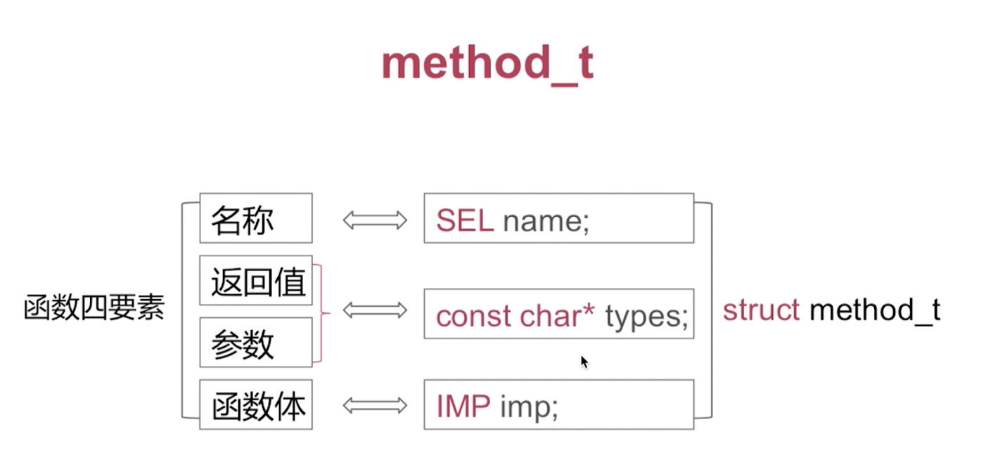
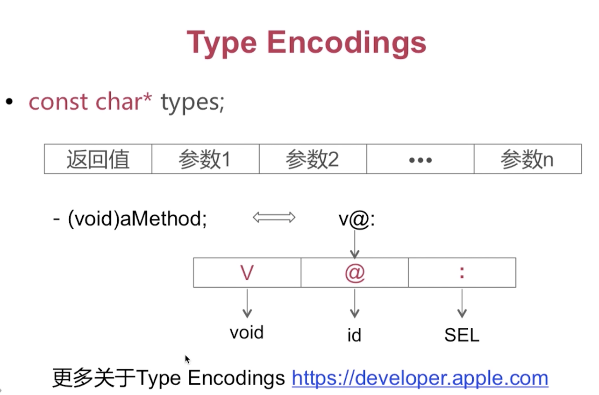
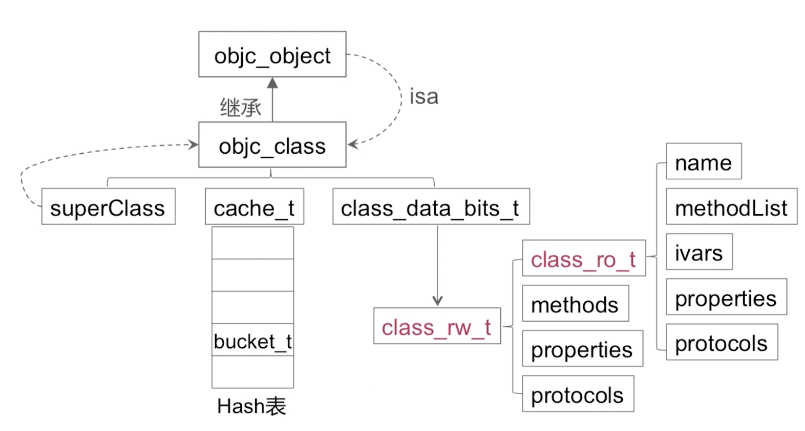

# method_t





# Type Encodings 技术

const char* types; 

// 不可变的字符指针, 他指向 的字符大致如下, 
// 函数返回值, 参数1, 参数2, ...参数n

v@: // 返回值, 参数1, 参数2

v: 函数的返回值是void类型

@: oc中的id类型, 表示的是一个对象

```

后续的学习当中,我们可以知道,我们调用的一个方法或者说消息传递, 到runtime层面的时候都会转化成Method_send这么一个函数调用, 这样的第一个和第二个参数都是固定@:, 第一个参数是消息的接收者self, 第二个是:, ':'表达就是SEL它表达的是这个参数是一个选择器也就是Method_send的第二个参数. 


```





# 整体的看一下runtime的数据结构




