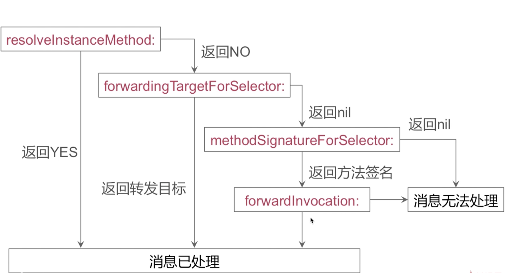

# 消息转发流程是怎样的?


# 实例方法转发流程

```
+ (BOOL)resolveInstanceMethod:(SEL)sel
```

首先系统会回调`resolveInstanceMethod:`这么一个方法,  如果是类方法就是`resolveClassMethod:`, 这里主要说实例方法的消息转发流程, `resolveInstanceMethod:`这个方法他有一个参数, 这个参数是方法的选择器, 也就是SEL这么一个类型的参数,返回值是一个布尔类型的, 相当于告诉系统要不要解决当前这个实例方法的实现.

`resolveInstanceMethod:`这个方法它是一个类方法,不是实例方法,


如果在`resolveInstanceMethod:`这一步骤返回的是YES, 或者说我们给予这个方法选择器所对应方法实现的一个实现的话.相当于通知系统当前消息已处理, 那么也就结束了消息转发流程.


如果在`resolveInstanceMethod:`返回NO, 系统会给予我们第二次机会来处理这条消息, 这个时候呢会回调 `- (id)forwardingTargetForSelector:(SEL)aSelector`这么样一个方法, 同样这个方法的参数呢也是方法的选择器.返回值是一个id,相当于告诉系统这个选择器,或是这次的实例方法的调用应该由哪个对象来处理, 转发对象是谁, 如果我们指定了一个转发目标的话,系统会把这条消息转发给我们返回的转发目标,同时会结束当前消息转发流程.


如果在第二次机会`- (id)forwardingTargetForSelector:(SEL)aSelector`的时候, 我们任然没有给他返回转发目标的情况下, 系统会给我第三次处理这条消息的机会,也是最后一次机会, 首先系统会调用`- (NSMethodSignature *)methodSignatureForSelector:(SEL)aSelector`这么样一个方法, 这个方法的参数任然只有一个就是方法的选择器, 返回值`NSMethodSignature`的一个对象,  这个对象实际上对于这个方法选择器返回值的类型以及他的参数个数和参数类型的一个封装,此时如果说我们返回了一个方法签名的话系统会接着调用  `- (void)forwardInvocation:(NSInvocation *)anInvocation` , 如果说`- (void)forwardInvocation:(NSInvocation *)anInvocation`能够处理这条消息的话,消息转发流程就结束了.


如果`- (NSMethodSignature *)methodSignatureForSelector:(SEL)aSelector`返回的是一个空, 或者说`- (void)forwardInvocation:(NSInvocation *)anInvocation`没能够处理这条消息的话, 就标记为消息无法处理.

那么我常见的一种crash, 未识别选择器,实际上就是走到消息转发流程的最后一步"消息无法处理", 所产生的一个打印结果,





```

#import <Foundation/Foundation.h>

@interface RuntimeObject : NSObject

- (void)test;

@end

```


```

#import "RuntimeObject.h"

@implementation  RuntimeObject

+ (BOOL)resolveInstanceMethod:(SEL)sel

{

  // 如果是test方法 打印日志

 if (sel == @selector(test)) {

 NSLog(@"%s", __func__);

 return YES;

 } else {

  // 返回父类的默认调用

  return [super  resolveInstanceMethod:sel];

 }

}

- (id)forwardingTargetForSelector:(SEL)aSelector

{

 NSLog(@"%s", __func__);

  return  nil; // 返回nil让他走第三部

}

- (NSMethodSignature *)methodSignatureForSelector:(SEL)aSelector

{

 if (aSelector == @selector(test)) {

 NSLog(@"%s", __func__);

  //返回一个正确的方法签名

  // v-void, 返回类型

  // @==self, 代表第一个参数类型是id, 即self

  // :--选择器, 代表第二参数SEL类型的, 即@selector(test)

  return [NSMethodSignature  signatureWithObjCTypes:"v@:"];

 } else {

  //返回父类的默认调用

  return [super  methodSignatureForSelector:aSelector];

 }

}

- (void)forwardInvocation:(NSInvocation *)anInvocation

{

 NSLog(@"%s", __func__);

}

@end

```


