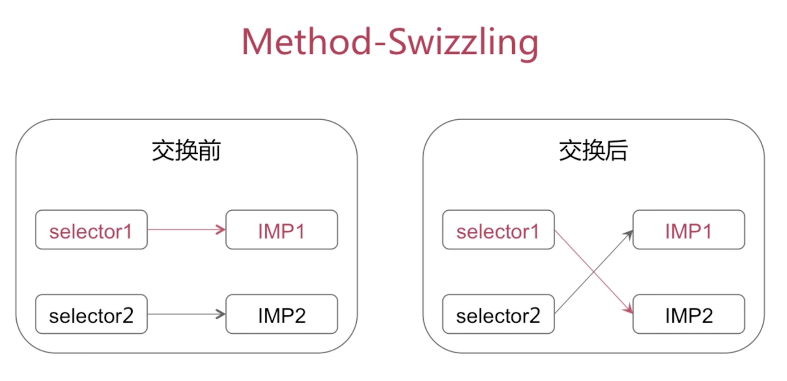

```

#import <Foundation/Foundation.h>

@interface RuntimeObject : NSObject

- (void)test;

- (void)otherTest;

@end


```


```

#import "RuntimeObject.h"

#import <objc/runtime.h>

@implementation RuntimeObject

+ (void)load

{

  Method test = class_getInstanceMethod(self, @selector(test));

 Method otherTest = class_getInstanceMethod(self, @selector(otherTest));

  method_exchangeImplementations(test, otherTest);

}

- (void)test

{

 NSLog(@"%s", __func__);

}

- (void)otherTest

{
[self  otherTest];
 NSLog(@"%s", __func__);

}

@end
```