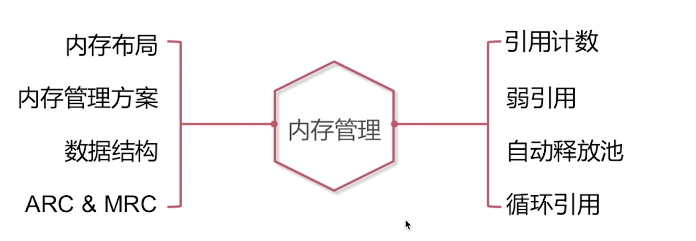
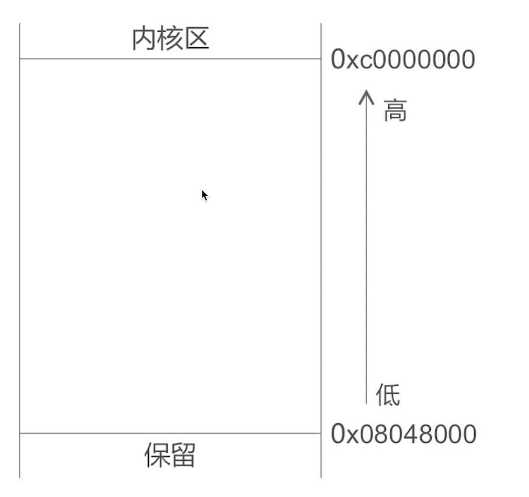
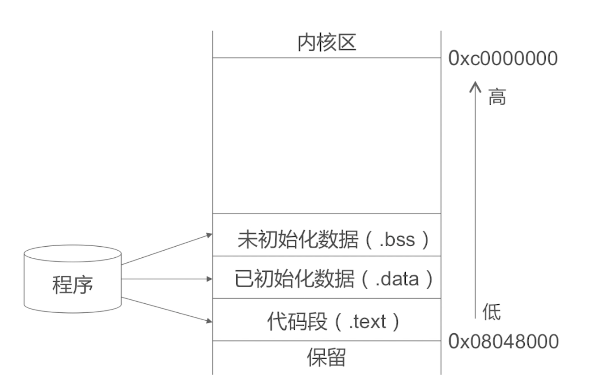
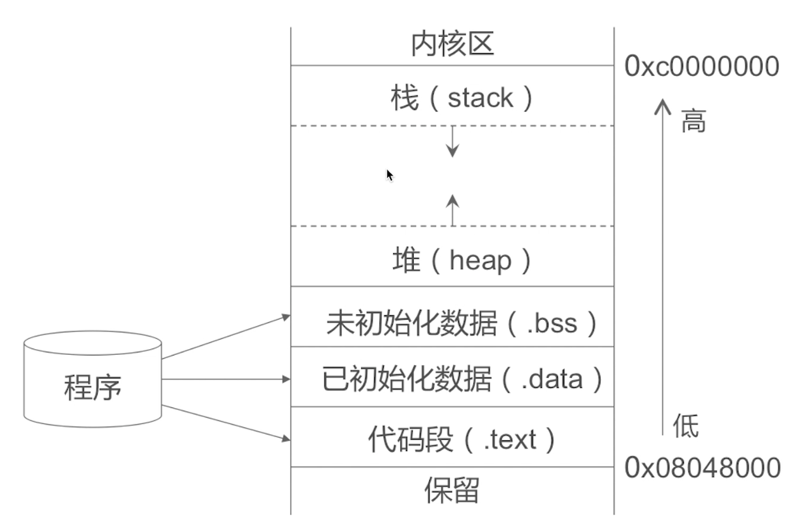

内存布局
内存管理方案
数据结构
ARC & MRC

引用计数
弱引用
自动释放池
循环引用

- 已初始化数据( .data): 一些静态变量, 全局变量,前提是已经初始化的
- 未初始化数据( .bss): 未初始化的静态变量,全局变量

- 栈( stack):iOS中的一些方法函数都是在栈上进行工作,栈是从高地址到底地址进行扩展, 栈是向下扩展向下增长,

- 堆(heap):iOS开发过程当中,创建的对象,block通过copy之后了他的都会转义到堆上面去, 堆是向上增长的.

# ===
stack :栈区都是我们的方法调用

heap : 堆, 通过alloc 等分配的对象
 
bss :未初始化的全局变量等
data : 已初始化的全局变量等.
text : 程序代码

