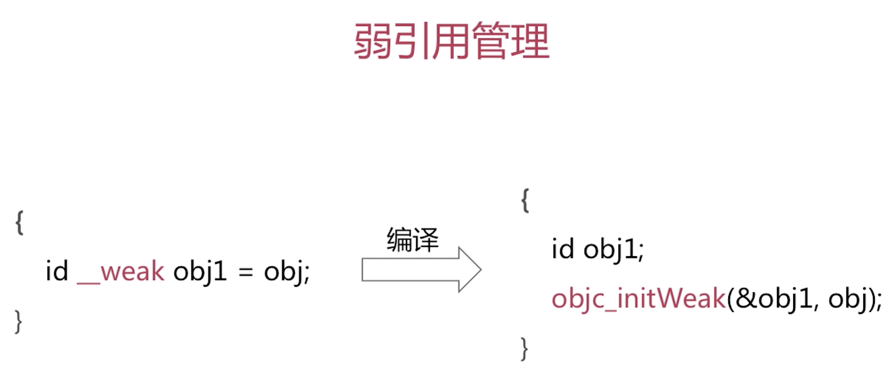
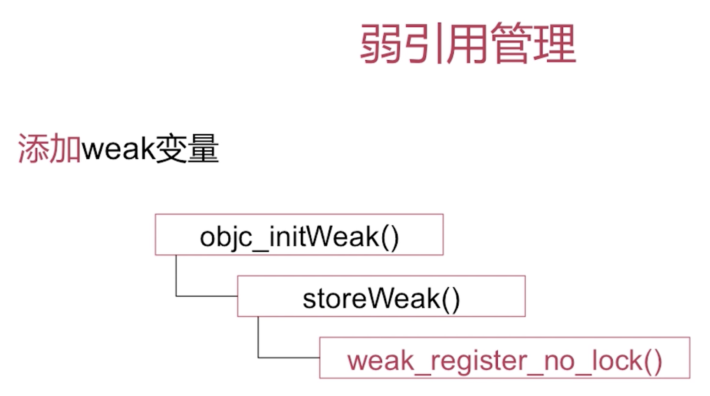
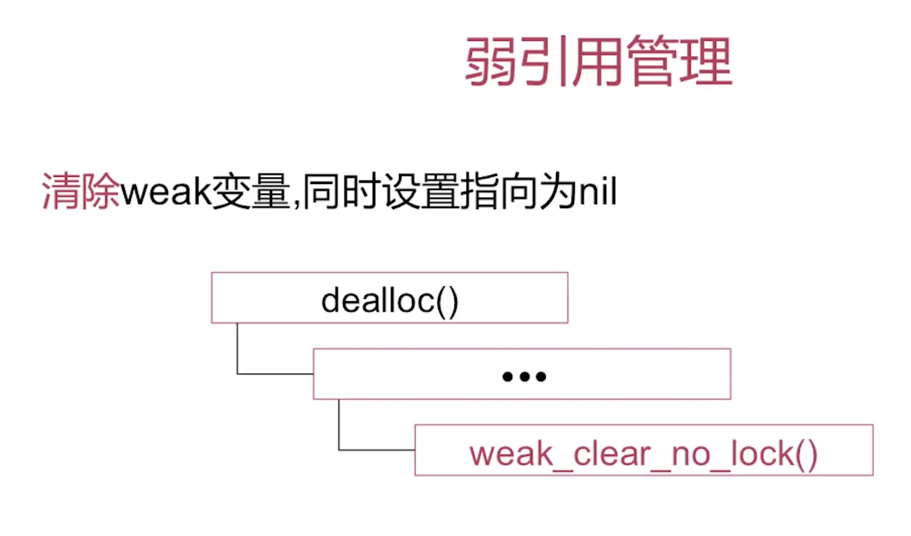

# weak 变量是怎样添加到弱引用表中的? 

当一个对象被dealloc之后, 在dealloc的内部实现当中会去调用弱引用清除的相关函数, `weak_clear_no_lock()`在这个函数内部实现当中会根据当前对象指针查找弱引用表,把当前对象的弱引用都拿出来是一个数组, 遍历这个数组将它们全部至为nil.

# 自动释放池

AutoreleasePool的实现原理是怎样的?

AutoreleasePool为何可以嵌套使用?

