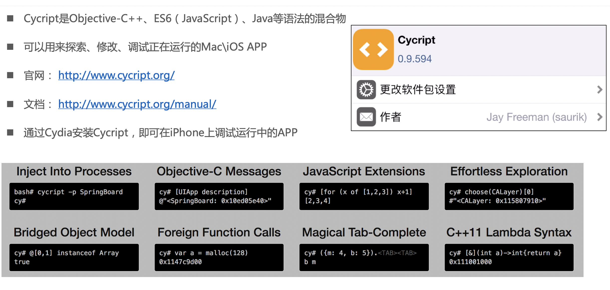
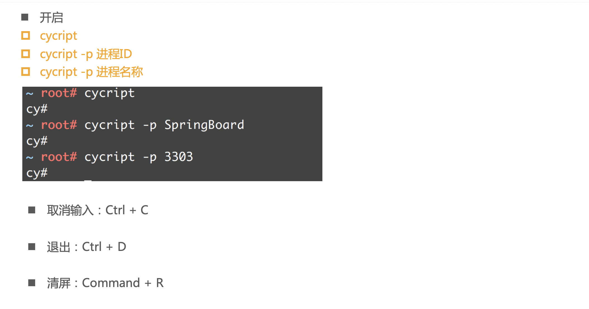
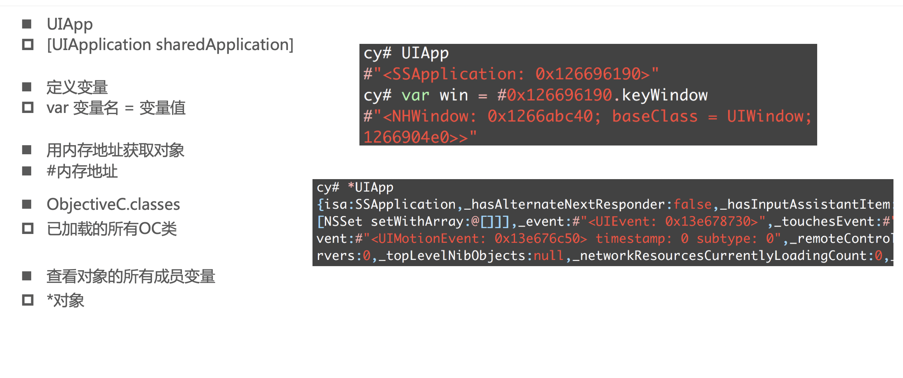
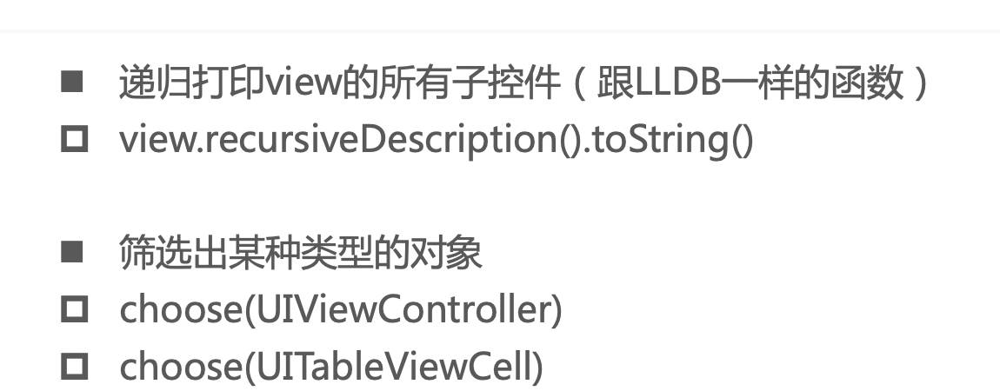
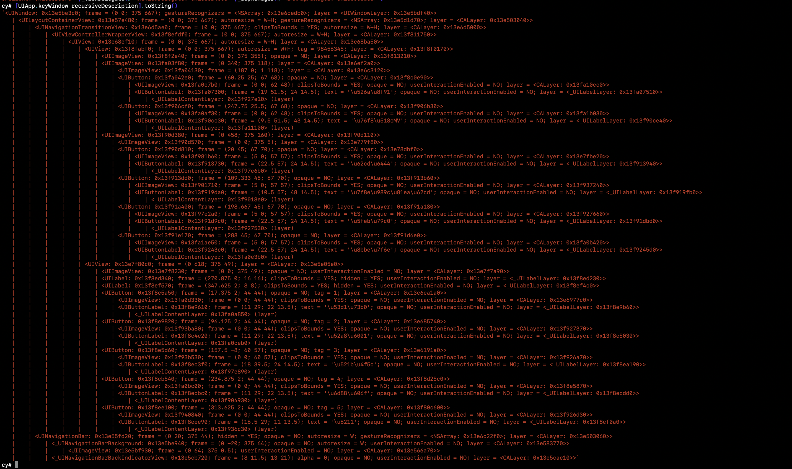
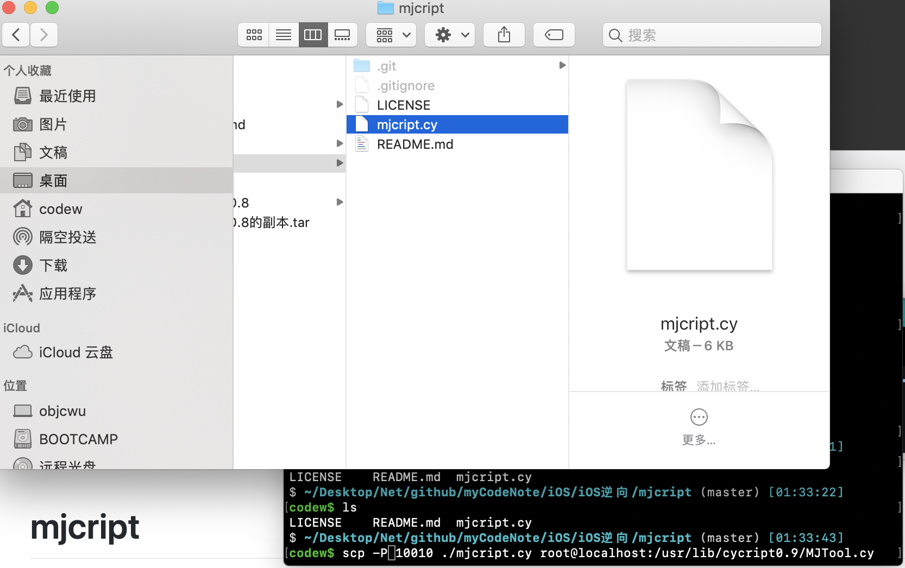
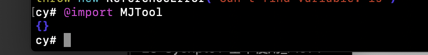

退出
control + d


```


control + d

```


```c

**codew$** ssh root@localhost -p 10010

iPhone:~ root# ps -A | grep qut

 2991 ??  0:19.98 /var/mobile/Containers/Bundle/Application/CF695CAF-4F7B-4F9D-8CDC-4800E1C1B8F1/qutui-appstore.app/qutui-appstore

 3030 ttys000 0:00.01 grep qut

iPhone:~ root# cycript -p 2991

cy# UIApp.keyWindow.rootViewController.super

cy# **[**UIApp.keyWindow.rootViewController super**]**

throw  new Error**(**"unrecognized selector super sent to object 0x16c12a00"**)**  **/***

 **objc_msgSend@[native code] */**

cy# UIApp.keyWindow.rootViewController

#"<CenturyBeatBanana: 0x16c12a00>"

cy# **[**UIApp.keyWindow.rootViewController class**]**

CenturyBeatBanana

cy# **[**UIApp.keyWindow.rootViewController superClas**]**

throw  new Error**(**"unrecognized selector superClas sent to object 0x16c12a00"**)**  **/***

 **objc_msgSend@[native code] */**

cy# **[**UIApp.keyWindow.rootViewController superClass**]**

throw  new Error**(**"unrecognized selector superClass sent to object 0x16c12a00"**)**  **/***

 **objc_msgSend@[native code] */**

cy# **[**UIApp.keyWindow.rootViewController superclass**]**

ChristmasCityAuthor

cy# **[[**UIApp.keyWindow.rootViewController superclass**]** superclass**]**

RTRootNavigationController

cy# **[[[**UIApp.keyWindow.rootViewController superclass**]** superclass**]** superclass**]**

UINavigationController

cy#


```


```
ps -A
cycript -p KxVideo
cycript -p 299
 ps -A | grep qut


UIApp.keyWindow.rootViewController
[[[UIApp.keyWindow.rootViewController superclass] superclass] superclass]

[UIApplication sharedApplication]

```


# 打印APP所有的类

```

ObjectiveC.classes


```


# 查看类的成员变量


```c
*XX
*UIApp

```


# 井号加内存地址等于一个对象

```

*#0x13e576fa0
{isa:AppDelegate,_hasAlternateNextResponder:false,_hasInputAssistantItem:false,nv:null,layerFade_:null,pushToken:null,theLastUserInfo:null,bActive:true,_scene:0,pushVideoFid:null,_needShow:false,isRefreshUser:false,baseAlert:null,isShareURLopenApp:false,_window:#"<UIWindow: 0x13e5be3c0; frame = (0 0; 375 667); gestureRecognizers = <NSArray: 0x13e6cedb0>; layer = <UIWindowLayer: 0x13e5bdf40>>",mainViewController:null,_nv:#"<UINavigationController: 0x13f03b400>",_VCOPClientInstance:#"<VCOPClient: 0x13e6bd070>",_viewDelegate:#"<AGViewDelegate: 0x13e6b4c60>",_mapManager:#"<BMKMapManager: 0x13e566a30>"}
cy# 

```






# 打印层级

```


[UIApp.keyWindow recursiveDescription].toString()

```





# 筛选当前页面的控制器choose(UIViewController)


```

cy# choose(UIViewController)
[#"<HomeViewController: 0x13e5cb990>",#"<MessageViewController: 0x13e5d1f00>",#"<FriendDynamicViewController: 0x13e5d2380>",#"<UINavigationController: 0x13f03a800>",#"<TabbarViewController: 0x13f03ae00>",#"<UINavigationController: 0x13f03b400>",#"<MainViewController: 0x13e803c00>",#"<FindsViewController: 0x13e816800>",#"<UINavigationController: 0x13e816e00>",#"<UINavigationController: 0x13e817a00>",#"<UIInputWindowController: 0x13e85aa00>"]
cy# 


```


# MJTool


scp -P 10010 ./mjcript.cy root@localhost:/usr/lib/cycript0.9/MJTool.cy




## 导入.... 没进入一个应用都要@import MJTool




```

cy# @import MJTool

{}


```


## MJFrontVc(); 获取最上层的控制器

 
```c


MJFrontVc();
#"<KXLoginViewController: 0x13ff078f0>"
cy# 


```


## 所有方法


```c

MJAppId                    MJFrontVcSubViews          MJLoadFramework            MJRefreshBackNormalFooter  MJSizeMake
MJAppPath                  MJInstanceMethodNames      MJPointMake                MJRefreshBackStateFooter   MJSubclasses
MJBtnTouchUpEvent          MJInstanceMethods          MJRectMake                 MJRefreshComponent         MJSubviews
MJCachesPath               MJIsArray                  MJRefreshAutoFooter        MJRefreshFooter            MJTool
MJChildVcs                 MJIsNumber                 MJRefreshAutoGifFooter     MJRefreshGifHeader         MJVcSubviews
MJClassMethodNames         MJIsString                 MJRefreshAutoNormalFooter  MJRefreshHeader            
MJClassMethods             MJIvarNames                MJRefreshAutoStateFooter   MJRefreshNormalHeader      
MJDocPath                  MJIvars                    MJRefreshBackFooter        MJRefreshStateHeader       
MJFrontVc                  MJKeyWin                   MJRefreshBackGifFooter     MJRootVc 

```

## 打印对象所有方法MJInstanceMethodNames(#)


```shell

cy# MJInstanceMethodNames(#0x13ff078f0)
[&"hudWasHidden:",&"updateThirdLogin:",&"setIsFromSeachClass:",&"performDismiss:",&"updateWeibo:with:",&"MBProgressHUDState:hudLable:",&"requestCompleteLoginBack:",&"userTokenInfo:",&"requestCompleteUserInfoBack:",&"PushKXMain:",&"compareCurrentTime:",&"initShareSDK",&"authBtnChangeHandler:",&"toJSONData:",&"hiddenShowScore:",&"showShowScore:",&"setIsFromMainController:",&"setIsFromMain:",&"setIsShare:",&"setIsZan:",&"setIsPingLun:",&"isShare",&"isZan",&"isPingLun",&"isFromMainController",&"setIsFromVideoDetail:",&"LoginAcount",&"LoginPassWord",&"thirdPartLogin:",&"setCooperationCode:",&"CooperationCode",&"uploadLoginParametes:",&"updateShareSDKUserInfo:",&"updateWeibo_bang:with:",&"CABasicAnimation",&"startRequestThirdLogin:",&"RegisterAction:",&"UserForgetPassWord:",&"LoginAction:",&"NoAccountLogin:",&"MBProgressHUDRevolvingState:",&"HiddenMBProgressHUDRevolvingState:",&"testAction:",&"upLoadISSPlatformCredentialInfo:",&"requestCompleteISSPlatformCredentialInfo:",&"isFromSeachClass",&"isFromvideoClass",&"setIsFromvideoClass:",&"isFromMain",&"isFromVideoDetail",&"isFromAuthor",&"setIsFromAuthor:",&"setLoginAcount:",&"setLoginPassWord:",&"forgetPassWord",&"setForgetPassWord:",&"loginWithUsername:password:",&".cxx_destruct",&"touchesBegan:withEvent:",&"didReceiveMemoryWarning",&"initWithNibName:bundle:",&"textFieldDidBeginEditing:",&"textFieldDidEndEditing:",&"textFieldShouldReturn:",&"viewWillAppear:",&"viewDidLoad",&"viewDidDisappear:",&"actionSheet:clickedButtonAtIndex:",&"setUserToken:",&"userToken",&"back:"]


```


## 调用对象某个方法[#0x13ff078f0 LoginAction:nil]


# 获取最上层控制器的所有自控件MJFrontVcSubViews();

```c


cy# #0x13fdda0b0.text = "kkk";
"kkk"
cy# #0x13fe95410.text = "12";


```


# @import 


# 微信等...

```c


# com.tencent.xin

```


