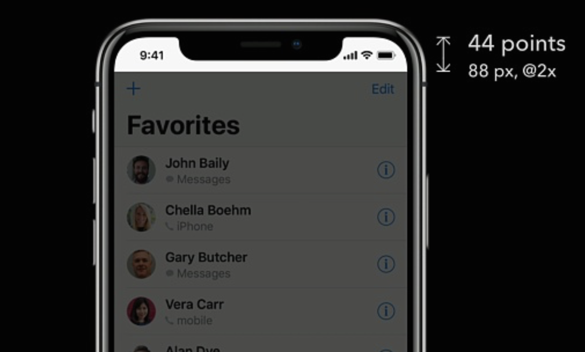
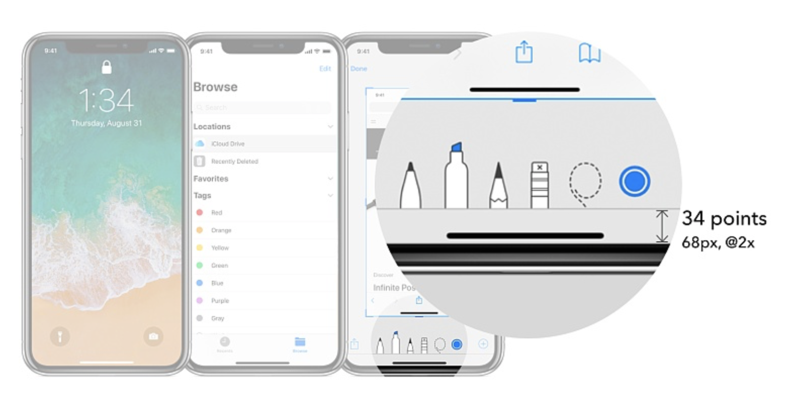
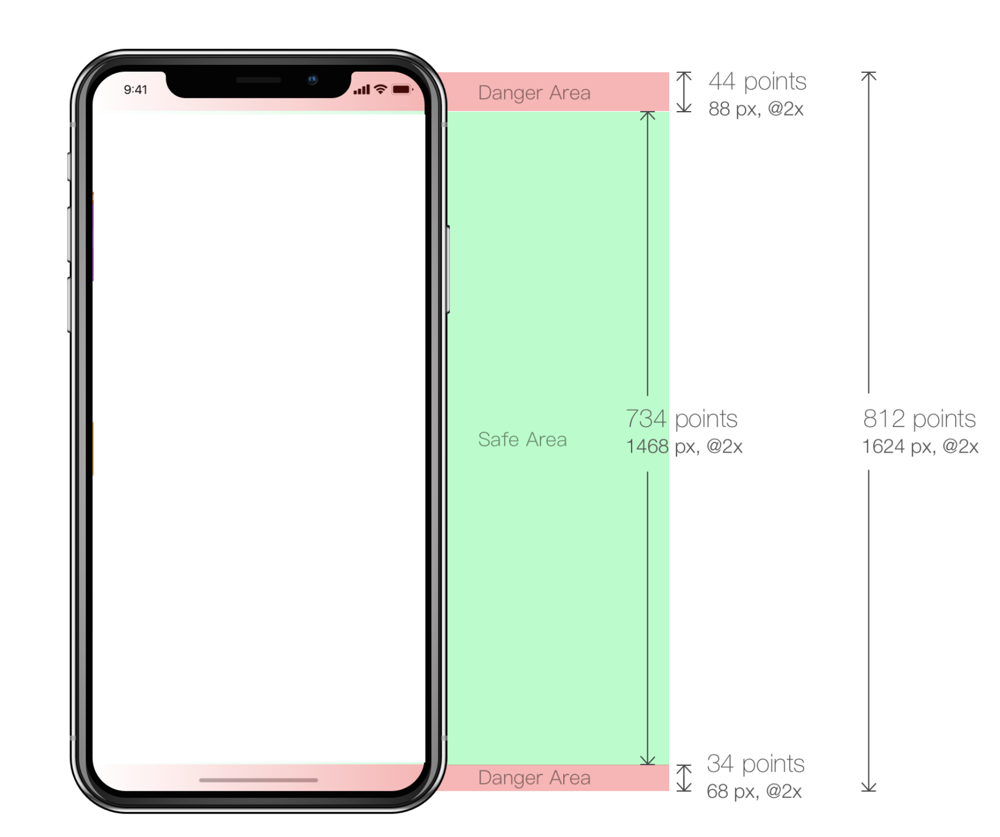

iOS11 废弃了UIViewController的`automaticallyAdjustsScrollViewInsets`属性

新增了 ***contentInsetAdjustmentBehavior*** 属性，

所以当超出安全区域时系统自动调整了 ***SafeAreaInsets***,  ----->进而影响了 ***adjustedContentInset***

在iOS11中决定tableview内容与边缘距离的是***adjustedContentInset***

所以需要设置UIScrollview 的, ***contentInsetAdjustmentBehavior***属性.

状态栏20-->44
导航栏变成88

[苹果官网文档](https://developer.apple.com/cn/ios/update-apps-for-iphone-x/)

