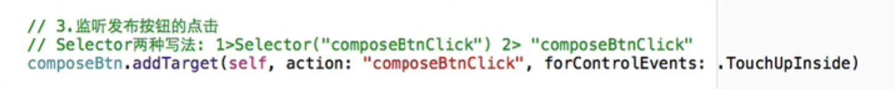

# 枚举 ''.''去访问


# btn添加方法

```

Selector("functionName")

或者直接写"functionName"


```





# 动画不消失

```

func addRotationAnim() {

  // 1.创建动画

 let rotationAnim = CABasicAnimation(keyPath: "transform.rotation.z")

  // 2.设置动画的属性

 rotationAnim.fromValue = 0

 rotationAnim.toValue = M_PI * 2

 rotationAnim.repeatCount = MAXFLOAT

 rotationAnim.duration = 5

/// 动画不消失
 rotationAnim.removedOnCompletion = false

  // 3.将动画添加到layer中

 rotationView.layer.addAnimation(rotationAnim, forKey: nil)

 }
		
			
```


# @objc 就可以私有然后调用不崩溃

