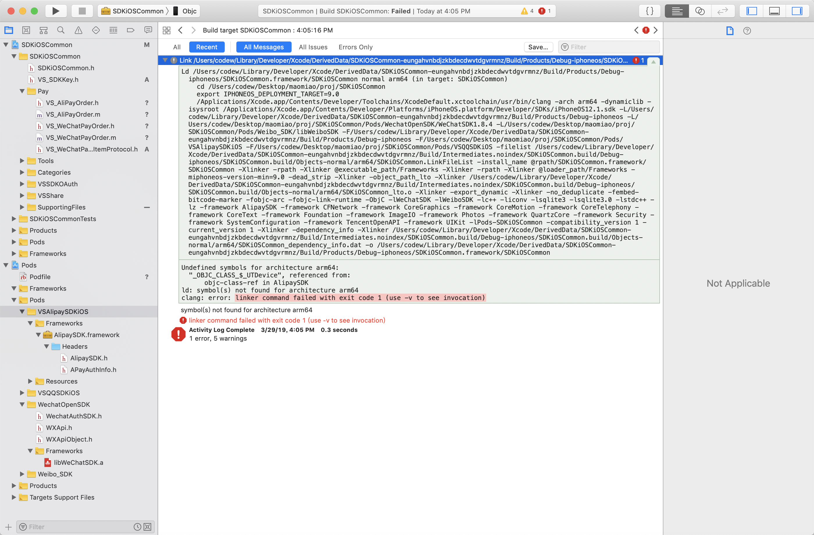

# 解决方案：下载他们的支付demo，将支付demo里的sdk拖到项目里，清理编译，ok。。。坑爹的


```


Ld /Users/codew/Library/Developer/Xcode/DerivedData/SDKiOSCommon-eungahvnbdjzkbdecdwvtdgvrmnz/Build/Products/Debug-iphoneos/SDKiOSCommon.framework/SDKiOSCommon normal arm64 (in target: SDKiOSCommon)

 cd /Users/codew/Desktop/maomiao/proj/SDKiOSCommon

 export IPHONEOS_DEPLOYMENT_TARGET=9.0

 /Applications/Xcode.app/Contents/Developer/Toolchains/XcodeDefault.xctoolchain/usr/bin/clang -arch arm64 -dynamiclib -isysroot /Applications/Xcode.app/Contents/Developer/Platforms/iPhoneOS.platform/Developer/SDKs/iPhoneOS12.1.sdk -L/Users/codew/Library/Developer/Xcode/DerivedData/SDKiOSCommon-eungahvnbdjzkbdecdwvtdgvrmnz/Build/Products/Debug-iphoneos -L/Users/codew/Desktop/maomiao/proj/SDKiOSCommon/Pods/WechatOpenSDK/WeChatSDK1.8.4 -L/Users/codew/Desktop/maomiao/proj/SDKiOSCommon/Pods/Weibo_SDK/libWeiboSDK -F/Users/codew/Library/Developer/Xcode/DerivedData/SDKiOSCommon-eungahvnbdjzkbdecdwvtdgvrmnz/Build/Products/Debug-iphoneos -F/Users/codew/Desktop/maomiao/proj/SDKiOSCommon/Pods/VSAlipaySDKiOS -F/Users/codew/Desktop/maomiao/proj/SDKiOSCommon/Pods/VSQQSDKiOS -filelist /Users/codew/Library/Developer/Xcode/DerivedData/SDKiOSCommon-eungahvnbdjzkbdecdwvtdgvrmnz/Build/Intermediates.noindex/SDKiOSCommon.build/Debug-iphoneos/SDKiOSCommon.build/Objects-normal/arm64/SDKiOSCommon.LinkFileList -install_name @rpath/SDKiOSCommon.framework/SDKiOSCommon -Xlinker -rpath -Xlinker @executable_path/Frameworks -Xlinker -rpath -Xlinker @loader_path/Frameworks -miphoneos-version-min=9.0 -dead_strip -Xlinker -object_path_lto -Xlinker /Users/codew/Library/Developer/Xcode/DerivedData/SDKiOSCommon-eungahvnbdjzkbdecdwvtdgvrmnz/Build/Intermediates.noindex/SDKiOSCommon.build/Debug-iphoneos/SDKiOSCommon.build/Objects-normal/arm64/SDKiOSCommon_lto.o -Xlinker -export_dynamic -Xlinker -no_deduplicate -fembed-bitcode-marker -fobjc-arc -fobjc-link-runtime -ObjC -lWeChatSDK -lWeiboSDK -lc++ -liconv -lsqlite3 -lsqlite3.0 -lstdc++ -lz -framework AlipaySDK -framework CFNetwork -framework CoreGraphics -framework CoreMotion -framework CoreTelephony -framework CoreText -framework Foundation -framework ImageIO -framework Photos -framework QuartzCore -framework Security -framework SystemConfiguration -framework TencentOpenAPI -framework UIKit -lPods-SDKiOSCommon -compatibility_version 1 -current_version 1 -Xlinker -dependency_info -Xlinker /Users/codew/Library/Developer/Xcode/DerivedData/SDKiOSCommon-eungahvnbdjzkbdecdwvtdgvrmnz/Build/Intermediates.noindex/SDKiOSCommon.build/Debug-iphoneos/SDKiOSCommon.build/Objects-normal/arm64/SDKiOSCommon_dependency_info.dat -o /Users/codew/Library/Developer/Xcode/DerivedData/SDKiOSCommon-eungahvnbdjzkbdecdwvtdgvrmnz/Build/Products/Debug-iphoneos/SDKiOSCommon.framework/SDKiOSCommon

Undefined symbols for architecture arm64:

 "_OBJC_CLASS_$_UTDevice", referenced from:

 objc-class-ref in AlipaySDK

ld: symbol(s) not found for architecture arm64

clang: error: linker command failed with exit code 1 (use -v to see invocation)


```
