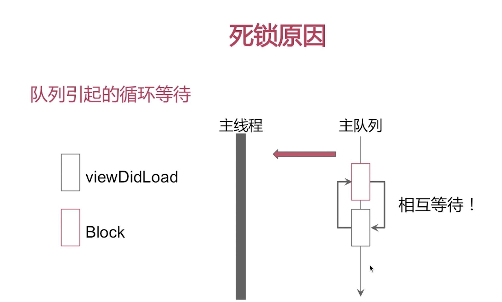
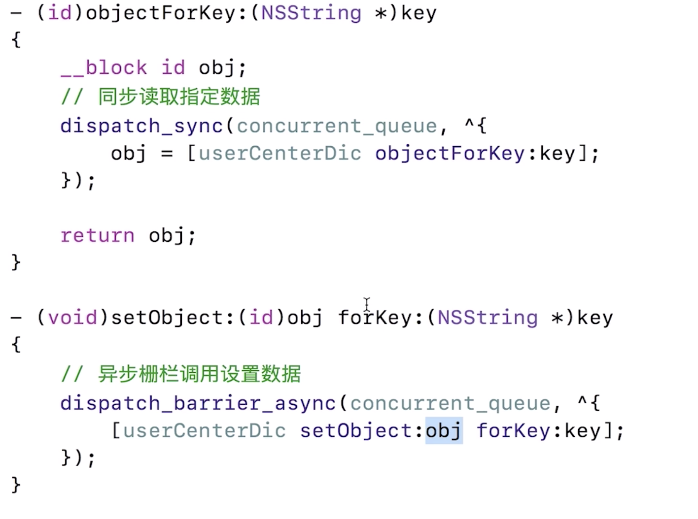
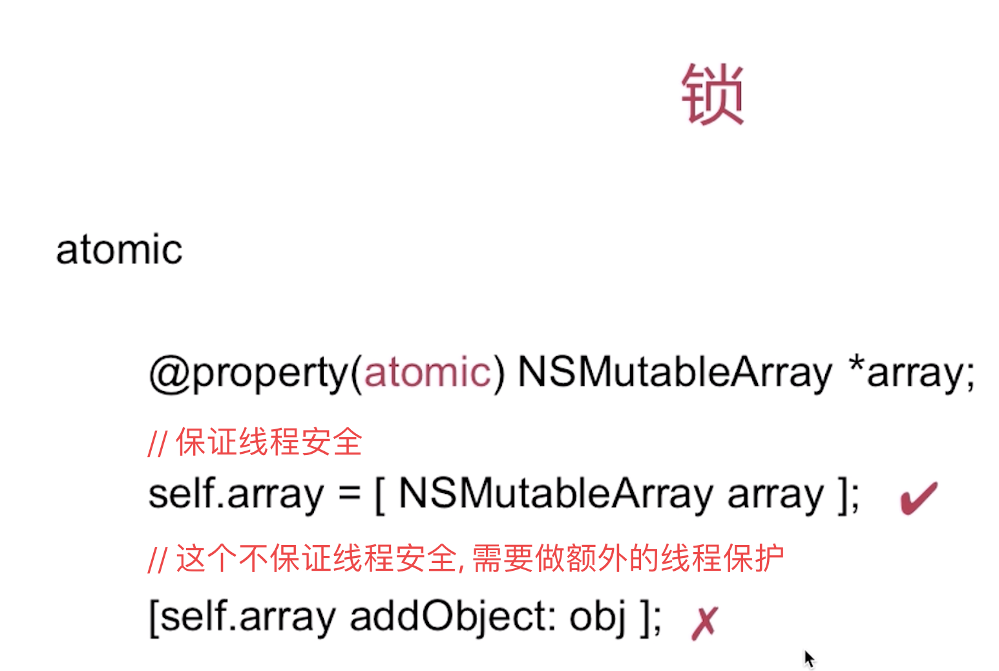
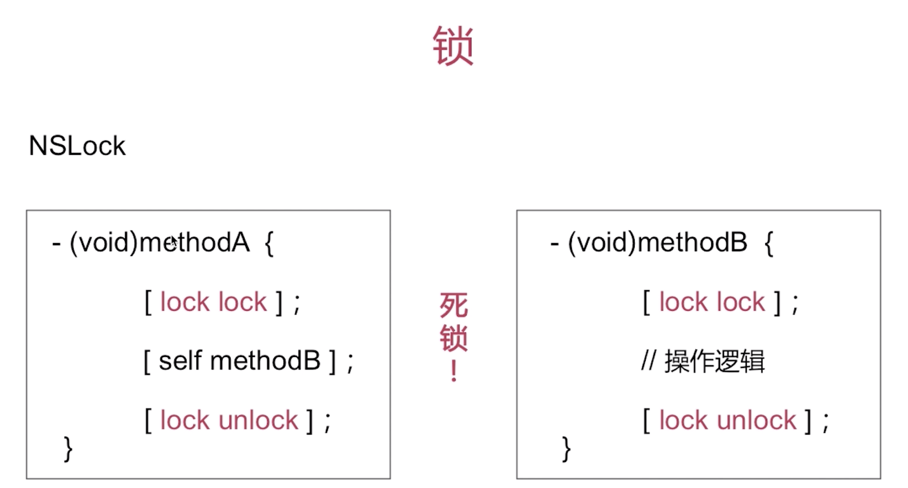
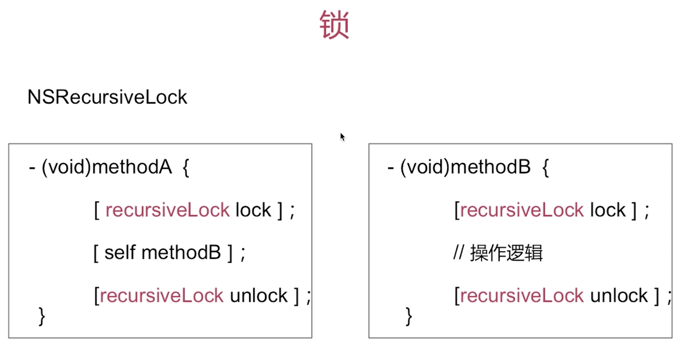

# GCD总结

1.首先如果是说GCD的话我们一般就是像如下那样使用

```C

  dispatch_async(dispatch_get_global_queue(0, 0), ^{

 NSLog(@"任务1");

 [NSThread  sleepForTimeInterval:3.0];

  dispatch_async(dispatch_get_main_queue(), ^{

 NSLog(@"回到主线程.....");

 });

 });

```

GCD 中最重要的两个概念是队列和任务 , 任务有同步异步, 队列有串行并发,于是就有了几种组合

同步(`dispatch_sync`)---- 在当前线程中执行任务, `不具备`开启新线程的能力
异步(`dispatch_async`)----可以在新的线程中执行任务, `具备`开启新线程的能力

不是说用了异步方法就一定创建线程

队列有系统提供的和自己创建的, 总共分为串行和并发.

- 并发队列（`Concurrent Dispatch Queue`）
- 串行队列（`Serial Dispatch Queue`）

1. 同步 + 并发 // 当前线程
2. 同步 + 串行 // 当前线程
3. 异步 + 并发 // 开多少线程不一定
4. 异步 + 串行 //  就开一个

5. 同步 + 主队列 //卡死
6. 异步 + 主队了 // 没毛病


```C

// 之所以同步加主队了会卡死. 死锁

死锁原因 : 队列引起的循环等待.......

viewDidLoad 的结束需要block的执行完成...队列的性质是先进先出, 然后block需要viewDidLoad执行完成, 然后就那么互相等.

```


```C

- (void)mokeTs{

  dispatch_async(dispatch_get_global_queue(0, 0), ^{

 NSLog(@"1");
/**

GCD底层所分配的线程, 没有开启runloop, 没有runloop

self performSelector 这种调用必须要当前线程有runloop, 否则失效
*/
 [self  performSelector:@selector(test2) withObject:nil  afterDelay:0];

 NSLog(@"3");

 });

}

- (void)test2{

 NSLog(@"2");

}

答案:  13

```



```C

// 怎样实现一个多度单写功能...?

/**
读者,读者并发
读者,写者互斥
写者,写者互斥
*/

- (id)objectForKey:(NSString *)key

{

 __block id obj;

  dispatch_sync(self.queue, ^{

 obj = [self.dic objectForKey:key];

 });

 return obj;

}

- (void)setObject:(id)obj forKey:(NSString *)key

{

  dispatch_barrier_async(self.queue, ^{

 [self.dic setObject:obj forKey:key];

 });

}


```


然后GCD有同步异步串行并发

同步和异步的最大区别就在于是否阻塞当前线程, 串行和并发呢就一个是一个一个执行,一个是同时执行...


```c

//  组的的任务是异步的

dispatch_queue_t queue2 = dispatch_queue_create("com.test2.codertom", DISPATCH_QUEUE_CONCURRENT);

  dispatch_group_t group = dispatch_group_create();

  dispatch_group_enter(group);

 [self request1:^{

  NSLog(@"request1 done");

  dispatch_group_leave(group);

 }];

  dispatch_group_enter(group);

 [self request2:^{

  NSLog(@"request2 done");

  dispatch_group_leave(group);

 }];

 dispatch_group_notify(group, queue2, ^{

  NSLog(@"All task over");

  dispatch_async(dispatch_get_main_queue(), ^{

 NSLog(@"回到主线程");

 });

 });


```


# 多线程中的锁

- @synchronized
在创建单例对象的时候使用, 保证多线程下创建单例唯一...

```C

@synchronized (<#token#>) {

 <#statements#>

 }

```

- atomic



- OSSpinlock()

循环等待询问, 不释放当前资源
用于轻量级数据访问, 简单的int值+1/-1操作

- NSLock



- NSRecursiveLock 递归锁
NSRecursiveLock的特点就是可以重入
NSLock的上面问题, 由NSRecursiveLock 递归锁解决,如下



- dispatch_semaphore_t
- 