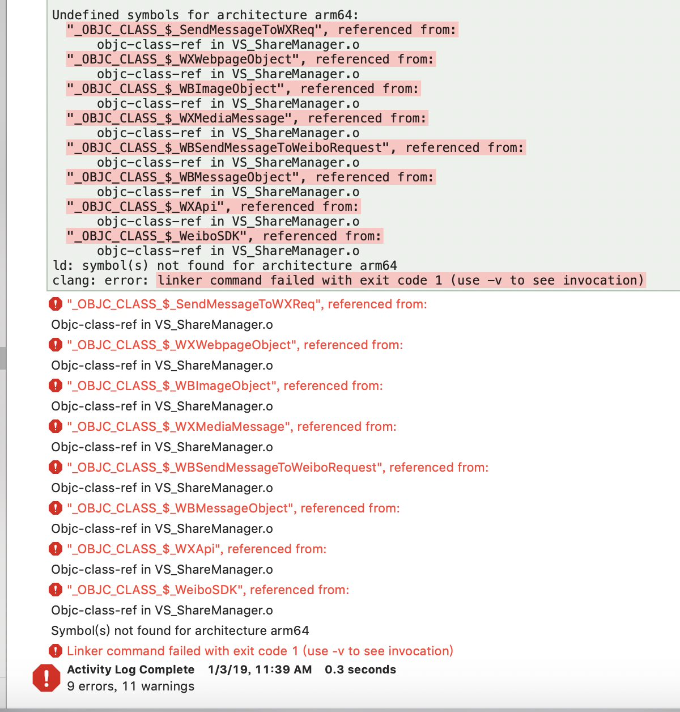

```c

Undefined symbols for architecture arm64:

 "_OBJC_CLASS_$_SendMessageToWXReq", referenced from:

 objc-class-ref in VS_ShareManager.o

 "_OBJC_CLASS_$_WXWebpageObject", referenced from:

 objc-class-ref in VS_ShareManager.o

 "_OBJC_CLASS_$_WBImageObject", referenced from:

 objc-class-ref in VS_ShareManager.o

 "_OBJC_CLASS_$_WXMediaMessage", referenced from:

 objc-class-ref in VS_ShareManager.o

 "_OBJC_CLASS_$_WBSendMessageToWeiboRequest", referenced from:

 objc-class-ref in VS_ShareManager.o

 "_OBJC_CLASS_$_WBMessageObject", referenced from:

 objc-class-ref in VS_ShareManager.o

 "_OBJC_CLASS_$_WXApi", referenced from:

 objc-class-ref in VS_ShareManager.o

 "_OBJC_CLASS_$_WeiboSDK", referenced from:

 objc-class-ref in VS_ShareManager.o

ld: symbol(s) not found for architecture arm64

clang: error: linker command failed with exit code 1 (use -v to see invocation)


```


```c


**Showing All Messages**

 "_OBJC_CLASS_$_SendMessageToWXReq", referenced from:

 objc-class-ref in VS_ShareManager.o

 "_OBJC_CLASS_$_WXWebpageObject", referenced from:

 objc-class-ref in VS_ShareManager.o

 "_OBJC_CLASS_$_WBImageObject", referenced from:

 objc-class-ref in VS_ShareManager.o

 "_OBJC_CLASS_$_WXMediaMessage", referenced from:

 objc-class-ref in VS_ShareManager.o

 "_OBJC_CLASS_$_WBSendMessageToWeiboRequest", referenced from:

 objc-class-ref in VS_ShareManager.o

 "_OBJC_CLASS_$_WBMessageObject", referenced from:

 objc-class-ref in VS_ShareManager.o

 "_OBJC_CLASS_$_WXApi", referenced from:

 objc-class-ref in VS_ShareManager.o

 "_OBJC_CLASS_$_WeiboSDK", referenced from:

 objc-class-ref in VS_ShareManager.o

ld: symbol(s) not found for architecture arm64

clang: error: linker command failed with exit code 1 (use -v to see invocation)


```


# 解决办法


