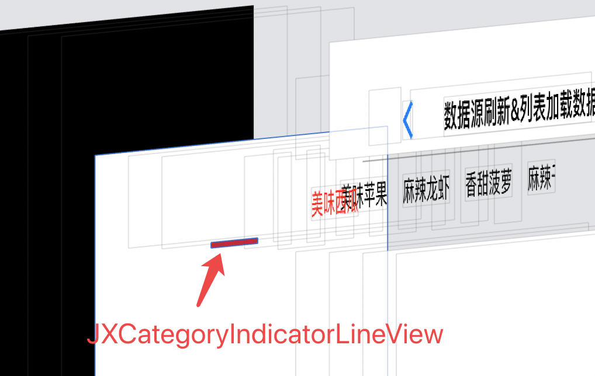

JXCategoryTitleView
- JXCategoryIndicatorView
  - JXCategoryBaseView
    - UIView

JXCategoryListContainerView
- UIView

# JXCategoryIndicatorLineView 

# 1.解读一
头部选择, 首先是一个view 上面放一个`JXCategoryCollectionView : UICollectionView`view, 每个item就是一个cell

# 2. 解读二

`JXCategoryListContainerView` 

