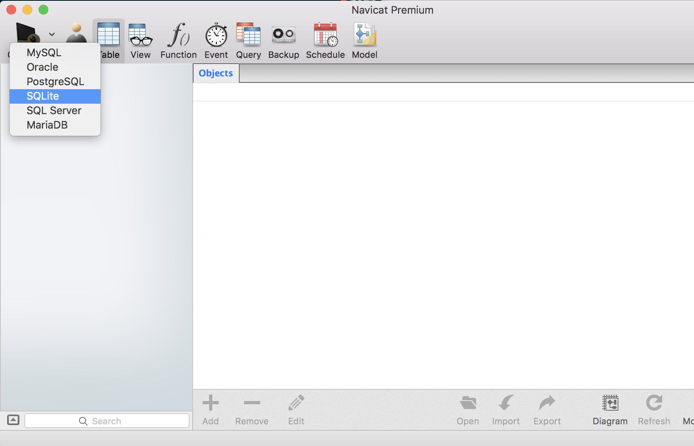
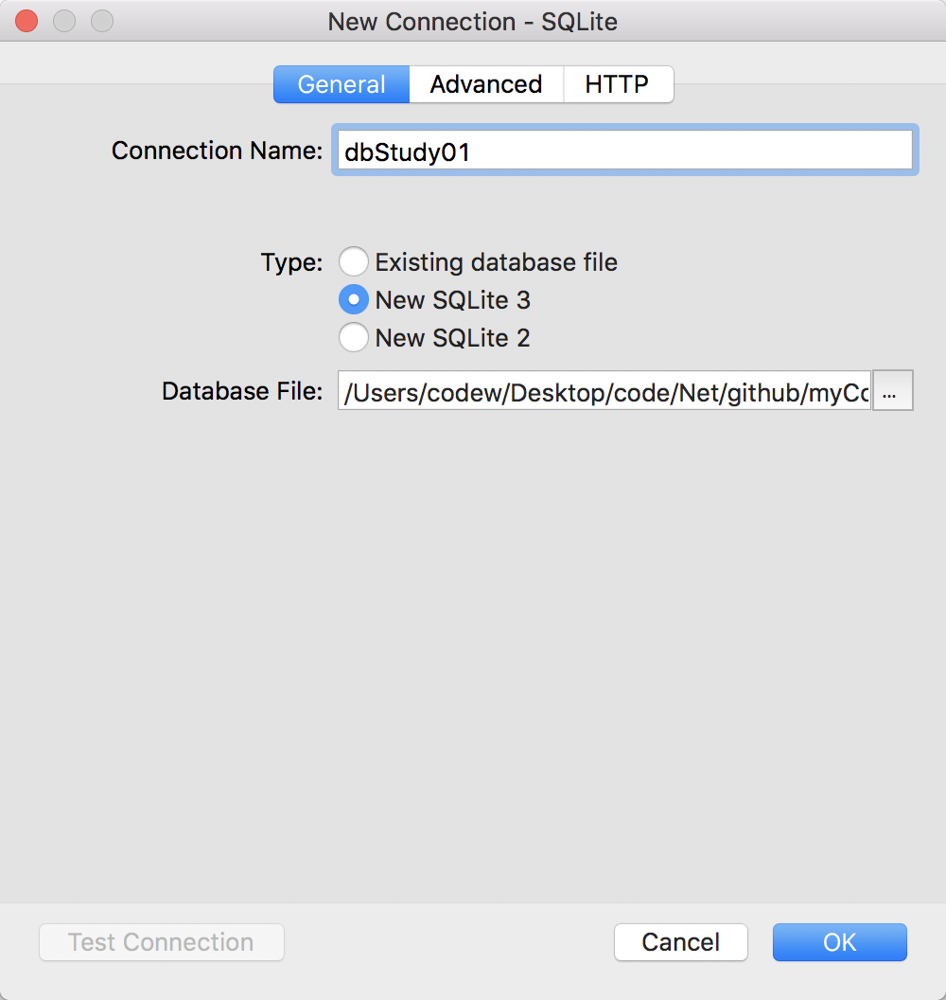
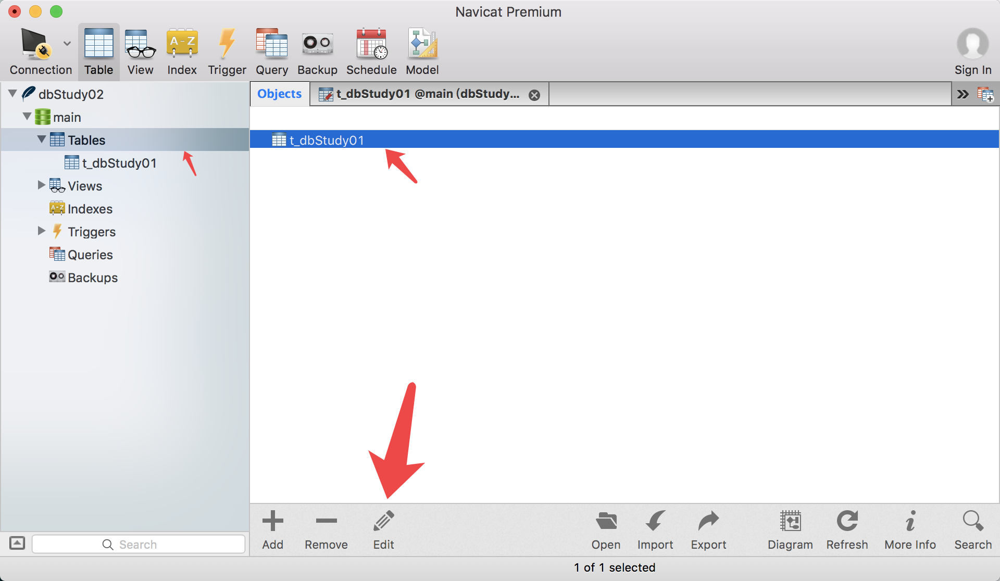
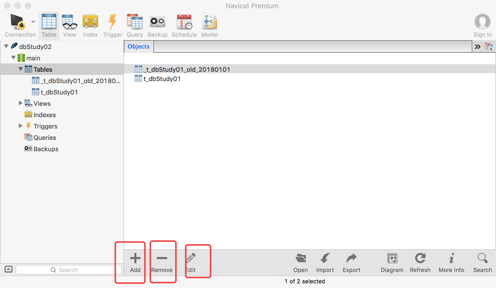

# Navicat-表操作







# Navicat-记录操作

## 1. 没有主键
```

There is no primary key here. 

Update will only use exact matching of the old values of the columns here. Thus, it may update more than one record.

```


## 2. 添加主键


## 3. 主键自动增长


