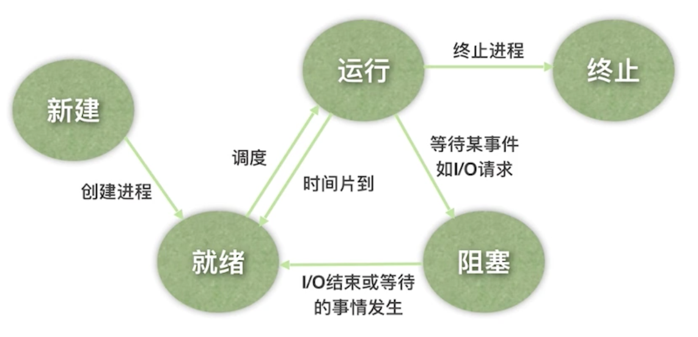
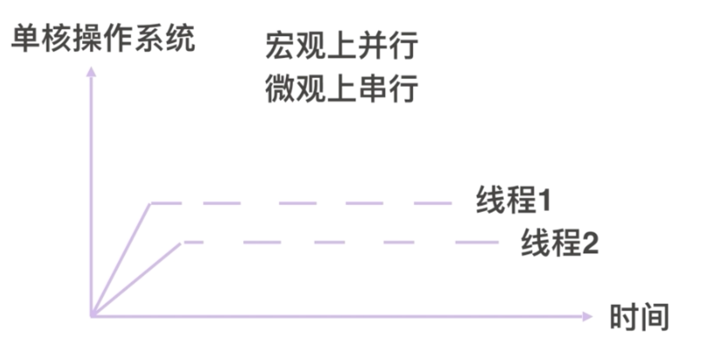

# iOS进程介绍之五态模型





# 线程


- 线程是进程的基本执行单元
网络请求,耗时任务放在独立的线程.

- 网络请求

- 图片加载

- 文件处理

- 数据存储

- 任务执行


# 什么是串行什么是并行(任务执行方式)

串行就是一个执行完再接着执行下一个排对

并行就是同时执行.


# 多线程实现原理
 
操作系统会采用时间片轮转调度的方式为每个进程分配时间段,  单核操作系统同一时间只能有一个线程执行,操作系统会为每一个线程分配时间段, 


## 多线程有点

1.简化了编程模型
2.更加的轻量级
3.提高了执行效率
4.提高了资源利用率

## 多线程缺点

1. 增加程序设计复杂性
2. 占用内存空间
3. 增大cpu调度开销


# 多线程实现技术方案
- pThread
- NSThread
- GCD
- NSOperation


# NSThread


# 第一章iOS多线程介绍

## 1.1进程介绍

进程说的是在系统中运行的一个应用程序, 每个进程之间都是独立的, 进程都是运行在其专有的空间内的.并且这个空间是受保护的, 一个进程是不能访问其他进程的独有空间的.


进程的五态
进程在处理器上是交替运行, 状态是不断的发生变化, 进程有五种状态.


- 新建: 分配资源加载程序
- 就绪: 就是除了没有处理机之外拿到所有资源, 拿到了处理机就可以即可运行
- 运行: 正在处理机上运行
- 阻塞: 也叫做等待或睡眠状态,等待某一事件发生而停止运行.
- 终止: 进程已经结束运行, 系统回收其资源


`总结`: 进程是在系统中`运行的`一个应用程序, 每个进程之间都是`独立的`, 进程都是运行在其专有的空间内的, 这个空间是`受保护的`, 不同进程之间空间是不能访问的. 进程在处理器上是交替运行的, 状态是不断发生变化的, 进程有五种状态, `新建`,`就绪`, `运行`,`阻塞`, `终止`.

## 1.2线程的介绍

线程是进程的基本执行单元, 进程的所有任务都在线程中执行.  进程要执行任务必须得有一个线程, 这个线程就是主线线程(UI线程).

 多线程使用场景: `网络请求`, `图片加载`, `文件处理`, `数据存储`, `任务执行`


### 任务的执行方式
执行耗时的任务操作的时候,都是通过子线程异步处理的,任务执行的方式有两种`串行`, `并行` 

串行: 多个任务安装一定顺序去执行,就是任务一个一个的执行
并行: 就是任务同时执行, 并发执行

## 1.3 多线程的实现原理以及优缺点
操作系统采用时间片轮转调度这样的方式为每个进程分配时间段, 对于单核操作系统, 同一时间只能有一个线程进行执行.

单核操作系统



# 多线程实现技术方案

- pThread
- NSThread
- GCD
- NSOperation

# pThread

参数说明:
**thread** ---`线程结构体`
　　指向执行线程标识符的指针, 通过该变量来控制线程
**attr**
　　设置线程属性, 如果为NULL, 则使用默认的属性
**start_routine** ---`运行函数地址`
　　线程运行函数的起始地址
**arg** -----`传递给函数的参数`
　　运行函数的参数, 这里使用 `void*`来作为参数类型, 以便可以向运行函数中传递任意类型的参数, 当然需要在运行函数中将参数转换为其原来的类型.
**返回值**
　　如果创建线程成功会返回0, 否则返回错误码.

```

int value = 64;

pthread_t pthread;
pthread_create(&pthread, NULL, run, &value);
pthread_join(pthread, NULL);

```


`pthread_join` 是用来完成线程间的同步,  即主线程等待指定的线程执行完成后再往下执行.

`pthread_join` 可以用于线程之间的同步, 当一个线程对另一个线程调用了join操作之后, 该线程会处于阻塞状态, 直到另外一个线程执行完毕.


下面是 `pthread_join`的函数原型:

```

int pthread_join( pthread_t thread, 

 void **   retval

);


```

参数说明:
**thread**
　　线程标识符, 用来指定等待哪个线程
**retaval**
　　用来存储等待线程的返回值

```

pthread_t thread_id;

pthread_attr_t attr;

pthread_attr_init(&attr);

pthread_attr_setdetachstate(&attr, PTHREAD_CREATE_JOINABLE);

pthread_create(&thread_id, &attr, work, (void *)arg);

pthread_attr_destroy(&attr);

pthread_join(thread_id, NULL);

```


### Detach(分离)

对于可 join 的线程, 只有当其他线程对其调用了 `pthread_join` 之后, 该线程才会释放所占用的资源(例如线程所对应的标识符pthread_t, 线程的返回值信息), 如果想要系统回收线程的资源, 而不是通过调用`pthread_join`回收资源(会阻塞线程), 我们可以将线程设置为 `DETACHED (分离的)`, 有三种方式将线程设为 `detached`的

*   创建线程时指定线程的 `detach` 属性: `pthread_attr_setdetachstate(&attr, PTHREAD_CREATE_DETACHED);`
*   通过在子线程中调用 `pthread_detach(pthread_self());`
*   在主线程中调用 `pthread_detach(thread_id);`(非阻塞, 执行完会立即会返回), 

通过上面的方式将线程设为 `detached`, 线程运行结束后会自动释放所有资源.


## 条件变量(Condition Variables)
条件变量对应的数据类型为 `pthread_cond_t`, 通过使用条件变量, 可以使线程在某个 **特定条件** 或者 **事件** 发生之前处于挂起状态. 当事件或者条件发生之后, 另一个线程可以通过信号来唤起挂起的线程. 条件变量主要使用下面几个函数


**初始化(init)**
和互斥锁一样, 条件变量也有两种初始化方式: 静态方式和动态方式

```c

// 静态

pthread_cond_t cond = PTHREAD_COND_INITIALIZER; 

// 动态, 成功返回0

int pthread_cond_init(pthread_cond_t *restrict cond, const pthread_condattr_t *restrict attr);

```

**销毁(destroy)**

```c

int pthread_cond_destroy(pthread_cond_t *cond);

```

**等待函数(wait)**

```c

int pthread_cond_wait( pthread_cond_t *   restrict cond, 

pthread_mutex_t *  restrict mutex ); 

int pthread_cond_timedwait( 
pthread_cond_t *         restrict cond,
pthread_mutex_t *        restrict mutex,
const struct timespec *  restrict abstime );
 

```


通过调用 wait 函数, 线程会处于挂起状态. 其中 `pthread_cond_timedwait` 的含义为: 如果在 `abstime` 时间内(系统时间小于abstime), 线程没有被唤醒, 那么线程就会结束等待, 同时返回 `ETIMEDOUT` 错误.


**唤醒函数(signal)**


```c

int pthread_cond_broadcast(pthread_cond_t *cond);

int pthread_cond_signal(pthread_cond_t *cond);

```


## 信号量(Semaphores)


## Reader/Writer Locks 读写锁


Pthread总结: `pthread` 线程标识符是`pthread_t` 创建`pthread_create(&thread_id, NULL, thread_function, &value);`,  大概有`Join(合并) 和 Detach(分离)`、`Mutex(互斥锁)`、`条件变量(Condition Variables)`、`Semaphores(信号量)`、`Reader/Writer Locks 读写锁`等概念,  
- 我们使用`pthread_join`函数来进行线程间同步但是这个是阻塞的绝对不能用在主线程,可用用其来做线程依赖, 可以通过其第二参数拿到线程的结果.  
- `join`线程是阻塞的而且资源回收需要调用`pthread_join`函数`Detach`就是非阻塞的可以设置线程为`detach`, 
-  Pthread的互斥锁`pthread_mutex_t`使用`lock`和`unlock`时一定先初始化.  如果想要对线程做挂起或唤起操作我们就试用条件变量`pthread_cond_t`, 唤起或者挂起时我们得加锁. 因为可能会出现用于无法唤醒的状态


# NSThread

```C

NSLog(@"主线程");

  // 1.通过alloc init

 NSThread * thread = [[NSThread alloc]initWithTarget:self selector:@selector(threadRun1) object:nil];

 [thread setName:@"name_thread1"];

 [thread setThreadPriority:0.2];

 [thread start];

 NSThread * thread2 = [[NSThread alloc]initWithTarget:self selector:@selector(threadRun1) object:nil];

 [thread2 setName:@"name_thread2"];

 [thread2 setThreadPriority:0.5];

 [thread2 start];

  // 2.通过detach

// [NSThread detachNewThreadSelector:@selector(threadRun) toTarget:self withObject:nil];

  // 3.ios10以后

// [NSThread detachNewThreadWithBlock:^{

//

// for (int i = 0; i < 10; i++) {

//

//

// NSLog(@"%d", i);

// sleep(1);

// }

// }];

  // 4.

// [self performSelectorInBackground:@selector(threadRun1) withObject:nil];

```


```C

@synchronized (self) {}


@property (nonatomic, strong) NSCondition * ticketCondition;
self.ticketCondition = [[NSCondition  alloc] init];
[self.ticketCondition  lock];
{
}
[self.ticketCondition  unlock];


```


# GCD

同步&异步 (对于任务来说, 区别在于会不会阻塞当前线程)
串行&并行(对于队列来说)


GCD是苹果为了多核的并行运算提出的一套解决方案.它会合理的利用更多的CPU,自动管理线程的生命周期


# NSOperation

`NSOperation `是一个基类, 我们要使用是使用它的子类


使用方式
1. NSInvocationOperation
2. NSBlockOperation
3. 自定义类继承NSOperation


相关概念:
 1.NSOperationQueue
   - `addOperation`
   - `[que setMaxConcurrentOperationCount:<#(NSInteger)#>]`

2.NSOperation状态
`ready`, `cancelled`, `executing(正在执行)`, `finished`, `asynchronous`

3. 依赖 `addDependency` 
4. 