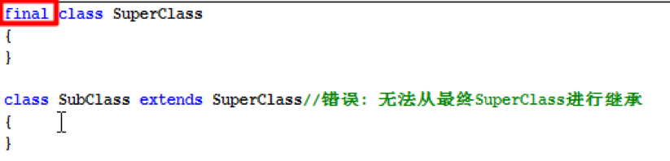
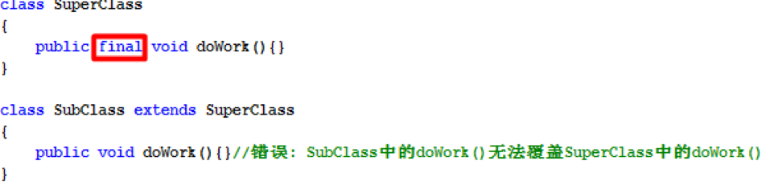
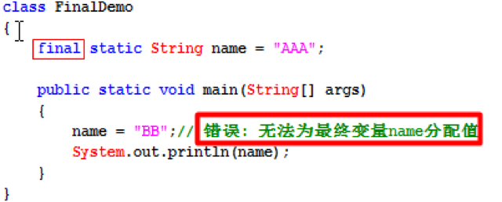
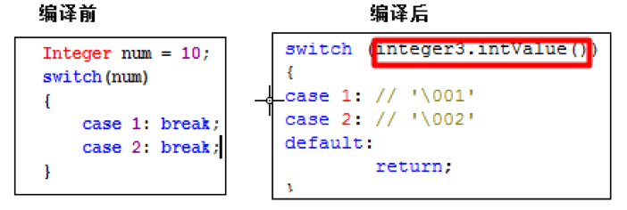

# 继承


--------------------------------------------------------------------------

在Java语言中,存在多个类的时候,我们使用”extends”关键字来表示子类和父类之间的关系.

语法格式: 在定义子类的时候来表明自己需要拓展于哪一个父类.

```

public class 子类类名   extends  父类类名

{

  编写自己特有的状态和行为

}

```
--------------------------------------------------------------------------

在Java中,类和类之间的继承关系只允许单继承,不允许多继承.

也就是说一个类A,只能有一个直接的父类,不能出现类A同时继承于

类B和类C.

  但是,Java中允许多重继承.

 多重继承例子：

动物有胎生动物和卵生动物之分，胎生动物有老虎，老虎又分华南虎，

东北虎，孟加拉虎等。

--------------------------------------------------------------------------

在Java中除了Object类之外,每一个类都有一个直接的父类.

比如:class Student extends Person{}

我们就说此时Student的直接父类是Person.

问题: class Person{} ,此时Person的父类又是谁?

`Object类是Java语言的根类(老祖宗,任何类都是Object的子类.)`

class Person{} 等价于 class Person extends Object{}

 Object类要么是一个类直接父类,要么是一个类间接父类.

--------------------------------------------------------------------------
继承关系的作用:
- 1):解决了代码的重复问题.
- 2):真正的作用,表示出一个体系.


***子类继承父类之后,可以拥有父类的某一些状态和行为(子类复用了父类的功能或状态).***
***子类到底继承了父类的哪些成员(根据访问修饰符来判断):***

- 1):如果父类中的成员使用public修饰,子类继承.
- 2):如果父类中的成员使用protected修饰,子类也继承,即使父类和子类不在同一个包中.
- 3):如果父类和子类在`同一个包中`,此时`子类可有继承父类中 缺省修饰符的成员.`
- 4):如果父类中的成员使用private修饰,子类打死都继承不到.因为private只能在本类中访问.
- 5):`父类的构造器,子类也不能继承,因为构造器必须和当前的类名相同.`


## 方法覆盖
***方法覆写的原则（一同两小一大）：Override***

***一同：***

- ①实例方法签名必须相同。 (方法签名= 方法名 + 方法的参数列表)

***两小：***

- ②子类方法的返回值类型是和父类方法的返回类型相同或者是其子类。

  - 子类可以返回一个更加具体的类.

- ③子类方法声明抛出的异常类型和父类方法声明抛出的异常类型相同或者是其子类。

  - 子类方法中声明抛出的异常小于或等于父类方法声明抛出异常类型；

  - 子类方法可以同时声明抛出多个属于父类方法声明抛出异常类的子类(RuntimeException类型除外)；

***一大：***

- ④　子类方法的访问权限比父类方法访问权 限更大或相等。

- ```private修饰的方法不能被子类所继承,也就不存在覆盖的概念.```


判断是否是覆写方法的必杀技：`@Override`标签：若方法是覆写方法，在方法前或上贴上该标签， 编译通过，否则，编译出错。
`只有方法存在覆盖的概念,字段没有覆盖.`

***方法覆盖解决的问题***: 当父类的某一个行为不符合子类具体的特征的时候,此时子类需要重新定义父类的方法,***并重写方法体.***


***方法重载和方法覆盖(方法重写)的区别:***

***方法重载: Overload***

***方法重写: Override***

批判,本身二者一点关系都没有,仅仅只是因为名字很像.

-------------------------------------------------------------------

***方法重载: Overload***

- 作用: 解决了同一个类中,相同功能的方法名不同的问题.

  既然是相同的功能,那么方法的名字就应该相同.

- 规则: 两同一不同.

  同类中,方法名相同,方法参数列表不同(参数类型,参数个数,参数顺序).

***方法重写: Override***

- 作用:解决子类继承父类之后,可能父类的某一个方法不满足子类的具体特征,此时需要重新在子类中定义该方法,并重写方法体.

- 规则: 一同两小,一大.

   - 一同:父类和子类的方法签名是相同的,所以,建议:直接拷贝父类中方法的定义到子类中,再重写方法体,就OK了.


# super
***需求:在子类中的某一个方法中,去调用父类被覆盖的方法.***

此时的解决方案:使用super关键字.
什么是super:
this: 当前对象,谁调用this所在的方法,this就是哪一个对象.
super: 当前对象的父类对象.


***子类初始化过程:创建子类对象的过程.***

  在创建子类对象之前,会先创建父类对象.

`调用子类构造器之前,在子类构造器中会先调用父类的构造器,默认调用的是父类无参数构造器..`
- 1): 如果父类不存在可以被子类访问的构造器,则不能存在子类.
- 2):`如果父类没有提供无参数构造器,此时子类必须显示通过super语句去调用父类带参数的构造器.`

```

必须现有父类对象,而后才能有子类对象.

必须先调用父类构造器,而后再调用子类构造器.

```


```

package javaStudy.start.com.demo1;

/**
 * Created by codew on 2018/1/20. */   class Animal
{
    private String name;
    private int age;

    Animal()
    {
        System.out.println("Animal 构造器");
    }
}

class Fish extends Animal
{
    private String color; // 颜色    Fish()
    {

        System.out.println("Fish 构造器");
    }
}

public class demo1 {

    public static void main(String[] args)
    {

        Fish f = new Fish();
    }

}

```


***super关键字的使用场景:***

- 1):可以使用super解决子类隐藏了父类的字段情况.该情况,我们一般不讨论,因为破坏封装.
- 2):`在子类方法中,调用父类被覆盖的方法,引出super的例子,此时必须使用super.`
- 3):在子类构造器中,调用父类构造器,此时必须使用super语句:`super([实参]).`


***所谓隐藏就是“遮蔽”的意思。***

- ①满足继承的访问权限下，隐藏父类`静态方法`：若子类定义的静态方法的签名和超类中的静态方法签名相同，那么此时就是隐藏父类方法。`注意：仅仅是静态方法,子类存在和父类一模一样的静态方法.`
- ②满足继承的访问权限下，`隐藏父类字段`：若子类中定义的字段和超类中的字段名相同(不管类型)，此时就是隐藏父类字段，`此时只能通过super访问被隐藏的字段。`
- ③隐藏本类字段：若本类中某局部变量名和字段名相同，此时就是隐藏本类字段，`此时只能通过this访问被隐藏的字段。`

`static不能和super以及this共存.`


# Object
***Object类的常见方法:***

- 1): protected void finalize() :当垃圾回收器确定不存在对该对象的更多引用时，由对象的垃圾回收器调用此方法。垃圾回收器在回收某一个对象之前,会先调用该方法,做扫尾操作. 该方法我们不要去调用.

- 2): Class getClass() :返回当前对象的真实类型。

- 3): int hashCode(): 返回该对象的哈希码值,hashCode决定了对象再哈希表中的存储位置,不同对象的hashCode是不一样的.

- 4): boolean equals(Object obj) :`拿当前对象(this)和参数obj做比较.`

  - `在Object类中的equals方法,本身和 “ == ”符号相同,都是比较对象的内存地址.`

  - 官方建议:每个类都应该覆盖equals方法,不要比较内存地址,而去比较我们关心的数据.,因为我们关系的是内容数据,而不是内存地址.

  - 比如:两个学生对象,我们不管是如何new出来的,只要学号相同我就应该认为是同一个对象.

  两个字符串,只要内容相同,我们就认为是同一个字符串.

- 5):`String toString()`:表示把一个对象转换为字符串.

  - ` 打印对象时,其实打印的就是对象的toString方法.`

  - System.out.println(obj对象);等价于 System.out.println(obj对象.toString());

  - 默认情况下打印对象,打印的是对象的十六进制的hashCode值,但是我们更关系对象中存储的数据.

  - 官方建议我们:应该每个类都应该覆盖toString,返回我们关心的数据.


# 多态
Animal d = new Dog(); //创建一只狗对象
Animal c = new Cat(); //创建一只猫对象

***多态的前提:可以是继承关系(类和类)/也可以是实现关系(接口和实现类),在开发中多态一般都指第二种.***

```

多态的特点:
  把子类对象赋给父类变量,在运行时期会表现出具体的子类特征(调用子类的方法).
 Animal a = new Dog();

```


# 引用类型转换
引用类型的转换:

  引用类型的大和小,指的是 父类 和子类的关系.

  自动类型转换: 把子类对象赋给父类变量(多态).

  Animal a = new Dog();

  Object是所有类的根类:

 Object obj = new Dog();

  强制类型转换: 把父类类型对象赋给子类类型变量(当时该父类类型变量的真实类型应该是子类类型).

  Animal a = new Dog();

 Dog d = (Dog)a;


### 判断类型
instanceof 运算符: 判断该对象是否是某一个类的实例.
语法格式：boolean b = 对象A instanceof 类B; // 判断 A对象是否是 B类的实例,如果是,返回true.


# final 修饰符

***为什么得需要使用final修饰符:***

- `继承关系最大弊端是破坏封装`: ***子类能访问父类的实现细节,而且可以通过方法覆盖的形式修改实现细节.***

```

多个修饰符之间是没有先后关系的.  public static final /public final static /final static punlic.

```

final本身的含义是“`最终的,不可改变的`”，它`可以修饰非抽象类，非抽象方法和变量`。注意：***构造方法不能使用final修饰，因为构造方法不能被继承，肯定是最终的。***

***final修饰的类: 表示最终的类, 该类不能再有子类.***

只`要满足以下条件就可以把一个类设计成final类：`

- ①　某类不是专门为继承而设计。

- ②　出于安全考虑，类的实现细节不许改动,不准修改源代码。

- ③　确信该类不会再被拓展。

面试题:`列举5个Java中内置的使用final修饰的类.`
java里final修饰的类有很多，比如八大基本数据类型保证类和String等。


final修饰的方法: 最终的方法,`该方法不能被子类覆盖.`
***什么时候的方法需要使用final修饰.***

 - 1):在父类中提供的统一的算法骨架,不准子类通过方法覆盖来修改. 此时使用final修饰.模板方法设计模式.

- 2):在构造器中调用的方法(初始化方法),此时一般使用final修饰.

注意: `final修饰的方法,子类可以调用,但是不能覆盖.`

-----------------------------------------

***final修饰的变量: 最终的变量,常量,该变量只能赋值一次,不能再赋值.***
` final是唯一可以修饰局部变量的修饰符`.


### final使用
***final修饰的变量:表示常量,只能赋值一次,不能再赋值.***

-----------------------------------------------------------------------------------------

- 1):final变量必须显示地指定初始值，系统不会为final字段初始化。

- 2):final变量一旦赋予初始值，就不能被重新赋值。

- 3):常量名规范：常量名符合标识符，单词全部使用大写字母，如果是多个单词组成,单词间使用下划线隔开。

  - int类型的最大值: final int MAX_VALUE = ....;

  - 补充概念:全局静态常量: public static final 修饰的变量,直接使用类名调用即可.
									

```

面试题: final修饰的引用类型变量到底表示引用的地址不能改变,还是引用空间中的数据不能改变.

final修饰基本类型变量：表示该变量的值不能改变，即不能用“=”号重新赋值。

final修饰引用类型变量：表示该变量的引用的地址不能变，而不是引用地址里的内容不能变。

```


`final是唯一可以修饰局部变量的修饰符,目的何在?期待局部内部类.局部内部类只能访问final修饰的局部变量`

什么时候使用常量:

  当在程序中,多个地方使用到共同的数据,且该数据不会改变,此时我们专门定义全局的常量,

  一般的,我们在开发中会专门定义一个常量类,专门用来存储常量数据.

```

public static final int X_SIZE = 100;
public static final int Y_SIZE = 100;

```





# 基本类型包装类


***装箱：把基本类型数据转成对应的包装类对象。***
***拆箱：把包装类对象转成对应的基本数据类型数据。***

`Sun公司从Java5开始提供了的自动装箱(Autoboxing)和自动拆箱(AutoUnboxing)功能 ：`

- 自动装箱：可把一个基本类型变量直接赋给对应的包装类型变量。

- 自动拆箱：允许把包装类对象直接赋给对应的基本数据类型变量。

***自动装箱和拆箱,也是一个语法糖/编译器级别新特性.***

在底层依然是手动装箱和拆箱操作.
`但是:装箱操作使用的是Integer.valueOf的方式,而不是直接new Integer.`

------------------------------------------------------------

`switch支持的数据类型:byte,short,char,int,也支持对应的包装类. 为何?就是在底层,switch中会对包装类做手动拆箱操作.`




```

----------------------------------------------

解释Object obj = 17;

  1):自动装箱: Integer i = 17;

 2):引用的自动类型转换,把子类对象赋给父类变量: Object obj = i; 

-----------------------------------------------

Object可以接受一切数据类型的值.

 Object数组:Object[]该数组可以装一切数据类型.

  Object[] arr = {“A”,12,3.14,true};

```


