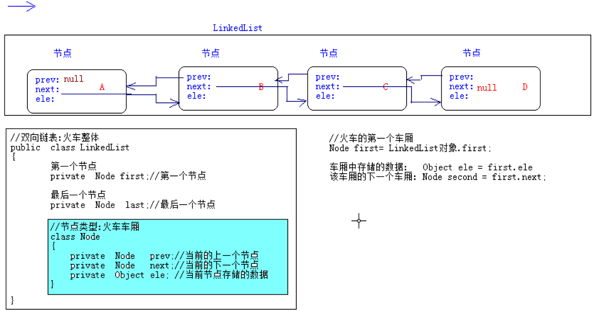
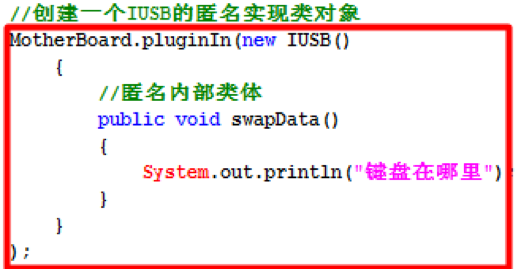
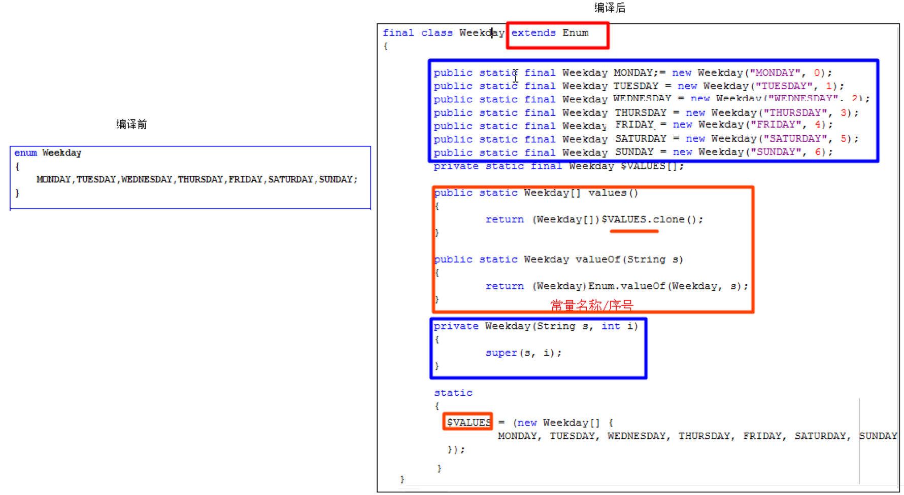
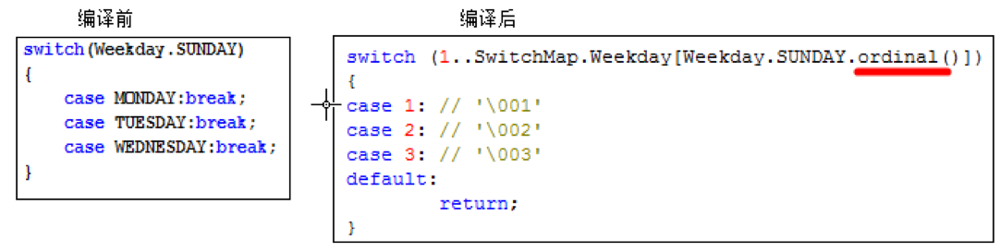

# 抽象类和抽象方法
# abstract
***使用abstract修饰且没有方法体的方法，称为抽象方法。***

特点：

- ①　使用抽象abstract修饰，方法没有方法体，留给子类去实现/覆盖。

- ②　抽象方法修饰符不能是private 和 final以及static，为什么？

- ③　抽象方法必须定义在抽象类或接口中。

- 一般的：习惯性把abstract写在方法修饰符最前面，一看就知道是抽象方法。

---------------------------------------------------------------------------------------------

***使用abstract关键字修饰的类。***

特点：

- ①　不能创建实例即不能new一个抽象类,即使创建出抽象类对象,调用抽象方法,根本没有方法体。

- ②　可以不包含抽象方法，若一旦包含，该类必须作为抽象类,`抽象类可以包含普通方法`(`留给子类调用的`),抽象类是有构造器的,子类构造器必须先调用父类构造器。

- ③　若`子类没有实现/覆盖父类所有的抽象方法`，那么子类也得作为抽象类(`抽象派生类`)。

- ④　`构造方法不能都定义成私有的`，否则不能有子类(创建子类对象前先调用父类构造方法)。

- ⑤　`抽象类不能使用final修饰`，因为必须有子类，抽象方法才能得以实现。

- ⑥　是不完整的类，需作为父类(必须要有子类)，功能才能得以实现。

***抽象类***:一般的,我们起名,习惯使用`Abstract`作为前缀,让调用者一看就知道是抽象类.

- 抽象类中`可以不存在抽象方法`,如此这样没有太大的意义,但是可以防止外界创建对象,所以我们会发现有些工具类没有抽象方法,但是也使用abstract来修饰..


***抽象类不能实例化：即不能创建对象***

抽象类和普通类的区别:

- 普通类有的成员(方法,字段,构造器),抽象类都有.

- 抽象类不能创建对象,抽象类中可以包含抽象方法.

```

abstract class Graph
{
    Graph (){}

    void doWork()
    {

    }

    abstract public Double getArea();
}

```


# 接口


***Java中的接口:***

专家说的:`多个抽象类的抽象就是接口.`

说人话:
- `在Java中最小的程序单元就是类,接口其实是一个特殊的类.`
- `Java中的接口表示规范,用于定义一组抽象方法,表示某一类事物必须具备的功能,要求实现类必须来实现该接口并提供方法实现.`


***定义类语法***: [public] class  类名{}

***定义接口语法***: [public]  interface  接口名{},(在这里还没有考虑接口的父接口等等).

 ***接口起名问题***: 
- 表示具有某些能力的.有人习惯以able/handler结尾. Walkable,表示可以行走的.

- 有的公司或个人,习惯以I打头,表示接口,如:IWalkable.java.

  ***成功编译之后,和类一样,具有一份字节码.***


***接口存在的成员:***

- 1):接口中没有构造器,推论:`接口不能创建对象`(不能 new ),接口中不能定义普通方法.

- 2):接口中定义的成员变量,实质是`全局静态常量`,默认使用  `public static final`来修饰.

  - public static final String NAME = "龙17";

- 3):接口中定义的方法都是公共的抽象方法,默认的使用  public abstract  来修饰方法.

  - public abstract void walk(); 一般的,我们在接口中定义方法,不喜欢使用修饰符.

- 4):接口中定义的内部类都是公共的静态内部类,默认使用public static来修饰内部类.

  - public static interface ABC{}

***标志接口***:接口中没有任何成员,就仅仅是一个接口的定义,就是一个标志,其他的类实现该接口,就属于该家族,我们可以通过第三方代码赋予该接口实现类特殊的功能(不推荐).

***常量接口***:有人喜欢使用接口来封装多个常量信息,我们称之为常量接口,其目的和常量类相同(`不推荐`).

咱们使用的接口,主要都包含了抽象方法.


```

interface IWalkable
{
    void walk();
}

interface ISwimable
{
    void swim();
}

interface Amphibbiousable extends IWalkable, ISwimable
{

}

```


## 接口的特点和接口的继承:

接口的特点：

- ①　没有构造方法，也不能显示定义构造器，不能实例化。
- ②　接口只能继承接口，不能继承类，且接口支持多继承(类是单继承关系)。
  - [修饰符] interface 接口名 extends  接口1,接口2
- ③　接口里的方法方法全是抽象的，默认修饰符是public abstract。
- ④　接口里的字段全是全局静态常量，默认修饰符是public static final。
- ⑤　接口里的内部类全是公共静态的，默认修饰符是public static。


类和类之间存在是继承关系: 使用`extends `来表示.
接口和接口之间只能是继承关系: 使用`extends `来表示.
接口和实现类之间只能是实现关系(继承关系),使用`implements`来表示.


## 接口的实现者:实现类.

  接口仅仅只是定义了某一类事物应该具有某些功能,但是没有提供任何实现.

  `此时,我们得提供类,再让该类去实现接口`, ***并覆盖接口中的方法***,从而实现类接口中定义的功能.

-----------------------------------------------------------------------------------------------

`接口和实现类之间的关系`,严格上称之为”`实现关系`”,使用`implements`来表示.

 但是在开发,有时候为了方便也把这个实现关系称之为`特殊继承关系.`

  所以可以这样理解:`接口是实现类的父类,实现类就是接口的子类.`


### 面向接口编程:

  `接口` `变量` = `创建实现类对象`;//体现了多态思想

  ***接口和实现类的多态关系才是我们见的最多的.***


类实现接口的语法: 一个类可以实现多个接口,从而也弥补了类的单继承问题.

`[修饰符]`class 实现类名 extends  父类 `implements` ***接口1***,***接口2***{}

注意:

***接口中的方法是公共的抽象的,所以实现类必须覆盖接口中的方法,并且方法必须使用public修饰.***


## 接口和抽象类的区别:

***相同点：***

- 1):都位于继承的顶端，用于被其他实现或继承。
- 2):都不能实例化。
- 3):都可以定义抽象方法，其子类/实现类都必须覆写这些抽象方法。 

***不同：***

- 1):接口没有构造方法，抽象类有构造方法。
- 2):抽象类可包含普通方法和抽象方法，`接口只能包含抽象方法`(***Java8之前***);
- 3):一个类只能继承一个直接父类(可能是抽象类)，接口是多继承的并且只支持一个类实现多个接口(接口弥补了Java的单继承)。
- 4):成员变量：接口里默认是`public static final`，抽象类是`默认包权限`。
- 5):方法：接口里默认是`public abstract`，抽象类默认是`默认包访问权限`。
- 6):内部类：接口里默认是`public static`，抽象类默认是`默认包访问权限`。

-----------------------------------------------------------

***如果接口和实现类可以完成相同的功能,尽量使用接口,面向接口编程.***
设计模式:接口 和抽象类集合使用的(适配器模式).


### 面向接口编程: 多态的好处:把实现类对象赋给接口类型变量,屏蔽了不同实现类之间的实现差异,从而可以做到通用编程.

```

interface IUSB
{
    void swapData();
}

class Mouse implements IUSB
{
    public void swapData()
    {

    }
}

class Print implements IUSB
{
    public void swapData()
    {

    }
}

// 主板 class MotherBoard
{
    private static IUSB[] usbs = new IUSB[6];
    private static int index = 0;

    public static void pluginIn(IUSB usb)
    {
        if (index == usbs.length)
        {
            //满了
  return;
        }

        usbs[index] = usb;
        index++;
    }

    public static void doWork()
    {
        for (IUSB usb:usbs) {

            if (usb != null)
            {
                usb.swapData();
            }

        }
    }

}

```


# 内部类


***内部类***:定义在类结构中的另一个类:

***类中的定义的成员***:

- 字段
- 方法
- 内部类

-------------------------------------------------------------------

***为什么使用内部类：***

- 1):`增强封装，把内部类隐藏在外部类之内，不许其他类访问内部类。`
- 2):内部类能提高代码的可读性和可维护性，把小型类嵌入到外部类中结构上代码更靠近。
- 3):内部类可以直接访问外部类的成员。


```

public class demo5ClassInClass {

    public  class In
    {

    }

}

```



## 四种内部类：

- ①　实例内部类： 内部类没有使用static修饰.
- ②　静态内部类： 内部类使用了static修饰.
- ③　局部内部类： 在方法中定义的内部类.
- ④　匿名内部类适合于仅使用一次使用的类,属于局部内部类的特殊情况：


对于每个内部类来说:Java编译器会生成独立.class文件.
***成员内部类***:外部类名$内部类名字
***局部内部类***:外部类名$数字内部类名称
***匿名内部类***:外部类名$数字


外部类的访问修饰符:`要么使用public`, `要么就缺省.`
内部类看做是外部类的一个成员,好比字段,那么内部类可以`使用public/缺省/protected/private修饰.`
还可以是static修饰.

## 实例内部类

实例内部类:

***没有使用static修饰内部类***,`说明内部类属于外部类的对象,不属于外部类本身.`

***特点:***

- 1: ***创建实例内部类前,必须存在外部类对象,通过外部类对象创建内部类对象***(`当存在内部类对象时,一定存在外部类对象`). 

  - Outter.Inner in = new Outter().new Inner();

- 2:`实例内部类的实例自动持有外部类的实例的引用,内部类可以直接访问外部类成员.`

- 3:***外部类中不能直接访问内部类的成员***,必须通过内部类的实例去访问.

- 4:`实例内部类中不能定义静态成员`,只能定义实例成员.

- 5:如果实例内部类和外部类存在同名的字段或方法abc,那么在内部类中:

  - this.abc:表示访问内部类成员.

  - 外部类.this.abc:表示访问外部类成员.


```

class Outter
{
    String name = "Outter.name";

    public void testOutter()
    {
        System.out.println(this.new Inner().age);
    }

    // 实例内部类
  class Inner
    {
        int age = 17;
        String name = "Inner.name";

        public void test()
        {
            String name = "Inner.test.name";

            System.out.println(name);
            System.out.println(this.name);
            System.out.println(new Outter().name);
        }
    }
}

public class demo5ClassInClass {

    public static void main(String[] args){

        Outter.Inner inner = new Outter().new Inner();
        inner.test();
    }

}


```
## 静态内部类:

***使用static修饰的内部类.***

特点:

1):静态内部类的实例不会自动持有外部类的特定实例的引用,在创建内部类的实例时,不必创建外部类的实例.

 Outter.Inner in = new Outter.Inner();

2):静态内部类可以直接访问外部类的静态成员,如果访问外部类的实例成员,必须通过外部类的实例去访问.

3):在静态内部类中可以定义静态成员和实例成员.

4):测试类可以通过完整的类名直接访问静态内部类的静态成员.

```

class Outter
{
    String name = "Outter.name";
    static String name2 = "Outter.name2";

    // 静态内部类
  static class Inner
    {
        static int age = 17;

        public void test()
        {
            System.out.println(name2);
            System.out.println(new Outter().name);
        }
    }
}

public class demo5ClassInClass {

    public static void main(String[] args){

        Outter.Inner inner = new Outter.Inner();
        inner.test();
    }

}


```
## 局部内部类----没什么价值
```

局部内部类(打死都不用):

在方法中定义的内部类,其可见范围是当前方法和局部变量是同一个级别.

1):不能使用public,private,protected,static修饰符.

2):局部内部类只能在当前方法中使用.

3):局部内部类和实例内部类一样,不能包含静态成员.

4):局部内部类和实例内部类,可以访问外部类的所有成员.

5):局部内部类访问的局部变量必须使用final修饰(在Java8中是自动隐式加上final,但是依然是常量,不能改变值).

  原因:如果当前方法不是main方法,那么当前方法调用完毕之后,当前方法的栈帧被销毁,方法内部的局部变量的空间全部销毁.

  然后局部内部类是定义在方法中的,而且在方法中会创建局部内部类对象,而局部内部类会去访问局部变量,当当前方法被销毁的时候,对象还在堆内存,依然持有对局部变量的引用,但是方法被销毁的时候局部变量以及被销毁了.

  此时出现:在堆内存中,一个对象引用着一个不存在的数据. 为了避免该问题,我们使用final修饰局部变量,从而变成常量,永驻内存空间,即使方法销毁之后,该局部变量也在内存中,对象可以继续持有.

```

## 匿名内部类(Anonymous)
***匿名内部类(Anonymous),是一个没有名称的局部内部类,适合只使用一次的类。***

在开发中经常有这样的类,只需要定义一次,使用一次就可以丢弃了,此时:不应该白白定义在一个文件中.

在JavaSE/Android的事件处理中:`不同的按钮点击之后,应该有不同的响应操作`,首先使用匿名内部类.

特点:

- 1):匿名内部类本身没有构造器,但是会调用父类构造器.

- 2):匿名类尽管没有构造器,但是可以在匿名类中提供一段实例初始化代码块,JVM在调用父类构造器后,会执行该段代码.

- 3):内部类处理可以继承类之外,还可以实现接口.

格式：

```
new  父类构造器([实参列表]) 或 接口()
{
  //匿名内部类的类体部分
}

```
注意：匿名内部类必须继承一个父类或者实现一个接口，但最多只能一个父类或实现一个接口。.




## 枚举

```

class Weekday
{
    private Weekday(){}

    public static final Weekday MONDAY = new Weekday();
    public static final Weekday TUESDAY = new Weekday();
    public static final Weekday WEDNESDAY = new Weekday();
    public static final Weekday THURSDAY = new Weekday();
    public static final Weekday FRIDAY = new Weekday();
    public static final Weekday SATURDAY = new Weekday();
    public static final Weekday SUNDAY = new Weekday();

}

class Employee
{
    private Weekday restday;

    public Weekday getRestday()
    {
        return restday;
    }

    public void setRestday(Weekday restday)
    {
        this.restday = restday;
    }

}

public class demo6M {

    public static void main(String[] args)
    {

        Employee e = new Employee();

        e.setRestday(Weekday.THURSDAY);
    }
}

```


```

enum Weekday
{
    MONDAY,
    TUESDAY,
    WEDNESDAY,
    THURSDAY,
    FRIDAY,
    SATURDAY,
    SUNDAY 
}
    
class Employee
{
    private Weekday restday;

    public Weekday getRestday()
    {
        return restday;
    }

    public void setRestday(Weekday restday)
    {
        this.restday = restday;
    }

}

public class demo6M {

    public static void main(String[] args)
    {

        Employee e = new Employee();

        e.setRestday(Weekday.THURSDAY);
    }
}

```




## 枚举类的特点:

枚举特点：[这样写没任何意义。每一个特点都是通过具体的原因引入的，不是在这里写总结。]

- ①　枚举的直接父类`java.lang.Enum`，但是不能显示继承`Enum`。
- ②　枚举就相当于一个类，可以定义构造方法、成员变量、普通方法和抽象方法。
- ③　`默认私有的造方法，即使不写访问权限也是private((假构造器,底层没有无参数构造器)。`
- ④　每个实例分别用一个全局常量表示，枚举类的对象是固定的，实例个数有限，`不能使用new关键字。`
- ⑤　枚举实例必须位于枚举体中的最开始部分，枚举实例列表的后要有分号与其他成员相分隔。
- ⑥　`枚举实例后有花括号时，该实例是枚举类的匿名内部类对象(查看编译后的class文件)。`


## 枚举的使用:

- 1):枚举中都是全局公共的静态常量,可以直接使用枚举类名调用.
  - Weekday day = Weekday.SATURDAY;

- 2):因为java.lang.Enum类是所有枚举类的父类,所以所有的枚举对象可以调用Enum类中的方法.

  - String name = 枚举对象.name(); //返回枚举对象的常量名称

  - int ordinal = 枚举对象.ordinal();//返回枚举对象的序号,从0开始.

  - String str = 枚举对象.toString():返回  枚举对象的常量名称

```

System.out.println(Weekday.TUESDAY.ordinal());
System.out.println(Weekday.WEDNESDAY.ordinal());
System.out.println(Weekday.THURSDAY.ordinal());

System.out.println(Weekday.MONDAY.toString());
System.out.println(Weekday.TUESDAY.toString());
System.out.println(Weekday.WEDNESDAY.toString());
System.out.println(Weekday.THURSDAY.toString());


```

- 3):编译器生成的枚举类的静态方法(从反编译代码中):

  枚举类型[] values();

 Weekday[] ws = Weekday.values();:返回当前枚举类型所有的常量,使用一个数组封装起来.

    - 枚举类型 valueof(String name);
```

Weekday[] ws = Weekday.values();

for (Weekday wsO: ws) {
    System.out.println(wsO.name());

}

```


 Weekday day = Weekday.valueOf("MONDAY");//把一个指定名称字符串转换为当前枚举类中同名的常量.

- 4):从java5开始出现枚举,switch也支持操作枚举类型.

 switch只支持int类型,支持枚举是因为底层使用的枚举对象的ordinal,而ordinal的类型依然是int类型.




## 枚举做单例
枚举的单例模式:
在<<effective java>>书中提到,建议使用枚举类做单例模式,很安全,即使`使用反射也不能创建对象.`

```

enum NV_GlobalSingleton2
{
    INSTANCE;

    public String  getUserID()
    {
        return "324-EFFE-344";
    }
}

```