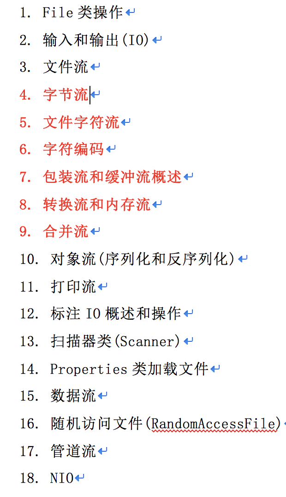

# 4. 字节流

案例1:文件拷贝案例-拷贝指定目录的指定类型文件到指定目录.
分析: `比如把C:/java目录中所有的java文件拷贝到D:/text/把拷贝的所有文件的拓展名改为.txt.`

## 文件拷贝案例

```

package IODemo;

import java.io.*;

/**
 * Created by codew on 2018/1/25.
 */
public class FileInputStreamCopy {

    public static void main(String[] args) throws Exception
    {

        // 1. 找到源目录所有的java文件
        File srcDir = new  File("/Users/codew/Desktop/Test/AAC");
        File destDir = new  File("/Users/codew/Desktop/Test/AAC/java");

        if (!destDir.exists()){

            System.out.println("没有这个文件夹");
            destDir.mkdirs();
        }

        File[] fs = srcDir.listFiles(new FilenameFilter() {
            @Override
            public boolean accept(File dir, String name) {
                
                return new File(dir, name).isFile() && name.endsWith(".java");
            }
        });

        // 2. 迭代出出每一个文件对象, 并拷贝

        for (File srcFile: fs) {

            // 创建流对象
            InputStream in = new FileInputStream(srcFile);
            OutputStream out = new FileOutputStream(new File(destDir, srcFile.getName()));
            // 读写操作
            byte[] buffer = new byte[1024];
            int len = -1;
            len = in.read(buffer);
            while (len != -1){

                out.write(buffer, 0, len);
                len = in.read(buffer);
            }

            // 关闭资源
            in.close();
            out.close();
        }

    }

}

```

## 案例2 获取进程数据-编译和运行java代码

```

package IODemo;

import java.io.File;
import java.io.FileOutputStream;
import java.io.InputStream;
import java.io.OutputStream;

/**
 * Created by codew on 2018/1/25.
 */


public class ProceessDemo {

    public static void main(String[] args) throws Exception
    {
        String str =  "System.out.println(\"一段文字\");";

//        System.out.println(str);
        eval(str);
    }

    // 执行str参数, 并在控制台打印
    private static void eval(String str) throws Exception{

        // 1. 使用StringBuilder拼接一个完整的HelloWorld 程序

        String nvClassName = "NVHello";
        String nvJava = ".java";

        StringBuilder sBuilder = new StringBuilder();
        sBuilder.append("public class NVHello{");

        sBuilder.append("public static void main(String[] args){");

        sBuilder.append(str);

        sBuilder.append("}");

        sBuilder.append("}");

        // 2. 保存到一个java文件中去
        OutputStream out = new FileOutputStream(nvClassName+nvJava);
        out.write(sBuilder.toString().getBytes());
        out.close();

        // 3. 调用javaC进程来编译NVHello.java
        Process javacProcess = Runtime.getRuntime().exec("javac"+ " " + nvClassName+nvJava);

        // 4. 读取javac进程中的错误流信息
        InputStream error = javacProcess.getErrorStream();
        // 读取流中的数据
        byte[] buffer = new byte[1024];
        int len = -1;
        while ( (len = error.read(buffer)) != -1){

            String msg = new String(buffer, 0, len);
            System.out.println(msg);
        }

        error.close();

        // 5. 调用java进程来运行NVHello.java
        Process javaProcess = Runtime.getRuntime().exec("java" + " " + nvClassName);

        // 6. 读取java进程中的流信息
        InputStream info = javaProcess.getInputStream();
        while ( (len = info.read(buffer)) != -1 ){

            String msg = new String(buffer, 0, len);
            System.out.println(msg);
        }

        info.close();

        // 7. 删除java和class文件
        new File(nvClassName+nvJava).delete();
        new File(nvClassName+".class").delete();
    }
}


```

# 文件字符流

文件的字节流:

- FileInputStream:
- FileOutputStream:

------------------------------------

使用`字节流`操作`汉字`或`特殊的符号`语言的时候,`容易乱码`,建议使用`字符流`.

`先有`字节流,`后有`字符流,字符流是对字节流的补充.

使用记事本打开某个文件,可以看到内容的就是文本文件,否则可以理解二进制.

一般的,操作二进制文件(图片,音频,视频等)必须使用字节流.

一般的,操作文本文件使用字符流.

  如果不清楚是哪一类型文件,使用字节流.

------------------------------------

文件的字符流:
- FileReader:
- FileWriter:


***flush(刷新)操作,输出流中都有flush方法:***

计算机访问外部设备(磁盘文件),要比直接访问内存慢很多,如果每次write都要直接写出到磁盘文件中,CPU都会花更多的时间,`此时我们可以准备一个内存缓冲区,程序每次write方法都是直接写到内存缓冲区中,当内存缓冲区满后,系统才把缓冲区内容一次性写出给磁盘文件.`

使用缓冲区的好处:

- 1:提高CPU使用率.

- 2:有机会回滚写入的数据.

***对于字节流,flush方法*** `不是都有作用(部分字节流才有作用,缓冲流),对于字符流都起作用.如果我们调用close方法,系统在关闭资源前,会先调用flush方法.`

-------------------------------------------------------

操作系统使用-1表示磁盘文件的结尾标记.

缓冲区大小一般使用容量整数倍,可以提高IO性能.

## 文件字符输入流

```

package IODemo.Writer_Reader;

import java.io.File;
import java.io.FileReader;

/**
 * Created by codew on 2018/1/25.
 */

// 文件字符输入流
public class FileReaderDemo {

    public static void main(String[] args) throws Exception {

        // 1. 创建源和目标

        File srcFile = new File("file/stream.txt");

        // 2. 创建操作对象, 字符输入流的对象
        FileReader fileReader = new FileReader(srcFile);
        // 3. 具体操作

        /*

        int reader(); // 每次读取 一个字符
        int reader(char[] cbuf); //
        */

        // 3.1 一个字符一个字符的读
//        int c = fileReader.read();
//        while ( c != -1){
//
//            System.out.println((char)c);
//            c = fileReader.read();
//        }

        // 3.2 多个字符的读
        char[] buffer = new char[5];
        int len = -1;
        len = fileReader.read(buffer);

        while (len != -1){

            System.out.println(buffer);
            len = fileReader.read(buffer);

        }

        // 4. 关闭

        fileReader.close();
    }
}

```


## 文件字符输出流

```

package IODemo.Writer_Reader;

import java.io.File;
import java.io.FileWriter;
import java.io.Writer;

/**
 * Created by codew on 2018/1/25.
 */


public class FileWriteDemo {

    public static void main(String[] args) throws Exception {

//        File

        // 1. 创建目标
        File destFile = new File("file/xx.txt");


        // 2. 创建字符输出流对象

        Writer out = new FileWriter(destFile);

        // 3.具体操作, 写操作
        /*
        void write(int c); // 向外写出一个字符
        void write(char cbuf[]);
        void write(char cbuf[], int off, int len);
        void write(String str);
        */
//        out.write('s');
//        out.write("opengl".toCharArray());
        //out.write("opengl".toCharArray(), 3, 2);
        out.write("opengl");

//        out.flush();
        // 4. 关闭流
        out.close();

    }
}

```


## 使用文件字符流完成文件的拷贝(存文本文件)

```

package IODemo.Writer_Reader;

import java.io.*;

/**
 * Created by codew on 2018/1/25.
 */
public class FileCopyDemo {


    public static void main(String[] args) throws Exception {

        // 1. 创建源
        File srcFile = new File("file/xx.txt");
        File desFile = new File("file/ch_copy.txt");

        // 2. 创建输出和输出流对象
        Reader in = new FileReader(srcFile);
        Writer out = new FileWriter(desFile);

        // 3. 读写操作
        char[] buffer = new char[100];
        int len = -1;

        while ( (len = in.read(buffer)) != -1){

            out.write(buffer, 0, len);
        }

        // 4.关闭资源
        out.close();
        in.close();
    }
}


```
# 字符编码

## 字符编码的发展历程:

阶段1:

> 计算机只认识数字,我们在计算机里一切数据都是以数字来表示,因为英文符号有限,所以规定使用的字节的最高位是0.每一个字节都是以0~127之间的数字来表示,比如A对应65,a对应97.这就是美国标准信息交换码-ASCII.

阶段2:

> 随着计算机在全球的普及,很多国家和地区都把自己的字符引入了计算机,比如汉字.此时发现一个字节能表示数字范围太小,不能包含所有的中文汉字,那么就规定使用两个字节来表示一个汉字.规定:原有的ASCII字符的编码保持不变,仍然使用一个字节表示,为了区别一个中文字符与两个ASCII码字符,中文字符的每个字节最高位规定为1(中文的二进制是负数).这个规范就是GB2312编码,后来在GB2312的基础上增加了更多的中文字符,比如汉字,也就出现了GBK.

阶段3:

> 新的问题,在中国是认识汉字的,但是如果把汉字传递给其他国家,该国家的码表中没有收录汉字,其实就显示另一个符号或者乱码.为了解决各个国家因为本地化字符编码带来的影响,咱们就把全世界所有的符号统一进行编码-Unicode编码.此时某一个字符在全世界任何地方都是固定的,比如'哥',在任何地方都是以十六进制的54E5来表示.Unicode的编码字符都占有2个字节大小.

--------------------------------------------------------------------------------------------------------------

常见的字符集:

- ASCII: 占一个字节,只能包含128个符号. 不能表示汉字
- ISO-8859-1:(latin-1):占一个字节,收录西欧语言,.不能表示汉字.
- ANSI:占两个字节,在简体中文的操作系统中 ANSI 就指的是 GB2312.
- GB2312/GBK/GB18030:占两个字节,支持中文.
- UTF-8:是一种针对Unicode的可变长度字符编码，又称万国码,是Unicode的实现方式之一。
- 编码中的第一个字节仍与ASCII兼容，这使得原来处理ASCII字符的软件无须或只须做少部份修改，即可继续使用。因此，它逐渐成为电子邮件、网页及其他存储或传送文字的应用中，优先采用的编码。互联网工程工作小组（IETF）要求所有互联网协议都必须支持UTF-8编码。

UTF-8 BOM:是MS搞出来的编码,默认占3个字节,不要使用这个. 
```

存储字母,数字和汉字:
存储字母和数字无论是什么字符集都占1个字节.
存储汉字:  GBK家族占两个字节,UTF-8家族占3个字节.
不能使用单字节的字符集(ASCII/ISO-8859-1)来存储中文.

```

字符的编码和解码操作:

  编码: 把字符串转换为byte数组.

  解码: 把byte数组转换为字符串.

一定要保证编码和解码的字符相同,否则乱码.


### 编码和解码

```

package IODemo.Writer_Reader;

import java.util.Arrays;

/**
 * Created by codew on 2018/1/25.
 */

public class EncodingDemo {

    public static void main(String[] args) throws Exception {

        String msg = "着色器";
        // 编码操作 String--->byte[]

        byte[] data = msg.getBytes("UTF-8");
        System.out.println(Arrays.toString(data));

        // 解码操作: byte[] --> String
        String ret = new String(data, "ISO-8859-1");
        System.out.println(ret);

        // 中文乱码
        // 解决方案

        data = ret.getBytes("ISO-8859-1");
        System.out.println(Arrays.toString(data));
        ret = new String(data, "UTF-8");
        System.out.println(ret);
    }
}

```


# 包装流和缓冲流

***处理流/包装流(相对于节点流更高级)装饰设计模式/包装模式:***

- 1:隐藏了底层的节点流的差异,并对外提供了更方便的输入/输出功能,让我们只关心高级流的操作.
- 2:使用处理流包装了节点流,程序直接操作处理流,让节点流与底层的设备做IO操作.
- 3:`只需要关闭处理流即可.`

***包装流如何区分:写代码的时候,发现创建l流对象对象的时候,需要传递另一个流对象.***

 new 包装流( 流对象 ) ;

***什么是缓冲流:***

  是一个包装流,目的起缓冲作用.

- BufferedInputStream:
- BufferedOutputStream:
- BufferedReader:
- BufferedWriter:

***缓冲流的目的:***

  操作流的时候,习惯定义一个byte/char数组.

 int read():每次都从磁盘文件中读取一个字节.  直接操作磁盘文件性能极低.

  解决方案: 定义一个数组作为缓冲区.

   byte[] buffer = new byte[1024]; 该数组其实就是一个缓冲区.

  一次性从磁盘文件中读取1024个字节. 如此以来,操作磁盘文件的次数少了,---->性能得以提升.

  `既然我们都能想到,SUN公司早就想到了,提供的默认缓存区大小是8192(1024*8),我们一般不用修改大小.`


## 字节缓冲流
```

package IODemo.Buffer;

import java.io.BufferedInputStream;
import java.io.BufferedOutputStream;
import java.io.FileInputStream;
import java.io.FileOutputStream;

/**
 * Created by codew on 2018/1/25.
 */
public class BufferedStreamDemo {

    public static void main(String[] args) throws Exception
    {
        // 字节缓冲输出流

        BufferedOutputStream bos = new BufferedOutputStream(new FileOutputStream("stream.txt", true));
        bos.write("hello opengl shader, Metal".getBytes());
        bos.close();

        // 字节缓冲输入流
        BufferedInputStream bin = new BufferedInputStream(new FileInputStream("stream.txt"));
        byte[] buffer = new byte[1024];
        int len = -1;

        len = bin.read(buffer);
        while (len != -1){

            System.out.println(new String(buffer, 0, len));
            len = bin.read(buffer);
        }
        bin.close();
    }
}

```

## 字符缓冲流

```


```