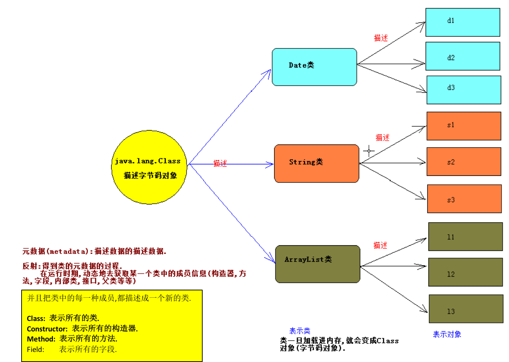

# 类加载机制

***JVM和类:***

运行Java: java 带有main方法的类名

启动JVM,并加载字节码.

-----------------------------------------------------------------

当调用	`java命令来运行某个Java程序时`,该命令将会启动一个JVM进程.同一个JVM中的所有线程,变量都处于同一个进程中,共享该JVM的内存区域.

当出现以下情况是,***JVM***会退出:

- 1):程序正常执行结束.
- 2):使用System.exit(0)方法;
- 3):出现异常时,没有捕获异常.
- 4):平台强制结束JVM进程.

***JVM进程一旦结束,该进程中内存中的数据将会丢失.***


当程序主动使用到某个类时,如果该类还未被加载进内存中,则系统会通过加载,连接,初始化三个步骤来对该类进行初始化操作.

***1):类的加载:***

类加载时指将类的`class文件(字节码文件)`载入内存中,并为之创建一个`java.lang.Class`对象,我们称之为字节码对象.

类的加载过程由类加载器(`ClassLoader)完成`,`类加载器通常有JVM提供,我们称之为系统类加载器`,我们也可以继承ClassLoader类来提供自定义类加载器.

不同的类加载器可以`实现加载本地字节码文件,jar包中的字节码,通过网络加载字节码`等.

***2):类的连接:***

当类被加载进内存之后,系统为之生产一个对应的Class对象,接着把类的二进制数据合并到JRE中.

- 1>:验证:检测被加载的类是否有正确的内部结构.

- 2>:准备:负责为类的static变量分配内存,并设置默认值.

- 3>:解析:把类的二进制数据中的符号引用替换为直接引用(深入分析JVM).

***3):类的初始化:***

在此阶段,JVM负责对类进行初始化,主要就是对static变量进行初始化.

 类的初始化一个类包含以下几个步骤:

- 1>:如果该类还未被加载和连接,则程序先加载并连接该类.

- 2>:如果该类的直接父类还未被初始化,则先初始化其父类.

- 3>:如果类中有初始化语句(静态代码块),则系统依次执行这些初始化语句.

----------------------------------------

符号引用:

符号引用是一个字符串，它给出了被引用的内容的名字并且可能会包含一些其他关于这个被引用项的信息——这些信息必须足以唯一的识别一个类、字段、方法。

这样，对于其他类的符号引用必须给出类的全名。

# 什么是反射

***问题1:***

1.对象有编译类型和运行类型

 Object obj = new java.util.Date();

 编译类型: Object

  运行类型: java.util.Date

***需求:通过obj对象,调用java.util.Date类中的toLocaleString方法.***

 obj.toLocaleString(); 此时编译报错, 编译时,会检查该编译类型中是否存在toLocaleString方法.

  如果存在,编译成功,否则编译失败.

  解决方案,因为obj的真实类型是java.util.Date类,所以我们可以把obj对象强制转换为java.util.Date类型.

```

java.util.Date d = (java.util.Date)obj;
d.toLocaleString();//调用成功

```
  `如果不知道obj的真实类型`,就不能强转.(底层有一个方法,返回一个Object类型的java.util.Date对象).

  此时问题如何解决?

***问题2:***
  我在面向对象中提及到,`一切事物都可以看成是对象,`那么问题来了,类这种事物是啥对象呢?`又使用什么类来表示类这种对象呢?`



***元数据(metadata)***:描述数据的描述数据

***反射:得到类的元数据的过程, 在运行时期,动态的去获取某一类的成员信息(构造器, 方法, 字段, 内部类, 接口, 父类)***

并且把类中的每一种成员,都描述成一个新的类.
- Class: 表示所有的类.
- Constructor: 表示所有的构造器.
- Method: 表示所有的方法.
- Field: 表示所有的字段.


# Class类和Class实例

***Class类***: 用来描述类或者接口的类型,描述类的类.

***Class类的实例***: 在`JVM中的一份份字节码`,Class实例表示在JVM中的类或者接口,枚举是一种特殊的类,注解是一种特殊的接口.

当程序第一次使用某一个java.util.Date类的时候,就会把该类的字节码对象加载进JVM,并创建出一个Class对象.
`此时的Class对象就表示java.util.Date的字节码.`

Class类可以表示N个类的字节码对象,问题,到底怎么区分Class类此时表示的那一个类的字节码呢?为了解决该问题,Class类的设计者提供了`泛型.`--->Class<T>.

java.lang.String类的字节码类型: Class<java.lang.String>;

java.util.Date类的字节码类型: Class<java.util.Date>;

java.util.ArrayList类的字节码类型: Class<java.util.ArrayList>;

----------------------------------------------------------------------------------------------

如何创建Class对象,如何来表示一个字节码对象?


```

package ClassDemo;

/**
 * Created by codew on 2018/1/29.
 */
public class ClassInstanceDemo {

    public static void main(String[] args) throws Exception{

        // 需求:获取java.util.Date 类的字节码对象
        // 方式一: 使用class属性
        Class<java.util.Date> clazz = java.util.Date.class;

        // 方式二:通过对象的getClass方法来获取, getClass是Object类中的方法
        /*
        */
        java.util.Date date = new java.util.Date();
        Class<?> clz = date.getClass();


        // 方式三:
        Class<?> clz2 = Class.forName("java.util.Date");


        System.out.println(clazz);
        System.out.println(clz);
        System.out.println(clz2);

System.out.println(clazz == clz2);
System.out.println(clazz == clz);
System.out.println(clz2 == clz);
    }

}

```

`注意:同一个类在JVM中只存在一份字节码对象,也就说上述,claz1 == clz2 == clz3;`
***以后使用最多的是第三种,在框架中大量使用.***


### 九大内置Class实例
`问题`:在上述讲了三种获取Class对象的方式,基本数据类型不能表示为对象,也就不能使用getClass的方式,基本类型没有类名的概念,也不能使用Class.forName的方式,如何表示基本类型的字节码对象呢?

  `所有的数据类型都有class属性.`
`Class clz = 数据类型.class;`

***九大内置Class实例***: JVM中预先提供好的Class实例,分别:`byte` , `short` , `int` ,`long`, `float` ,`double`, `boolea` , `char `, `void`.

  表示:byte.class,short.class,int.class,....void.class.

在8大基本数据类型的包装类中,都有一个常量:TYPE,用于返回该包装类对应基本类的字节码对象.

System.out.println(Integer.TYPE == int.class);//true

注意:Integer和int是不同的数据类型

System.out.println(Integer.class == int.class);//false


------------------------------------------------------------------------------------------

***数组的Class实例***:数组是引用数据类型,数组其实是对象.

如何来表示数组的Class实例.

  方式1: 数组类型.class;

  方式2: 数组对象.getClass();

注意:所有的具有相同的`维数`和相同`元素类型`的数组共享同一份字节码对象,`和元素没有关系.`

------------------------------------------------------------------------------------------

Class: `描述所有的类型,所以Class类中应该具有所有类型的相同的方法.`

Object: `描述所有的对象,所以在Object类中应该具有所有对象的共同的方法.`

# 获取类中的构造器
需求:通过反射来获取某一个类的构造器:

- 1):获取该类的字节码对象.
- 2):从该字节码对象中去找需要获取的构造器.

------------------------------------------------------------------------

Class类获取构造器方法:

`Constructor类`:表示类中构造器的类型,Constructor的实例就是某一个类中的某一个构造器

public Constructor<?>[] getConstructors():该方法只能获取当前Class所表示类`的public修饰的构造器`

public Constructor<?>[] getDeclaredConstructors():获取当前Class所表示类的***所有的构造器***,`和访问权限无关`

public Constructor<T> getConstructor(Class<?>... parameterTypes) :获取当前Class所表示类中指定的`一个public的构造器

   参数:parameterTypes表示:构造器参数的Class类型`

 如:public User(String name)

 Constructor c = clz.getConstructor(String.class);

public Constructor<T> get`DeclaredConstructor`(Class<?>... parameterTypes) :获取当前Class所表示类中指定的一个的构造


```

package ClassDemo;

import java.lang.reflect.Constructor;

/**
 * Created by codew on 2018/1/29.
 */

class User{

    public User(){

    }

    public User(String name){

    }
    private User(String name, int age){

    }
}

//  获取构造器
public class ConstructorTestDemo {

    public static void main(String[] args) throws Exception{

//        getAll();
        getOne();
    }

    // 获取指定的构造器
    private static void getOne() throws Exception{
        // 1.获取构造器所在类的字节码对象
        Class<User> clz = User.class;

        // public Constructor<T> getConstructor(Class<?>... parameterTypes) :获取当前Class所表示类中指定的`一个public的构造器
        // 2. 获取public User()
        Constructor<User> con = clz.getConstructor();
        System.out.println(con);


        // public Constructor<T> get`DeclaredConstructor`(Class<?>... parameterTypes) :获取当前Class所表示类中指定的一个
        // public User(String name)
        con = clz.getConstructor(String.class);
        System.out.println(con);

//        private User(String name, int age)
        con = clz.getDeclaredConstructor(String.class, int.class);
        System.out.println(con);
    }

    private static void getAll(){

        // 1.获取构造器所在类的字节码对象
        Class<User> clz = User.class;

        // 2. 获取clz对象中所有的构造器
        // public Constructor<?>[] getConstructors():该方法只能获取当前Class所表示类`的public修饰的构造器`
//        Constructor<?>[] constructors = clz.getConstructors();
//        for (Constructor c: constructors) {
//            System.out.println(c);
//        }
        // public Constructor<?>[] getDeclaredConstructors():获取当前Class所表示类的***所有的构造器***,`和访问权限无关`
        Constructor<?>[] constructors = clz.getDeclaredConstructors();
        for (Constructor c: constructors) {
            System.out.println(c);
        }

    }
}


```


# 使用反射调用构造器

构造器最大的作用:创建对象.

为什么使用反射创建对象,为什么不直接来new呢?

在框架中,提供给我们的都是字符串.

-----------------------------------------------------------

***使用反射创建对象:***

步骤:
- 1);找到构造器所在类的字节码对象.
- 2):获取构造器对象.
- 3):使用反射,创建对象

-----------------------------------------------------------

Constructor<T>类:表示类中构造器的类型,Constructor的实例就是某一个类中的某一个构造器

常用方法:

public T `newInstance(Object... initargs):`如调用带参数的构造器,只能使用该方式.

 参数:`initargs:表示调用构造器的实际参数`

 返回:返回创建的实例,T表示Class所表示类的类型

`如果:一个类中的构造器` `是外界可以直接访问,同时没有参数`.,那么可以`直接使用Class类中的newInstance方法创建对象.`

 public Object newInstance():相当于new 类名();

调用私有的构造器:


```

package ClassDemo;

import java.lang.reflect.Constructor;

/**
 * Created by codew on 2018/1/29.
 */

class Person
{
    public Person(){

        System.out.println("无参数");
    }

    public Person(String name){

        System.out.println("名字:" + name);
    }

    private Person(String name, int age){

        System.out.println("name:" + name + " " + "age:" + age);
    }
}

public class ConstructorCreateObjDemo {

    public static void main(String[] args) throws Exception{

        // 传统方式
        new Person("xx");


        // =====================
//        Class<Person> clz = Person.class;
//        Constructor<Person> con = clz.getConstructor();
//        con.newInstance();


        // =====================
//        public Person(String name)

//        Class<Person> clz = Person.class;
//        Constructor<Person> con = clz.getConstructor(String.class);
//        con.newInstance("lucy");

        // =====================
//        private Person(String name, int age)
        // 方法是私有的,,so
//        Class<Person> clz = Person.class;
//        Constructor<Person> con = clz.getDeclaredConstructor(String.class, int.class);
//        System.out.println(con);
//        // 设置当前构造器可以访问
//        con.setAccessible(true);
//        con.newInstance("lucy", 17);

        // =====================
        // `如果:一个类中的构造器` `是外界可以直接访问,同时没有参数`.,那么可以`直接使用Class类中的newInstance方法创建对象.`
        Class<Person> clz = Person.class;
        clz.newInstance();
    }
}

```

# 获取类中的方法 
使用反射获取类中的方法:

- 1):获取方法所在类的字节码对象.
- 2):获取方法.

------------------------------------------------------------------------

Class类中常用方法:

- public Method[] getMethods():获取`包括自身和继承过来的所有的public方法`

- public Method[] getDeclaredMethods():`获取自身类中所有的方法(不包括继承的,和访问权限无关)`

public Method getMethod(String methodName,Class<?>... parameterTypes):表示调用指定的一个公共的方法(包括继承的)

  参数:
- `methodName: 表示被调用方法的名字`
- `parameterTypes:表示被调用方法的参数的Class类型如String.class`

public Method getDeclaredMethod(String name,Class<?>... parameterTypes):表示调用指定的一个本类中的方法(不包括继承的)
 参数:
- methodName: 表示被调用方法的名字
- parameterTypes:表示被调用方法的参数的Class类型如String.class

```

package ClassDemo.MethodDemo;

import java.lang.reflect.Method;

/**
 * Created by codew on 2018/1/29.
 */
class User{

    public User(){

    }

    public void doWorkObj()
    {

    }

    public static void doWork()
    {

    }

    public static void doWork(String name)
    {

    }

    private String sayHello(String msg, int count)
    {
        return "说:" + msg + " " + "count:" + count;
    }
}


public class MethodDemoTest {

    public static void main(String[] args) throws Exception{

        getOne();
    }

    // 获取User类中指定的一个方法
    private static void getOne() throws Exception
    {
        Class clz = User.class;

        // 获取没有参数方法
        Method m = clz.getMethod("doWork");
        System.out.println(m);

        // 获取有参数
        m = clz.getMethod("doWork", String.class);
        System.out.println(m);

        // 获取两个参数
        m = clz.getDeclaredMethod("sayHello", String.class, int.class);
        System.out.println(m);
    }
    // 获取User类中所有的方法
    private static void getAll() throws Exception
    {
        Class clz = User.class;

        // 获取本类加父类的所有方法
        Method[] ms = clz.getMethods();
        System.out.println(ms.length);
        for (Method m: ms) {

            System.out.println(m);
        }

        System.out.println("===============================");
        // 只获取本类的方法
        ms = clz.getDeclaredMethods();
        System.out.println(ms.length);
        for (Method m: ms) {

            System.out.println(m);
        }
    }

}

```

# 使用反射调用方法
# 使用反射调用静态方法和数组参数
使用反射调用静态方法:

  静态方法不属于任何对象,静态方法属于类本身.

  此时把invoke方法的第一个参数设置为null即可.

--------------------------------------------------------------------------------

使用反射调用数组参数(可变参数):

  王道:调用方法的时候把实际参数统统作为Object数组的元素即可.

 Method对象.invoke(方法底层所属对象,new Object[]{  所有实参  });

```

package ClassDemo;


import java.lang.reflect.Method;
import java.util.Arrays;

/**
 * Created by codew on 2018/1/29.
 */

class Emloyee
{

    // =============================================================类
    // 无返回 无参数
    public static void doWork()
    {
        System.out.println("doWork, 无参数");
    }

    // 无返回 有参数
    public static void doWork(String name)
    {
        System.out.println("doWork, name:" + name);
    }

    // 又返回 多参数
    public static int doWork(String name, int age)
    {
        System.out.println("doWork, name:" + name + " " + "age:" + age);

        return age;
    }

    // 有返回 有参数 私有方法
    private static int doWorkP(String name, int age)
    {
        System.out.println("doWork私有方法, name:" + name + " " + "age:" + age);

        return age;
    }
    // =============================================================对象
    public void objMethod()
    {
        System.out.println("对象方法:objMethod");
    }

    // 对象方法多参数
    public void objMethodMoreArgs(String name, int age, float cm)
    {
//        System.out.println("对象方法多参数: name:" + name + " " + "age:" + age + " " + "cm:" +cm);

        System.out.printf("对象方法多参数: name %s, name: %d, cm:%f", name, age, cm);
    }


    public void objMethod(String name)
    {
        System.out.println("对象方法: name:" + name);
    }

    // =============================================================类, 可变参数
    public static void doWorkMutable(int... arr)
    {
        System.out.println("doWorkMutable," + Arrays.toString(arr));
    }

    public static void doWorkMutable(String... arr)
    {
        System.out.println("doWorkMutable," + Arrays.toString(arr));
    }
}


// 使用反射调用数组参数()
public class MethodInvokeDemo2 {

    public static void main(String[] args) throws Exception{

        Class clz = Emloyee.class;
        Method m = clz.getMethod("doWork");
// =============================================================类
//        // 类方法=====> 调用无参数
//
//        m.invoke(null);
//        m.invoke(clz.newInstance());// clz.newInstance() // 前提是类提供了一个公共无参数的构造器
//
//
//        //类方法=====> 调用有参数
//        m = clz.getMethod("doWork", String.class);
//        m.invoke(null, "lucy");
//
//        //类方法=====> 有参数, 有返回值
//        m = clz.getMethod("doWork", String.class, int.class);
//       Object ob = m.invoke(null, "lucy", 22);
//       System.out.println(ob);
//
//
//       //类方法=====> 私有方法
//        m = clz.getDeclaredMethod("doWorkP", String.class, int.class);
//        m.setAccessible(true);
//        ob = m.invoke(null, "lili", 19);
//        System.out.println(ob);
// =============================================================对象

//        // 对象方法====> 类方法无所谓, 如果是调用对象方法,必须要传对象进去
//        m = clz.getMethod("objMethod");
//        m.invoke(clz.newInstance());
//
//        // 对象方法====> 类方法无所谓, 如果是调用对象方法,必须要传对象进去
//        m = clz.getMethod("objMethod", String.class);
//        m.invoke(clz.newInstance(), "cicy");
//
//
//        // 对象方法====> 类方法无所谓, 如果是调用对象方法,必须要传对象进去
//        // objMethodMoreArgs
//        // 去找无参数的方法,实际山没有调用是传了很多参数, 并没有报错,实际上没执行
//        m = clz.getMethod("objMethodMoreArgs");
////        m.invoke(clz.newInstance(), "cicy", 17, 120.9f);
//        m.invoke(clz.newInstance());
////
////        m = clz.getMethod("objMethodMoreArgs", String.class, int.class, float.class);
////        // 对象方法参数很多, 你传的实参数不够也会报错
//////        m.invoke(clz.newInstance(), "cicy");
////        m.invoke(clz.newInstance(), "cicy", 17, 120.9f);


        // =============================================================类, 可变参数
        m = clz.getMethod("doWorkMutable", int[].class);
        m.invoke(null, new int[]{1,2,3,4,6});

        m = clz.getMethod("doWorkMutable", String[].class);

        m.invoke(null, new Object[]{ new String[]{"s","s0","s"} });
//        m.invoke(null, new String[]{"1","2","2"});
//
//        m.invoke(null, new Object[])new String[]{"1","2","2"}
    }

}

```

# 操作反射其他AIP
反射其它的API:

Class类中:

- int getModifiers():获得修饰符

- String getName():返回类的全限定名

- Package getPackage():获得该类的包

- String getSimpleName():获得类的简单名字

- Class getSuperclass():获得类的父类

- boolean isArray():判断该Class实例是否是数组

- boolean isEnum() :判断该Class实例是否是枚举

-  Constructor,Method,Filed的信息:

 去查阅相应类的API即可.


```

package ClassDemo.ClassOtherAPI;

import java.lang.reflect.Constructor;
import java.lang.reflect.Modifier;

/**
 * Created by codew on 2018/1/29.
 */

enum Gender{

    ONE,TWO,THREE
}

abstract public class ClassOtherAPIDemo {

    public static void main(String[] args) throws Exception{

        Class clz = ClassOtherAPIDemo.class;
        int mod = clz.getModifiers();
        String m = Modifier.toString(mod);
        System.out.println(m);

        System.out.println(clz.getName());
        System.out.println(clz.getSimpleName());
        System.out.println(clz.getPackage());
        System.out.println(clz.getPackage().getName());

        System.out.println(clz.getSuperclass());


        Constructor con = Gender.class.getDeclaredConstructor();
        con.setAccessible(true);
        con.newInstance();
    }
}

```

```

arraycopy

public static void arraycopy(Object src,
                             int srcPos,
                             Object dest,
                             int destPos,
                             int length)

```

**参数：**

`src` - 源数组。

`srcPos` - 源数组中的起始位置。

`dest` - 目标数组。

`destPos` - 目标数据中的起始位置。

`length` - 要复制的数组元素的数量。


```

package ClassDemo.ArrayTest;

import java.lang.reflect.Array;
import java.util.Arrays;

/**
 * Created by codew on 2018/1/29.
 */
public class ArrayTestDEmo {


    public static void main(String[] args) throws Exception{


    }

    public static void arraycopy(Object src,
                                 int srcPos,
                                 Object dest,
                                 int destPos,
                                 int length)
    {
        
        if (src == null || dest == null){
            
            throw new NullPointerException("原数组和目标数组都不能为null");
        }
        
        if (!src.getClass().isArray() || !dest.getClass().isArray()){
            
            throw new ArrayStoreException("源和目标都必须是数组");
        }
        
        if (srcPos < 0 || destPos < 0 || length < 0 || 
                srcPos + length > Array.getLength(src) ||
                destPos + length > Array.getLength(dest)){
            
            throw new IndexOutOfBoundsException("索引越界");
        }
        
        if (src.getClass().getComponentType() != dest.getClass().getComponentType()){
            
            throw new ArrayStoreException("目标和源的元素类型必须相同!");
        }

        for (int index = srcPos; index < srcPos + length; index++) {
            
            Object val = Array.get(src, index);
            
            Array.set(dest, destPos, val);
            destPos++;
        }
        
    }
    private void test()
    {
        Object arr = new int[]{12, 323, 23, 22};
        Array.set(arr, 2, 100);

        int val = Array.getInt(arr, 2);
        System.out.println(val);
    }
}

```
# 加载资源文件路径
三种方法. 

前提注意点` 加载properties文件,只能使用Properties类的load方法.` 

