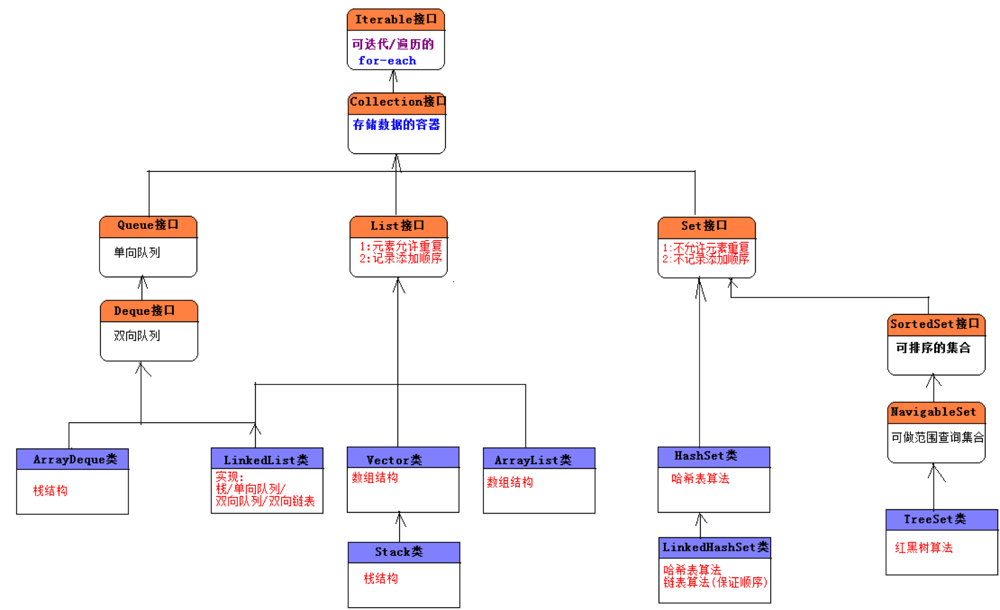
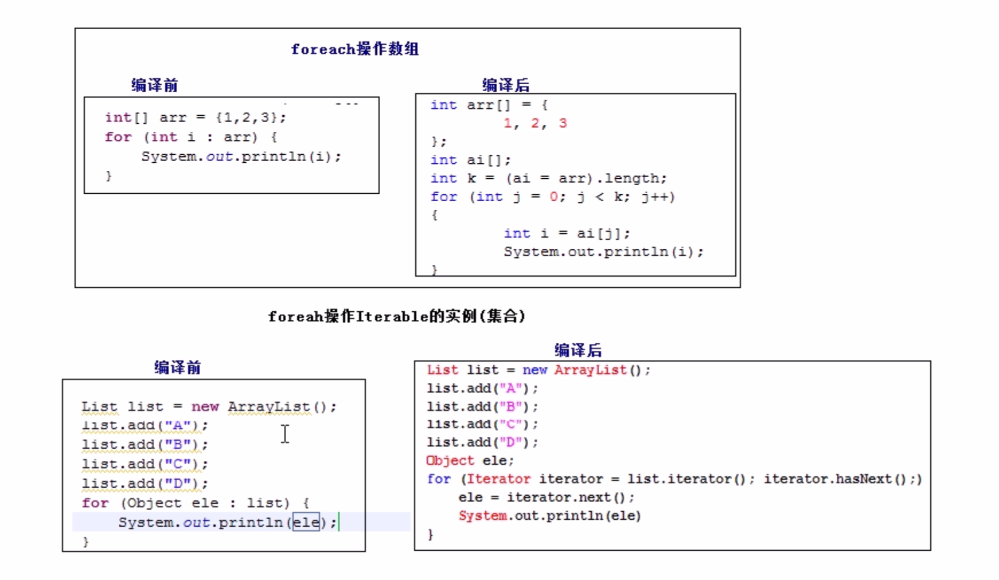
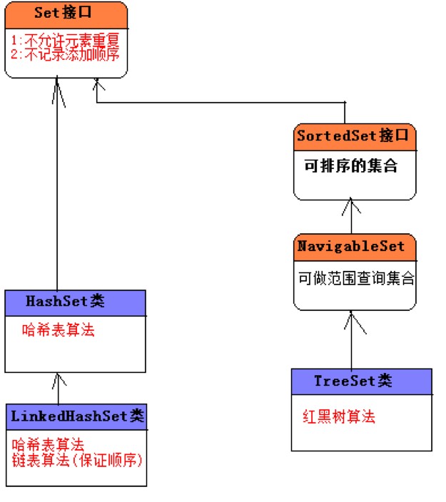

#集合体系




# Vertor , Stack

# ArrayList
我的手机  09:20:44
ArrayList类是 ava集合框架出现之后用来取代Vector类的:
二者底层原理都是基于数组的算法,一模一样.
区别:
- 线程安全但是性能较低.适用于多线程环境.
- Vector: 所有的方法都使用了synchronized修饰符.
线程不安全但是性能较高.
ArrayList:所有的方法都没有使用synchronized修饰符.

***多线程下获取一个线程安全的***
ArrayList list = Collections.synchronizedist(ew ArraylLi+..);
常用方法参照与Vector类
阅读源代码发现,vector和ArrayList 的源代码差异有点大(从设计上考虑).
I
有的时候某个方法需要返回一个ArrayList对象,需要返回一个空集合.


# LinkedList

LinkedList类是`双向链表`，`单向队列`，`双向队列栈`的实现类:
LinkedList类实现单向队列和双向队列的接口，自身提高了栈操作的方法，链表操作的方法
在LinkedList类中存在很多方法,但是功能都是相同的.LinkedList表示了多种数据结构的实现，每一种数
据结构的操作名字不同
T_
LinkedList类是线程不安全的类，在多线程环境下所有保证线程安全.
`List list = Collections.synchronizedList(new LinkedList(...));`


> 无论是链表还是队列，都特别擅长操作头和尾的节点

>  在LinkedList中大多数方法都是xFirst/xxLast的.


在LinkedList中存在Object get(int index),表示根据索引位置获取对应的元素.
链表没有索引的概念，本不应该有索引,但是从Java2开始，存在了集合框架，让LinkedList类作为了List接口
的实现类,List中提供了该根据索引查询元素的方法,LinkedList内部类提供了一个变量来当做索引
该方法要少用，因为Linkedlist不擅长做查询操作.`擅长最保存和删除操作`

# for和 foreach

***深入分析for-each和迭代器:***
- 1):foreach可以操作数组:  ***底层依然采用for循环索引来获取数组元素.***
- 2):foreach可以操作Iterable的实例:***底层其实采用的terator(迭代器).*** 
直接使用foreach迭代数组和集合元素即可，简单


# 边遍历边删除
 会报错ConcurrentModificationException


解决方法

```

package ArrayListDemoTP;

import java.util.*;

/**
 * Created by codew on 2018/1/31.
 */


public class ArrayListDemoTest {

    public static void main(String[] args){

        testFor();
    }


    private static void testFor(){

        List list = new ArrayList();
        list.add("A");
        list.add("B");
        list.add("C");
        list.add("D");
        list.add("E");

//        for (Object obj: list) {
//
//            System.out.println(obj);
//
//            if (obj.equals("C")){
//                System.out.println("看到C罗~");
//
//                list.remove(obj);
//            }
//        }

        Iterator it = list.iterator();
        while (it.hasNext()){

            Object object = it.next();

            if (object.equals("C")){
                System.out.println("看到C罗~");

                it.remove();
            }
        }
        System.out.println(list);


    }

    private static void testLinkedList(){

        LinkedList linkedList = new LinkedList();
        linkedList.add("hi Android");
        linkedList.add("hi openGL");
        linkedList.add("hi Shader");
        linkedList.add("hi iOS");


       String str = (String)linkedList.get(3);
        System.out.println(str);
//        LinkedList  linkedList2 = Collections.synchronizedList(linkedList);

        // 使用迭代器 接口 Iterable<T>
        Iterator it = linkedList.iterator();

        while (it.hasNext()){

            System.out.println(it.next());
        }


    }
    private static void testArrayList(){

        ArrayList list = new ArrayList();

        list.add("cc");
        list.add("AA");


        list.add(1, "BB");
        list.set(0, "AA");
        list.set(2, "CC");

//        list.removeAll()
        System.out.println(list);
        System.out.println(list.size());

    }

}


```

# Hashtable(坚决不用!!!!!!!!!!!!) 和 HashMap

Hashtable是HashMap的前身, 效果类似于Vector和ArrayList,
其实类似于OC的NSDictionary

## Map 的常用实现类:

- HashMap: 采用哈希表算法,此时Map中的key不会保证添加的先后顺序,key也不允许重复.key判断重复的标准是: key1和key2是否equals为true,并且hashCode相等.

- TreeMap: 采用红黑树算法,此时Map中的key会按照自然顺序或定制排序进行排序,key也不允许重复.key判断重复的标准是: compareTo/compare的返回值是否为0.

- LinkedHashMap: 采用链表和哈希表算法,此时Map中的key会保证先后添加的顺序,key不允许重复.key判断重复的标准和HashMap中的key的标准相同.


- Hashtable: `采用哈希表算法`，`是HashMap的前身`(***类似于vector是ArrayList的前身***).`在Java的集合框架之前，表示映射关系就使用`***Hashtable***.`所有的方法都使用synchronized修饰符，线程安全的，但是性能相对HashMap较低`

- Properties : `Hashtable的子类此时要求key和value都是string类型.`
 
`HashMap`和`TreeMap`以及`LinkedHashMap`都是线程不安全的，但是性能较高:
解决方案: `Map m= Collections.synchronizedMap(Map对象);`
Hashtable类实现线程安全的,但是性能较低======>打死不用
***哈希表算法做等值查询最快***
数结构算法:***做范围查询最快~>应用到索引上***


# List 和 Set 和 Map的选用 


选用哪一种容器取决于每一种容器的存储特点以及当前业务的需求:

- List: 单一元素集合.

  - 允许元素重复/记录元素的添加顺序.

- Set:单一元素集合.
  - 不允许元素重复/不记录元素的添加顺序.
  - 既要不重复,又要保证先后顺序:LinkedHashSet.

- Map: 双元素集合. 如果存储数据的时候,还得给数据其为一个的一个名称,此时考虑使用Map.

--------------------------------------------------------------------------------

List和Set以及Map之间相互转换问题:

 List<String> list = new ArrayList<>();

  把List转换为Set:

 Set<String> set = new HashSet<>(list);//此时会消除重复的元素.

  把Set转换为List:

  List<String> list2 = new ArrayList<>(set );

 Map不能直接转换为List或Set(但是Map中的方法可以间接转换).


# List和Map的综合运用

Map在以后运用的非常广泛:比如可以表示JavaBean对象,可以做缓存(工具箱).

 JavaBean对象: 多对,属性名=属性值 (PS:属性名表示字段名)

 Map对象:每一个key-value就好比是一对 `属性名=属性值.`

 把Map对象转换为JavaBean对象,把JavaBean对象转换为Map对象.

---------------------------------------------------------------------------------------------

Set,List,Map三种集合并不是都一直是单独使用的,偶尔也会综合使用.

List<Map<String,Object>> list = new ArrayList<>();


```

package ArrayListDemoTP;

import java.util.*;

/**
 * Created by codew on 2018/1/31.
 */
public class ListAndMapDemo {

    public static void main(String[] args){

        Set<String> names1 = new HashSet<>();
        names1.add("老牛");
        names1.add("老何");
        names1.add("老蔡");

        Set<String> names2 = new HashSet<>();
        names2.add("周星驰");
        names2.add("周杰伦");
        names2.add("周大福");


        Map<String, Set<String>> classMap1 = new HashMap<>();
        classMap1.put("普通人", names1);
        classMap1.put("名人", names2);


        Map<String, Set<String>> classMap2 = new HashMap<>();
        classMap2.put("三个姓", names1);
        classMap2.put("都姓周", names2);


        // 使用list来存储所有学员的学生姓名
        List< Map<String, Set<String>> > school = new ArrayList<>();

        school.add(classMap1);
        school.add(classMap2);

        System.out.println(school);
    }
}

```


# 集合的工具类 Arrays 和 Collections
集合操作的工具类:
- 1):Arrays类:
- 2):Collections类.

---------------------------------------------------

Arrays类:

- 在Collection接口中有一个方法叫toArray把集合转换为Object数组.
- 把集合转换为数组: Object[] arr = 集合对象.toArray();
- 数组也可以转换为集合(List集合):

`public static <T> List<T> asList(T... a) 等价于public static <T> List<T> asList(T[] a).`
 
 ***通过Arrays.asList方法得到的List对象的长度是固定的,不能增,也不能减.***

  为什么: asList方法返回的ArrayList对象,不是java.util.ArrayList而是Arrays类中的内部类对象.

```

package ArraysAndCollections;

import java.util.ArrayList;
import java.util.Arrays;
import java.util.Date;
import java.util.List;

/**
 * Created by codew on 2018/1/31. */ public class ArrayListAndCollectionDEmo {

    public static void main(String[] args){

        List<String> list = Arrays.asList("A", "B", "C");

        list = new ArrayList<>(list);

        list.remove(0);
        System.out.println(list);

        List<Date> dates = Arrays.asList(new Date(), new Date(),new Date());
        System.out.println(dates);
    }
}

```

## Collection和Collections的区别.
Collections 类: 封装了Set,List,Map的操作的工具方法.
获取空集对象(没有元素的集合,注意集合不为null):

```

List<Object> list1 = Collections.EMPTY_LIST;
List<Object> list2 = Collections.emptyList();
List<Object> list3 = new ArrayList<>();

```


***常用的集合类:***

- HashSet/ArrayList/HashMap都是线程不安全的,在多线程环境下不安全.
- 在Collections类中有获取线程安全的集合方法:

```

 List list = Collections.synchronizedList(new ArrayList());

  当要做迭代的时候得使用synchronized.

   synchronized(list) {

 TODO

 }

```
```
-----------------------------------------------------------------------------------

Set set = Collections.synchronizedSet(new HashSet());

Map map = Collections.synchronizedMap(new HashMap());

-----------------------------------------------------------------------------------

```


# HashSet

Set集合存储特点:

- 1):不允许元素重复.
- 2):不会记录元素的先后添加顺序.

-----------------------------------------------------------------------

Set只包含从Collection继承的方法，不过Set无法记住添加的顺序，不允许包含重复的元素。当试图添加两个相同元素进Set集合，添加操作失败，add()方法返回false。

Set判断两个对象是否相等用equals,而不是使用==。也就是说两个对象equals比较返回true，Set集合是不会接受这个两个对象的。


```

在一般的数组中,元素在数组中的索引位置是随机的,元素的取值和元素的位置之间不存在确定的关系,因此,在数组中查找特定的值时,需要把查找值和一系列的元素进行比较.

此时的查询效率依赖于查找过程中所进行的比较次数.

-------------------------

 如果元素的值(value)和在数组中的索引位置(index)有一个确定的对应关系(hash).

 公式为: index = hash(value);

 那么对于给定的值,只要调用上述的hash(value)方,就能找到数组中取值为value的元素的位置.

```


***HashSet是Set接口最常用的实现类,顾名思义,底层才用了哈希表(散列/hash)算法.***
`其底层其实也是一个数组,存在的意义是提供查询速度,插入速度也比较快,但是适用于少量数据的插入操作.`

在HashSet中如何判断两个对象是否相同问题:

- 1):两个对象的equals比较相等. 返回true,则说明是相同对象.

- 2):两个对象的hashCode方法返回值相等.

`对象的hashCode值决定了在哈希表中的存储位置.`

二者:缺一不可.

***当往HashSet集合中添加新的对象的时候,先回判断该对象和集合对象中的hashCode值:***
- 1):不等: 直接把该新的对象存储到hashCode指定的位置.
- 2):相等: 再继续判断新对象和集合对象中的equals做比较.

  - 1>:hashCode相同,equals为true: 则视为是同一个对象,则不保存在哈希表中.
  - 1>:hashCode相同,equals为false:非常麻烦,存储在之前对象同槽为的链表上(拒绝,操作比较麻烦).


对象的`hashCode`和`equals`方法的重要性:
- 每一个存储到hash表中的对象,都得提供hashCode和equals方法,用来判断是否是同一个对象.
- 存储在哈希表中的对象,都应该覆盖equals方法和hashCode方法,并且保证equals相等的时候,hashCode也应该相等.

```

如果需要把我们自定义的对象存储到哈希表中,该类型 的对象应该覆盖equals和hashCode方法,并在该方法中提供自己的判断规则.
可以使用工具自动生成hashCode和equals方法.

```


```

package HashSetDemo;

import java.util.HashSet;
import java.util.Set;

/**
 * Created by codew on 2018/2/1.
 */
class ObjA{

    @Override
    public boolean equals(Object obj) {
        return true;
    }
}
class ObjB{

    @Override
    public int hashCode() {
        return 1;
    }
}
class ObjC{

    @Override
    public boolean equals(Object obj) {
        return true;
    }

    @Override
    public int hashCode() {
        return 2;
    }
}

public class HashSetDemo2  {

    public static void main(String[] args){


        Set set = new HashSet();
        set.add(new ObjA());
        set.add(new ObjA());
        set.add(new ObjB());
        set.add(new ObjB());
        set.add(new ObjC());
        set.add(new ObjC());

        System.out.println(set.size());
        System.out.println(set);


    }
}

```

```

package HashSetDemo;

import lombok.AllArgsConstructor;
import lombok.Setter;
import lombok.ToString;

import java.util.HashSet;
import java.util.Set;

/**
 * Created by codew on 2018/2/1.
 */
@Setter
//@AllArgsConstructor
@ToString
class StudentD{

    private int sn;
    private String name;
    private int age;

    public int getAge() {
        return age;
    }

    @Override
    public boolean equals(Object o) {
        if (this == o) return true;
        if (o == null || getClass() != o.getClass()) return false;

        StudentD studentD = (StudentD) o;

        return sn == studentD.sn;
    }

    @Override
    public int hashCode() {
        return sn;
    }

    public StudentD(int sn, String name, int age){

        super();

        this.age = age;
        this.name = name;
        this.sn = sn;
    }


    @Override
    public String toString() {

        return "StudentD [sn=" + sn + ", name = " + name + ", age = " + age + "]";
    }


}

public class HashSetDemo3 {

    public static void main(String[] args){

        Set set = new HashSet();

        set.add(new StudentD(1, "周杰伦", 17));
        set.add(new StudentD(1, "周杰伦", 17));
        set.add(new StudentD(1, "周星驰", 17));
        set.add(new StudentD(3, "周大福", 17));
        set.add(new StudentD(4, "周冬雨", 17));
        set.add(new StudentD(5, "周润发", 17));


        System.out.println(set.size());
        System.out.println(set);


//        System.out.println(new StudentD(5, "周润发", 17));
    }
}

```
# LinkedHashSet类


List接口: 允许元素重复,记录先后添加顺序.

Set接口: 不允许元素重复,不记录先后添加顺序.

`需求: 不允许元素重复,但是需要保证先后添加的顺序.`

LinkedHashSet:`底层才有哈希表和链表算法.`

- 哈希表:来保证唯一性,.此时就是HashSet,在哈希表中元素没有先后顺序.
- 链表: 来记录元素的先后添加顺序.

```

package HashSetDemo;

import java.util.LinkedHashSet;
import java.util.Set;

/**
 * Created by codew on 2018/2/1.
 */
public class LinkedHashSetDemo {


    public static void main(String[] args){


        Set<String> set = new LinkedHashSet<>();

        set.add("X");
        set.add("B");
        set.add("S");
        set.add("DA");
        set.add("sdf");

        System.out.println(set);
    }
}

```


# TreeSet类




TreeSet集合底层才有红黑树算法,会对存储的元素默认使用自然排序(从小到大).

  注意: `必须保证TreeSet集合中的元素对象是相同的数据类型,否则报错.`

----------------------------------------------------------------------------------------------

TreeSet的排序规则:

`自然排序`(从小到大):

TreeSet调用集合元素的compareTo方法来比较元素的大小关系,然后讲集合元素按照升序排列(从小到大).

注意:`要求TreeSet集合中元素得实现java.util.Comparable接口.`


***java.util.Comparable接口:可比较的.***

覆盖 public int compareTo(Object o)方法,在该方法中编写比较规则.

在该方法中,比较当前对象(this)和参数对象o做比较(严格上说比较的是对象中的数据,`比如按照对象的年龄排序).`

- this > o: 返回正整数. 1
- this < o: 返回负整数. -1
- this == o: 返回0. `此时认为两个对象为同一个对象.`

--------------------------------------

在TreeSet的自然排序中,认为如果两个对象做比较的compareTo方法返回的是0,则认为是同一个对象.

--------------------------------------

定制排序(从大到小,`按照名字的长短来排序`):

在TreeSet构造器中传递java.lang.`Comparator对象`.并覆盖public int compare(Object o1, Object o2)再编写比较规则.

--------------------------------------

对于TreeSet集合来说,要么使用自然排序,要么使用定制排序.

判断两个对象是否相等的规则:

自然排序: compareTo方法返回0;

定制排序: compare方法返回0;
