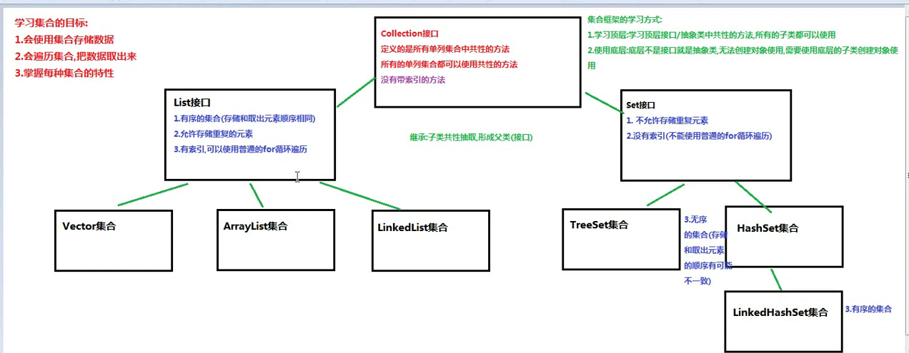

# Collection


1. 数组长度固定， 集合可以改变
2. 数组可以存基本也可以对象， 集合只存对象而且对象的类型可以不一致

# 学习集合目标

1.会使用集合存储数据

2.会遍历集合取出数据

3.掌握每种集合的特性


# 集合框架学习方式

1. 学习顶层， 学习顶层接口/抽象类中的共性方法， 所有子类都可以使用
2. 使用底层：顶层不是接口就是抽象类， 无法创建对象使用， 需要使用底层的子类创建对象使用。





# Collection 常用功能


```java

/**

boolean add(E e) 
          确保此 collection 包含指定的元素（可选操作）。 
          
void clear() 
          移除此 collection 中的所有元素（可选操作）。 
          
 
 boolean remove(Object o) 
          从此 collection 中移除指定元素的单个实例，如果存在的话（可选操作）。 
 
 boolean contains(Object o) 
          如果此 collection 包含指定的元素，则返回 true。 

boolean isEmpty() 
          如果此 collection 不包含元素，则返回 true。 

int size() 
          返回此 collection 中的元素数 
 
 Object[] toArray() 
          返回包含此 collection 中所有元素的数组。 
*/

```

