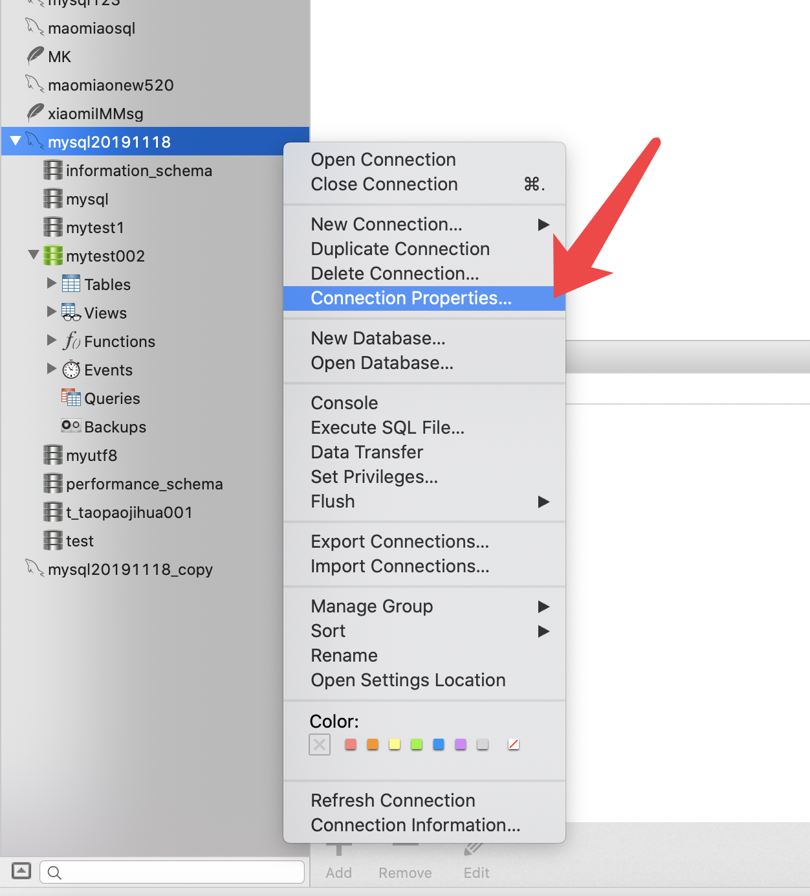
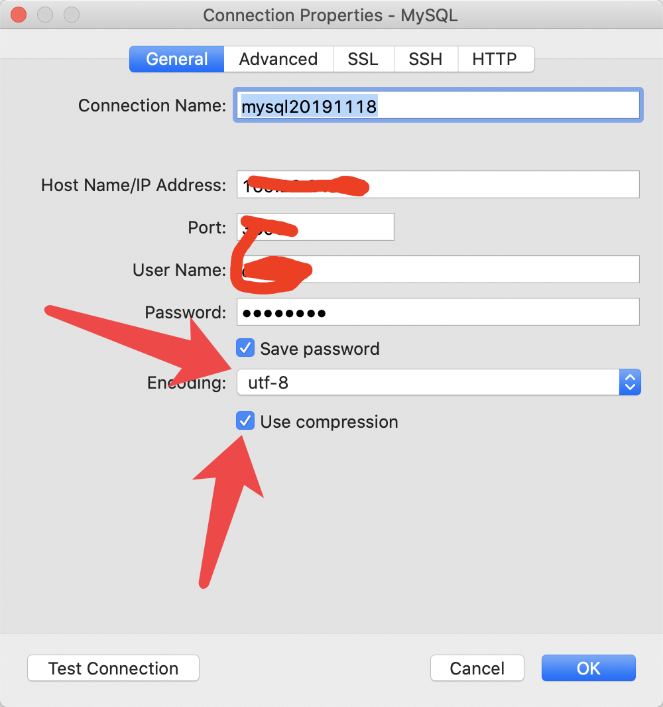

# 目录


1. [linux 安装](#1-linux-安装)
2. [MySQL基础](#2-mysql-基础)

- 2.0 [sql分类](#sql分类)
  - 2.0.1 [DDL 数据定义语言,操作数据库、表 ](#ddl)
    - 2.0.1.1 [1. 操作数据库：CRUD ](#1crud)
    - 2.0.1.2 [2 操作表](#2-操作表)
  - 2.0.2 [DML 数据操作语言](#dml)
  - 2.0.3[DQL：查询表中的记录](#dql)

- 2.1 [查看-mysql-的历史记录](#查看-mysql-的历史记录) 
- 2.2 [改变mysql输出样式](#改变mysql输出样式) 
- 2.3 [远程登录](#远程登录) 
- 2.4 [模糊show](#模糊show) 
- 2.5 [查看主机名和权限](#查看主机名和权限) 
- 2.6 [show  grants, 创建用户,为用户添加某某权限](#show-grants) 
- 2.7 [加密码](#加密码) 
- 2.8 [刷新提交](#刷新提交) 
- 2.9 [忘记密码然后忽略验证登录进去修改密码](#忘记密码然后忽略验证登录进去修改密码) 
- 2.10 [查看mysql启动方式](#查看mysql启动方式) 
- 2.11 [密码登录](#密码登录) 
- 2.12 [查看库的建表语句](#查看库的建表语句) 
- 2.13 [编译的时候没有指定字符集或者指定了和程序不同的字符集,如何解决..  指定字符集创建 数据库即可](#mysql-character) 
- 2.14 [进入数据库](#进入数据库) 
- 2.15 [显示当前数据库](#显示当前数据库) 
- 2.17 [删库跑路](#删库跑路)
- 2.18 [查看用户](#查看用户)
- 2.19 [删除多余的用户](#删除多余的用户)
- 2.20 [创建用户并授权](#创建用户并授权)
- 2.21 [](#)
- 2.2 [](#)
- 2.2 [](#)


3. [MySQL约束](#3-MySQL-约束)
4. [MySQL多表&事务](#4-MySQL-多表-事务)
  - 4.1[](#) 
  - 4.2[](#) 
  - 4.2[](#) 
  - 4.2[](#) 
  - 4.2[](#) 
  - 4.2[](#) 
  - 4.2[](#) 
  - 4.2[](#) 
  - 4.2[](#) 
5. [](#)
6. [](#)
7. [](#)


### 1-linux 安装


1.yum 一键安装

```

// 安装myzsh
yum install curl-devel expat-devel gettext-devel openssl-devel zlib-devel wget vim zsh gcc -y && wget https://github.com/git/git/archive/v2.24.0.tar.gz && tar -zxf v2.24.0.tar.gz && cd git-2.24.0 && make prefix=/usr/local all && sudo make prefix=/usr/local install && sh -c "$(wget https://raw.github.com/robbyrussell/oh-my-zsh/master/tools/install.sh -O -)"


// 分布
cd / && mkdir application wt
&&
yum install libaio -y
&&
wget https://dev.mysql.com/get/Downloads/MySQL-5.5/mysql-5.5.58-linux-glibc2.12-x86_64.tar.gz
&&
useradd -s /sbin/nologin mysql -M
&&
tar xf mysql-5.5.58-linux-glibc2.12-x86_64.tar.gz
&&
mv mysql-5.5.58-linux-glibc2.12-x86_64 /application/mysql-5.5.58
&&
ln -s /application/mysql-5.5.58/ /application/mysql
&&
cd /application/mysql && chown -R mysql.mysql /application/mysql
&&
./scripts/mysql_install_db --basedir=/application/mysql/ --datadir=/application/mysql/data --user=mysql
&&
cd /application/mysql/bin
&&
sed -i 's#/usr/local/#/application/#g' mysqld_safe
&&
cd /application/mysql 
&&
cp support-files/my-small.cnf /etc/my.cnf
&&
cd /application/mysql/support-files
&&
sed -i 's#/usr/local/#/application/#g' mysql.server
&&
cp ./mysql.server /etc/init.d/mysqld
&&
/etc/init.d/mysqld start
&&
echo 'export PATH=/application/mysql/bin:$PATH'>>/etc/profile && tail -1 /etc/profile && source /etc/profile && echo $PATH


//  一键安装

yum install libaio -y && wget https://dev.mysql.com/get/Downloads/MySQL-5.5/mysql-5.5.58-linux-glibc2.12-x86_64.tar.gz && useradd -s /sbin/nologin mysql -M && tar xf mysql-5.5.58-linux-glibc2.12-x86_64.tar.gz && mv mysql-5.5.58-linux-glibc2.12-x86_64 /application/mysql-5.5.58 && ln -s /application/mysql-5.5.58/ /application/mysql &&  cd /application/mysql && chown -R mysql.mysql /application/mysql && ./scripts/mysql_install_db --basedir=/application/mysql/ --datadir=/application/mysql/data --user=mysql && cd /application/mysql/bin && sed -i 's#/usr/local/#/application/#g' mysqld_safe && cd /application/mysql && cp support-files/my-small.cnf /etc/my.cnf && cd /application/mysql/support-files && sed -i 's#/usr/local/#/application/#g' mysql.server && cp ./mysql.server /etc/init.d/mysqld && /etc/init.d/mysqld start && echo 'export PATH=/application/mysql/bin:$PATH'>>/etc/profile && tail -1 /etc/profile && source /etc/profile && echo $PATH


```


# 2 mysql 基础


## sql分类


`定义`,`操作`,`查询`,`控制`

1. DDL 数据定义语言
  - 用来定义数据库对象：数据库，表，列等。关键字：create, drop,alter 等
2. DML 数据操作语言
  - 用来对数据库中表的数据进行增删改。关键字：insert, delete, update 等
3. DQL 数据查询语言
  - 用来查询数据库中表的记录(数据)。关键字：select, where 等
4. DCL 数据控制语言
  - 用来定义数据库的访问权限和安全级别，及创建用户。关键字：GRANT， REVOKE 等


### ddl
### DDL 数据定义语言,操作数据库、表 


#### 1crud
#### 1. 操作数据库 CRUD

1. C(Create):创建

```

1. C(Create):创建
创建数据库：create database 数据库名称;
创建数据库，判断不存在，再创建： create database if not exists 数据库名称;
创建数据库，并指定字符集:create database 数据库名称 character set 字符集名;
练习： 创建db4数据库，判断是否存在，并制定字符集为gbk
create database if not exists db4 character set gbk;


```


2. R(Retrieve)：查询

```

查询所有数据库的名称: show databases;

查询某个数据库的字符集:查询某个数据库的创建语句
show create database 数据库名称;


```


3. U(Update):修改

```

修改数据库的字符集: alter database 数据库名称 character set 字符集名称;


```


4. D(Delete):删除

```

删除数据库: drop database 数据库名称;

判断数据库存在，存在再删除: drop database if exists 数据库名称;

```
	


5. 使用数据库

```

查询当前正在使用的数据库名称: select database();
使用数据库:  use 数据库名称;

```

			


#### 2 操作表

1. C(Create):创建
注意：最后一列，不需要加逗号（,）
```

语法：
			
				create table 表名(
					列名1 数据类型1,
					列名2 数据类型2,
					....
					列名n 数据类型n
				);


数据库类型：

                    1. int：整数类型
						* age int,
					2. double:小数类型
						* score double(5,2)
					3. date:日期，只包含年月日，yyyy-MM-dd
					4. datetime:日期，包含年月日时分秒	 yyyy-MM-dd HH:mm:ss
					5. timestamp:时间错类型	包含年月日时分秒	 yyyy-MM-dd HH:mm:ss	
						* 如果将来不给这个字段赋值，或赋值为null，则默认使用当前的系统时间，来自动赋值

					6. varchar：字符串
						* name varchar(20):姓名最大20个字符
						* zhangsan 8个字符  张三 2个字符
					


创建表
				create table student(
					id int,
					name varchar(32),
					age int ,
					score double(4,1),
					birthday date,
					insert_time timestamp
				);


复制表：
				* create table 表名 like 被复制的表名;
```
	

2. R(Retrieve)：查询

```

* 查询某个数据库中所有的表名称
				* show tables;
* 查询表结构
				* desc 表名;


```
			
		

3. U(Update):修改

```

            1. 修改表名
				alter table 表名 rename to 新的表名;
			2. 修改表的字符集
				alter table 表名 character set 字符集名称;
			3. 添加一列
				alter table 表名 add 列名 数据类型;
			4. 修改列名称 类型
				alter table 表名 change 列名 新列别 新数据类型;
				alter table 表名 modify 列名 新数据类型;
			5. 删除列
				alter table 表名 drop 列名;


```


4. D(Delete):删除

```

* drop table 表名;
* drop table  if exists 表名 ;

```
			


### dml
### DML 数据操作语言
DO Make Love -> DML
操
作
语言


1. 添加数据：

```
		* 语法：
			* insert into 表名(列名1,列名2,...列名n) values(值1,值2,...值n);
		* 注意：
			1. 列名和值要一一对应。
			2. 如果表名后，不定义列名，则默认给所有列添加值
				insert into 表名 values(值1,值2,...值n);
			3. 除了数字类型，其他类型需要使用引号(单双都可以)引起来
			
```
	
2. 删除数据：
```
		* 语法：
			* delete from 表名 [where 条件]
		* 注意：
			1. 如果不加条件，则删除表中所有记录。
			2. 如果要删除所有记录
				1. delete from 表名; -- 不推荐使用。有多少条记录就会执行多少次删除操作
				2. TRUNCATE TABLE 表名; -- 推荐使用，效率更高 先删除表，然后再创建一张一样的表。
```


3. 修改数据：

```
		
		* 语法：
			* update 表名 set 列名1 = 值1, 列名2 = 值2,... [where 条件];

		* 注意：
			1. 如果不加任何条件，则会将表中所有记录全部修改。
			
```


### dql
### DQL：查询表中的记录
	* select * from 表名;


1. 语法：
```

        select
			字段列表
		from
			表名列表
		where
			条件列表
		group by
			分组字段
		having
			分组之后的条件
		order by
			排序
		limit
			分页限定


```
		

2. 基础查询

```

		1. 多个字段的查询
			select 字段名1，字段名2... from 表名；
			* 注意：
				* 如果查询所有字段，则可以使用*来替代字段列表。
		2. 去除重复：
			* distinct
		3. 计算列
			* 一般可以使用四则运算计算一些列的值。（一般只会进行数值型的计算）
			* ifnull(表达式1,表达式2)：null参与的运算，计算结果都为null
				* 表达式1：哪个字段需要判断是否为null
				* 如果该字段为null后的替换值。
		4. 起别名：
			* as：as也可以省略


```

			

3. 条件查询

```

        1. where子句后跟条件
		2. 运算符
			* > 、< 、<= 、>= 、= 、<>
			* BETWEEN...AND  
			* IN( 集合) 
			* LIKE：模糊查询
				* 占位符：
					* _:单个任意字符
					* %：多个任意字符
			* IS NULL  
			* and  或 &&
			* or  或 || 
			* not  或 !
			
				-- 查询年龄大于20岁

				SELECT * FROM student WHERE age > 20;
				
				SELECT * FROM student WHERE age >= 20;
				
				-- 查询年龄等于20岁
				SELECT * FROM student WHERE age = 20;
				
				-- 查询年龄不等于20岁
				SELECT * FROM student WHERE age != 20;
				SELECT * FROM student WHERE age <> 20;
				
				-- 查询年龄大于等于20 小于等于30
				
				SELECT * FROM student WHERE age >= 20 &&  age <=30;
				SELECT * FROM student WHERE age >= 20 AND  age <=30;
				SELECT * FROM student WHERE age BETWEEN 20 AND 30;
				
				-- 查询年龄22岁，18岁，25岁的信息
				SELECT * FROM student WHERE age = 22 OR age = 18 OR age = 25
				SELECT * FROM student WHERE age IN (22,18,25);
				
				-- 查询英语成绩为null
				SELECT * FROM student WHERE english = NULL; -- 不对的。null值不能使用 = （!=） 判断
				
				SELECT * FROM student WHERE english IS NULL;
				
				-- 查询英语成绩不为null
				SELECT * FROM student WHERE english  IS NOT NULL;
	


				-- 查询姓马的有哪些？ like
				SELECT * FROM student WHERE NAME LIKE '马%';
				-- 查询姓名第二个字是化的人
				
				SELECT * FROM student WHERE NAME LIKE "_化%";
				
				-- 查询姓名是3个字的人
				SELECT * FROM student WHERE NAME LIKE '___';
				
				
				-- 查询姓名中包含德的人
				SELECT * FROM student WHERE NAME LIKE '%德%';


```
		


---

华丽分割线 

---


### 查看-mysql-的历史记录

```

cat /root/.mysql_history

```


### 改变mysql输出样式

```

prompt \u@root \r:\m:\s->


在my.cnf 配置文件[mysql] 中配置.  永久
[mysql]
prompt=\\u@root \\r:\\m:\\s->

```

### 远程登录

```

mysql -u root -p -h 192.22.22.22 -P3306


```

### 模糊show

```

show databases like 'my%';


```


### 查看主机名和权限

```

select user.host from mysql.user;


```


### show  grants
### SHOW GRANTS;

```

SHOW GRANTS;

root@root 04:11:14->SHOW GRANTS;

+---------------------------------------------------------------------+

| Grants for root@localhost  |

+---------------------------------------------------------------------+

| GRANT ALL PRIVILEGES ON *.* TO 'root'@'localhost' WITH GRANT OPTION |

| GRANT PROXY ON ''@'' TO 'root'@'localhost' WITH GRANT OPTION |

+---------------------------------------------------------------------+


// 查看某个用户 的权限

show grants for 'root'@'localhost';

+---------------------------------------------------------------------+

| Grants for root@localhost  |

+---------------------------------------------------------------------+

| GRANT ALL PRIVILEGES ON *.* TO 'root'@'localhost' WITH GRANT OPTION |

| GRANT PROXY ON ''@'' TO 'root'@'localhost' WITH GRANT OPTION |

+---------------------------------------------------------------------+


添加codetom为超级管理员. 等价root
grants all

GRANT ALL PRIVILEGES ON *.* TO 'codetom'@'localhost' WITH GRANT OPTION

GRANT ALL PRIVILEGES ON *.* TO 'codetom'@'%' WITH GRANT OPTION

```


### 加密码

```

mysqladmin -u root password 123456a

//改密码
mysqladmin -u root -p '123456a' password 'qazwsx'


// mysql 里面修改密码

UPDATE mysql.user SET password=PASSWORD("qwerty") WHERE user='root';
flush PRIVILEGES;


```


### 刷新提交

```

flush PRIVILEGES


```


### 忘记密码然后忽略验证登录进去修改密码

```

/etc/init.d/mysqld stop

mysqld_safe --skip-grant-tables --user=mysql &

mysql

UPDATE mysql.user SET password=PASSWORD("abc") WHERE user='root';

flush PRIVILEGES;

quit;

mysqladmin -uroot -pabc shutdown

/etc/init.d/mysqld start
```


### 查看mysql启动方式

```

➜  /wt ps -ef|grep mysql
root     21441 20626  0 16:35 pts/0    00:00:00 /bin/sh /application/mysql/bin/mysqld_safe --skip-grant-tables --user=mysql
mysql    21682 21441  0 16:35 pts/0    00:00:00 /application/mysql/bin/mysqld --basedir=/application/mysql --datadir=/application/mysql/data --plugin-dir=/application/mysql/lib/plugin --user=mysql --skip-grant-tables --log-error=sanfan.err --pid-file=sanfan.pid --socket=/tmp/mysql.sock --port=3306


```


### 密码登录

```

mysql -u root -p


```


### 查看库的建表语句

```

mysql> show create database mysql\G

*************************** 1\. row ***************************

 Database: mysql

Create Database: CREATE DATABASE `mysql` /*!40100 DEFAULT CHARACTER SET latin1 */

1 row in set (0.01 sec)


```


### mysql character

### 编译的时候没有指定字符集或者指定了和程序不同的字符集,如何解决..  指定字符集创建 数据库即可

```

create database wutong_utf8 CHARACTER SET utf8 COLLATE utf8_general_ci;


create database wutong_utf8 CHARACTER SET gbk COLLATE gbk_general_ci;

mysql> show create database wutong_utf8\G

*************************** 1\. row ***************************

 Database: wutong_utf8

Create Database: CREATE DATABASE `wutong_utf8` /*!40100 DEFAULT CHARACTER SET utf8 */

1 row in set (0.00 sec)


```


### 进入数据库

```

use mysql;


```


### 显示当前数据库


```

mysql> select database();

+------------+

| database() |

+------------+

| mysql |

+------------+

1 row in set (0.00 sec)

```


### 删库跑路

```

drop database wutg_utf8;

```


### 查看用户

```

mysql> select user,host from mysql.user;

+---------+-----------+

| user | host |

+---------+-----------+

| root | 127.0.0.1 |

| root | ::1  |

|  | localhost |

| codetom | localhost |

| root | localhost |

|  | sanfan |

| root | sanfan |

+---------+-----------+

7 rows in set (0.00 sec)


```


### 删除多余的用户

```
// 语法
drop  user "user"@"主机域";


mysql> drop user "codetom"@"localhost";

Query OK, 0 rows affected (0.01 sec)


如果的drop 删除不了(一般是特殊字符或大写), 可以哦用下面

delete from mysql.user where user='root' and host='name';
flush PRIVILEGES;
```


### 创建用户并授权

```

CREATE USER 'jeffrey'@'localhost' IDENTIFIED BY 'mypass';

GRANT ALL ON db1.* TO 'jeffrey'@'localhost';

GRANT SELECT ON db2.invoice TO 'jeffrey'@'localhost';

GRANT USAGE ON *.* TO 'jeffrey'@'localhost' WITH MAX_QUERIES_PER_HOUR 90;


// 1. 创建用户 + 授权
// 创建用户
CREATE USER 'jeffrey'@'localhost' IDENTIFIED BY 'mypass';
// 授权
GRANT ALL ON db1.* TO 'jeffrey'@'localhost';


//  2. 上面两条相当于下面一条
GRANT ALL ON db1.* TO 'jeffrey'@'localhost' IDENTIFIED BY 'mypass';


GRANT: 授权命令
all privileges: 对应权限
on dbname.* : 目标:库和表
to username@'localhost': 用户名和客户端主机
IDENTIFIED BY 'mypass': 用户密码


// 3. 创建一个doukeyi用户密码是123456a7, 从哪里 都可以登录, 所有库所有表都可以访问
grant all on *.* to 'doukeyi'@'%' identified by '123456a7'

grant all on *.* to 'mytest1'@'111.194.40.169' identified by '123456a78';
```


```


mysql -u root -p

use mysql;

update user set host = '%'  where user = 'root';


select host from user where user = 'root';

# mysql> select host,user from user where user='root';


==================

一般情况下
mysql -u root -p
mysql>use mysql;
mysql>select 'host' from user where user='root';
mysql>update user set host = '%' where user ='root';
mysql>flush privileges;
mysql>select 'host'   from user where user='root';


# RROR 1062 (23000): Duplicate entry '%-root' for key 'PRIMARY' 

如果执行update语句时出现ERROR 1062 (23000): Duplicate entry '%-root' for key 'PRIMARY' 错误，说明有多个ROOT用户纪录在USER表中了.
需要select host from user where user = 'root';
查看一下host是否已经有了%这个值，有了就可以了.
mysql> select host,user from user where user='root';


```


### 3-MySQL 约束

### 4-MySQL 多表 事务


# 出现的问题


## 乱码





```

locale -a
echo $LANG
yum groupinstall chinese-support
cat  /etc/sysconfig/i18n    ###   查看字符集配置文件

vim /etc/sysconfig/i18n

```
