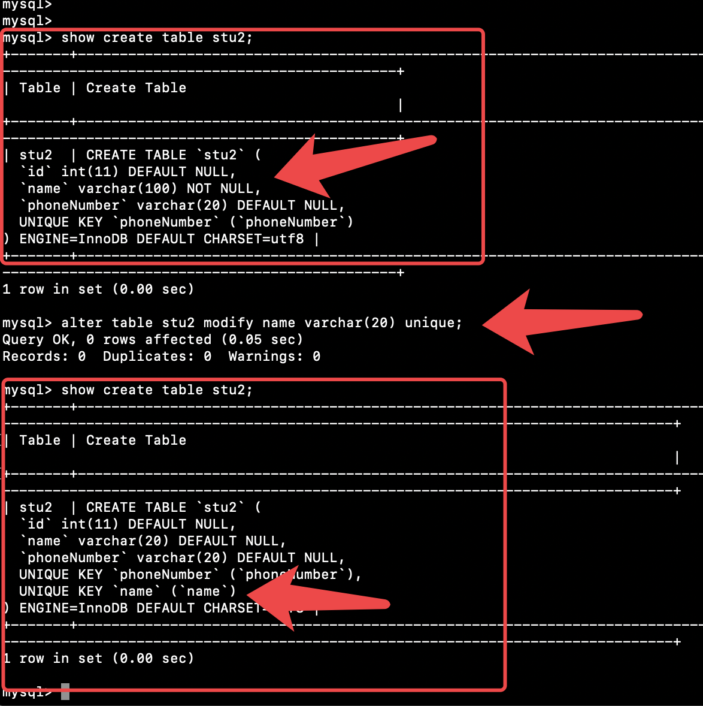
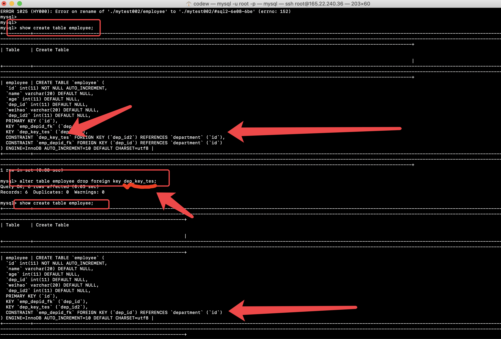
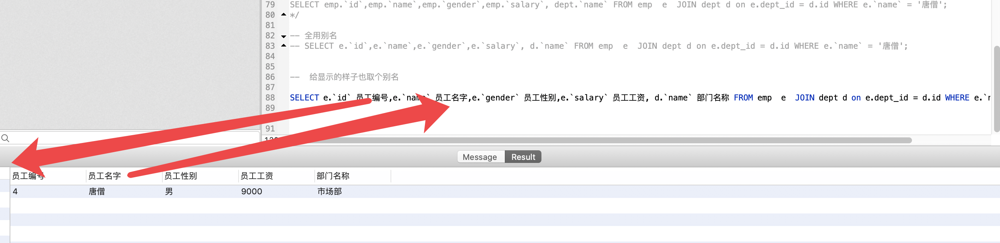

# 目录


1. [linux 安装](#1-linux-安装)
2. [MySQL基础](#2-mysql-基础)

- 2.0 [sql分类](#sql分类)
  - 2.0.1 [DDL 数据定义语言,操作数据库、表 ](#ddl)
    - 2.0.1.1 [1. 操作数据库：CRUD ](#1crud)
    - 2.0.1.2 [2 操作表](#2-操作表)
  - 2.0.2 [DML 数据操作语言](#dml)
  - 2.0.3[DQL：查询表中的记录](#dql)
    - 2.0.3.1[排序查询](#排序查询)
    - 2.0.3.2[聚合函数](#聚合函数)
    - 2.0.3.3[分组查询](#分组查询)
    - 2.0.3.4[分页查询](#分页查询)

- 2.1 [查看-mysql-的历史记录](#查看-mysql-的历史记录) 
- 2.2 [改变mysql输出样式](#改变mysql输出样式) 
- 2.3 [远程登录](#远程登录) 
- 2.4 [模糊show](#模糊show) 
- 2.5 [查看主机名和权限](#查看主机名和权限) 
- 2.6 [show  grants, 创建用户,为用户添加某某权限](#show-grants) 
- 2.7 [加密码](#加密码) 
- 2.8 [刷新提交](#刷新提交) 
- 2.9 [忘记密码然后忽略验证登录进去修改密码](#忘记密码然后忽略验证登录进去修改密码) 
- 2.10 [查看mysql启动方式](#查看mysql启动方式) 
- 2.11 [密码登录](#密码登录) 
- 2.12 [查看库的建表语句](#查看库的建表语句) 
- 2.13 [编译的时候没有指定字符集或者指定了和程序不同的字符集,如何解决..  指定字符集创建 数据库即可](#mysql-character) 
- 2.14 [进入数据库](#进入数据库) 
- 2.15 [显示当前数据库](#显示当前数据库) 
- 2.17 [删库跑路](#删库跑路)
- 2.18 [查看用户](#查看用户)
- 2.19 [删除多余的用户](#删除多余的用户)
- 2.20 [创建用户并授权](#创建用户并授权)
- 2.21 [为现有的表加字段](#为现有的表加字段)
- 2.2 [一次插入多条记录](#一次插入多条记录)
- 2.2 [](#)


3. [MySQL约束](#3-mysql-约束)
- 3.1[非空约束](#非空约束)
  - 3.1.1[1.创建表时](#1-创建表时)
  - 3.1.2[2 创建表完成后,添加非空约束](#2-创建表完成后-添加非空约束)
  - 3.1.3[3 非空约束不要了](#3-非空约束不要了)
- 3.2[唯一约束](#唯一约束)
  - 3.2.1[创建表时添加唯一约束](#创建表时添加唯一约束)
  - 3.2.2[删除唯一约束](#删除唯一约束)
  - 3.2.3[创建以后添加约束](#创建以后添加约束)
  
- 3.3 [主键约束](#主键约束)
  - 3.3.1 [在创建表时 添加主键约束](#在创建表时-添加主键约束)
  - 3.3.2 [删除主键](#删除主键)
  - 3.3.3 [创建完表后 添加主键](#创建完表后-添加主键)
  - 3.3.4 [自动增长](#自动增长)
  - 3.3.5 [自动增长 创建表时 添加主键约束 并且完成主键自增长](#自动增长-创建表时-添加主键约束-并且完成主键自增长)
  - 3.3.6 [删除自动增长](#删除自动增长)
  - 3.3.7 [添加自动增长](#添加自动增长)

- 3.4 [外键约束](#外键约束)
  - 3.4.1 [在创建表时 可以添加外键](#在创建表时-可以添加外键)
  - 3.4.2 [删除外键](#删除外键)
  - 3.4.3 [创建表之后 添加外键](#创建表之后-添加外键)
  - 3.4.4 [级联操作](#级联操作)

4. [MySQL多表&事务](#4多表)
  - 4.1[一对多](#一对多) 
  - 4.2[多对多](#多对多) 
  
5. [数据库设计](#数据库设计)
- 5.1[数据规范化](#数据规范化) 
  - 5.1[什么是范式](#什么是范式) 
  - 5.2[三大范式](#三大范式) 
- 5.2[1nf](#1nf) 
- 5.3[2nf](#2nf) 
- 5.4[3nf](#3nf) 

6. [6多表查询](#6多表查询)
- 6.1[表连接查询](#表连接查询) 
- 6.2[内连接](#内连接) 
- 6.3[外连接](#外连接) 
- 6.4[取了别名就必须全部用别名](#取了别名就必须全部用别名)

7. [7子查询](#7子查询)
-  7.1[概念](#概念)
- 7.2 [三种情况](#三种情况) 
- 7.3 [结果一个值?](#结果一个值) 
- 7.4 [结果是多行单列](#结果是多行单列)
- 7.5 [结果是多行多列](#结果是多行多列)

8. [8事务](#8事务)
- 8.1 [使用场景](#使用场景) 
- 8.2 [手动提交](#手动提交) 
- 8.3 [自动提交](#自动提交)
- 8.4 [事务原理](#事务原理)
- 8.5 [回滚点](#回滚点)
- 8.6 [事务的隔离级别](#事务的隔离级别)
 

9. [9用户管理和权限](#9用户管理和权限)
- 9.1 [创建用户](#创建用户) 
- 9.2 [给用户授权](#给用户授权) 
- 9.3 [撤销授权](#撤销授权) 
- 9.4 [查看权限](#查看权限) 
- 9.5 [删除用户](#删除用户) 
- 9.6 [修改管理员密码](#修改管理员密码) 
- 9.7 [修改普通用户密码](#修改普通用户密码) 


### 1-linux 安装


1.yum 一键安装

```

// 安装myzsh
yum install curl-devel expat-devel gettext-devel openssl-devel zlib-devel wget vim zsh gcc -y && wget https://github.com/git/git/archive/v2.24.0.tar.gz && tar -zxf v2.24.0.tar.gz && cd git-2.24.0 && make prefix=/usr/local all && sudo make prefix=/usr/local install && sh -c "$(wget https://raw.github.com/robbyrussell/oh-my-zsh/master/tools/install.sh -O -)"


// 分布
cd / && mkdir application wt
&&
yum install libaio -y
&&
wget https://dev.mysql.com/get/Downloads/MySQL-5.5/mysql-5.5.58-linux-glibc2.12-x86_64.tar.gz
&&
useradd -s /sbin/nologin mysql -M
&&
tar xf mysql-5.5.58-linux-glibc2.12-x86_64.tar.gz
&&
mv mysql-5.5.58-linux-glibc2.12-x86_64 /application/mysql-5.5.58
&&
ln -s /application/mysql-5.5.58/ /application/mysql
&&
cd /application/mysql && chown -R mysql.mysql /application/mysql
&&
./scripts/mysql_install_db --basedir=/application/mysql/ --datadir=/application/mysql/data --user=mysql
&&
cd /application/mysql/bin
&&
sed -i 's#/usr/local/#/application/#g' mysqld_safe
&&
cd /application/mysql 
&&
cp support-files/my-small.cnf /etc/my.cnf
&&
cd /application/mysql/support-files
&&
sed -i 's#/usr/local/#/application/#g' mysql.server
&&
cp ./mysql.server /etc/init.d/mysqld
&&
/etc/init.d/mysqld start
&&
echo 'export PATH=/application/mysql/bin:$PATH'>>/etc/profile && tail -1 /etc/profile && source /etc/profile && echo $PATH


//  一键安装

yum install libaio -y && wget https://dev.mysql.com/get/Downloads/MySQL-5.5/mysql-5.5.58-linux-glibc2.12-x86_64.tar.gz && useradd -s /sbin/nologin mysql -M && tar xf mysql-5.5.58-linux-glibc2.12-x86_64.tar.gz && mv mysql-5.5.58-linux-glibc2.12-x86_64 /application/mysql-5.5.58 && ln -s /application/mysql-5.5.58/ /application/mysql &&  cd /application/mysql && chown -R mysql.mysql /application/mysql && ./scripts/mysql_install_db --basedir=/application/mysql/ --datadir=/application/mysql/data --user=mysql && cd /application/mysql/bin && sed -i 's#/usr/local/#/application/#g' mysqld_safe && cd /application/mysql && cp support-files/my-small.cnf /etc/my.cnf && cd /application/mysql/support-files && sed -i 's#/usr/local/#/application/#g' mysql.server && cp ./mysql.server /etc/init.d/mysqld && /etc/init.d/mysqld start && echo 'export PATH=/application/mysql/bin:$PATH'>>/etc/profile && tail -1 /etc/profile && source /etc/profile && echo $PATH


```


# 2 mysql 基础


## sql分类


`定义`,`操作`,`查询`,`控制`

1. DDL 数据定义语言
  - 用来定义数据库对象：数据库，表，列等。关键字：create, drop,alter 等
2. DML 数据操作语言
  - 用来对数据库中表的数据进行增删改。关键字：insert, delete, update 等
3. DQL 数据查询语言
  - 用来查询数据库中表的记录(数据)。关键字：select, where 等
4. DCL 数据控制语言
  - 用来定义数据库的访问权限和安全级别，及创建用户。关键字：GRANT， REVOKE 等


### ddl
### DDL 数据定义语言,操作数据库、表 


#### 1crud
#### 1. 操作数据库 CRUD

1. C(Create):创建

```

1. C(Create):创建
创建数据库：create database 数据库名称;
创建数据库，判断不存在，再创建： create database if not exists 数据库名称;
创建数据库，并指定字符集:create database 数据库名称 character set 字符集名;
练习： 创建db4数据库，判断是否存在，并制定字符集为gbk
create database if not exists db4 character set gbk;


```


2. R(Retrieve)：查询

```

查询所有数据库的名称: show databases;

查询某个数据库的字符集:查询某个数据库的创建语句
show create database 数据库名称;


```


3. U(Update):修改

```

修改数据库的字符集: alter database 数据库名称 character set 字符集名称;


```


4. D(Delete):删除

```

删除数据库: drop database 数据库名称;

判断数据库存在，存在再删除: drop database if exists 数据库名称;

```
	


5. 使用数据库

```

查询当前正在使用的数据库名称: select database();
使用数据库:  use 数据库名称;

```

			


#### 2 操作表

1. C(Create):创建
注意：最后一列，不需要加逗号（,）
```

语法：
			
				create table 表名(
					列名1 数据类型1,
					列名2 数据类型2,
					....
					列名n 数据类型n
				);


数据库类型：

                    1. int：整数类型
						* age int,
					2. double:小数类型
						* score double(5,2)
					3. date:日期，只包含年月日，yyyy-MM-dd
					4. datetime:日期，包含年月日时分秒	 yyyy-MM-dd HH:mm:ss
					5. timestamp:时间错类型	包含年月日时分秒	 yyyy-MM-dd HH:mm:ss	
						* 如果将来不给这个字段赋值，或赋值为null，则默认使用当前的系统时间，来自动赋值

					6. varchar：字符串
						* name varchar(20):姓名最大20个字符
						* zhangsan 8个字符  张三 2个字符
					


创建表
				create table student(
					id int,
					name varchar(32),
					age int ,
					score double(4,1),
					birthday date,
					insert_time timestamp
				);


复制表：
				* create table 表名 like 被复制的表名;
```
	

2. R(Retrieve)：查询

```

* 查询某个数据库中所有的表名称
				* show tables;
* 查询表结构
				* desc 表名;


```
			
		

3. U(Update):修改

```

            1. 修改表名
				alter table 表名 rename to 新的表名;
			2. 修改表的字符集
				alter table 表名 character set 字符集名称;
			3. 添加一列
				alter table 表名 add 列名 数据类型;
			4. 修改列名称 类型
				alter table 表名 change 列名 新列别 新数据类型;
				alter table 表名 modify 列名 新数据类型;
			5. 删除列
				alter table 表名 drop 列名;


```


4. D(Delete):删除

```

* drop table 表名;
* drop table  if exists 表名 ;

```
			


### dml
### DML 数据操作语言
DO Make Love -> DML
操
作
语言


1. 添加数据：

```
		* 语法：
			* insert into 表名(列名1,列名2,...列名n) values(值1,值2,...值n);
		* 注意：
			1. 列名和值要一一对应。
			2. 如果表名后，不定义列名，则默认给所有列添加值
				insert into 表名 values(值1,值2,...值n);
			3. 除了数字类型，其他类型需要使用引号(单双都可以)引起来
			
```
	
2. 删除数据：
```
		* 语法：
			* delete from 表名 [where 条件]
		* 注意：
			1. 如果不加条件，则删除表中所有记录。
			2. 如果要删除所有记录
				1. delete from 表名; -- 不推荐使用。有多少条记录就会执行多少次删除操作
				2. TRUNCATE TABLE 表名; -- 推荐使用，效率更高 先删除表，然后再创建一张一样的表。


```


3. 修改数据：

```
		
		* 语法：
			* update 表名 set 列名1 = 值1, 列名2 = 值2,... [where 条件];

		* 注意：
			1. 如果不加任何条件，则会将表中所有记录全部修改。


UPDATE emp set join_date='2008-08-08'  WHERE `name`='唐僧';

```


### dql
### DQL：查询表中的记录
	* select * from 表名;


1. 语法：
```

        select
			字段列表
		from
			表名列表
		where
			条件列表
		group by
			分组字段
		having
			分组之后的条件
		order by
			排序
		limit
			分页限定


```
		

2. 基础查询

```

		1. 多个字段的查询
			select 字段名1，字段名2... from 表名；
			* 注意：
				* 如果查询所有字段，则可以使用*来替代字段列表。
		2. 去除重复：
			* distinct
		3. 计算列
			* 一般可以使用四则运算计算一些列的值。（一般只会进行数值型的计算）
			* ifnull(表达式1,表达式2)：null参与的运算，计算结果都为null
				* 表达式1：哪个字段需要判断是否为null
				* 如果该字段为null后的替换值。
		4. 起别名：
			* as：as也可以省略


```

			

3. 条件查询

```

        1. where子句后跟条件
		2. 运算符
			* > 、< 、<= 、>= 、= 、<>
			* BETWEEN...AND  
			* IN( 集合) 
			* LIKE：模糊查询
				* 占位符：
					* _:单个任意字符
					* %：多个任意字符
			* IS NULL  
			* and  或 &&
			* or  或 || 
			* not  或 !
			
				-- 查询年龄大于20岁

				SELECT * FROM student WHERE age > 20;
				
				SELECT * FROM student WHERE age >= 20;
				
				-- 查询年龄等于20岁
				SELECT * FROM student WHERE age = 20;
				
				-- 查询年龄不等于20岁
				SELECT * FROM student WHERE age != 20;
				SELECT * FROM student WHERE age <> 20;
				
				-- 查询年龄大于等于20 小于等于30
				
				SELECT * FROM student WHERE age >= 20 &&  age <=30;
				SELECT * FROM student WHERE age >= 20 AND  age <=30;
				SELECT * FROM student WHERE age BETWEEN 20 AND 30;
				
				-- 查询年龄22岁，18岁，25岁的信息
				SELECT * FROM student WHERE age = 22 OR age = 18 OR age = 25
				SELECT * FROM student WHERE age IN (22,18,25);
				
				-- 查询英语成绩为null
				SELECT * FROM student WHERE english = NULL; -- 不对的。null值不能使用 = （!=） 判断
				
				SELECT * FROM student WHERE english IS NULL;
				
				-- 查询英语成绩不为null
				SELECT * FROM student WHERE english  IS NOT NULL;
	


				-- 查询姓马的有哪些？ like
				SELECT * FROM student WHERE NAME LIKE '马%';
				-- 查询姓名第二个字是化的人
				
				SELECT * FROM student WHERE NAME LIKE "_化%";
				
				-- 查询姓名是3个字的人
				SELECT * FROM student WHERE NAME LIKE '___';
				
				
				-- 查询姓名中包含德的人
				SELECT * FROM student WHERE NAME LIKE '%德%';


```
		

### 排序查询
> - 2.0.3.1排序查询


```

		* 语法：order by 子句
			* order by 排序字段1 排序方式1 ，  排序字段2 排序方式2...

		* 排序方式：
			* ASC：升序，默认的。小的在前面
			* DESC：降序。

		* 注意：
			* 如果有多个排序条件，则当前边的条件值一样时，才会判断第二条件。


select * from student order by id DESC;

```


### 聚合函数
> 2.0.3.2聚合函数

什么是聚合函数?
将一列 数据作为一个整体 ,进行 纵向的计算.


```


count :  计算个数
  1. 一般选择非空的列: 主键
  2. count(*)

max: 计算最大值
min: 计算最小值
sum: 计算和 
avg: 计算平均值


* 注意：聚合函数的计算，排除null值。
			解决方案：
				1. 选择不包含非空的列进行计算
				2. IFNULL函数


select count(age) from student;
select max(age) from student;
select min(age) from student;
select avg(age) from student;


```


### 分组查询

> 2.0.3.3[分组查询


```

语法: group  by 分组字段


select sex, AVG(age) from student group by sex;

select sex from student group by sex;

mysql> select sex from student group by sex;

+------+

| sex |

+------+

| 0 |

| 1 |

+------+

2 rows in set (0.00 sec)

mysql> select sex, AVG(age) from student group by sex;

+------+----------+

| sex | AVG(age) |

+------+----------+

| 0 | 26.3333 |

| 1 | 17.0000 |

+------+----------+

2 rows in set (0.00 sec)
```


注意:?
1. 分组之后查询的字段: 分组字段. 聚合函数?
2. where 和 having  的区别?

where 在分组前面, 最开始就排除了参与分组的查询, having是最分组查询出来的结果再进行排除.

```

1. where 在分组之前进行限定, 如果不满足条件, 则不参与分组. having在分组之后进行限定, 如果不满足结果, 则不会被查询出来.

2. where 后面不可以跟聚合函数, having可以进行聚合函数的判断


mysql> select sex, avg(math), count(id) from student group by sex;

+------+-----------+-----------+

| sex | avg(math) | count(id) |

+------+-----------+-----------+

| 0 |  80.4000 |  5 |

| 1 |  64.4000 |  5 |

+------+-----------+-----------+

2 rows in set (0.00 sec)


年龄相同的站一排, 算出每一排的数学平均成绩.并说出没一排的人数.
mysql> select age, avg(math),count(id) from student group by age;

+------+-----------+-----------+

| age | avg(math) | count(id) |

+------+-----------+-----------+

|  14 |  64.5000 |  2 |

|  16 |  99.0000 |  1 |

|  18 |  45.0000 |  1 |

|  20 |  66.0000 |  1 |

|  22 |  79.0000 |  3 |

|  26 |  80.0000 |  1 |

|  28 |  78.0000 |  1 |

|  35 |  77.0000 |  1 |

+------+-----------+-----------+


年龄相同的站一排, 算出每一排的数学平均成绩.并说出没一排的人数.
说人数小于2的不要了, 看看还有哪些人
having 要在分组之后

mysql> select age, avg(math),count(id) from student group by age having count(id) > 1;

+------+-----------+-----------+

| age | avg(math) | count(id) |

+------+-----------+-----------+

|  14 |  64.5000 |  2 |

|  22 |  79.0000 |  3 |

+------+-----------+-----------+

2 rows in set (0.00 sec)


年龄相同的站一排, 要成年人, 算出每一排的数学平均成绩.并说出没一排的人数.
说人数小于2的不要了, 看看还有哪些人
where 要在分组前

select age, avg(math),count(id) from student where age>18 group by age having count(id) > 1;
mysql> select age, avg(math),count(id) from student where age>18 group by age having count(id) > 1;

+------+-----------+-----------+

| age | avg(math) | count(id) |

+------+-----------+-----------+

|  22 |  79.0000 |  3 |

+------+-----------+-----------+

1 row in set (0.00 sec)


```


### 分页查询
> 2.0.3.4分页查询

// 第一页
select * from student limit 0,3;

// 第二页
select * from student limit 3,3;

// 第三页
select * from student limit 6,3;

```

mysql> select * from student;          

+------+-----------------------------+------+------+------+

| id  | name | age | sex | math |

+------+-----------------------------+------+------+------+

|  10 | 要啥自行车  |  22 | 0 |  50 |

|  90 | 你大爷累死了 |  14 | 0 |  95 |

| 9 | 要啥自行车  |  22 | 0 | 100 |

|  12 | 赶紧写月子二吧  |  20 | 1 |  66 |

| 1 | 悄悄的打枪的不要 |  18 | 1 |  45 |

| 2 | 穿上马甲照样认识你 |  35 | 0 |  77 |

| 3 | oc牛逼 |  14 | 1 |  34 |

| 4 | NULL |  16 | 1 |  99 |

| 5 | 要啥手表 |  26 | 0 |  80 |

| 6 | 在我手里就没走过字 |  28 | 1 |  78 |

| 7 | tom  |  22 | 1 |  87 |

+------+-----------------------------+------+------+------+

11 rows in set (0.00 sec)


mysql> select * from student limit 0,3;

+------+--------------------+------+------+------+

| id  | name  | age | sex | math |

+------+--------------------+------+------+------+

|  10 | 要啥自行车 |  22 | 0 |  50 |

|  90 | 你大爷累死了 |  14 | 0 |  95 |

| 9 | 要啥自行车 |  22 | 0 | 100 |

+------+--------------------+------+------+------+

3 rows in set (0.00 sec)

mysql> select * from student limit 3,3;

+------+-----------------------------+------+------+------+

| id  | name | age | sex | math |

+------+-----------------------------+------+------+------+

|  12 | 赶紧写月子二吧  |  20 | 1 |  66 |

| 1 | 悄悄的打枪的不要 |  18 | 1 |  45 |

| 2 | 穿上马甲照样认识你 |  35 | 0 |  77 |

+------+-----------------------------+------+------+------+

3 rows in set (0.00 sec)

mysql> 

mysql> select * from student limit 6,3;

+------+--------------+------+------+------+

| id  | name  | age | sex | math |

+------+--------------+------+------+------+

| 3 | oc牛逼  |  14 | 1 |  34 |

| 4 | NULL  |  16 | 1 |  99 |

| 5 | 要啥手表 |  26 | 0 |  80 |

+------+--------------+------+------+------+

3 rows in set (0.00 sec)


```


---

华丽分割线 

---


### 查看-mysql-的历史记录

```

cat /root/.mysql_history

```


### 改变mysql输出样式

```

prompt \u@root \r:\m:\s->


在my.cnf 配置文件[mysql] 中配置.  永久
[mysql]
prompt=\\u@root \\r:\\m:\\s->

```

### 远程登录

```

mysql -u root -p -h 192.22.22.22 -P3306


```

### 模糊show

```

show databases like 'my%';


```


### 查看主机名和权限

```

select user.host from mysql.user;


```


### show  grants
### SHOW GRANTS;

```

SHOW GRANTS;

root@root 04:11:14->SHOW GRANTS;

+---------------------------------------------------------------------+

| Grants for root@localhost  |

+---------------------------------------------------------------------+

| GRANT ALL PRIVILEGES ON *.* TO 'root'@'localhost' WITH GRANT OPTION |

| GRANT PROXY ON ''@'' TO 'root'@'localhost' WITH GRANT OPTION |

+---------------------------------------------------------------------+


// 查看某个用户 的权限

show grants for 'root'@'localhost';

+---------------------------------------------------------------------+

| Grants for root@localhost  |

+---------------------------------------------------------------------+

| GRANT ALL PRIVILEGES ON *.* TO 'root'@'localhost' WITH GRANT OPTION |

| GRANT PROXY ON ''@'' TO 'root'@'localhost' WITH GRANT OPTION |

+---------------------------------------------------------------------+


添加codetom为超级管理员. 等价root
grants all

GRANT ALL PRIVILEGES ON *.* TO 'codetom'@'localhost' WITH GRANT OPTION

GRANT ALL PRIVILEGES ON *.* TO 'codetom'@'%' WITH GRANT OPTION

```


### 加密码

```

mysqladmin -u root password 123456a

//改密码
mysqladmin -u root -p '123456a' password 'qazwsx'


// mysql 里面修改密码

UPDATE mysql.user SET password=PASSWORD("qwerty") WHERE user='root';
flush PRIVILEGES;


```


### 刷新提交

```

flush PRIVILEGES


```

###  停止mysql运行

```

/etc/init.d/mysqld stop

```

### 忘记密码然后忽略验证登录进去修改密码

```

/etc/init.d/mysqld stop

mysqld_safe --skip-grant-tables --user=mysql &

mysql

UPDATE mysql.user SET password=PASSWORD("abc") WHERE user='root';

flush PRIVILEGES;

quit;

mysqladmin -uroot -pabc shutdown

/etc/init.d/mysqld start
```


### 查看mysql启动方式

```

➜  /wt ps -ef|grep mysql
root     21441 20626  0 16:35 pts/0    00:00:00 /bin/sh /application/mysql/bin/mysqld_safe --skip-grant-tables --user=mysql
mysql    21682 21441  0 16:35 pts/0    00:00:00 /application/mysql/bin/mysqld --basedir=/application/mysql --datadir=/application/mysql/data --plugin-dir=/application/mysql/lib/plugin --user=mysql --skip-grant-tables --log-error=sanfan.err --pid-file=sanfan.pid --socket=/tmp/mysql.sock --port=3306


```


### 密码登录

```

mysql -u root -p


```


### 查看库的建表语句

```

mysql> show create database mysql\G

*************************** 1\. row ***************************

 Database: mysql

Create Database: CREATE DATABASE `mysql` /*!40100 DEFAULT CHARACTER SET latin1 */

1 row in set (0.01 sec)


```


### mysql character

### 编译的时候没有指定字符集或者指定了和程序不同的字符集,如何解决..  指定字符集创建 数据库即可

```

create database wutong_utf8 CHARACTER SET utf8 COLLATE utf8_general_ci;


create database wutong_utf8 CHARACTER SET gbk COLLATE gbk_general_ci;

mysql> show create database wutong_utf8\G

*************************** 1\. row ***************************

 Database: wutong_utf8

Create Database: CREATE DATABASE `wutong_utf8` /*!40100 DEFAULT CHARACTER SET utf8 */

1 row in set (0.00 sec)


```


### 进入数据库

```

use mysql;


```


### 显示当前数据库


```

mysql> select database();

+------------+

| database() |

+------------+

| mysql |

+------------+

1 row in set (0.00 sec)

```


### 删库跑路

```

drop database wutg_utf8;

```


### 查看用户

```

mysql> select user,host from mysql.user;

+---------+-----------+

| user | host |

+---------+-----------+

| root | 127.0.0.1 |

| root | ::1  |

|  | localhost |

| codetom | localhost |

| root | localhost |

|  | sanfan |

| root | sanfan |

+---------+-----------+

7 rows in set (0.00 sec)


```


### 删除多余的用户

```
// 语法
drop  user "user"@"主机域";


mysql> drop user "codetom"@"localhost";

Query OK, 0 rows affected (0.01 sec)


如果的drop 删除不了(一般是特殊字符或大写), 可以哦用下面

delete from mysql.user where user='root' and host='name';
flush PRIVILEGES;
```


### 创建用户并授权

```

CREATE USER 'jeffrey'@'localhost' IDENTIFIED BY 'mypass';

GRANT ALL ON db1.* TO 'jeffrey'@'localhost';

GRANT SELECT ON db2.invoice TO 'jeffrey'@'localhost';

GRANT USAGE ON *.* TO 'jeffrey'@'localhost' WITH MAX_QUERIES_PER_HOUR 90;


// 1. 创建用户 + 授权
// 创建用户
CREATE USER 'jeffrey'@'localhost' IDENTIFIED BY 'mypass';
// 授权
GRANT ALL ON db1.* TO 'jeffrey'@'localhost';


//  2. 上面两条相当于下面一条
GRANT ALL ON db1.* TO 'jeffrey'@'localhost' IDENTIFIED BY 'mypass';


GRANT: 授权命令
all privileges: 对应权限
on dbname.* : 目标:库和表
to username@'localhost': 用户名和客户端主机
IDENTIFIED BY 'mypass': 用户密码


// 3. 创建一个doukeyi用户密码是123456a7, 从哪里 都可以登录, 所有库所有表都可以访问
grant all on *.* to 'doukeyi'@'%' identified by '123456a7'

grant all on *.* to 'mytest1'@'111.194.40.169' identified by '123456a78';
```


```


mysql -u root -p

use mysql;

update user set host = '%'  where user = 'root';


select host from user where user = 'root';

# mysql> select host,user from user where user='root';


==================

一般情况下
mysql -u root -p
mysql>use mysql;
mysql>select 'host' from user where user='root';
mysql>update user set host = '%' where user ='root';
mysql>flush privileges;
mysql>select 'host'   from user where user='root';


# RROR 1062 (23000): Duplicate entry '%-root' for key 'PRIMARY' 

如果执行update语句时出现ERROR 1062 (23000): Duplicate entry '%-root' for key 'PRIMARY' 错误，说明有多个ROOT用户纪录在USER表中了.
需要select host from user where user = 'root';
查看一下host是否已经有了%这个值，有了就可以了.
mysql> select host,user from user where user='root';


```


### 为现有的表加字段

ALTER TABLE 表名 ADD 列名 类型;

```

alter table employee ADD `weihao` varchar(20);

```


### 一次插入多条记录

```

insert into t_category (cname) values ('傻逼游'), ('坑钱游'), ('QNMD游'), ('GNM游');


```


## 3 mysql 约束

> 概念： 对表中的数据进行限定，保证数据的正确性、有效性和完整性
> 分类：
> 1. 主键约束 ：primary key
> 2. 非空约束：not null
> 3. 唯一约束：unique
> 4. 外键约束：foreign key


### 非空约束

#### 1 创建表时
```

CREATE TABLE stu(
	id INT,
	name VARCHAR(100) NOT NULL
);


```


#### 2 创建表完成后 添加非空约束
alter table stu modify `id` int not NULL;
```

mysql> show create table stu; 

+-------+-----------------------------------------------------------------------------------------------------------------------+

| Table | Create Table |

+-------+-----------------------------------------------------------------------------------------------------------------------+

| stu  | CREATE TABLE `stu` (

 `id` int(11) DEFAULT NULL,

 `name` varchar(100) NOT NULL

) ENGINE=InnoDB DEFAULT CHARSET=utf8 |

+-------+-----------------------------------------------------------------------------------------------------------------------+

1 row in set (0.00 sec)

mysql> 

mysql> 

mysql> 

mysql> 

mysql> 

mysql> alter table stu modify `id` int not NULL;

Query OK, 0 rows affected (0.03 sec)

Records: 0 Duplicates: 0 Warnings: 0

mysql> show create table stu;

+-------+-------------------------------------------------------------------------------------------------------------------+

| Table | Create Table |

+-------+-------------------------------------------------------------------------------------------------------------------+

| stu  | CREATE TABLE `stu` (

 `id` int(11) NOT NULL,

 `name` varchar(100) NOT NULL

) ENGINE=InnoDB DEFAULT CHARSET=utf8 |

+-------+-------------------------------------------------------------------------------------------------------------------+

1 row in set (0.00 sec)


```


#### 3 非空约束不要了


alter table stu modify `name` varchar(20);


```

mysql> show create table stu;

+-------+-------------------------------------------------------------------------------------------------------------------+

| Table | Create Table |

+-------+-------------------------------------------------------------------------------------------------------------------+

| stu  | CREATE TABLE `stu` (

 `id` int(11) NOT NULL,

 `name` varchar(100) NOT NULL

) ENGINE=InnoDB DEFAULT CHARSET=utf8 |

+-------+-------------------------------------------------------------------------------------------------------------------+

1 row in set (0.00 sec)

mysql> alter table stu modify `name` varchar(20);

Query OK, 0 rows affected (0.03 sec)

Records: 0 Duplicates: 0 Warnings: 0

mysql> show create table stu;

+-------+----------------------------------------------------------------------------------------------------------------------+

| Table | Create Table  |

+-------+----------------------------------------------------------------------------------------------------------------------+

| stu  | CREATE TABLE `stu` (

 `id` int(11) NOT NULL,

 `name` varchar(20) DEFAULT NULL

) ENGINE=InnoDB DEFAULT CHARSET=utf8 |

+-------+----------------------------------------------------------------------------------------------------------------------+

1 row in set (0.00 sec)


```


### 唯一约束

唯一约束：unique，值不能重复

#### 创建表时添加唯一约束

```

CREATE TABLE stu2(
	id INT,
	name VARCHAR(100) NOT NULL,
	phoneNumber VARCHAR(20) UNIQUE
);

```

#### 删除唯一约束

**alter table stu2 drop index name;**

```

mysql> alter table stu2 drop index name;

Query OK, 0 rows affected (0.01 sec)

Records: 0 Duplicates: 0 Warnings: 0

mysql> show create table stu2;

+-------+-----------------------------------------------------------------------------------------------------------------------------------------------------------------------------------------------------------------+

| Table | Create Table |

+-------+-----------------------------------------------------------------------------------------------------------------------------------------------------------------------------------------------------------------+

| stu2 | CREATE TABLE `stu2` (

 `id` int(11) DEFAULT NULL,

 `name` varchar(20) DEFAULT NULL,

 `phoneNumber` varchar(20) DEFAULT NULL,

 UNIQUE KEY `phoneNumber` (`phoneNumber`)

) ENGINE=InnoDB DEFAULT CHARSET=utf8 |

+-------+-----------------------------------------------------------------------------------------------------------------------------------------------------------------------------------------------------------------+

1 row in set (0.00 sec)

```


#### 创建以后添加约束

`alter table stu2 modify name varchar(20) unique;`


```

mysql> show create table stu2;

+-------+--------------------------------------------------------------------------------------------------------------------------------------------------------------------------------------------------------------+

| Table | Create Table  |

+-------+--------------------------------------------------------------------------------------------------------------------------------------------------------------------------------------------------------------+

| stu2 | CREATE TABLE `stu2` (

 `id` int(11) DEFAULT NULL,

 `name` varchar(100) NOT NULL,

 `phoneNumber` varchar(20) DEFAULT NULL,

 UNIQUE KEY `phoneNumber` (`phoneNumber`)

) ENGINE=InnoDB DEFAULT CHARSET=utf8 |

+-------+--------------------------------------------------------------------------------------------------------------------------------------------------------------------------------------------------------------+

1 row in set (0.00 sec)

mysql> alter table stu2 modify name varchar(20) unique;

Query OK, 0 rows affected (0.05 sec)

Records: 0 Duplicates: 0 Warnings: 0

mysql> show create table stu2;

+-------+-----------------------------------------------------------------------------------------------------------------------------------------------------------------------------------------------------------------------------------------------+

| Table | Create Table |

+-------+-----------------------------------------------------------------------------------------------------------------------------------------------------------------------------------------------------------------------------------------------+

| stu2 | CREATE TABLE `stu2` (

 `id` int(11) DEFAULT NULL,

 `name` varchar(20) DEFAULT NULL,

 `phoneNumber` varchar(20) DEFAULT NULL,

 UNIQUE KEY `phoneNumber` (`phoneNumber`),

 UNIQUE KEY `name` (`name`)

) ENGINE=InnoDB DEFAULT CHARSET=utf8 |

+-------+-----------------------------------------------------------------------------------------------------------------------------------------------------------------------------------------------------------------------------------------------+

1 row in set (0.00 sec)

```


### 主键约束

主键约束：primary key。

> 1. 非空 且唯一
> 一张表只能有一个字段是主键
> 

#### 在创建表时 添加主键约束

```

CREATE TABLE stu3(
	id INT PRIMARY KEY,
	name VARCHAR(100) NOT NULL,
	phoneNumber VARCHAR(20) UNIQUE
);


```

#### 删除主键
show create table stu3;
alter table stu3 drop primary key;


#### 创建完表后 添加主键
alter table stu3 modify id int primary key;


#### 自动增长

```

5. 自动增长：
			1.  概念：如果某一列是数值类型的，使用 auto_increment 可以来完成值得自动增长

			2. 在创建表时，添加主键约束，并且完成主键自增长


```

#### 自动增长-创建表时-添加主键约束-并且完成主键自增长

```

CREATE TABLE stu4(
	id INT PRIMARY KEY auto_increment,
	name VARCHAR(100) NOT NULL,
	phoneNumber VARCHAR(20) UNIQUE
);


```

#### 删除自动增长

show create table stu4;
alter table stu4 modify id int;

#### 添加自动增长
alter table stu4 modify id int AUTO_INCREMENT;


### 外键约束

> 好比函数抽取

将公共的抽取为另一个表,

：foreign key,让表于表产生关系，从而保证数据的正确性。


#### 在创建表时 可以添加外键

1.  新建表时增加外键:

  [CONSTRAINT] [外键约束名称] FOREIGN KEY(外键字段名) REFERENCES 主表名(主键字段名)

```


CREATE TABLE employee(
`id` int PRIMARY KEY AUTO_INCREMENT,
`name` VARCHAR(20),
`age` int,
`dep_id` int,
-- 外键对应的主表

CONSTRAINT emp_depid_fk FOREIGN KEY (`dep_id`) REFERENCES department(`id`)
);


```


#### 删除外键
ALTER TABLE 从表 drop foreign key 外键名称;



```

alter table employee drop foreign key dep_key_tes;


```


#### 创建表之后 添加外键

```

 alter table employee ADD constraint dep_key_tes foreign key (dep_id2) references department(id);

```


#### 级联操作
在修改和删除主表的主键时，同时更新或删除副表的外键值，称为级联操作

**级联以后,如果从表不死, 主表就死不了~~~~**

```

级联更新，只能是创建表的时候创建级联关系。更新主表中的主键，从表中的外键 列也自动同步更新

ON UPDATE CASCADE


```

```

ON DELETE CASCADE 级联删除


```


```


create table if not EXISTS department(
 id int primary key auto_increment,
 dep_name varchar(20),
 dep_location varchar(20)
);


create table  if not EXISTS employee(
id int primary key auto_increment, name varchar(20),
age int,
dep_id int, -- 外键对应主表的主键
-- 创建外键约束
constraint emp_depid_fk foreign key (dep_id) references
  department(id) on update cascade on delete cascade
);

insert into department values(null, '研发部','广州'),(null, '销售部', '深圳'); select * from department;


INSERT INTO employee (NAME, age, dep_id) VALUES ('张三', 20, 1); 
INSERT INTO employee (NAME, age, dep_id) VALUES ('李四', 21, 1); 
INSERT INTO employee (NAME, age, dep_id) VALUES ('王五', 20, 1);
INSERT INTO employee (NAME, age, dep_id) VALUES ('老王', 20, 2); 
INSERT INTO employee (NAME, age, dep_id) VALUES ('大王', 22, 2); 
INSERT INTO employee (NAME, age, dep_id) VALUES ('小王', 18, 2);


```


## 4多表

表之间的关系.

一对多: 最常用的关系, 员工和部门,  学生和班级
多对多:  一门课程可以有多个学生选择, 一个学生可以有多门课程
一对一:,,,这种一般没有存在的意义, 做字段就行了..


### 一对多

`班级和学生`
一个旅游线路分类中有多个旅游线路

```

create table tab_category (

 cid int primary key auto_increment, 

 cname varchar(100) not null unique
);


create table tab_route( 

 rid int primary key auto_increment,
  rname varchar(100) not null unique,
  price double,
  rdate date, 
  cid int,

 foreign key (cid) references tab_category(cid)
);


```


###  多对多

`老师和学生`


一个用户收藏多个线路, 一个线路被多个用户收藏

```


CREATE TABLE if not EXISTS tab_user(

`uid` int PRIMARY KEY auto_increment,
`userName` VARCHAR(100) UNIQUE NOT NULL,
`passWord` VARCHAR(100) NOT NULL,
`name` VARCHAR(100),
`birthday` date,
`sex` char(1) DEFAULT '男',
`telephone` VARCHAR(11),
`email` VARCHAR(100) 

);

-- INSERT INTO  tab_user VALUES (NULL, 'cz110', 123456, '老王', '1977-07-07', '男', '13888888888', '66666@qq.com'), 
-- 							 (NULL, 'cz119', 654321, '小王', '1999-09-09', '男', '13999999999', '99999@qq.com');


CREATE TABLE if not EXISTS tab_route(

`rid` int PRIMARY KEY auto_increment,
`rname` varchar(100) not NULL UNIQUE,
`price` DOUBLE,
`rdate` date,
`cid` int

);


INSERT INTO tab_route VALUES  (NULL, '【厦门+鼓浪屿+南普陀寺+曾厝垵 高铁 3 天 惠贵团】尝味友鸭面线 住 1 晚鼓浪屿', 1499, '2018-01-27', 1),
							  (NULL, '【浪漫桂林 阳朔西街高铁 3 天纯玩 高级团】城徽象鼻山 兴坪漓江 西山公园', 699, '2018-02- 22', 3),
							  (NULL, '【爆款¥1699 秒杀】泰国 曼谷 芭堤雅 金沙岛 杜拉拉水上市场 双飞六天【含送签费 泰风情 广州 往返 特价团】', 1699, '2018-01-27', 2),
							  (NULL, '【经典•狮航 ¥2399 秒杀】巴厘岛双飞五天 抵玩【广州往返 特价团】', 2399, '2017-12-23', 2),
							  (NULL, '香港迪士尼乐园自由行2天【永东跨境巴士广东至迪士尼去程交通+迪士尼一日门票+香港如心海景酒店 暨会议中心标准房1晚住宿】', 799, '2018-04-10', 4);


/*

创建收藏表
rid 旅游线路id, 外键
date 收藏时间
uid 用户id, 外键
rid和uid 不能重复, 设置复合主键, 同一个用户不能收藏用一个线路两次

*/ 

CREATE TABLE  if not EXISTS  tab_favorite(

`rid` int,
`date` datetime,
`uid` int,
-- 创建复合主键
PRIMARY KEY(rid, uid),

FOREIGN KEY (rid) REFERENCES tab_route(rid),
FOREIGN KEY (uid) REFERENCES tab_user(uid)
);


INSERT INTO tab_favorite VALUES (1, '2018-01-01', 1), -- 老王选择厦门
								(2, '2018-02-11', 1), -- 老王选择桂林 
								(3, '2018-03-21', 1), -- 老王选择泰国
								(2, '2018-04-21', 2), -- 小王选择桂林
								(3, '2018-05-08', 2), -- 小王选择泰国
								(5, '2018-06-02', 2); -- 小王选择迪士尼


```


## 5数据库设计

### 数据规范化

#### 什么是范式

好的数据库设计对数据的存储性能和后期的程序开发，都会产生重要的影响。建立科学的，规范的数据库就需 要满足一些规则来优化数据的设计和存储，这些`规则`就称为范式。


#### 三大范式

目前关系数据库有六种范式:第一范式(`1NF`)、第二范式(`2NF`)、第三范式(`3NF`)、巴斯-科德范式(`BCNF`)、 第四范式(`4NF`)和第五范式(`5NF`，又称完美范式)。

满足最低要求的范式是第一范式(`1NF`)。在第一范式的基础上进一步满足更多规范要求的称为第二范式(`2NF`，) 其余范式以次类推。一般说来，数据库只需满足第三范式(`3NF`)就行了。

### 1nf
概念

**不可再拆分**
数据库表的每一列都是不可分割的原子数据项，不能是集合、数组等非原子数据项。即表中的某个列有多个值 时，必须拆分为不同的列。`简而言之，第一范式每一列不可再拆分，称为原子性。`

### 2nf
概念

在满足第一范式的前提下，表中的每一个字段都完全依赖于主键。 所谓完全依赖是指不能存在仅依赖主键一部分的列。`简而言之，第二范式就是在第一范式的基础上所有列完全依赖于主键列。`当存在一个复合主键包含多个主键列的时候，才会发生不符合第二范式的情况。比如有一个主键有 两个列，不能存在这样的属性，它只依赖于其中一个列，这就是不符合第二范式。

> 1.  一张表只描述一件事
> 2. 表中的每一列都完全依赖于主键

### 3nf

在满足第二范式的前提下，表中的每一列都直接依赖于主键，而不是通过其它的列来间接依赖于主键。

简而言之，第三范式就是所有列不依赖于其它非主键列，也就是在满足 `2NF` 的基础上，**任何非主列不得传递 依赖于主键。**所谓传递依赖，指的是如果存在`"A → B → C"`的决定关系，则 `C` 传递依赖于 `A`。因此，满足第三范 式的数据库表应该不存在如下依赖关系:主键列 → 非主键列 x → 非主键列 y

`在第二范式的基础上干掉传递依赖`

### 三大范式小结

| 范式      | 特点    |
| --------- | --: |
| 1NF    | 原子性: 表中 每一列不可拆分  | 
| 2NF     | 不产生局部依赖,   一张表只描述一件事  |
| 3NF     | 不产生传递依赖,表中每一列都直接依赖于主键. 而不是通过其他列间接依赖于主键 | 


## 6多表查询

### 表连接查询

多表查询的作用: 比如:我们想查询孙悟空的名字和他所在的部门的名字，则需要使用多表查询。
如果一条 SQL 语句查询多张表，因为查询结果在多张不同的表中。每张表取 1 列或多列。

笛卡尔积 = 等于 两个表的数据乘积

**SELECT * from emp, dept; **


```

/*
创建部门表
*/

-- CREATE TABLE if not EXISTS dept(
-- 
-- `id` int PRIMARY KEY auto_increment,
-- `name` VARCHAR(20)
-- 
-- );
-- 
-- /*
-- 
-- 创建员工表
-- */
-- 
-- CREATE TABLE if not EXISTS emp(
-- 
-- `id` int primary key auto_increment, 
-- `name` varchar(10),
-- `gender` char(1), -- 性别 
-- `salary` double, -- 工资
-- join_date date, -- 入职日期
-- dept_id int,
-- foreign key (dept_id) references dept(id) -- 外键，关联部门表(部门表的主键)
-- 
-- );

-- INSERT into dept (name) VALUES ('开发部'), ('市场部'), ('财务部');

-- INSERT INTO emp (name, gender, salary, join_date, dept_id) VALUES('孙悟空', '男', 7200, '2013-02-24', 1);
/*
错误外键测试
INSERT INTO emp (name, gender, salary, join_date, dept_id) VALUES('孙悟空', '男', 7200, '2013-02-24', 9);
*/

-- insert into emp(name,gender,salary,join_date,dept_id) values('猪八戒','男 ',3600,'2010-12-02',2);
-- insert into emp(name,gender,salary,join_date,dept_id) values('唐僧','男',9000,'2008-08-08',2);
-- insert into emp(name,gender,salary,join_date,dept_id) values('白骨精','女 ',5000,'2015-10-07',3);
-- insert into emp(name,gender,salary,join_date,dept_id) values('蜘蛛精','女 ',4500,'2011-03-14',1);


-- SELECT * from emp, dept; 

```


简单清除笛卡尔积

```

 SELECT * from emp, dept WHERE `emp`.`dept_id` = `dept`.`id`;


SELECT emp.`name`, dept.`name` FROM  emp,dept WHERE emp.`dept_id` = dept.`id`;


```


### 内连接

用`左边`表的记录去`匹配``右边`表的记录, 如果条件符合则显示..
如: 从表.`外键` = 主表.`主键`

#### 隐式内连接 

隐式内连接: 看不到 `JOIN` 关键字, 条件使用 `where` 指定

`select 字段名  from 左表,右表 where 条件`


```

SELECT * from emp,dept WHERE emp.dept_id = dept.id;

```


#### 显示内连接 

显示内连接: 使用`INNER JOIN ... ON `预计语句, 可以省略 `INNER`

`SELECT 字段名 from 左表 [INNER] JOIN 右表 ON 条件`

最简单相当于`SELECT * from emp, dept; `

```

SELECT * from emp INNER JOIN dept;

```


相当于`SELECT * from emp,dept WHERE emp.dept_id = dept.id;`
其中`e`和`d`是取的别名
```

SELECT * from emp e INNER JOIN dept d on e.dept_id=d.id;

```


再查询其中的叫唐僧的

```

SELECT * from emp e INNER JOIN dept d on e.dept_id = d.id WHERE e.`name`='唐僧';


```


这次 只要 员工id name 工资.
部门的话就只要部门的名字
```


-- 不用别名 
SELECT emp.`id`,emp.`name`,emp.`gender`,emp.`salary`, dept.`name` FROM emp  JOIN dept on emp.dept_id = dept.id WHERE emp.`name` = '唐僧';
/*
取了别名, 又 只有 后面用前面不用
这样是不行的=======================Error
SELECT emp.`id`,emp.`name`,emp.`gender`,emp.`salary`, dept.`name` FROM emp  e  JOIN dept d on e.dept_id = d.id WHERE e.`name` = '唐僧';
*/

-- 全用别名
SELECT e.`id`,e.`name`,e.`gender`,e.`salary`, d.`name` FROM emp  e  JOIN dept d on e.dept_id = d.id WHERE e.`name` = '唐僧';


--  给显示的样子也取个别名

SELECT e.`id` 员工编号,e.`name` 员工名字,e.`gender` 员工性别,e.`salary` 员工工资, d.`name` 部门名称 FROM emp  e  JOIN dept d on e.dept_id = d.id WHERE e.`name` = '唐僧';


```

#### 取了别名就必须全部用别名


```


/**
要嘛不取 别名=========ok

*/
SELECT emp.`id`,emp.`name`,emp.`gender`,emp.`salary`, dept.`name` FROM emp  JOIN dept on emp.dept_id = dept.id WHERE emp.`name` = '唐僧';


/***
要嘛取了别名就用别名=========ok
*/
SELECT e.`id`,e.`name`,e.`gender`,e.`salary`, d.`name` FROM emp  e  JOIN dept d on e.dept_id = d.id WHERE e.`name` = '唐僧';


/*

取了别名, 又 只有 后面用前面不用
这样是不行的=======================Error
*/
SELECT emp.`id`,emp.`name`,emp.`gender`,emp.`salary`, dept.`name` FROM emp  e  JOIN dept d on e.dept_id = d.id WHERE e.`name` = '唐僧';


```


#### 给显示的样子也取个别名

```

SELECT e.`id` 员工编号,e.`name` 员工名字,e.`gender` 员工性别,e.`salary` 员工工资, d.`name` 部门名称 FROM emp  e  JOIN dept d on e.dept_id = d.id WHERE e.`name` = '唐僧';


```





### 外连接

内连接会过滤掉没有数据的值
外连接则不会, 如果没有值的话就显示NULL

```


-- 左外连接

-- INSERT INTO dept (name) VALUES ('销售部');

-- SELECT * FROM dept;

-- 先用内连接试一下

-- SELECT * FROM dept d INNER JOIN emp e on d.`id` = e.`dept_id`; 


-- 用外连接试一下

SELECT * FROM dept d LEFT JOIN emp e ON d.`id` = e.`dept_id`;

```

## 7子查询

### 概念


> 1.一个查询的结果作为另一个查询的条件
> 2.有查询的嵌套, 内部的查询称为子查询
> 3. 子查询需要 使用括号

```

-- select id from dept where name='开发部' ;
-- select * from emp where dept_id = 1;

-- 子查询
SELECT * FROM emp WHERE dept_id = (SELECT id FROM dept WHERE name='市场部'); 

```


### 三种情况

> 1. 子查询的结果是单行单列
> 2. 子查询的结果是多行单列的
> 3. 子查询的结果是多行多列的


### 结果一个值

子查询的结果只要是单行单列, 肯定在where 后面作为条件, 父查询使用: 比较运费算符, 如: >, <, <>, =等

select 查询字段 from 表 where 字段 = ( 子查询 );


```


-- 单行单列

--  查询工资最高的是多少

-- SELECT MAX(salary) FROM emp;

-- 查询最高工资那个家伙是谁

-- SELECT * from emp WHERE salary = (SELECT MAX(salary) FROM emp);


/*
avg(salary) 正确
avg(salary ) 正确?
avg( salary) 正确?
avg( salary ) 正确?
*/
-- 查询员工小于平均工资的员工

SELECT * from emp where salary < ( SELECT avg( salary ) FROM emp ); 


```


### 结果是多行单列

**子查询结果是单例多行，结果集类似于一个数组，父查询使用 IN 运算符**


```

-- 
-- -- 多行单列
-- 
-- -- 查询工资大于5000的员工, 来至哪个部门, 输出名字
-- 
-- -- select name from dept where id in (select dept_id from emp where salary > 5000);
-- 
-- -- SELECT name FROM dept WHERE id IN (SELECT dept_id FROM emp WHERE salary > 5000);
--  
-- 
-- --  查询开发部与财务部所有的员工信息
-- 
-- SELECT * FROM emp WHERE dept_id in ( SELECT id FROM dept WHERE `name` in ('开发部', '财务部') );


```

### 结果是多行多列

子查询结果只要是多列, 肯定在from 后面作为表


select 查询字段 from (子查询) 表别名 where 条件;

```


-- 多行多列

-- 查询2011年以后入职的员工信息, 包括部门名称

-- SELECT * from dept d, (SELECT * FROM emp WHERE join_date >='2011-1-1') e  WHERE d.`id` = e.`dept_id`;

-- 也可以使用表连接


-- SELECT * FROM emp INNER JOIN dept ON emp.dept_id = dept.id WHERE join_date >= '2011-1-1';

-- SELECT * FROM emp INNER JOIN dept ON emp.dept_id = dept.id AND join_date >= '2011-1-1'; 


```

子查询小结

> 子查询结果只要是单列, 则在where后面作为条件
> 子查询结果只要是多列, 则在from后面作为表进行二次查询


## 8事务

### 使用场景

什么是事务: 在实际的开发过程中，一个业务操作如:转账，往往是要多次访问数据库才能完成的。转 账是一个用户扣钱，另一个用户加钱。如果其中有一条 SQL 语句出现异常，这条 SQL 就可能执行失败。

事务执行是一个整体，所有的 SQL 语句都必须执行成功。如果其中有 1 条 SQL 语句出现异常，则所有的 SQL 语句都要回滚，整个业务执行失败。


### 手动提交

开启事务 start   transaction
提交事务 commit;
回滚事务 rollback;

查看当前事务是自动还是手动
**1表示开启, 0表示关闭**
```

select @@autocommit;

临时生效~
set @@autocommit = 0;

```

### 自动提交
### 事务原理
### 回滚点
### 事务的隔离级别

事务的四大特性ACID


## 9用户管理和权限

### 创建用户
### 给用户授权
### 撤销授权
### 查看权限
### 删除用户
### 修改管理员密码
### 修改普通用户密码


# 出现的问题


## 乱码


```

show create table student;
set names utf8;
select * from student;


```


```

locale -a
echo $LANG
yum groupinstall chinese-support
cat  /etc/sysconfig/i18n    ###   查看字符集配置文件

vim /etc/sysconfig/i18n

```
