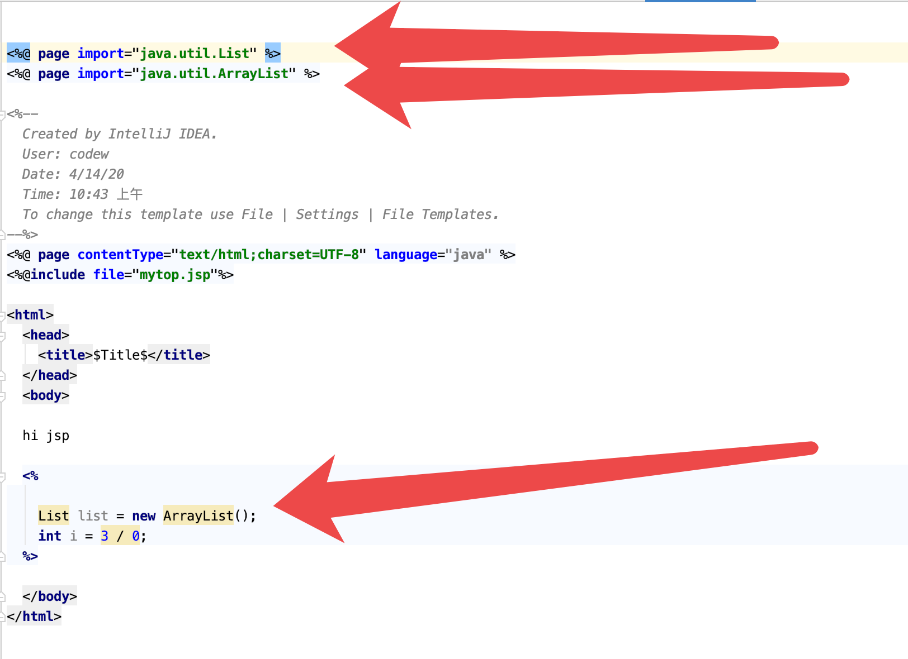
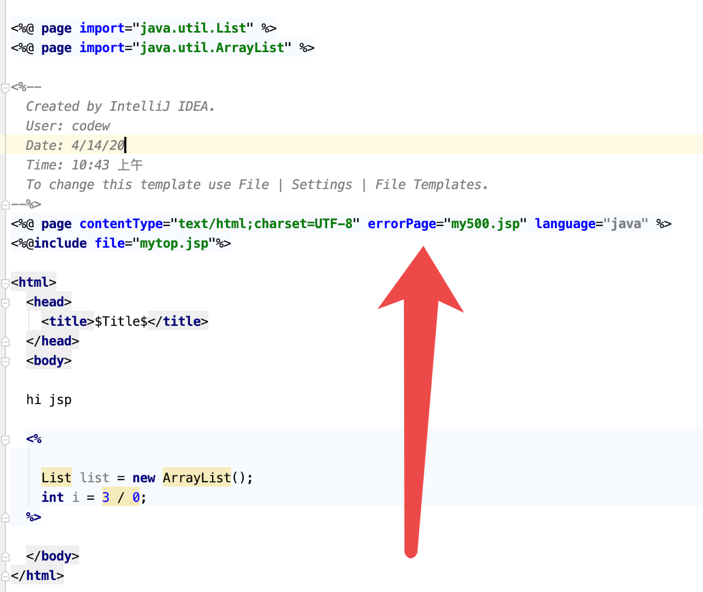
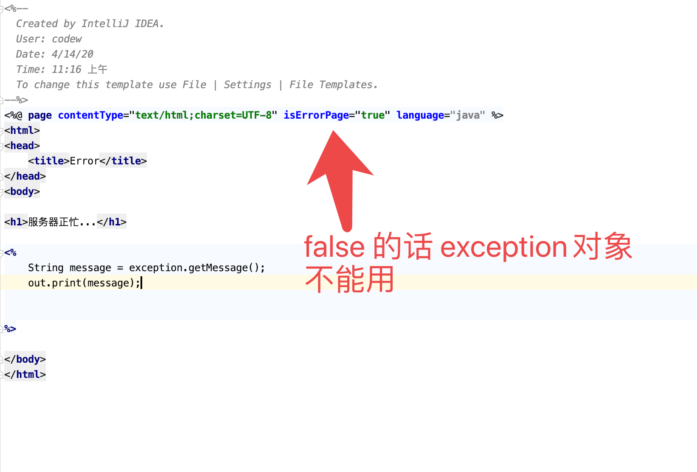
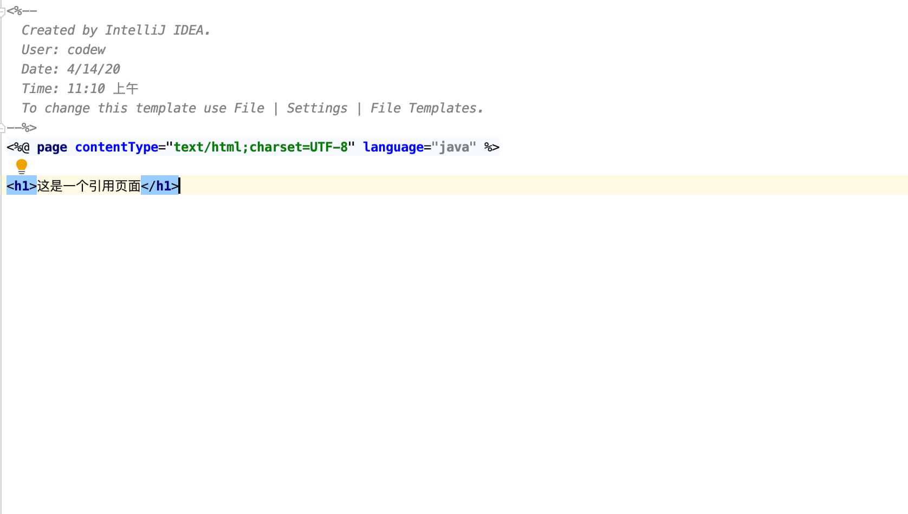
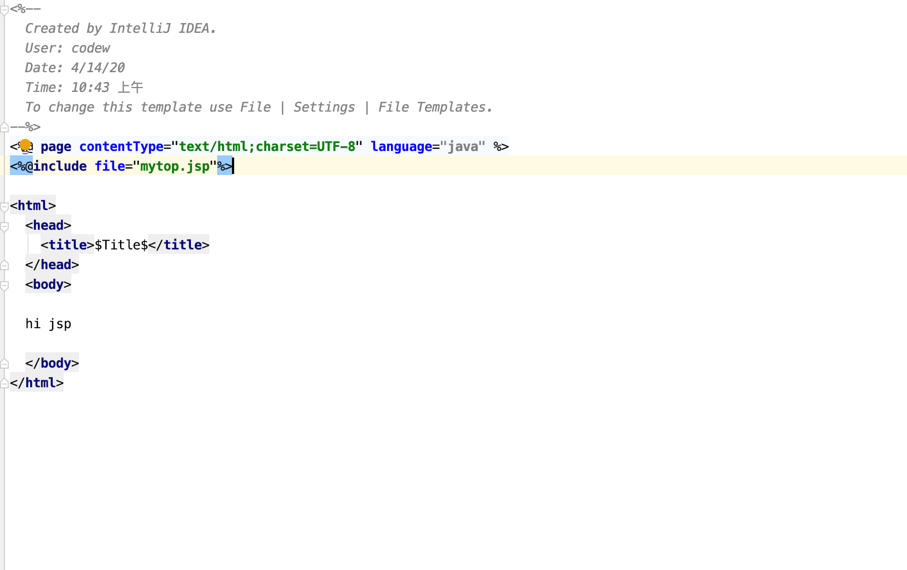
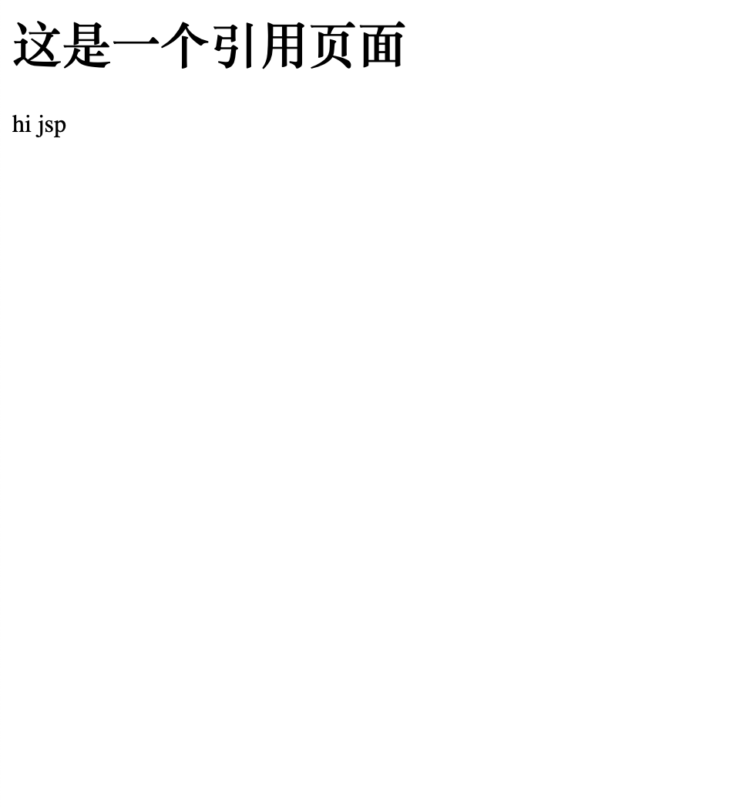

## 目录

1. [jsp](#jsp)
    1. [指令](#指令) 
    2. [注释](#注释)
    3. [内置对象](#内置对象)
2. [MVC开发模式](#mvc)
3. [EL表达式](#el)
4. [JSTL标签](#jstl)
5. [三层架构](#三层架构)


# 1. jsp 页面
## jsp

- 1. jsp 是java的特殊html
- 2. 特殊的页面,里面可以写html, 也可以写java
- 3. 他的原理就是一个 `Servlet`
- 4. 他有三种脚本如下
  - 1. `<% %>`: 作用范围较小.  定义的java代码,在service方法中. service方法中可以定义什么, 这个脚本中就可以定义什么.
  - 2. `<%! %> `:可能会有线程问题. 作用范围大.  定义的java代码, 在jsp转换后的java类的成员位置.
  - 3. `<%= %>`: 输出用的

## 指令

- 作用: 用于配置JSP页面,  导入资源文件什么的
- 格式: `<%@ 指令名称 属性名1=属性值1 属性名2=属性值2 ... %>`


- 分类:  有三个, 如下
  - 1. page : 配置JSP页面
    - `contentType`: 等同于**response.setContentType()**
      - 1. 设置响应体的`mime`类型以及字符集
      - 2. 设置当前jsp页面的编码(IDEA有效, 文本编辑无效)
      - `<%@ page contentType="text/html;charset=UTF-8" language="java" %>`
  
  - `import`: 导包, 导入java包
    
   
        
```html

<%@ page import="java.util.List" %>
<%@ page import="java.util.ArrayList" %>

<%--
 Created by IntelliJ IDEA. User: codew Date: 4/14/20 Time: 10:43 上午 To change this template use File | Settings | File Templates. --%> <%@ page contentType="text/html;charset=UTF-8" language="java" %>
<%@include file="mytop.jsp"%>

<html>
  <head>
    <title>$Title$</title>
  </head>
  <body>

  hi jsp

  <%    
  List list = new ArrayList();
  int i = 3 / 0;
  %>     
  </body>
</html>

```


    - `errorPage`: 当前页面发生异常后, 会自动跳转到指定的错误页面
 
    
    - `isErrorPage`: 标记当前页是否是错误页面
      - `true`: 是, 可以使用内置对象**exception**
      - `false`:否, 默认值. 不可以使用内置对象**exception**
      
  
      
  - 2. include:  页面包含, 导入页面的资源文件
    - `<%@ include file="top.jsp"%>`
    
 
 
 


    - 3. taglib: 导入资源
    - `<%@ taglib  prefix="c" uri="http://java.sun.com/jsp/jstl/core" %>`
    - prefix: 前缀,自定义的


## 注释

## 内置对象


# 2. MVC开发模式
## mvc

# 3. EL表达式
## el

# 4. JSTL标签
## jstl


# 5. 三层架构
## 三层架构

