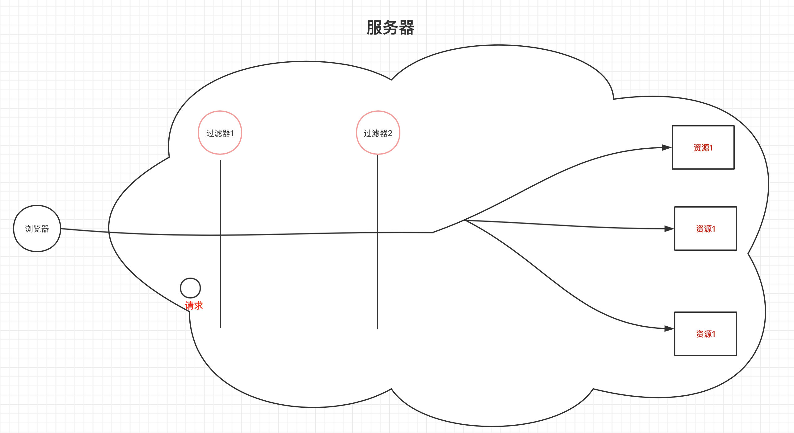
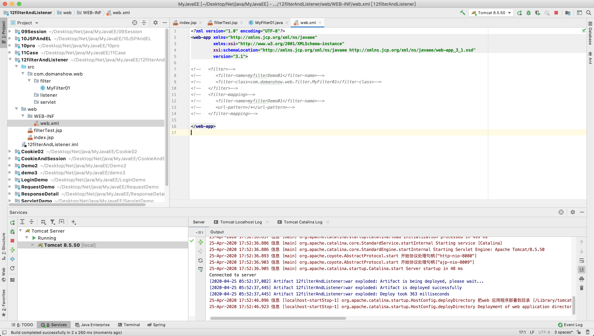
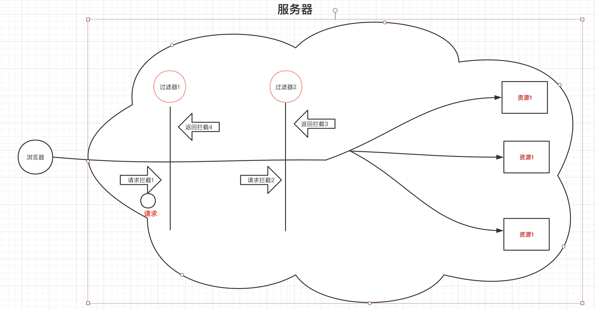
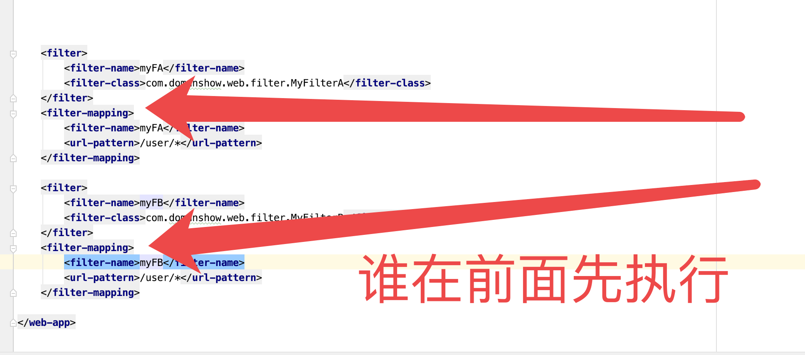
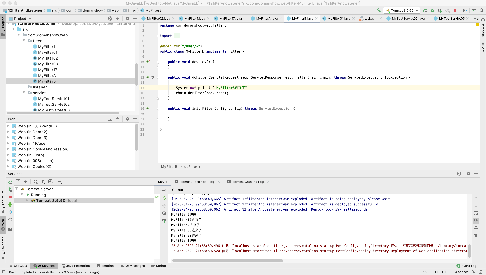

# 目录

1. [Filter](#t1)
    1. [概念](#概念) 
    2. [快速入门](#快速入门) 
    3. [过滤器细节](#过滤器细节) 
    4. [案例](#案例) 
2. [Listener](#t2)
    1. [](#) 
    2. [](#) 
    3. [](#) 

# t1
# 1. Filter


## 概念
## 2. 概念

就是过滤器
一般作用在. 登录验证, 统一编码处理, 铭感字符过滤什么的



## 快速入门
## 3. 快速入门
1. 定义一个类实现Filter 接口
2. 复写方法
3. 配置拦截路径
   1. web.xml
   2. 注解



```xml


<?xml version="1.0" encoding="UTF-8"?> <web-app xmlns="http://xmlns.jcp.org/xml/ns/javaee"
  xmlns:xsi="http://www.w3.org/2001/XMLSchema-instance"
  xsi:schemaLocation="http://xmlns.jcp.org/xml/ns/javaee http://xmlns.jcp.org/xml/ns/javaee/web-app_3_1.xsd"
  version="3.1">

   <filter>
      <filter-name>myfilterDemo01</filter-name>
      <filter-class>com.domanshow.web.filter.MyFilter01</filter-class>
   </filter>
   <filter-mapping>
      <filter-name>myfilterDemo01</filter-name>
      <url-pattern>/*</url-pattern>
   </filter-mapping>

</web-app>


```


```java


package com.domanshow.web.filter;

import javax.servlet.*;
import javax.servlet.annotation.WebFilter;
import java.io.IOException;

/**
 * 快速入门Demo */   @WebFilter("/*")
public class MyFilter01 implements Filter
{
    @Override
  public void init(FilterConfig filterConfig) throws ServletException {

    }

    @Override
  public void doFilter(ServletRequest servletRequest, ServletResponse servletResponse, FilterChain filterChain) throws IOException, ServletException {

        System.out.println("放行");
        filterChain.doFilter(servletRequest, servletResponse);
//        System.out.println("不放行");
  }

    @Override
  public void destroy() {

    }
}

```


## 过滤器细节

## 4. 过滤器细节


### 4.1过滤器执行流程
1. 执行过滤器
2. 执行放行后的资源
3. 执行放行后面的代码

### 4.2过滤器生命周期方法

1. init: 在服务器启动后, 会创建filter对象. 执行一次用于加载资源
2. `doFilter` : 每次拦截执行
3. `destroy`:  死亡方法, 服务器正常关闭执行   

### 4.3 过滤器配置详解

#### 4.3.1 拦截路径配置

1. 具体资源路径: `index.jsp` 单指这个文件
2. 拦截目录: `/user/*` user目录下所有
3. 后缀名拦截: `*.jsp` 后缀名`jsp`
4. 拦截所有资源: `/*`

#### 4.3.2 拦截方式配置: 资源访问方式

1. `REQUEST`: 默认值, 浏览器直接请求
2. `FORWARD`: 转发访问资源
3. `INCLUDE`: 包含访问资源
4. `ASYNC`: 异步访问资源
5. `ERROR`: 错误跳转资源

他们这几个可以多选的像下面这样

```java

package com.domanshow.web.filter;

import javax.servlet.*;
import javax.servlet.annotation.WebFilter;
import java.io.IOException;

@WebFilter(value = "/user/*", dispatcherTypes = {DispatcherType.ASYNC, DispatcherType.FORWARD})
public class MyFilter02 implements Filter {
    public void destroy() {
    }

    public void doFilter(ServletRequest req, ServletResponse resp, FilterChain chain) throws ServletException, IOException {
        chain.doFilter(req, resp);
    }

    public void init(FilterConfig config) throws ServletException {

    }

}

```

### 4.4 过滤器链 (配置多个过滤器)

#### 4.4.1执行顺序: 
1. 过滤器1
2. 过滤器2
3. 资源执行
4. 过滤器2
5. 过滤器1

如图



#### 4.4.2 过滤内部之间的先后顺序问题

1. 注解配置: 安装类名一个一个字符比较. 值较大的先执行 : 
**AFilter** 和 **BFilter** 的话后者先执行, A比B小
**MyFilter17** 和 **MyFilter6** 的话后者先执行, 1比6小

2. `web.xml`配置: 



```xml

<?xml version="1.0" encoding="UTF-8"?> <web-app xmlns="http://xmlns.jcp.org/xml/ns/javaee"
  xmlns:xsi="http://www.w3.org/2001/XMLSchema-instance"
  xsi:schemaLocation="http://xmlns.jcp.org/xml/ns/javaee http://xmlns.jcp.org/xml/ns/javaee/web-app_3_1.xsd"
  version="3.1">

<!--   <filter>--> <!--      <filter-name>myfilterDemo01</filter-name>--> <!--      <filter-class>com.domanshow.web.filter.MyFilter01</filter-class>--> <!--   </filter>--> <!--   <filter-mapping>--> <!--      <filter-name>myfilterDemo01</filter-name>--> <!--      <url-pattern>/*</url-pattern>--> <!--   </filter-mapping>-->        <filter>
        <filter-name>myFA</filter-name>
        <filter-class>com.domanshow.web.filter.MyFilterA</filter-class>
    </filter>
    <filter-mapping>
        <filter-name>myFA</filter-name>
        <url-pattern>/user/*</url-pattern>
    </filter-mapping>

    <filter>
        <filter-name>myFB</filter-name>
        <filter-class>com.domanshow.web.filter.MyFilterB</filter-class>
    </filter>
    <filter-mapping>
        <filter-name>myFB</filter-name>
        <url-pattern>/user/*</url-pattern>
    </filter-mapping>

</web-app>

```

## 案例

1. 案例一, 登录验证
2. 


# t2
# Listener