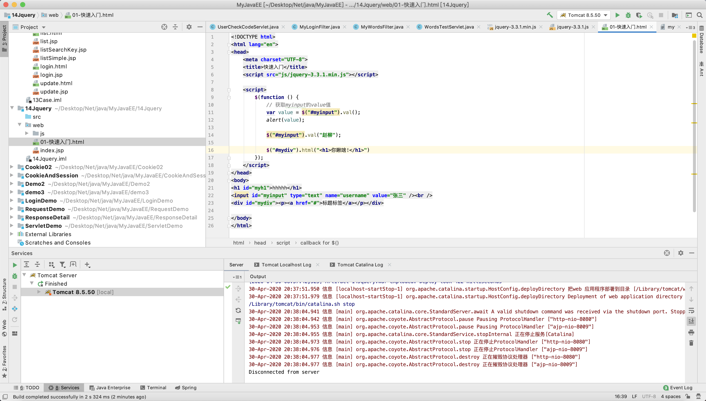

# 目录
1. [概念](#jquery01)
2. [快速入门](#jquery02)
3. [JQuery对象和JS对象区别与转换](#jquery03)
4. [选择器](#jquery04)
5. [DOM操作](#jquery05)
6. [基础案例](#jquery06)
7. [高级-动画](#jquery07)
8. [高级-遍历](#jquery08)
9. [高级-事件绑定](#jquery09)
10. [高级-案例](#jquery10)
11. [高级-插件](#jquery11)


# Jquery 基础


# jquery01
# 1.概念

他就是一个JavaScript的框架, 简化js开发
用它操作HTML文档, 事件处理, 动画什么的, Ajax交互什么的
本质就是js

# jquery02
# 2. 快速入门

## 2.1版本解释
1.x 兼容垃圾ie78, 仿佛使用最广泛终结版本`1.12.4(2016年5月20日)`
2.x 没什么人用
3.x 只支持最新浏览器
jquery-xxx.js：开发版本。给程序员看的，有良好的缩进和注释。体积大一些
jquery-xxx.min.js：生产版本。程序中使用，没有缩进。体积小一些。程序加载更快

## 2.2 入门
```html

<!DOCTYPE html>
<html lang="en">
<head>
    <meta charset="UTF-8">
    <title>快速入门</title>
    <script src="js/jquery-3.3.1.min.js"></script>

    <script>
        $(function () {
            // 获取myinput的value值
  var value = $("#myinput").val();
            alert(value);

            $("#myinput").val("赵柳");

            $("#mydiv").html("<h1>你瞅啥!</h1>")
        });
    </script>
</head>
<body>
<h1 id="myh1">hhhhh</h1>
<input id="myinput" type="text" name="username" value="张三" /><br />
<div id="mydiv"><p><a href="#">标题标签</a></p></div>

</body>
</html>

```


# jquery03
# 3. JQuery对象和JS对象区别与转换

1. JQuery方便些
2. JQuery对象方法和js对象不通用
3. 两者互换

jq----->js: 用索引像这样`$myJQh1s[0]`
js----->jq: 用`$()`包裹, 像下面这个`$(h1s[i])`其中`h1s[i]`是js,被包裹后整体就是jq对象

```html

<!DOCTYPE html>
<html lang="en">
<head>
    <meta charset="UTF-8">
    <title>快速入门</title>
    <script src="js/jquery-3.3.1.min.js"></script>

</head>
<body>

<h1 id="my1">你瞅啥!</h1>
<h1 id="my2">瞅你咋地!</h1>

<div id="div1">div1....</div>
<div id="div2">div2....</div>

<script>

    // 1. 用js试试
  var h1s = document.getElementsByTagName("h1");
    // alert(h1s.length)
  for (var i = 0; i < h1s.length; i++){
        // h1s[i].innerHTML = "滚你大爷!";
 // $(h1s[i]).html("你可拉倒吧");  }

    // 2. 用jq
  var $myJQh1s = $("h1");
    alert($myJQh1s.length+"是没");

    $myJQh1s[0].innerHTML = "拉鸡巴倒";

</script>

</body>
</html>


```


# jquery04
# 4. 选择器

## 4.1 基本操作

1. 事件绑定
2. 函数入口
    1. window.onload 只能定义一次,如果定义多次，后边的会将前边的覆盖掉
    2. $(function)可以定义多次的。
     
3. 样式控制

```html

<!DOCTYPE html>
<html lang="en">
<head>
    <meta charset="UTF-8">
    <title>快速入门</title>
    <script src="js/jquery-3.3.1.min.js"></script>

    <script>

        $(function () {

            $("#b1").click(function () {
                alert("abc");
            });
        });

    </script>

</head>
<body>

<div id="div1">div1....</div>
<div id="div2">div2....</div>
<input type="button" value="点我" id="b1">

</body>
</html>

```


## 4.2 选择器-基础选择器

1. 标签选择器:`$("div")`
2. id选择器:`$("#one")`
3. 类选择器: `$(".mini")`
4. 并集选择器:`$("span,#two")`

```html

<!DOCTYPE HTML PUBLIC "-//W3C//DTD HTML 4.01 Transitional//EN">
<html>
  <head>
    <title>基本选择器</title>
    <meta http-equiv="content-type" content="text/html; charset=UTF-8">
   <script src="../js/jquery-3.3.1.min.js"></script>
   <style type="text/css">
         div,span{
             width: 180px;
             height: 180px;
             margin: 20px;
             background: #9999CC;
             border: #000 1px solid;
            float:left;
             font-size: 17px;
             font-family:Roman;
         }

         div .mini{
             width: 50px;
             height: 50px;
             background: #CC66FF;
             border: #000 1px solid;
             font-size: 12px;
             font-family:Roman;
         }

         div .mini01{
             width: 50px;
             height: 50px;
             background: #CC66FF;
             border: #000 1px solid;
             font-size: 12px;
             font-family:Roman;
         }

    </style>

   <script type="text/javascript">

       $(function () {
          // <input type="button" value="改变 id 为 one 的元素的背景色为 红色"  id="b1"/>
  $("#b1").click(function () {
            $("#one").css("backgroundColor", "red");
          });

      // <input type="button" value=" 改变元素名为 <div> 的所有元素的背景色为 红色"  id="b2"/>
  $("#b2").click(function () {
             $("div").css("backgroundColor", "pink");
          });
       //<input type="button" value=" 改变 class 为 mini 的所有元素的背景色为 红色"  id="b3"/>
  $("#b3").click(function () {
             $(".mini").css("backgroundColor", "black");
          });
       //<input type="button" value=" 改变所有的<span>元素和 id 为 two 的元素的背景色为红色"  id="b4"/>
  $("#b4").click(function () {
             $("span,#two").css("backgroundColor", "red");
          });

       });

   </script>

   </head>

   <body>

       <input type="button" value="保存" class="mini" name="ok" class="mini" />
       <input type="button" value="改变 id 为 one 的元素的背景色为 红色" id="b1"/>
       <input type="button" value=" 改变元素名为 <div> 的所有元素的背景色为 红色" id="b2"/>
       <input type="button" value=" 改变 class 为 mini 的所有元素的背景色为 红色" id="b3"/>
       <input type="button" value=" 改变所有的<span>元素和 id 为 two 的元素的背景色为红色" id="b4"/>

       <h1>有一种奇迹叫坚持</h1>
       <h2>自信源于努力</h2>

      <div id="one">
           id为one       
       </div>

       <div id="two" class="mini" >
             id为two   class是 mini 
             <div class="mini" >class是 mini</div>
       </div>

       <div class="one" >
             class是 one 
             <div class="mini" >class是 mini</div>
            <div class="mini" >class是 mini</div>
       </div>
       <div class="one" >
           class是 one 
             <div class="mini01" >class是 mini01</div>
            <div class="mini" >class是 mini</div>
      </div>

      <span class="spanone">class为spanone的span元素</span>
      <span class="mini">class为mini的span元素</span>

      <input type="text" value="zhang" id="username" name="username">

   </body>

</html>

```

## 4.2 选择器-层级选择器

1. 后代选择器: `$("body div")`
2. 子选择器: `$("body > div")`

```html

<!DOCTYPE HTML PUBLIC "-//W3C//DTD HTML 4.01 Transitional//EN">
<html>
  <head>
    <title>层次选择器</title>
    <meta http-equiv="content-type" content="text/html; charset=UTF-8">
   <script src="../js/jquery-3.3.1.min.js"></script>
   <style type="text/css">
         div,span{
             width: 180px;
             height: 180px;
             margin: 20px;
             background: #9999CC;
             border: #000 1px solid;
            float:left;
             font-size: 17px;
             font-family:Roman;
         }

         div .mini{
             width: 50px;
             height: 50px;
             background: #CC66FF;
             border: #000 1px solid;
             font-size: 12px;
             font-family:Roman;
         }

         div .mini01{
             width: 50px;
             height: 50px;
             background: #CC66FF;
             border: #000 1px solid;
             font-size: 12px;
             font-family:Roman;
         }

    </style>
    <script type="text/javascript">
      $(function () {
         // <input type="button" value=" 改变 <body> 内所有 <div> 的背景色为红色"  id="b1"/>
  $("#b1").click(function () {
            $("body div").css("backgroundColor", "red");
         });
         // <input type="button" value=" 改变 <body> 内子 <div> 的背景色为 红色"  id="b2"/>
  $("#b2").click(function () {
            $("body > div").css("backgroundColor", "red");
         });
      });

   </script>

   </head>

   <body>

       <input type="button" value="保存" class="mini" name="ok" class="mini" />
       <input type="button" value=" 改变 <body> 内所有 <div> 的背景色为红色" id="b1"/>
       <input type="button" value=" 改变 <body> 内子 <div> 的背景色为 红色" id="b2"/>

       <h1>有一种奇迹叫坚持</h1>
       <h2>自信源于努力</h2>

        <div id="one">
           id为one  

       </div>

       <div id="two" class="mini" >
             id为two   class是 mini 
             <div class="mini" >class是 mini</div>
      </div>

       <div class="one" >
             class是 one 
             <div class="mini" >class是 mini</div>
            <div class="mini" >class是 mini</div>
       </div>
       <div class="one">
           class是 one 
             <div class="mini01" >class是 mini01</div>
            <div class="mini" >class是 mini</div>
      </div>

      <span class="spanone">    span
      </span>

   </body>

</html>


```
## 4.3 选择器-属性选择器
1. 属性名称选择器: `$("div[title]")`
2. 属性选择器: 
3. 复合属性选择器:`$("div[id][title*='es']")`

```html

<!DOCTYPE HTML PUBLIC "-//W3C//DTD HTML 4.01 Transitional//EN">
<html>
  <head>
    <title>属性过滤选择器</title>
    <meta http-equiv="content-type" content="text/html; charset=UTF-8">
   <script src="../js/jquery-3.3.1.min.js"></script>
   <style type="text/css">
         div,span{
             width: 180px;
             height: 180px;
             margin: 20px;
             background: #9999CC;
             border: #000 1px solid;
            float:left;
             font-size: 17px;
             font-family:Roman;
         }

         div .mini{
             width: 50px;
             height: 50px;
             background: #CC66FF;
             border: #000 1px solid;
             font-size: 12px;
             font-family:Roman;
         }

         div .mini01{
             width: 50px;
             height: 50px;
             background: #CC66FF;
             border: #000 1px solid;
             font-size: 12px;
             font-family:Roman;
         }

         div.visible{
            display:none;
         }
    </style>
    <script type="text/javascript">

       $(function () {
          // <input type="button" value=" 含有属性title 的div元素背景色为红色"  id="b1"/>    $("#b1").click(function () {
            $("div[title]").css("backgroundColor", "red");
          });
          // <input type="button" value=" 属性title值等于test的div元素背景色为红色"  id="b2"/>
  $("#b2").click(function () {
             $("div[title='test']").css("backgroundColor", "red");
          });
          // <input type="button" value=" 属性title值不等于test的div元素(没有属性title的也将被选中)背景色为红色"  id="b3"/>
  $("#b3").click(function () {
             $("div[title!='test']").css("backgroundColor", "red");
          });
          // <input type="button" value=" 属性title值 以te开始 的div元素背景色为红色"  id="b4"/>
  $("#b4").click(function () {
             $("div[title^='te']").css("backgroundColor", "red");
          });
          // <input type="button" value=" 属性title值 以est结束 的div元素背景色为红色"  id="b5"/>
  $("#b5").click(function () {
             $("div[title$='est']").css("backgroundColor", "red");
          });
          // <input type="button" value="属性title值 含有es的div元素背景色为红色"  id="b6"/>
  $("#b6").click(function () {
             $("div[title*='es']").css("backgroundColor", "red");
          });
          // <input type="button" value="选取有属性id的div元素，然后在结果中选取属性title值含有“es”的 div 元素背景色为红色"  id="b7"/>
  $("#b7").click(function () {
             $("div[id][title*='es']").css("backgroundColor", "red");
          });
       });

   </script>

   </head>

   <body>

       <input type="button" value="保存" class="mini" name="ok" class="mini" />
       <input type="button" value=" 含有属性title 的div元素背景色为红色" id="b1"/>
       <input type="button" value=" 属性title值等于test的div元素背景色为红色" id="b2"/>
       <input type="button" value=" 属性title值不等于test的div元素(没有属性title的也将被选中)背景色为红色" id="b3"/>
       <input type="button" value=" 属性title值 以te开始 的div元素背景色为红色" id="b4"/>
       <input type="button" value=" 属性title值 以est结束 的div元素背景色为红色" id="b5"/>
       <input type="button" value="属性title值 含有es的div元素背景色为红色" id="b6"/>
       <input type="button" value="选取有属性id的div元素，然后在结果中选取属性title值含有“es”的 div 元素背景色为红色" id="b7"/>

      <div id="one">
           id为one   div  
       </div>

       <div id="two" class="mini" title="test">
             id为two   class是 mini  div  title="test"
             <div class="mini" >class是 mini</div>
      </div>

       <div class="visible" >
             class是 one 
             <div class="mini" >class是 mini</div>
            <div class="mini" >class是 mini</div>
       </div>
       <div class="one" title="test02">
           class是 one    title="test02"
             <div class="mini01" >class是 mini01</div>
            <div class="mini" style="margin-top:0px;">class是 mini</div>
      </div>

      <div class="visible" >
           这是隐藏的
      </div>

      <div class="one">

      </div>

      <div id="mover" >
           动画
      </div>

      <input type="text" value="zhang" id="username" name="username">
   </body>

</html>

```


## 4.4 选择器-过滤选择器

1. 首元素选择器
2. 尾元素选择器
3. 非元素选择器
4. 偶数选择器
5. 奇数选择器
6. 等于索引选择器
7. 大于索引选择器
8. 小于索引选择器
9. 标题选择器

```html

<!DOCTYPE HTML PUBLIC "-//W3C//DTD HTML 4.01 Transitional//EN">
<html>
  <head>
    <title>基本过滤选择器</title>
    <meta http-equiv="content-type" content="text/html; charset=UTF-8">
   <script src="../js/jquery-3.3.1.min.js"></script>
   <style type="text/css">
         div,span{
             width: 180px;
             height: 180px;
             margin: 20px;
             background: #9999CC;
             border: #000 1px solid;
            float:left;
             font-size: 17px;
             font-family:Roman;
         }

         div .mini{
             width: 50px;
             height: 50px;
             background: #CC66FF;
             border: #000 1px solid;
             font-size: 12px;
             font-family:Roman;
         }

         div .mini01{
             width: 50px;
             height: 50px;
             background: #CC66FF;
             border: #000 1px solid;
             font-size: 12px;
             font-family:Roman;
         }
    </style>
   <script type="text/javascript">

      $(function () {

      // <input type="button" value=" 改变第一个 div 元素的背景色为 红色"  id="b1"/><br>    $("#b1").click(function () {
            $("div:first").css("backgroundColor", "red");
         });

      //           <input type="button" value=" 改变最后一个 div 元素的背景色为 红色"  id="b2"/><br>
  $("#b2").click(function () {
            $("div:last").css("backgroundColor", "black");
         });
      //           <input type="button" value=" 改变class不为 one 的所有 div 元素的背景色为 红色"  id="b3"/><br>
  $("#b3").click(function () {
            $("div:not(.one)").css("backgroundColor", "yellow");
         });
      //           <input type="button" value=" 改变索引值为偶数的 div 元素的背景色为 红色"  id="b4"/><br>
  $("#b4").click(function () {
            $("div:even").css("backgroundColor", "green");
         });
      //           <input type="button" value=" 改变索引值为奇数的 div 元素的背景色为 红色"  id="b5"/><br>
  $("#b5").click(function () {
            $("div:odd").css("backgroundColor", "#0063FF");
         });
      //           <input type="button" value=" 改变索引值为大于 3 的 div 元素的背景色为 红色"  id="b6"/><br>
  $("#b6").click(function () {
            $("div:gt(3)").css("backgroundColor", "#006300");
         });
      //           <input type="button" value=" 改变索引值为等于 3 的 div 元素的背景色为 红色"  id="b7"/><br>
  $("#b7").click(function () {
            $("div:eq(3)").css("backgroundColor", "#006300");
         });
      //           <input type="button" value=" 改变索引值为小于 3 的 div 元素的背景色为 红色"  id="b8"/><br>
  $("#b8").click(function () {
            $("div:lt(3)").css("backgroundColor", "#006300");
         });
      //           <input type="button" value=" 改变所有的标题元素的背景色为 红色"  id="b9"/><br>
  $("#b9").click(function () {
            $(":header").css("backgroundColor", "red");
         });
      });

   </script>
   </head>

   <body>

       <input type="button" value="保存" class="mini" name="ok" class="mini" /><br>
       <input type="button" value=" 改变第一个 div 元素的背景色为 红色" id="b1"/><br>
       <input type="button" value=" 改变最后一个 div 元素的背景色为 红色" id="b2"/><br>
       <input type="button" value=" 改变class不为 one 的所有 div 元素的背景色为 红色" id="b3"/><br>
       <input type="button" value=" 改变索引值为偶数的 div 元素的背景色为 红色" id="b4"/><br>
       <input type="button" value=" 改变索引值为奇数的 div 元素的背景色为 红色" id="b5"/><br>
       <input type="button" value=" 改变索引值为大于 3 的 div 元素的背景色为 红色" id="b6"/><br>
       <input type="button" value=" 改变索引值为等于 3 的 div 元素的背景色为 红色" id="b7"/><br>
       <input type="button" value=" 改变索引值为小于 3 的 div 元素的背景色为 红色" id="b8"/><br>
       <input type="button" value=" 改变所有的标题元素的背景色为 红色" id="b9"/><br>

       <h1>有一种奇迹叫坚持</h1>
       <h2>自信源于努力</h2>
       <h3>嗨起来!</h3>
       <div id="wode" class="one">
          love xy
       </div>

        <div id="one">
           id为one  

       </div>

       <div id="two" class="mini" >
             id为two   class是 mini 
             <div class="mini" >class是 mini</div>
      </div>

       <div class="one" >
             class是 one 
             <div class="mini" >class是 mini</div>
            <div class="mini" >class是 mini</div>
       </div>
       <div class="one" >
           class是 one 
             <div class="mini01" >class是 mini01</div>
            <div class="mini" >class是 mini</div>
      </div>

   </body>

</html>

```

## 4.5 表单过滤选择器

1. 可用元素选择器
2. 不可用元素选择器
3. 选中选择器
4. 选中选择器

```html

<!DOCTYPE HTML PUBLIC "-//W3C//DTD HTML 4.01 Transitional//EN">
<html>
  <head>
    <title>表单属性过滤选择器</title>
    <meta http-equiv="content-type" content="text/html; charset=UTF-8">
   <script src="../js/jquery-3.3.1.min.js"></script>
   <style type="text/css">
         div,span{
             width: 180px;
             height: 180px;
             margin: 20px;
             background: #9999CC;
             border: #000 1px solid;
            float:left;
             font-size: 17px;
             font-family:Roman;
         }

         div .mini{
             width: 50px;
             height: 50px;
             background: #CC66FF;
             border: #000 1px solid;
             font-size: 12px;
             font-family:Roman;
         }

         div .mini01{
             width: 50px;
             height: 50px;
             background: #CC66FF;
             border: #000 1px solid;
             font-size: 12px;
             font-family:Roman;
         }
         #job{
            margin: 20px;
         }
         #edu{
            margin-top:-70px;
         }

    </style>

    <script type="text/javascript">
      $(function () {
      // <input type="button" value=" 利用 jQuery 对象的 val() 方法改变表单内可用 <input> 元素的值"  id="b1"/>
  $("#b1").click(function () {
            $("input[type='text']:enabled").val("aa");
         });
      //           <input type="button" value=" 利用 jQuery 对象的 val() 方法改变表单内不可用 <input> 元素的值"  id="b2"/>
  $("#b2").click(function () {
            $("input[type='text']:disabled").val("aa");
         });
      //           <input type="button" value=" 利用 jQuery 对象的 length 属性获取复选框选中的个数"  id="b3"/>
  $("#b3").click(function () {
            alert($("input[type='checkbox']:checked").length);
         });
      //           <input type="button" value=" 利用 jQuery 对象的 length 属性获取下拉框选中的个数"  id="b4"/>
  $("#b4").click(function () {

            alert($("#job > option:selected").length);
         });
      });

   </script>

   </head>

   <body>

       <input type="button" value="保存" class="mini" name="ok" class="mini" /><br>
       <input type="button" value=" 利用 jQuery 对象的 val() 方法改变表单内可用 <input> 元素的值" id="b1"/><br>
       <input type="button" value=" 利用 jQuery 对象的 val() 方法改变表单内不可用 <input> 元素的值" id="b2"/><br>
       <input type="button" value=" 利用 jQuery 对象的 length 属性获取复选框选中的个数" id="b3"/><br>
       <input type="button" value=" 利用 jQuery 对象的 length 属性获取下拉框选中的个数" id="b4"/><br>

      <br><br>

         <input type="text" value="不可用值1" disabled="disabled"> 
       <input type="text" value="可用值1" >
       <input type="text" value="不可用值2" disabled="disabled">
       <input type="text" value="可用值2" >

       <br><br>
       <input type="checkbox" name="items" value="美容" >美容
       <input type="checkbox" name="items" value="IT" >IT
       <input type="checkbox" name="items" value="金融" >金融
       <input type="checkbox" name="items" value="管理" >管理

       <br><br>

        <input type="radio" name="sex" value="男" >男
        <input type="radio" name="sex" value="女" >女

         <br><br>

        <select name="job" id="job" multiple="multiple" size=4>
           <option>程序员</option>
         <option>中级程序员</option>
         <option>高级程序员</option>
         <option>系统分析师</option>
          </select>

          <select name="edu" id="edu">
           <option>本科</option>
         <option>博士</option>
         <option>硕士</option>
         <option>大专</option>
          </select>

      <br/>

       <div id="two" class="mini" >
             id为two   class是 mini  div
             <div class="mini" >class是 mini</div>
      </div>

       <div class="one" >
             class是 one 
             <div class="mini" >class是 mini</div>
            <div class="mini" >class是 mini</div>
       </div>
       <div class="one" >
           class是 one 
             <div class="mini01" >class是 mini01</div>
            <div class="mini" >class是 mini</div>
      </div>

   </body>

</html>


```


# jquery05
# 5. DOM操作

## 5.1 内容操作

1. `val()`: 获取/设置元素的value属性值
2. `html()`: 标签内容
3. `text()`: 内容

```html

<!DOCTYPE html>
<html>
   <head>
      <meta charset="UTF-8">
      <title></title>
      <script src="../js/jquery-3.3.1.min.js"></script>
      <script>

         $(function () {
            // 获取myinput 的value值
  var value = $("#myinput").val();
            // alert(value);
 // 获取mydiv的标签体内容  var divStr = $("#mydiv").html();
            // alert(divStr);
  $("#mydiv").html("<h1>你瞅啥!</h1>")
            // 获取mydiv文本内容
  var divContent = $("#mydiv").text();
            alert(divContent);
            $("#mydiv").text("你去死吧!")
         });

      </script>

   </head>
   <body>
      <input id="myinput" type="text" name="username" value="张三" /><br />
      <div id="mydiv"><p><a href="#">标题标签</a></p></div>
   </body>
</html>

```

## 5.2 属性操作

### 5.2.1 通用属性操作

1. `attr("name")`:
2. `removeAttr("name")`:
3. `prop("checked")`:
4. ``:


attr和prop区别？
1. 如果操作的是元素的固有属性，则建议使用prop
2. 如果操作的是元素自定义的属性，则建议使用attr

```html

<!DOCTYPE HTML PUBLIC "-//W3C//DTD HTML 4.01 Transitional//EN">
<html>
  <head>
    <title>获取属性</title>
    <meta http-equiv="content-type" content="text/html; charset=UTF-8">
   <script src="../js/jquery-3.3.1.min.js"></script>

   <style type="text/css">
         div,span{
             width: 140px;
             height: 140px;
             margin: 20px;
             background: #9999CC;
             border: #000 1px solid;
            float:left;
             font-size: 17px;
             font-family:Roman;
         }

         div.mini{
             width: 30px;
             height: 30px;
             background: #CC66FF;
             border: #000 1px solid;
             font-size: 12px;
             font-family:Roman;
         }

         div.visible{
            display:none;
         }
    </style>

   <script type="text/javascript">
      $(function () {
            //获取北京节点的name属性值
  var name = $("#bj").attr("name");
         //alert(name);
 //设置北京节点的name属性的值为dabeijing  $("#bj").attr("name","dabeijing");
            //新增北京节点的discription属性 属性值是didu
  $("#bj").attr("discription","didu");
            //删除北京节点的name属性并检验name属性是否存在
  $("#bj").removeAttr("name");
            //获得hobby的的选中状态
  var checked = $("#hobby").prop("checked");
         alert(checked);

            //var checked = $("#hobby").attr("checked"); //获取不到，弹出undefined    });

   </script>

   </head>

   <body>

       <ul>
          <li id="bj" name="beijing" xxx="yyy">北京</li>
          <li id="tj" name="tianjin">天津</li>
       </ul>
       <input type="checkbox" id="hobby"/>

   </body>

</html>

```


### 5.2.2 对class属性操作
1. `$("#one").prop("class", "second");`:
2. `$("#one").addClass("second");`:
3. `$("#one").removeClass("second");`:
4. `$("#one").toggleClass("second");`:
5. `$("#one").css("backgroundColor");`:
6. `$("#one").css("backgroundColor", "black");`:

```html

<!DOCTYPE HTML PUBLIC "-//W3C//DTD HTML 4.01 Transitional//EN">
<html>
  <head>
    <title>样式操作</title>
    <meta http-equiv="content-type" content="text/html; charset=UTF-8">
   <script src="../js/jquery-3.3.1.min.js"></script>
   <style type="text/css">
         .one{
             width: 200px;
             height: 140px;
             margin: 20px;
             background: red;
             border: #000 1px solid;
            float:left;
             font-size: 17px;
             font-family:Roman;
         }

         div,span{
             width: 140px;
             height: 140px;
             margin: 20px;
             background: #9999CC;
             border: #000 1px solid;
            float:left;
             font-size: 17px;
             font-family:Roman;
         }

         div .mini{
             width: 40px;
             height: 40px;
             background: #CC66FF;
             border: #000 1px solid;
             font-size: 12px;
             font-family:Roman;
         }
         div .mini01{
             width: 40px;
             height: 40px;
             background: #CC66FF;
             border: #000 1px solid;
             font-size: 12px;
             font-family:Roman;
         }

         /*待用的样式*/
  .second{
            width: 300px;
             height: 340px;
             margin: 20px;
             background: yellow;
             border: pink 3px dotted;
            float:left;
             font-size: 22px;
             font-family:Roman;
         }

    </style>
    <script type="text/javascript">

       $(function () {

          //<input type="button" value="采用属性增加样式(改变id=one的样式)"  id="b1"/>
  $("#b1").click(function () {
            $("#one").prop("class", "second");
          });
          //<input type="button" value=" addClass"  id="b2"/>
  $("#b2").click(function () {
             $("#one").addClass("second");
          });

          //<input type="button" value="removeClass"  id="b3"/>
  $("#b3").click(function () {
             $("#one").removeClass("second");
          });

          //<input type="button" value=" 切换样式"  id="b4"/>
  $("#b4").click(function () {
             $("#one").toggleClass("second");
          });

          //<input type="button" value=" 通过css()获得id为one背景颜色"  id="b5"/>
  $("#b5").click(function () {
            var backG = $("#one").css("backgroundColor");
            alert(backG);
          });

          //<input type="button" value=" 通过css()设置id为one背景颜色为绿色"  id="b6"/>
  $("#b6").click(function () {
             $("#one").css("backgroundColor", "black");
          });
       });

   </script>

   </head>

   <body>

       <input type="button" value="保存" class="mini" name="ok" class="mini" /><br>
       <input type="button" value="采用属性增加样式(改变id=one的样式)" id="b1"/><br>
       <input type="button" value=" addClass" id="b2"/><br>
       <input type="button" value="removeClass" id="b3"/><br>
       <input type="button" value=" 切换样式" id="b4"/><br>
       <input type="button" value=" 通过css()获得id为one背景颜色" id="b5"/><br>
       <input type="button" value=" 通过css()设置id为one背景颜色为绿色" id="b6"/><br>

       <h1>有一种奇迹叫坚持</h1>
       <h2>自信源于努力</h2>

        <div id="one">
           id为one 
       </div>

       <div id="two" class="mini" >
             id为two   class是 mini 
             <div class="mini" >class是 mini</div>
      </div>

       <div class="one" >
             class是 one 
             <div class="mini" >class是 mini</div>
            <div class="mini" >class是 mini</div>
       </div>

       <div class="one" >
           class是 one 
             <div class="mini01" >class是 mini01</div>
            <div class="mini" >class是 mini</div>
      </div>

      <span class="spanone">    span
      </span>

   </body>

</html>

```


## 5.3 CRUD

1. `$("#city").append($("#fk"));`:将反恐放置到city的后面
2. `$("#fk").appendTo("#city");`:将反恐放置到city的后面
3. `$("#city").prepend($("#fk"));`:将反恐放置到city的最前面
4. `$("#fk").prependTo("#city");`:将反恐放置到city的最前面
5. `$("#tj").after($("#fk"));`:将反恐插入到天津后面
6. `$("#fk").insertAfter($("#tj"));`:将反恐插入到天津后面
7. `$("#tj").before($("#fk"));`:将反恐插入到天津前面
8. `$("#fk").insertBefore($("#tj"));`:将反恐插入到天津前面
9. `$("#bj").remove();`:删除<li id='bj' name='beijing'>北京</li>
10. `$("#city").empty();`:删除city所有的li节点   清空元素中的所有后代节点(不包含属性节点)


```html

<!DOCTYPE HTML PUBLIC "-//W3C//DTD HTML 4.01 Transitional//EN">
<html>
  <head>
    <title>内部插入脚本</title>
    <meta http-equiv="content-type" content="text/html; charset=UTF-8">
   <script src="../js/jquery-3.3.1.min.js"></script>
   <style type="text/css">
         div,span{
             width: 140px;
             height: 140px;
             margin: 20px;
             background: #9999CC;
             border: #000 1px solid;
            float:left;
             font-size: 17px;
             font-family:Roman;
         }

         div .mini{
             width: 30px;
             height: 30px;
             background: #CC66FF;
             border: #000 1px solid;
             font-size: 12px;
             font-family:Roman;
         }

         div.visible{
            display:none;
         }
    </style>
    <script type="text/javascript">

       $(function () {

          // <input type="button" value="将反恐放置到city的后面"  id="b1"/>
  $("#b1").click(function () {
             // $("#city").append($("#fk"));
  $("#fk").appendTo("#city");
          });

          // <input type="button" value="将反恐放置到city的最前面"  id="b2"/>
  $("#b2").click(function () {
             // $("#city").prepend($("#fk"));
  $("#fk").prependTo("#city");
          });

          // <input type="button" value="将反恐插入到天津后面"  id="b3"/>
  $("#b3").click(function () {

            // $("#tj").after($("#fk"));
  $("#fk").insertAfter($("#tj"));
          });

          // <input type="button" value="将反恐插入到天津前面"  id="b4"/>
  $("#b4").click(function () {

            // $("#tj").before($("#fk"));
  $("#fk").insertBefore($("#tj"));
          });
       });

   </script>

   </head>

   <body>

      <input type="button" value="将反恐放置到city的后面" id="b1"/><br>
      <input type="button" value="将反恐放置到city的最前面" id="b2"/><br>
      <input type="button" value="将反恐插入到天津后面" id="b3"/><br>
      <input type="button" value="将反恐插入到天津前面" id="b4"/><br>
       <ul id="city">
          <li id="bj" name="beijing">北京</li>
          <li id="tj" name="tianjin">天津</li>
          <li id="cq" name="chongqing">重庆</li>
       </ul>

        <ul id="love">
          <li id="fk" name="fankong">反恐</li>
          <li id="xj" name="xingji">星际</li>
       </ul>

      <div id="foo1">Hello1</div> 

   </body>

</html>

```


```html

<!DOCTYPE HTML PUBLIC "-//W3C//DTD HTML 4.01 Transitional//EN">
<html>
  <head>
    <title>删除节点</title>
    <meta http-equiv="content-type" content="text/html; charset=UTF-8">
   <script src="../js/jquery-3.3.1.min.js"></script>
   <style type="text/css">
         div,span{
             width: 140px;
             height: 140px;
             margin: 20px;
             background: #9999CC;
             border: #000 1px solid;
            float:left;
             font-size: 17px;
             font-family:Roman;
         }

         div.mini{
             width: 30px;
             height: 30px;
             background: #CC66FF;
             border: #000 1px solid;
             font-size: 12px;
             font-family:Roman;
         }

         div.visible{
            display:none;
         }
    </style>
    <script type="text/javascript">

      $(function () {
         // <input type="button" value="删除<li id='bj' name='beijing'>北京</li>"  id="b1"/>
  $("#b1").click(function () {
            $("#bj").remove();
         });
         // <input type="button" value="删除city所有的li节点   清空元素中的所有后代节点(不包含属性节点)"  id="b2"/>
  $("#b2").click(function () {
            $("#city").empty();
         });
      });

   </script>
   </head>

   <body>

   <input type="button" value="删除<li id='bj' name='beijing'>北京</li>" id="b1"/><br>
   <input type="button" value="删除所有的子节点   清空元素中的所有后代节点(不包含属性节点)" id="b2"/><br>

       <ul id="city">
          <li id="bj" name="beijing">北京</li>
          <li id="tj" name="tianjin">天津</li>
          <li id="cq" name="chongqing">重庆</li>
       </ul>
       <p class="hello">Hello</p> how are <p>you?</p> 
   </body>

</html>


```


# jquery06
# 6. 基础案例


# Jquery高级


# jquery07
# 7. 高级-动画

# jquery08
# 8. 高级-遍历

# jquery09
# 9. 高级-事件绑定

# jquery10
# 10. 高级-案例

# jquery11
# 11. 高级-插件

