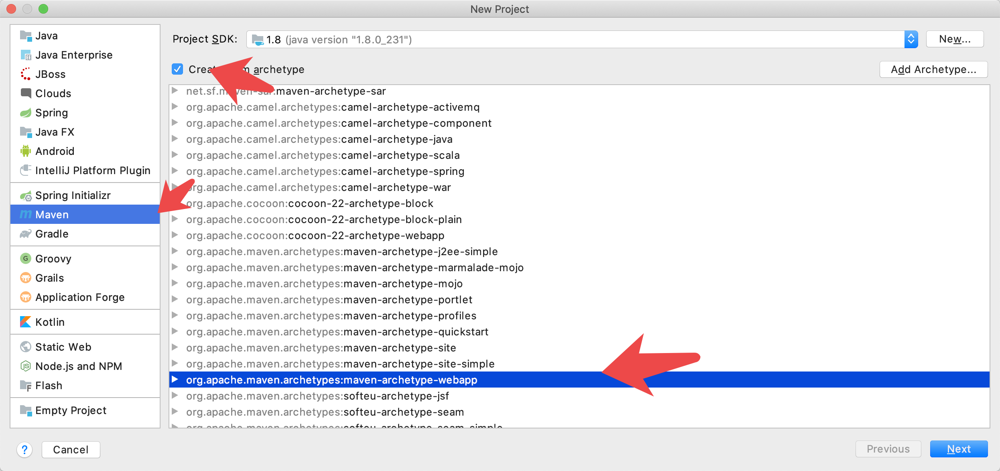
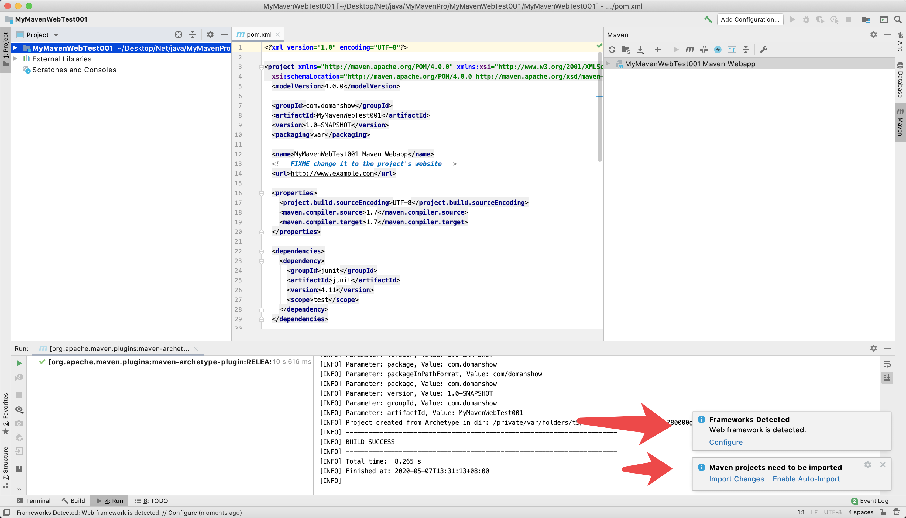
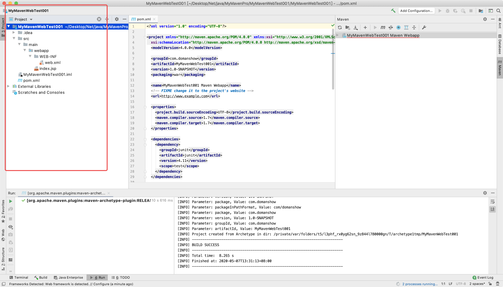
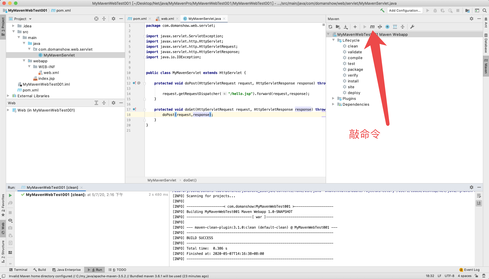

# 目录

1. [概念](#mvn01)
    1. [概念](#mvn0101)
    2. [优势](#mvn0102)
    3. [作用-依赖管理](#mvn013)
    4. [作用-一键构建](#mvn0104)
2. [Maven使用](#mvn02)
    1. [2.1 下载安装-见外面文件](#mvn0201)
    2. [2.2 Maven仓库](#mvn0202)
    3. [2.3 Maven 工程认识](#mvn0203)
3. [Maven 常用命令](#mvn03)
    1. [3.1 常用命令](#mvn0301)
    2. [3.2 idea 开发 maven 项目](#mvn0302)
4. [Maven 工程运行调试](#mvn04)
    1. [端口占用处理](#mvn0401)
    2. [断点调试](#mvn0402)
5. [总结](#mvn05)
    1. [maven 仓库](#mvn0501)
    2. [常用的 maven 命令](#mvn0502)
    3. [坐标定义](#mvn0503)
    4. [pom 基本配置](#mvn0504)


/Users/codew/.m2/


# mvn01
# 1. 概念


## mvn0101
## 1.1 概念

不只是`iOS`里的`cocoapods`

```c

Maven是一个项目管理工具
包含一个项目对象模型(POM:Project Object Model)
一组标准集合
一个项目生命周期(Project Lifecycle)
一个依赖管理系统(Dependency Management System)
最后一个用来运行定义在生命周期阶段(phase)中插件(plugin)目标(goal)的逻辑

```


## mvn0102
## 1.2 优势

1. 对 jar包冲突,版本冲突 说再见, 减少工程大小
2. 总之就是好,哈哈哈哈

## mvn0103
## 1.3 作用-依赖管理

之前我们都是将jar复制粘贴到项目中去, 用它就和`pod` 一样`pod install`

1. `pod`是在`Podfile`, `Maven`是在`pom.xml`文件配置


## mvn0104
## 1.4 作用-一键构建

`一条命令搞定`

1. `编译`, `测试`, `运行`, `打包`, `安装`,都交给`Maven`做, 这一套叫构建


# mvn02
# 2. Maven使用

## mvn0201
## 2.1 下载安装-见外面文件

## mvn0202
## 2.2 Maven仓库

### 2.2.1 仓库的分类

1. 本地仓库
2. 远程仓库
3. 中央仓库: *   maven 软件中内置一个远程仓库地址 http://repo1.maven.org/maven2


4. 可以修改本地仓库指向`localRepository`
`/Users/codew/Library/wtApplication/apache-maven-3.6.3/conf/settings.xml`

> maven 仓库地址、私服等配置信息需要在 setting.xml 文件中配置，分为全局配置和用户配置。

> 在 maven 安装目录下的有 conf/setting.xml 文件，此 setting.xml 文件用于 maven 的所有 project 项目，它作为 maven 的全局配置。

> 如需要个性配置则需要在用户配置中设置，用户配置的 setting.xml 文件默认的位置在:${user.dir} /.m2/settings.xml目录中,${user.dir} 指windows 中的用户目录。

> maven 会先找用户配置，如果找到则以用户配置文件为准，否则使用全局配置文件。

## mvn0203
## 2.3 Maven 工程认识

1. `/src/main/java`:  核心代码部分
2. `/src/main/resources`: 配置文件部分
3. `/src/main/webapp`: 页面资源
4. `/src/test/java`: 测试代码部分
5. `/src/test/resources`: 测试配置文件


# mvn03
# 3. Maven 常用命令

## mvn0301
## 3.1 常用命令

1. `mvn clean`是`maven`工程的 **清理命令**, 它会删除`target`目录及内容
2. `mvn compile` 是`maven`工程的编译命令 
3. `mvn test`是`maven`工程的 **测试命令**
4. `mvn package`是`maven`工程的 **打包命令**, java工程大包成`jar`包, web工程大包成`war`包
5. `mvn install`是`maven`工程的 **安装命令**, 执行会将工程打包成jar或war发布到本地仓库

6. `mvn deploy`发布


### 3.1.2 maven指令 的生命周期

maven对项目构建过程分为三套相互独立的生命周期, 是`三套`. 相互独立的`三套`

`Clean Lifecycle` 在进行真正的构建之前进行一些清理工作。
`DefaultLifecycle` 构建的核心部分，编译，测试，打包，部署等等。 
`Site Lifecycle` 生成项目报告，站点，发布站点。


### 3.1.3 maven的概念模型
```c

Maven是一个项目管理工具
包含一个项目对象模型(POM:Project Object Model)
一组标准集合
一个项目生命周期(Project Lifecycle)
一个依赖管理系统(Dependency Management System)
最后一个用来运行定义在生命周期阶段(phase)中插件(plugin)目标(goal)的逻辑

```


1. 项目对象模型(Project Object Model)

一个`maven`工程都有一个`pom.xml` 文件.
通过`pom.xml` 文件定义`项目的坐标`, `项目依赖`,`项目信息`,`插件目标`

2. 依赖管理系统(Dependency Management System)


3. 项目生命周期(Project Lifecycle)


4. 一组标准集合

5. 插件(plugin)目标(goal)
`maven`管理项目生命周期过程都是基于插件完成的

## mvn0302
## 3.2 idea 开发 maven 项目


```

-DarchetypeCatalog=internal

-DarchetypeCatalog=local


archetypeCatalog=internal


-DarchetypeCatalog=internal

-DarchetypeCatalog=local


```


### 3.2.1 使用骨架创建maven的java工程


 IDEA 不会为我们创建完整的目录, 自己补全


### 3.2.2 不使用maven骨架创建java工程, 建议不使用maven骨架


### 3.2.3 使用maven骨架创建一个web工程









## 3.3 使用 maven web项目创建一个Servlet

### 3.3.1 网络上搜索maven jar包坐标
### https://www.mvnrepository.com


### 3.3.2 new的时候没有Servlet去常见错误里看解决办法

### 3.3.4 项目怎么运行





### 3.3.5 放问出问题
**Allocate exception for servlet MyMavenServlet java.lang.ClassCastException: com.domanshow.web.servlet.MyMavenServlet cannot be cast to javax.servlet.Servlet**


```

严重: Allocate exception for servlet MyMavenServlet
java.lang.ClassCastException: com.domanshow.web.servlet.MyMavenServlet cannot be cast to javax.servlet.Servlet
	at org.apache.catalina.core.StandardWrapper.loadServlet(StandardWrapper.java:1116)
	at org.apache.catalina.core.StandardWrapper.allocate(StandardWrapper.java:809)
	at org.apache.catalina.core.StandardWrapperValve.invoke(StandardWrapperValve.java:129)
	at org.apache.catalina.core.StandardContextValve.invoke(StandardContextValve.java:191)
	at org.apache.catalina.core.StandardHostValve.invoke(StandardHostValve.java:127)
	at org.apache.catalina.valves.ErrorReportValve.invoke(ErrorReportValve.java:102)
	at org.apache.catalina.core.StandardEngineValve.invoke(StandardEngineValve.java:109)
	at org.apache.catalina.connector.CoyoteAdapter.service(CoyoteAdapter.java:298)
	at org.apache.coyote.http11.Http11Processor.process(Http11Processor.java:857)
	at org.apache.coyote.http11.Http11Protocol$Http11ConnectionHandler.process(Http11Protocol.java:588)
	at org.apache.tomcat.util.net.JIoEndpoint$Worker.run(JIoEndpoint.java:489)
	at java.lang.Thread.run(Thread.java:748)


```


这是因为出现了冲突, 我pom.xml引入的`servlet-api`, `javax.servlet.jsp`他们与Tomcat里lib文件下的jar包冲突了


####  解决办法

设置pom.xml引入的`servlet-api`, `javax.servlet.jsp`作用域, 说它只在写代码编译的时候起作用

`<scope>provided</scope>`


`<scope>test</scope>`只在测试的时候起作用


## 又出现问题了

页面表现

```

# HTTP Status 500 - 

* * *

**type** Exception report

**message**

**description** The server encountered an internal error () that prevented it from fulfilling this request.

**exception**

org.apache.jasper.JasperException: Unable to compile class for JSP: 

An error occurred at line: 1 in the generated java file
The type java.io.ObjectInputStream cannot be resolved. It is indirectly referenced from required .class files

Stacktrace:
	org.apache.jasper.compiler.DefaultErrorHandler.javacError(DefaultErrorHandler.java:92)
	org.apache.jasper.compiler.ErrorDispatcher.javacError(ErrorDispatcher.java:330)
	org.apache.jasper.compiler.JDTCompiler.generateClass(JDTCompiler.java:439)
	org.apache.jasper.compiler.Compiler.compile(Compiler.java:349)
	org.apache.jasper.compiler.Compiler.compile(Compiler.java:327)
	org.apache.jasper.compiler.Compiler.compile(Compiler.java:314)
	org.apache.jasper.JspCompilationContext.compile(JspCompilationContext.java:592)
	org.apache.jasper.servlet.JspServletWrapper.service(JspServletWrapper.java:317)
	org.apache.jasper.servlet.JspServlet.serviceJspFile(JspServlet.java:313)
	org.apache.jasper.servlet.JspServlet.service(JspServlet.java:260)
	javax.servlet.http.HttpServlet.service(HttpServlet.java:717)
	com.domanshow.web.servlet.MyMavenServlet.doPost(MyMavenServlet.java:14)
	com.domanshow.web.servlet.MyMavenServlet.doGet(MyMavenServlet.java:18)
	javax.servlet.http.HttpServlet.service(HttpServlet.java:617)
	javax.servlet.http.HttpServlet.service(HttpServlet.java:717)

**note** The full stack trace of the root cause is available in the Apache Tomcat/6.0.29 logs.


```


IDEA 日志表现

```

五月 07, 2020 2:42:11 下午 org.apache.jasper.compiler.JDTCompiler$1 findType
严重: Compilation error
org.eclipse.jdt.internal.compiler.classfmt.ClassFormatException

```

```


五月 07, 2020 2:42:11 下午 org.apache.catalina.core.ApplicationDispatcher invoke
严重: Servlet.service() for servlet jsp threw exception
org.apache.jasper.JasperException: Unable to compile class for JSP: 

An error occurred at line: 1 in the generated java file
The type java.io.ObjectInputStream cannot be resolved. It is indirectly referenced from required .class files

Stacktrace:

```

```

五月 07, 2020 2:42:11 下午 org.apache.catalina.core.StandardWrapperValve invoke
严重: Servlet.service() for servlet MyMavenServlet threw exception
org.apache.jasper.JasperException: Unable to compile class for JSP: 

An error occurred at line: 1 in the generated java file
The type java.io.ObjectInputStream cannot be resolved. It is indirectly referenced from required .class files

Stacktrace:


```


#### 解决办法

首先在pom.xml中加入, 让IDEA先去下载文件

```xml

<dependency>
  <groupId>org.apache.tomcat.maven</groupId>
  <artifactId>tomcat7-maven-plugin</artifactId>
  <version>2.2</version>
</dependency>


```


然后注释掉上面的, 然后再加下面


tomcat模板
```

<plugin>
  <groupId>org.apache.tomcat.maven</groupId>
  <artifactId>tomcat7-maven-plugin</artifactId>
  <version>2.2</version>
  <configuration>
    <port>8888</port>
  </configuration>
</plugin>

```

jdk模板

```

<plugin>
  <groupId>org.apache.maven.plugins</groupId>
  <artifactId>maven-compiler-plugin</artifactId>
  <configuration>
    <target>1.8</target>
    <source>1.8</source>
    <encoding>UTF-8</encoding>
  </configuration>
</plugin>

```


# mvn04
# 4 .Maven 工程运行调试

## 4.1maven 代码模板创建


## mvn0401
## 4.1 端口占用处理

## mvn0402
## 4.2 断点调试


# mvn05
# 5. 总结

## mvn0501
## 5.1 maven 仓库

## mvn0502
## 5.2 常用的 maven 命令

## mvn0503
## 5.3 坐标定义

## mvn0504
## 5.4 pom 基本配置

